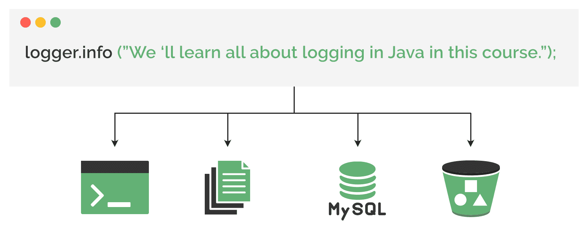
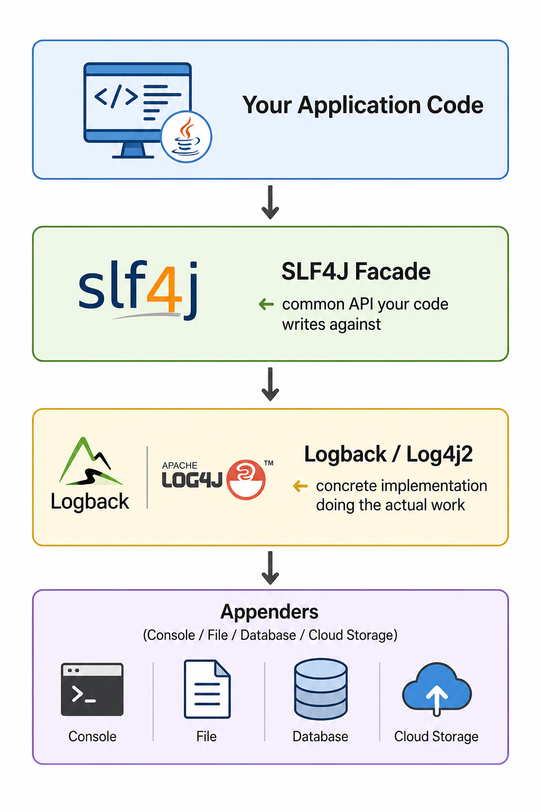

# The Importance of Logging

## 1. Overview

In any running application, events happen constantly — users log in, forget passwords, attempt payments that exceed their balance. During development, we can attach a debugger and step through code directly to understand what is happening. Once an application is deployed to production, that direct visibility disappears.

**Logging** is the primary solution to this problem. It gives us a window into what our application is doing, how it is performing, and why it failed — without needing to reproduce the exact conditions of a problem.

---

## 2. What Is Logging?

**Logging** is the practice of recording events as an application runs. Think of it as keeping a detailed diary of everything the application does at any given moment.

Each entry in this diary is called a **log message** or **log statement**. These statements are placed strategically throughout the code to capture important events and state changes.

### Example: Payment Processing

```java
void processPayment(Order order) {
    log("Processing payment for order: " + order.getId());

    PaymentResult result = paymentGateway.process(order);
    if (result.isSuccessful()) {
        log("Payment successful for order: " + order.getId());
        order.markAsPaid();
    } else {
        log("Payment failed for order: " + order.getId() + " due to: " + result.getFailureReason());
        order.markAsPaymentFailed();
    }
}
```

When this code runs, it produces a **chronological record** of what happened — which orders were processed, which payments succeeded or failed, and the reason for any failure. This record can be examined later to understand exactly what occurred with a specific order.

---

## 3. Common Use Cases for Logging

### Debugging

In production, we cannot attach a debugger and step through code as we do locally. Logs allow us to trace the sequence of events leading up to a problem.

**Example log entry:**

```
[2025-08-06 14:30:18.456] [ERROR] [com.baeldung.OrderProcessor] - Payment failed for order: 'ORD-123' due to: payment declined.
```

Starting from the timestamp in this entry, we can trace through what happened without needing to reproduce the exact conditions that caused the issue.

---

### Performance Monitoring and Optimization

By logging metrics such as the time taken to execute critical business logic or the response time of an external API call, we gain insight into where our application is slow and where bottlenecks exist.

---

### Auditing and Security

Many industries — including finance and healthcare — legally require audit trails for compliance purposes. Logging provides a persistent, detailed record of user activity that satisfies these requirements and supports security investigations.

---

## 4. Core Components of a Logging Framework

### 4.1 Log Levels

Not all events are equally important. **Log levels** allow us to assign a severity to each message, making it possible to filter logs based on importance without changing any code.

There are five standard log levels:

| Level | Purpose | When to Use |
|---|---|---|
| **TRACE** | Most granular — tracks method entries, exits, and exact execution flow | Only when investigating complex issues |
| **DEBUG** | Logs internal state — key decision points, calculation results, object states | During troubleshooting; too verbose for normal production use |
| **INFO** | Logs normal, important events — user logins, successful transactions, startup/shutdown | Routine production logging |
| **WARN** | Flags unexpected but non-critical situations — slow API response, retryable failure | Issues that may need attention before becoming critical |
| **ERROR** | Logs significant failures that prevent an operation from completing — unhandled exceptions, DB connection failures | Requires immediate attention |

**How log level filtering works:**

When we configure the application to log at a certain level, all messages at that level *and above* are recorded; messages below it are ignored.

```
Configured level: INFO
→ Records:  INFO, WARN, ERROR
→ Ignores:  DEBUG, TRACE
```

This lets us control the volume of logs in different environments (e.g., verbose DEBUG logs in development, INFO-only in production) without touching the code.

---

### 4.2 Appenders



**Appenders** are the components responsible for writing log messages to a destination.

| Destination | Typical Use |
|---|---|
| Console | Local development and testing — immediate feedback |
| Files | Production — persistent logs that can be reviewed later |
| Databases | Structured storage for querying and reporting |
| Central storage (e.g., Amazon S3) | Long-term archiving and centralized log management |

Multiple appenders can be configured simultaneously, sending the same log message to several destinations at once. For example, during local development a console appender provides immediate feedback, while in production a file appender persists logs for later analysis.

---

### 4.3 Formatters

A **formatter** defines how a log message appears. It transforms raw log data into a structured, readable format by combining the message itself with useful metadata.

**Example format template:**

```
[%timestamp] [%level] [%class] - %message
```

**Resulting log output:**

```
[2025-08-06 14:30:15.123] [INFO]  [com.baeldung.UserService]    - User 'john.doe' logged in successfully.
[2025-08-06 14:30:16.789] [WARN]  [com.baeldung.PaymentService] - Payment gateway response exceeded 5 seconds. Attempting retry.
```

The logging system automatically fills in the placeholders with the appropriate metadata. This immediately communicates:

- **When** the event occurred (timestamp)
- **How severe** it is (level)
- **Where** in the code it originated (class)
- **What** happened (message)

Additional metadata such as thread name or a request identifier can also be included depending on the configuration.

---

## 5. The Java Logging Ecosystem

Java's logging ecosystem has evolved significantly over time. Understanding this history makes it easier to navigate the available tools.

### 5.1 Early Frameworks

| Framework | Notes |
|---|---|
| **Java Util Logging (JUL)** | Built into the JDK since version 1.4. Limited in features and flexibility. |
| **Log4j** | Third-party library that emerged as the most popular alternative. Offered better performance and more flexible configuration. |

As more logging libraries appeared, applications became **tightly coupled** to whichever library they used. Switching from one library to another required significant code changes.

---

### 5.2 Logging Facades

**Logging facades** were introduced to solve the tight-coupling problem. Instead of writing code that depends directly on a specific logging library, we write code against a common API — the facade — and the actual logging work is delegated to a concrete library at runtime, which can be swapped out without changing application code.

| Facade | Notes |
|---|---|
| **Apache Commons Logging** | One of the first widely used facades |
| **SLF4J** (Simple Logging Facade for Java) | Has become the **de facto standard** in modern Java applications |

---

### 5.3 Modern Frameworks

Two implementations have emerged as the dominant choices in modern Java development, both integrating seamlessly with SLF4J:

| Framework | Key Characteristics |
|---|---|
| **Logback** | Created by the original author of Log4j. The native implementation of the SLF4J API. Widely used, especially in the Spring ecosystem. |
| **Log4j2** | A complete rewrite of the original Log4j. Supports SLF4J through an adapter. Known for excellent performance via asynchronous logging and an advanced feature set. |

---

### The Java Logging Ecosystem at a Glance



Understanding where each component sits in this stack makes it much easier to choose the right tools and configure them correctly.

---

## 6. Summary

| Concept | Description |
|---|---|
| **Logging** | Recording application events at runtime to maintain visibility after deployment |
| **Log Message** | A single recorded event, placed strategically throughout the code |
| **Log Level** | Severity label (TRACE, DEBUG, INFO, WARN, ERROR) used to filter messages |
| **Appender** | Component that writes log output to a destination (console, file, database) |
| **Formatter** | Defines the structure and metadata of each log entry |
| **Facade (SLF4J)** | Abstraction layer that decouples application code from the logging implementation |
| **Logback / Log4j2** | Modern concrete logging implementations used with SLF4J |

**Key takeaways:**
- Logging is the primary tool for understanding production application behavior without a debugger.
- The three core components of any logging framework are log levels, appenders, and formatters.
- Configure log levels per environment — verbose in development, INFO or above in production.
- SLF4J is the standard facade; Logback and Log4j2 are the two dominant modern implementations.