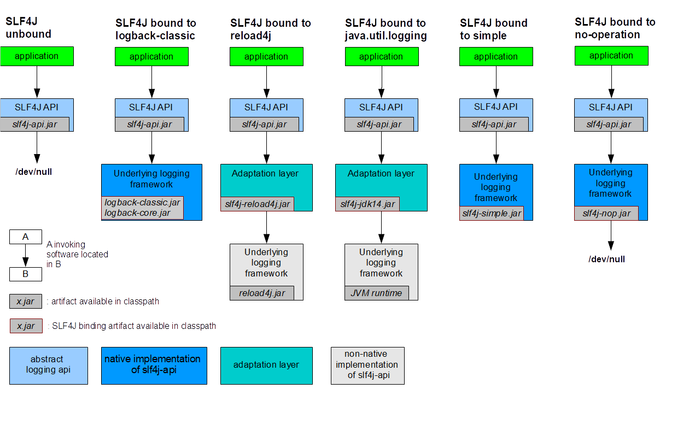

# SLF4J User Manual

## 1. What Is SLF4J?

**SLF4J (Simple Logging Facade for Java)** is an abstraction layer — a common API that sits between your application code and any concrete logging framework. Rather than writing code that depends directly on Log4j, Logback, or java.util.logging, you write code against SLF4J's single, stable interface. The actual logging work is then delegated to whichever logging framework you choose at deployment time.

```
Your Application Code
        ↓
   SLF4J API  ← you code against this
        ↓
  Logback / Log4j2 / JUL / ...  ← swappable at deployment time
```

**Key benefit:** Switching logging frameworks requires no code changes — only a JAR file swap on the classpath.

Adding SLF4J to a project requires only a single mandatory dependency:

```xml
<dependency>
    <groupId>org.slf4j</groupId>
    <artifactId>slf4j-api</artifactId>
    <version>2.0.18</version>
</dependency>
```

---

## 2. Hello World

The simplest possible SLF4J example:

```java
import org.slf4j.Logger;
import org.slf4j.LoggerFactory;

public class HelloWorld {

    public static void main(String[] args) {
        Logger logger = LoggerFactory.getLogger(HelloWorld.class);
        logger.info("Hello World");
    }
}
```

`LoggerFactory.getLogger()` creates a logger named after the class passed to it. That logger is then used to emit a message at `INFO` level.

### What happens without a provider?

If only `slf4j-api` is on the classpath (no logging backend), running this produces:

```
SLF4J: No SLF4J providers were found.
SLF4J: Defaulting to no-operation (NOP) logger implementation
```

No exception is thrown — SLF4J silently discards all log requests and emits a single warning. This is intentional: libraries that depend on SLF4J still work out of the box even if the end-user has not configured a logging backend yet.

### Adding a provider

Add `slf4j-simple-2.0.18.jar` to the classpath alongside `slf4j-api-2.0.18.jar`:

```
slf4j-api-2.0.18.jar
slf4j-simple-2.0.18.jar
```

Now running HelloWorld produces:

```
0 [main] INFO HelloWorld - Hello World
```

---

## 3. Typical Usage Pattern

The standard pattern in real applications is to declare a logger as a `final` field on the class:

```java
import org.slf4j.Logger;
import org.slf4j.LoggerFactory;

public class Wombat {

    final Logger logger = LoggerFactory.getLogger(Wombat.class);
    Integer t;
    Integer oldT;

    public void setTemperature(Integer temperature) {
        oldT = t;
        t = temperature;

        logger.debug("Temperature set to {}. Old value was {}.", t, oldT);

        if (temperature.intValue() > 50) {
            logger.info("Temperature has risen above 50 degrees.");
        }
    }
}
```

### The `{}` Placeholder Syntax

SLF4J uses `{}` as a placeholder for arguments rather than string concatenation. This is important for performance.

**Why not string concatenation?**

```java
// BAD — string is always built, even if DEBUG is disabled
logger.debug("Temperature set to " + t + ". Old value was " + oldT + ".");

// GOOD — string is only built if DEBUG is actually enabled
logger.debug("Temperature set to {}. Old value was {}.", t, oldT);
```

Using placeholders avoids the cost of building the log string when the log level is disabled — which is most of the time in production.

---

## 4. Fluent Logging API

Since SLF4J 2.0.0 (requires Java 8), a **fluent logging API** is available. It lets you build a log event incrementally before emitting it.

The entry points are level-specific methods on `Logger`:

```java
logger.atTrace()
logger.atDebug()
logger.atInfo()
logger.atWarn()
logger.atError()
```

Each returns a `LoggingEventBuilder`. You must always terminate the chain with `.log()` — forgetting to do so results in nothing being logged.

### Equivalent statements

```java
// Traditional API
logger.info("Hello world.");

// Fluent API — identical output
logger.atInfo().log("Hello world.");
```

### Building messages with arguments

```java
int newT = 15;
int oldT = 16;

// Traditional API
logger.debug("Temperature set to {}. Old value was {}.", newT, oldT);

// Fluent API — inline arguments
logger.atDebug().log("Temperature set to {}. Old value was {}.", newT, oldT);

// Fluent API — add arguments one by one
logger.atDebug()
      .setMessage("Temperature set to {}. Old value was {}.")
      .addArgument(newT)
      .addArgument(oldT)
      .log();

// Fluent API — lazy argument using a Supplier (only evaluated if level is enabled)
logger.atDebug()
      .setMessage("Temperature set to {}. Old value was {}.")
      .addArgument(() -> computeNewTemp())
      .addArgument(oldT)
      .log();
```

### Key-value pairs

The fluent API introduces structured key-value pair logging, which is particularly useful for log analysis tools that can parse and query structured data:

```java
// Traditional style — values embedded in message string
logger.debug("oldT={} newT={} Temperature changed.", oldT, newT);

// Fluent API — values stored as separate key-value objects
logger.atDebug()
      .setMessage("Temperature changed.")
      .addKeyValue("oldT", oldT)
      .addKeyValue("newT", newT)
      .log();
```

The key-value variant stores pairs as discrete objects rather than embedding them in the string, enabling logging backends and analysis tools to extract and process them individually.

---

## 5. Providers (Bindings)

A **provider** (called a *binding* in SLF4J 1.x) is a JAR file that connects SLF4J to a specific logging framework. Only one provider should be present on the classpath at a time.

### Available providers

| JAR | Logging Framework |
|---|---|
| `slf4j-simple-2.0.18.jar` | SLF4J Simple — prints INFO and above to `System.err`. Good for small applications. |
| `slf4j-nop-2.0.18.jar` | NOP — silently discards all log messages |
| `slf4j-jdk14-2.0.18.jar` | java.util.logging (JUL) |
| `slf4j-reload4j-2.0.18.jar` | Reload4j (drop-in replacement for Log4j 1.x) |
| `slf4j-jcl-2.0.18.jar` | Apache Commons Logging |
| `logback-classic-1.5.15.jar` | Logback — natively implements SLF4J with zero overhead |

> **Note:** Log4j 1.x reached End of Life in 2015. Use `slf4j-reload4j` instead of `slf4j-log4j12`.

---

### How Binding Works: Six Configurations Explained

The diagram below shows six possible ways SLF4J can be configured at deployment time. In every case, the **application** and **SLF4J API** layer remain identical — only what sits below the API changes.



---

#### 1. SLF4J Unbound

```
application
     ↓
SLF4J API (slf4j-api.jar)
     ↓
  /dev/null
```

No provider is present on the classpath. SLF4J emits a single warning at startup and then **silently discards all log messages**. The application does not crash. This is the fail-safe default.

---

#### 2. SLF4J Bound to Logback-Classic

```
application
     ↓
SLF4J API (slf4j-api.jar)
     ↓
Underlying logging framework
  logback-classic.jar
  logback-core.jar
```

Logback is a **native implementation** of the SLF4J API — `ch.qos.logback.classic.Logger` directly implements `org.slf4j.Logger`. There is no adaptation layer in between, meaning **zero memory or computational overhead**. This is the most direct and efficient binding available and is the default in the Spring ecosystem.

---

#### 3. SLF4J Bound to Reload4j

```
application
     ↓
SLF4J API (slf4j-api.jar)
     ↓
Adaptation layer (slf4j-reload4j.jar)
     ↓
Underlying logging framework (reload4j.jar)
```

Reload4j is **not** a native SLF4J implementation. An **adaptation layer** (`slf4j-reload4j.jar`) is required to translate SLF4J calls into Reload4j calls. Two JARs are needed: the adapter and the framework itself.

---

#### 4. SLF4J Bound to java.util.logging (JUL)

```
application
     ↓
SLF4J API (slf4j-api.jar)
     ↓
Adaptation layer (slf4j-jdk14.jar)
     ↓
Underlying logging framework (JVM runtime)
```

JUL is built into the JVM, so no additional framework JAR is required. However, like Reload4j, it is not a native SLF4J implementation and therefore requires an **adaptation layer** (`slf4j-jdk14.jar`) to bridge the two APIs.

---

#### 5. SLF4J Bound to Simple

```
application
     ↓
SLF4J API (slf4j-api.jar)
     ↓
Underlying logging framework (slf4j-simple.jar)
```

SLF4J Simple is a **minimal built-in implementation** that outputs all INFO and above messages to `System.err`. Like Logback, it requires no adaptation layer — it implements SLF4J directly. Suitable for small applications or quick tests, not for production.

---

#### 6. SLF4J Bound to No-Operation (NOP)

```
application
     ↓
SLF4J API (slf4j-api.jar)
     ↓
Underlying logging framework (slf4j-nop.jar)
     ↓
  /dev/null
```

The NOP binding **intentionally discards all log messages**, similar to the unbound case but explicit and deliberate. Use this when you want to deploy a library or application with logging completely suppressed by design.

---

### Binding Type Summary

| Configuration | Adaptation Layer Needed | Notes |
|---|---|---|
| **Unbound** | — | Fail-safe; discards all logs; emits one warning |
| **Logback-classic** | No | Native SLF4J implementation; zero overhead |
| **Reload4j** | Yes (`slf4j-reload4j.jar`) | Non-native; two JARs required |
| **java.util.logging** | Yes (`slf4j-jdk14.jar`) | Non-native; JUL is built into the JVM |
| **Simple** | No | Native; minimal; INFO and above only |
| **NOP** | No | Native; explicitly discards everything |

**Legend from the diagram:**

| Colour | Meaning |
|---|---|
| Blue (light) | Abstract logging API |
| Blue (dark) | Native implementation of SLF4J API |
| Teal | Adaptation layer |
| White/grey | Non-native implementation of SLF4J API |

### Switching frameworks

Switching logging backends requires no code changes — only a classpath swap:

```
# Switch from JUL to Reload4j:
Remove:  slf4j-jdk14-2.0.18.jar
Add:     slf4j-reload4j-2.0.18.jar
```

### Provider discovery (SLF4J 2.x)

Since version 2.0.0, SLF4J uses the Java `ServiceLoader` mechanism to find providers automatically at startup. You can also specify a provider explicitly via the system property to bypass service discovery:

```
-Dslf4j.provider=<provider-class-name>
```

---

## 6. Maven Dependencies

### SLF4J API only

```xml
<dependency>
    <groupId>org.slf4j</groupId>
    <artifactId>slf4j-api</artifactId>
    <version>2.0.18</version>
</dependency>
```

### With Logback (Jakarta EE — recommended for modern projects)

Declaring `logback-classic` automatically pulls in both `slf4j-api` and `logback-core`:

```xml
<dependency>
    <groupId>ch.qos.logback</groupId>
    <artifactId>logback-classic</artifactId>
    <version>1.5.15</version>
</dependency>
```

### With Logback (Javax EE)

```xml
<dependency>
    <groupId>ch.qos.logback</groupId>
    <artifactId>logback-classic</artifactId>
    <version>1.3.14</version>
</dependency>
```

### With Reload4j

```xml
<dependency>
    <groupId>org.slf4j</groupId>
    <artifactId>slf4j-reload4j</artifactId>
    <version>2.0.18</version>
</dependency>
```

### With java.util.logging (JUL)

```xml
<dependency>
    <groupId>org.slf4j</groupId>
    <artifactId>slf4j-jdk14</artifactId>
    <version>2.0.18</version>
</dependency>
```

### With SLF4J Simple

```xml
<dependency>
    <groupId>org.slf4j</groupId>
    <artifactId>slf4j-simple</artifactId>
    <version>2.0.18</version>
</dependency>
```

---

## 7. Rules for Libraries vs. Applications

SLF4J has a critical rule that applies to code intended for use by others:

| Type | Rule |
|---|---|
| **Libraries / Frameworks** | Depend on `slf4j-api` only — **never** include a provider/binding |
| **Applications** | Declare both `slf4j-api` and the desired provider |

**Why?** If a library includes a concrete logging provider as a transitive dependency, it forces that logging framework onto every application that uses the library — completely defeating the purpose of SLF4J. The end-user should always choose their own logging backend.

> A non-transitive dependency on a provider (e.g., for testing only using `<scope>test</scope>`) does not affect end-users and is acceptable.

---

## 8. Binary Compatibility

**SLF4J API is backward-compatible across all versions.** Code compiled against `slf4j-api-N.jar` will run with `slf4j-api-M.jar` for any `N` and `M`.

**However, the provider/binding version must match the API version:**

```
# Correct
slf4j-api-2.0.18.jar  +  slf4j-simple-2.0.18.jar  ✓

# Incorrect — version mismatch will cause problems
slf4j-api-2.0.18.jar  +  slf4j-simple-1.5.5.jar   ✗
```

Always ensure your provider JAR version matches your `slf4j-api` JAR version.

---

## 9. Consolidating Logging from Multiple Frameworks

Real projects often depend on third-party libraries that each use a different logging API (JCL, JUL, Log4j, SLF4J). SLF4J provides **bridge modules** that redirect calls from these legacy APIs through SLF4J, consolidating all log output into a single channel.

| Bridge JAR | Redirects From |
|---|---|
| `jcl-over-slf4j.jar` | Apache Commons Logging (JCL) |
| `log4j-over-slf4j.jar` | Log4j 1.x |
| `jul-to-slf4j.jar` | java.util.logging (JUL) |

With these bridges, even third-party libraries using older logging APIs will have their output routed through SLF4J and handled by your chosen backend.

---

## 10. Mapped Diagnostic Context (MDC)

**MDC (Mapped Diagnostic Context)** is a thread-local map of key-value pairs that your application can populate. The logging framework then automatically includes these values in every log message produced by that thread.

**Common use case:** Attaching a request ID, user ID, or session ID to all log messages for a given request — making it easy to filter or correlate all log entries belonging to one operation.

```java
MDC.put("requestId", "REQ-9921");
logger.info("Processing started.");   // will include requestId automatically
logger.warn("Slow response detected.");  // will also include requestId
MDC.remove("requestId");
```

MDC is fully supported when using **Log4j** or **Logback** as the backend. When using a backend that does not natively support MDC (e.g., JUL), SLF4J still stores the data but it must be retrieved manually via custom code.

---

## 11. Key Advantages of SLF4J

| Advantage | Description |
|---|---|
| **Separation of concerns** | Application code uses SLF4J API; configuration is handled entirely by the logging backend |
| **Swappable at deployment time** | Change the logging framework by swapping a JAR, not by touching code |
| **Fail-safe** | If no provider is found, SLF4J emits a warning and discards all logs — no crash |
| **Broad framework support** | Works with Logback, Log4j2, Reload4j, JUL, JCL, and more |
| **Bridge support** | Legacy logging calls from third-party code can be redirected through SLF4J |
| **Parameterized messages** | `{}` placeholders avoid string construction overhead when a log level is disabled |
| **MDC support** | Thread-local context data automatically enriches log messages |
| **Simple API** | The interface is small enough that most Java developers can fully understand it within an hour |

---

## 12. Summary

| Concept | Description |
|---|---|
| **SLF4J** | A logging facade — provides a common API; does not log anything itself |
| **Provider / Binding** | A JAR that connects SLF4J to a concrete logging framework |
| **`LoggerFactory.getLogger()`** | Creates a named logger instance |
| **`{}` placeholders** | Deferred argument substitution — avoids string building when level is disabled |
| **Fluent API** | Available since 2.0.0; builds log events incrementally via method chaining |
| **MDC** | Thread-local key-value map; values are automatically included in log messages |
| **Library rule** | Libraries must only depend on `slf4j-api`, never on a provider |
| **Version matching** | Provider JAR version must always match `slf4j-api` JAR version |

**Key takeaways:**
- Write all logging code against the SLF4J API; never import a concrete framework directly in application or library code.
- Always use `{}` placeholders instead of string concatenation for performance.
- Libraries must only declare a dependency on `slf4j-api` — never a provider.
- Match provider and API versions exactly to avoid runtime issues.
- Use bridge modules to consolidate logging from third-party dependencies that use legacy APIs.