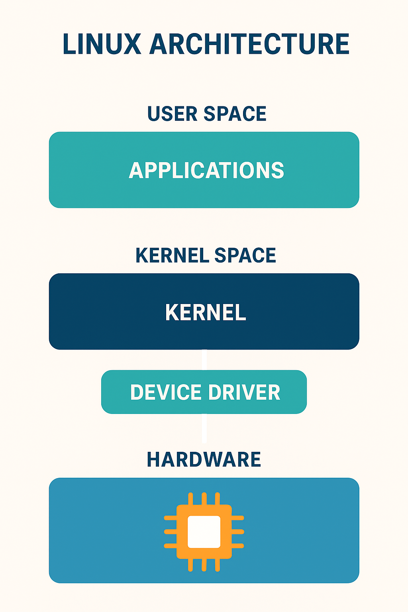

---

# 🐧 **Lesson 1: Introduction to Linux — History, Usage, and Advantages**

---

## 1. 🧠 Getting to Know Linux

### What Exactly Is Linux?

**Linux** is one of the most powerful, stable, and flexible systems in the computing world — and yet, it’s often misunderstood.

When most people say *Linux*, they think of an **operating system** like Windows or macOS.
👉 But **technically, Linux is not an operating system** — it is a **kernel**.

---

### 🧩 What is a Kernel?

A **kernel** is the **core component** of any operating system.
It’s like the **brain or heart** that connects software (applications) to hardware (your computer’s processor, memory, and storage).

Imagine your computer as a human body:

* 🧠 **Kernel** — the brain that controls communication between body parts.
* 🦴 **Hardware** — the skeleton and muscles (CPU, memory, disk, etc.).
* 💬 **Applications** — the thoughts and commands you issue (like web browsers, editors, etc.).

Without the kernel, your software wouldn’t know how to use your computer’s hardware.

---

### 🖥️ Linux Distributions (Distros)

Since Linux itself is *just the kernel*, other developers package it with:

* System utilities
* Graphical interfaces (GUIs)
* Software managers

These complete systems are called **Linux distributions** (or **distros**).

✅ **Examples:**

* **Ubuntu** – User-friendly and great for beginners
* **Fedora** – Cutting-edge technology, supported by Red Hat
* **Debian** – Stable and preferred for servers
* **Arch Linux** – Lightweight, built for advanced users
* **Kali Linux** – Used for cybersecurity and penetration testing

Each distribution shares the **same Linux kernel**, but provides different user experiences.

---

### 🧍‍♂️ Why Linux?

In 1991, **Linus Torvalds**, a Finnish student, said:

> “I’m doing a free operating system — just a hobby, nothing big or professional.”

Today, that “hobby project” powers:

* 🚀 **All 500 top supercomputers**
* ☁️ **Most of the world’s web servers**
* 📱 **All Android phones**
* 🛰️ **Space systems and satellites**

That’s the power of Linux!

---

## 2. 🕰️ History and Evolution of Linux

### 📜 Early Origins

Before Linux, there was **UNIX** — a powerful OS used in universities and enterprises during the 1970s–80s.
However, UNIX was **proprietary**, meaning users had to pay for it.

To help students learn how operating systems work, Professor **Andrew Tanenbaum** developed **MINIX**, a simplified UNIX-like system for teaching.

Linus Torvalds, inspired by MINIX, began writing his own kernel — **Linux** — on an Intel 386 processor.

---

### 📦 Linux’s First Release (1991)

The very first Linux version (0.01) had:

* Basic multitasking
* Limited device drivers
* A simple file system

Linus uploaded it online for collaboration, and programmers around the world began contributing to it.

Within a few years, Linux became the **foundation for a global open-source revolution**.

---

### 🌐 Growth and Open Source Movement

Linux’s code was released under the **GNU General Public License (GPL)**, allowing:

* Anyone to **read** the code
* **Modify** and **distribute** their versions
* **Share** improvements freely

This created a massive **global developer community** — people constantly improving and securing the system together.

---

### 🧱 Evolution Timeline

| **Year** | **Milestone**                                           |
| -------- | ------------------------------------------------------- |
| 1991     | Linus Torvalds releases first version of Linux kernel   |
| 1992     | Linux adopts GNU GPL license (open-source)              |
| 1994     | Linux Kernel 1.0 officially released                    |
| 1996     | Linux mascot “Tux the Penguin” introduced               |
| 2004     | Ubuntu released, making Linux beginner-friendly         |
| 2008     | Android OS launched on Linux kernel                     |
| 2010+    | Linux dominates servers, supercomputers, IoT, and cloud |

---

## 3. 🌍 Where Linux Is Used

Linux might not dominate personal laptops, but **it runs almost everything else** in our digital world.

---

### 1️⃣ Servers

Over **90% of web servers** use Linux.
This includes:

* Google servers (Debian-based)
* Facebook and Instagram backend systems
* Amazon Web Services (AWS)
* Wikipedia and YouTube infrastructure

**Why?**
Because Linux can run **for years without rebooting**, consumes minimal resources, and scales easily.

🧩 **Example:**
A web server running Ubuntu Server hosting a website using Apache:

```bash
sudo apt install apache2
sudo systemctl start apache2
```

---

### 2️⃣ Embedded Systems

Linux powers small devices like:

* Smart TVs (LG, Samsung)
* Routers (TP-Link, Asus)
* Smartwatches
* Tesla’s car software

These devices run **custom lightweight Linux versions** optimized for hardware.

---

### 3️⃣ Mobile Devices

Android — used by **over 3 billion devices** — is built on top of the Linux kernel.
So if you use an Android phone, **you already use Linux every day**.

---

### 4️⃣ Desktops and Laptops

Linux desktop distros like **Ubuntu**, **Mint**, and **Fedora** are great for:

* Developers
* Data scientists
* Ethical hackers

They offer:

* Open-source tools (e.g., Python, Git, Docker)
* Customization and privacy
* High performance with no license cost

🧩 **Example:** Installing a package on Ubuntu:

```bash
sudo apt install git
```

---

### 5️⃣ Supercomputers

All **Top 500 supercomputers** use Linux due to:

* High scalability
* Open customization
* Reliability for complex scientific computations

Supercomputers at **NASA, CERN, and SpaceX** all use specialized Linux builds.

---

### 6️⃣ Space and Science

NASA’s **Perseverance Rover** on Mars runs on **Linux**.
Even the **International Space Station (ISS)** migrated from Windows to Linux for stability.

---

## 4. ⚙️ Advantages of Linux

| **Feature**                 | **Description**                                                 | **Example/Benefit**                        |
| --------------------------- | --------------------------------------------------------------- | ------------------------------------------ |
| 🆓 **Free & Open Source**   | Linux is released under GPL, meaning no licensing cost.         | Use Ubuntu legally at zero cost            |
| 🔐 **Security**             | Permissions and user roles protect against viruses and malware. | Rarely targeted by ransomware              |
| ⚡ **Speed & Efficiency**    | Lightweight, minimal resource usage.                            | Runs fast even on old PCs                  |
| 🧩 **Customizability**      | Modify and build your own distro or kernel.                     | Developers can strip down features for IoT |
| 🏗️ **Reliability**         | Linux servers run for years without rebooting.                  | Web servers stay online 24/7               |
| 👨‍💻 **Community Support** | Millions of contributors and forums.                            | Quick help via Stack Overflow, Reddit      |
| ☁️ **Cloud Compatibility**  | Powers cloud services like AWS, Azure, Google Cloud.            | Essential for DevOps professionals         |

---

## 5. 🧰 Practical Use of Linux Knowledge

### 💻 For Developers

* Write and run code using built-in tools.
* Use Git for version control.
* Build and deploy web apps on local servers.

```bash
sudo apt install python3
python3 --version
```

---

### ⚙️ For System Administrators

Manage users, permissions, and services easily:

```bash
sudo adduser student
sudo systemctl status ssh
```

Monitor system performance:

```bash
top
htop
```

---

### 🧪 For Cybersecurity Experts

Distributions like **Kali Linux** and **Parrot OS** are used for:

* Network scanning (`nmap`)
* Password auditing (`john`)
* Exploitation testing (`metasploit`)

---

### ☁️ For DevOps Engineers

Docker, Kubernetes, and Jenkins — all depend on Linux.
Linux knowledge helps you:

* Build containers
* Automate deployments
* Debug systems

---

## 6. 🐧 Fun and Fascinating Linux Facts

| **Fact**                    | **Explanation**                                                                                  |
| --------------------------- | ------------------------------------------------------------------------------------------------ |
| 🐧 **Tux the Penguin**      | The official Linux mascot. Linus was once bitten by a penguin in Australia and found it amusing! |
| 🚀 **Linux in Space**       | NASA uses Linux to control space missions and rovers.                                            |
| 🎥 **Hollywood Uses Linux** | Studios like Pixar and DreamWorks render movies using Linux.                                     |
| 🏢 **Corporate Adoption**   | Google, Meta, IBM, and Amazon all rely entirely on Linux servers.                                |
| 📱 **Android = Linux**      | Your smartphone runs on a modified Linux kernel.                                                 |

---

## 7. 🌠 Linux and Your Future Career

Mastering Linux can open doors in various IT fields:

| **Field**                    | **How Linux Is Used**                                       |
| ---------------------------- | ----------------------------------------------------------- |
| 🧱 **System Administration** | Manage users, permissions, and system processes             |
| 🧠 **Software Development**  | Compile, debug, and deploy applications                     |
| ☁️ **DevOps/Cloud**          | Docker, Kubernetes, Jenkins, AWS all built on Linux         |
| 🛡️ **Cybersecurity**        | Ethical hacking, penetration testing, network monitoring    |
| 📡 **Networking**            | Configure routers, firewalls, and VPNs using Linux commands |

---

### Example: Starting a Simple Web Server in Linux

```bash
# Install Python (if not installed)
sudo apt install python3

# Navigate to your project directory
cd ~/Documents/myproject

# Start a simple HTTP server
python3 -m http.server 8080
```

🟢 **Output:**
Your local server is now running at
👉 [http://localhost:8080](http://localhost:8080)

This simple demo shows how quickly Linux can turn your machine into a development server.

---

## 8. 🧭 Summary

| **Topic**  | **Key Points**                                                            |
| ---------- | ------------------------------------------------------------------------- |
| Definition | Linux is a kernel, not a full OS                                          |
| Creator    | Linus Torvalds (1991)                                                     |
| License    | GNU General Public License (GPL)                                          |
| Uses       | Servers, supercomputers, mobile, IoT, space tech                          |
| Advantages | Free, secure, customizable, reliable                                      |
| Relevance  | Essential for careers in DevOps, cybersecurity, and system administration |

---

## 9. 💻 Hands-On Practice: Basic Linux Commands

```bash
# Display current directory
pwd

# List files
ls

# Create a folder
mkdir linux_practice

# Navigate into it
cd linux_practice

# Create a file
echo "Hello Linux Learners!" > greetings.txt

# Read file content
cat greetings.txt

# Display system info
uname -a
```

🟢 **Output:**

```
Hello Linux Learners!
Linux Ubuntu 22.04 x86_64 GNU/Linux
```

You’ve just executed essential Linux commands — welcome to the world of command-line mastery!

---

## 10. 🎓 Conclusion

Linux is not just another computer system — it’s a **global ecosystem** built on collaboration, innovation, and freedom.

* It powers everything from **Android phones** to **spacecraft**.
* It offers **unmatched control** and **career opportunities** in IT.
* Learning Linux isn’t optional anymore — it’s essential for anyone serious about tech.

> 🧭 “Once you learn Linux, you don’t just use computers — you command them.”

---

*Linux Architecture** 
