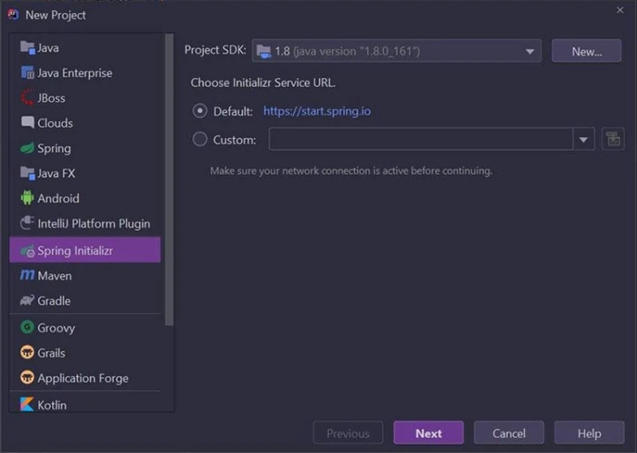
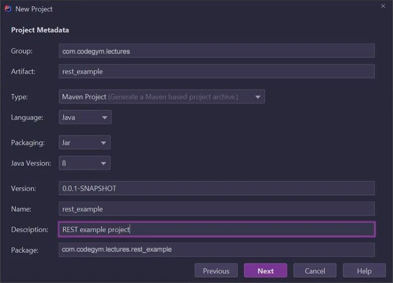
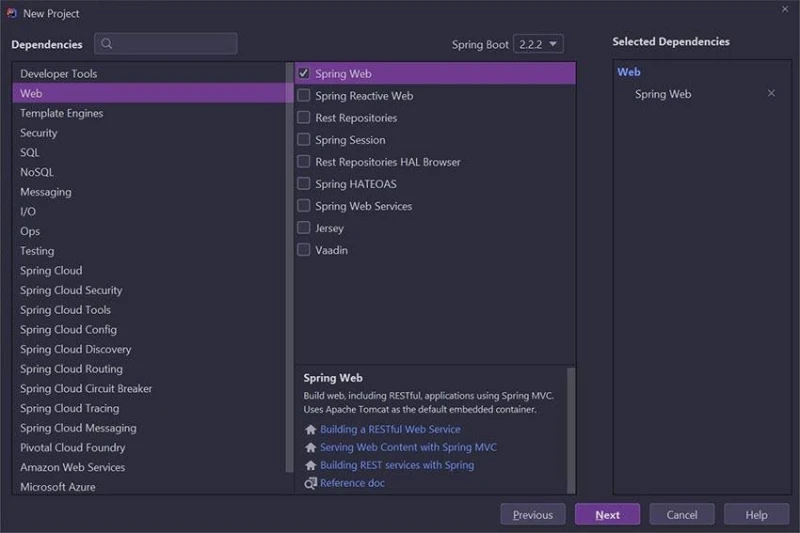
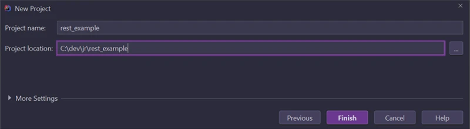
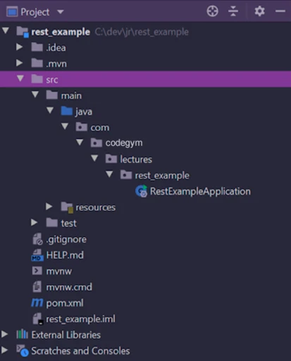
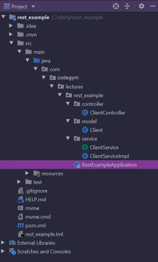
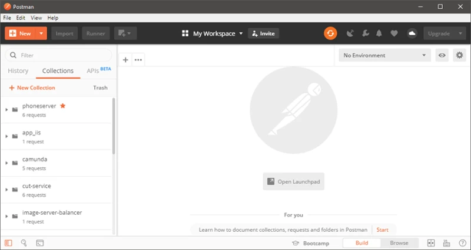
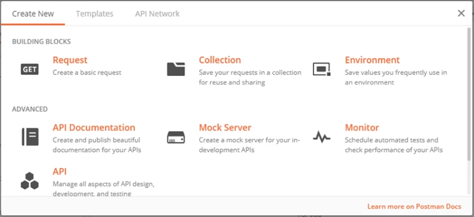
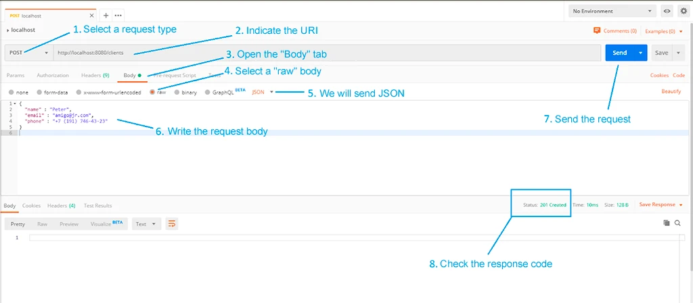
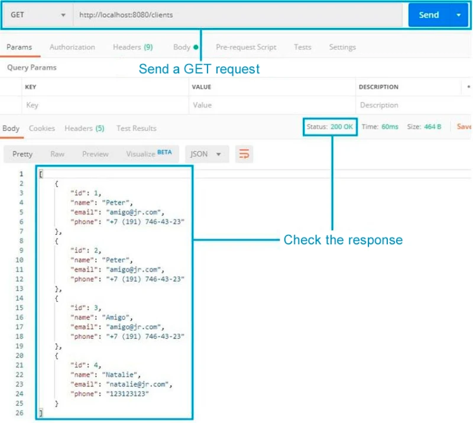

---

# Part 3: Building a RESTful Service with Spring Boot

### Introduction

In the previous parts of this REST overview, we focused on **theory**:

* What REST is
* Why REST exists
* How clients and servers communicate using HTTP
* What CRUD operations are
* REST principles such as statelessness and uniform interfaces

In this final part, we move from theory to **practice**.

👉 Our goal is to **build a real RESTful web service** using **Spring Boot**.

By the end of this lesson, you will:

* Create a Spring Boot project
* Build a REST API that manages customers
* Implement full **CRUD operations**
* Test your API using **Postman**

---

## What Are We Building?

We will build a **Customer Management REST API**.

The API will allow clients to:

* **Create** a customer
* **Read** all customers
* **Read** a single customer by ID
* **Update** a customer
* **Delete** a customer

This is known as **CRUD**:

| Operation | HTTP Method | Description   |
| --------- | ----------- | ------------- |
| Create    | POST        | Add new data  |
| Read      | GET         | Retrieve data |
| Update    | PUT         | Modify data   |
| Delete    | DELETE      | Remove data   |

---

## Key Terms (Beginner-Friendly Definitions)

### REST (Representational State Transfer)

REST is an **architectural style** that defines how clients and servers communicate over HTTP using resources and standard methods.

### RESTful Service

A RESTful service is a **server application** that follows REST principles and exposes resources through URLs (endpoints).

### Resource

A resource is **anything you want to expose via your API**, such as:

* Customer
* Order
* Product

Example resource:

```
/customers
/customers/1
```

### CRUD

CRUD stands for:

* **Create**
* **Read**
* **Update**
* **Delete**

These are the four basic operations on data.

### Spring Boot

Spring Boot is a Java framework that:

* Simplifies Spring configuration
* Automatically sets up the application
* Lets you focus on writing business logic instead of boilerplate code

---

## Step 1: Creating the Spring Boot Project

We will use **IntelliJ IDEA** to create the project.

### Steps in IntelliJ IDEA

1. Open IntelliJ IDEA
2. Go to:
   **File → New → Project**
3. Select **Spring Initializr**
4. Choose a Project SDK
5. Click **Next**

---

---

### Project Configuration

In the next window:

* Project Type: **Maven Project**
* Group: `com.codegym.lessons`
* Artifact: `rest_example`

Click **Next**.

---

---

### Selecting Dependencies

We need Spring Web to build REST APIs.

✔ Select:

* **Spring Web**

Click **Next**, then **Finish**.

---

---

---

## Project Structure Overview

After creation, IntelliJ generates the project structure automatically.

---

---

Spring Boot creates:

* `pom.xml` → Maven configuration file
* `RestExampleApplication.java` → Main application class

---

## Understanding pom.xml (Maven Configuration)

### What is Maven?

Maven is a **build and dependency management tool**.
It downloads libraries and manages project builds.

### Key Sections Explained

* **spring-boot-starter-parent**
  Provides default Spring Boot configuration

* **spring-boot-starter-web**
  Adds:

    * REST controllers
    * Embedded Tomcat server
    * JSON serialization (Jackson)

---

IntelliJ IDEA generated a **Maven deployment descriptor (pom.xml)** and the application’s **main class (RestExampleApplication)**.

---

## pom.xml

```xml
<?xml version="1.0" encoding="UTF-8"?>
<project xmlns="http://maven.apache.org/POM/4.0.0" xmlns:xsi="http://www.w3.org/2001/XMLSchema-instance"
        xsi:schemaLocation="http://maven.apache.org/POM/4.0.0 https://maven.apache.org/xsd/maven-4.0.0.xsd">
   <modelVersion>4.0.0</modelVersion>
   <parent>
       <groupId>org.springframework.boot</groupId>
       <artifactId>spring-boot-starter-parent</artifactId>
       <version>2.2.2.RELEASE</version>
       <relativePath/>
   </parent>
   <groupId>com.codegym.lessons</groupId>
   <artifactId>rest_example</artifactId>
   <version>0.0.1-SNAPSHOT</version>
   <name>rest_example</name>
   <description>REST example project</description>

   <properties>
       <java.version>1.8</java.version>
   </properties>

   <dependencies>
       <dependency>
           <groupId>org.springframework.boot</groupId>
           <artifactId>spring-boot-starter-web</artifactId>
       </dependency>

       <dependency>
           <groupId>org.springframework.boot</groupId>
           <artifactId>spring-boot-starter-test</artifactId>
           <scope>test</scope>
           <exclusions>
               <exclusion>
                   <groupId>org.junit.vintage</groupId>
                   <artifactId>junit-vintage-engine</artifactId>
               </exclusion>
           </exclusions>
       </dependency>
   </dependencies>

   <build>
       <plugins>
           <plugin>
               <groupId>org.springframework.boot</groupId>
               <artifactId>spring-boot-maven-plugin</artifactId>
           </plugin>
       </plugins>
   </build>

</project>
```

---

## RestExampleApplication

```java
@SpringBootApplication
public class RestExampleApplication {

   public static void main(String[] args) {
       SpringApplication.run(RestExampleApplication.class, args);
   }
}
```

---

## Creating REST Functionality

Our application is a customer management system. So, the first thing we need to do is create a customer entity. It will be a POJO (plain old Java object) class.

Create a model package inside the com.codegym.lessons.rest_example package. Inside the model package, create the Customer:

---

## Customer Model

Create a `model` package inside:

`com.codegym.lessons.rest_example`

Inside the model package, create `Customer.java`.

```java
public class Customer {

   private Integer id;
   private String name;
   private String email;
   private String phone;

   public Integer getId() {
       return id;
   }

   public void setId(Integer id) {
       this.id = id;
   }

   public String getName() {
       return name;
   }

   public void setName(String name) {
       this.name = name;
   }

   public String getEmail() {
       return email;
   }

   public void setEmail(String email) {
       this.email = email;
   }

   public String getPhone() {
       return phone;
   }

   public void setPhone(String phone) {
       this.phone = phone;
   }
}
```

---

## CustomerService Interface

The service will implement CRUD operations on customers. The next step is to create a service that will implement these operations. In the com.codegym.lessons.rest_example package, create a service package. And inside that, create a CustomerService interface.

Here is the interface code with comments:

```java
public interface CustomerService {

   void create(Customer customer);

   List<Customer> readAll();

   Customer read(int id);

   boolean update(Customer customer, int id);

   boolean delete(int id);
}
```

---

## CustomerService Implementation

Next, we need to implement this interface. Now a Map<Integer, Customer> will store our customers. The map's keys will be the customer IDs, and the values will be the customers themselves. This is done so as to not overload this example with the specifics of working with a real database. However, in the future we will be able to write another implementation of the interface, which will make it possible to connect to a real database.

In the service package, create an implementation of the CustomerService interface:

```java
@Service
public class CustomerServiceImpl implements CustomerService {

   private static final Map<Integer, Customer> CUSTOMER_REPOSITORY_MAP = new HashMap<>();
   private static final AtomicInteger CUSTOMER_ID_HOLDER = new AtomicInteger();

   @Override
   public void create(Customer customer) {
       final int customerId = CUSTOMER_ID_HOLDER.incrementAndGet();
       customer.setId(customerId);
       CUSTOMER_REPOSITORY_MAP.put(customerId, customer);
   }

   @Override
   public List<Customer> readAll() {
       return new ArrayList<>(CUSTOMER_REPOSITORY_MAP.values());
   }

   @Override
   public Customer read(int id) {
       return CUSTOMER_REPOSITORY_MAP.get(id);
   }

   @Override
   public boolean update(Customer customer, int id) {
       if (CUSTOMER_REPOSITORY_MAP.containsKey(id)) {
           customer.setId(id);
           CUSTOMER_REPOSITORY_MAP.put(id, customer);
           return true;
       }
       return false;
   }

   @Override
   public boolean delete(int id) {
       return CUSTOMER_REPOSITORY_MAP.remove(id) != null;
   }
}
```

---

## CustomerController

The @Service annotation tells spring that this class is a service. This is a special type of class that implements some business application logic. Subsequently, thanks to this annotation, Spring will use dependency injection to provide us with an instance of this class in all the places where it is needed.

Now it's time to create a controller. This is a special class where we will implement the logic for processing client requests sent to endpoints (URIs).

To make all this clearer, we will create this class incrementally. First, create the class itself and add a dependency on CustomerService:

```java
@RestController
public class CustomerController {

    private final CustomerService customerService;

    @Autowired
    public CustomerController(CustomerService customerService) {
        this.customerService = customerService;
    }
}
```

**Let's explain the annotations:**

**@RestController** tells Spring that this class is a REST controller. In other words, this class implements the logic for processing client requests.

**@Autowired** tells Spring that a dependency needs to be added here. We pass the CustomerService interface to the constructor. Earlier, we marked the implementation of this service with the @Service annotation, and now Spring will be able to pass an instance of this implementation to the controller's constructor.

Next, we will implement each controller method for handling **CRUD** operations. Let's start with the create operation. To do this, we write a create method:

```java
@PostMapping(value = "/customers")
public ResponseEntity<?> create(@RequestBody Customer customer) {
    customerService.create(customer);
    return new ResponseEntity<>(HttpStatus.CREATED);
}
```

**Let's analyze this method:**

**@PostMapping(value = "/customers")** mean that this method processes POST requests sent to the address **"/customers"**.

The method returns a **ResponseEntity<?>**. A ResponseEntity is a special class for returning responses. Later, we will use it to return an HTTP status code to the client.

The method has a **@RequestBody** Customer customer parameter. The value of this parameter comes from the request body. The @RequestBody annotation indicates this.

Inside the body of the method, we call the create() method on the previously created service and pass it the customer controller received in the parameters.

Then we return the **"201 Created"** status by creating a new ResponseEntity object and passing the corresponding HttpStatus enum field to it.

Next, we'll implement the read operation:

First, we'll implement the operation to get a list of all available customers:

```java
@GetMapping(value = "/customers")
public ResponseEntity<List<Customer>> read() {
    final List<Customer> customers = customerService.readAll();

    return customers != null &&  !customers.isEmpty()
            ? new ResponseEntity<>(customers, HttpStatus.OK)
            : new ResponseEntity<>(HttpStatus.NOT_FOUND);
}
```

**Let's dive in:**

**@GetMapping(value = "/customers")** — everything here is similar to the @PostMapping annotation, but now we are processing GET requests.

This time we return a **ResponseEntity<List<Customer>>**, and in addition to an HTTP status, we will also return a response body, which will be the list of customers.

In Spring's REST controllers, everything is POJO objects and collections of POJO objects, which are returned as response bodies and automatically serialized into JSON, unless otherwise specified. This suits us perfectly.

Inside the method, we use our service to get a list of all customers. Next, if the list is not null and not empty, then we use the ResponseEntity class to return the list of customers and the "200 OK" HTTP status code. Otherwise, we simply return the **"404 Not Found"** HTTP status code.

Now we will implement the ability to get a customer using its ID:

```java
@GetMapping(value = "/customers/{id}")
public ResponseEntity<Customer> read(@PathVariable(name = "id") int id) {
    final Customer customer = customerService.read(id);

    return customer != null
            ? new ResponseEntity<>(customer, HttpStatus.OK)
            : new ResponseEntity<>(HttpStatus.NOT_FOUND);
}
```

One new thing here is the path variable. The variable is defined in the URI: **value = "/customers/{id}"**. We indicate it in curly braces. And we receive it as an int method parameter using the **@PathVariable(name = "id")** annotation.

This method will accept requests sent to URIs in the form **/customers/{id}**, where **{id}** represents any numeric value. This value is subsequently passed via the int id variable to the method parameter.

In the body, we get the Customer object using our service and the received id. And then, by analogy with the list, we return either the "200 OK" status and the Customer object itself, or simply the "404 Not Found" status if the system has no customer with that id.

We still need to implement two operations: update and delete. Here is the code for these methods:

```java
@PutMapping(value = "/customers/{id}")
public ResponseEntity<?> update(@PathVariable(name = "id") int id, @RequestBody Customer customer) {
    final boolean updated = customerService.update(customer, id);

    return updated
            ? new ResponseEntity<>(HttpStatus.OK)
            : new ResponseEntity<>(HttpStatus.NOT_MODIFIED);
}
```

```java
@DeleteMapping(value = "/customers/{id}")
public ResponseEntity<?> delete(@PathVariable(name = "id") int id) {
    final boolean deleted = customerService.delete(id);

    return deleted
            ? new ResponseEntity<>(HttpStatus.OK)
            : new ResponseEntity<>(HttpStatus.NOT_MODIFIED);
}
```

There's nothing essentially new in these methods, so we'll skip the detailed description. The only thing worth mentioning is that the update() method handles PUT requests (@PutMapping annotation), and the delete() method handles DELETE requests (DeleteMapping annotation).

Here is the full code for the controller:

```java
@RestController
public class CustomerController {

   private final CustomerService customerService;

   @Autowired
   public CustomerController(CustomerService customerService) {
       this.customerService = customerService;
   }

   @PostMapping(value = "/customers")
   public ResponseEntity<?> create(@RequestBody Customer customer) {
       customerService.create(customer);
       return new ResponseEntity<>(HttpStatus.CREATED);
   }

   @GetMapping(value = "/customers")
   public ResponseEntity<List<Customer>> read() {
       final List<Customer> customers = customerService.readAll();

       return customers != null && !customers.isEmpty()
               ? new ResponseEntity<>(customers, HttpStatus.OK)
               : new ResponseEntity<>(HttpStatus.NOT_FOUND);
   }

   @GetMapping(value = "/customers/{id}")
   public ResponseEntity<Customer> read(@PathVariable(name = "id") int id) {
       final Customer customer = customerService.read(id);

       return customer != null
               ? new ResponseEntity<>(customer, HttpStatus.OK)
               : new ResponseEntity<>(HttpStatus.NOT_FOUND);
   }

   @PutMapping(value = "/customers/{id}")
   public ResponseEntity<?> update(@PathVariable(name = "id") int id, @RequestBody Customer customer) {
       final boolean updated = customerService.update(customer, id);

       return updated
               ? new ResponseEntity<>(HttpStatus.OK)
               : new ResponseEntity<>(HttpStatus.NOT_MODIFIED);
   }

   @DeleteMapping(value = "/customers/{id}")
   public ResponseEntity<?> delete(@PathVariable(name = "id") int id) {
       final boolean deleted = customerService.delete(id);

       return deleted
               ? new ResponseEntity<>(HttpStatus.OK)
               : new ResponseEntity<>(HttpStatus.NOT_MODIFIED);
   }
}
```

---

Below is a breakdown of the REST example above

## Step1: Main Application Class

```java
@SpringBootApplication
public class RestExampleApplication {

   public static void main(String[] args) {
       SpringApplication.run(RestExampleApplication.class, args);
   }
}
```

### What Does @SpringBootApplication Do?

It combines three annotations:

* `@Configuration`
* `@EnableAutoConfiguration`
* `@ComponentScan`

👉 In simple terms:
It **starts the Spring Boot application**.

---

## Step 2: Creating the Customer Model

### What Is a Model?

A **model** represents application data.

In REST:

* Models are converted to **JSON**
* Sent between client and server

---

### Creating the Customer Class

Create a package:

```
com.codegym.lessons.rest_example.model
```

Inside it, create `Customer.java`.

```java
public class Customer {

   private Integer id;
   private String name;
   private String email;
   private String phone;

   // getters and setters
}
```

### What Is a POJO?

**POJO** = Plain Old Java Object
It:

* Has fields
* Has getters/setters
* Has no framework dependencies

---

## Step 3: Creating the Service Layer

### What Is a Service?

A **service**:

* Contains business logic
* Sits between controller and data storage

---

### CustomerService Interface

Create package:

```
service
```

Create `CustomerService.java`.

This interface defines **what operations are available**, not how they work.

CRUD methods:

* create
* readAll
* read
* update
* delete

---

### Why Use an Interface?

* Makes code flexible
* Allows switching implementations later (e.g., database instead of Map)

---

## Step 4: Implementing the Service

### Why Use a Map Instead of a Database?

For learning purposes:

* Keeps things simple
* Focuses on REST concepts
* Avoids database configuration

---

### CustomerServiceImpl

```java
@Service
public class CustomerServiceImpl implements CustomerService {
```

### What Does @Service Mean?

It tells Spring:

> “This class contains business logic and should be managed by Spring.”

Spring will:

* Create the object
* Inject it where needed

---

### Data Storage Explained

```java
private static final Map<Integer, Customer> CUSTOMER_REPOSITORY_MAP = new HashMap<>();
```

* Key → customer ID
* Value → customer object

```java
private static final AtomicInteger CUSTOMER_ID_HOLDER = new AtomicInteger();
```

Used to generate unique IDs.

---

## Step 5: Creating the REST Controller

### What Is a Controller?

A **controller**:

* Receives HTTP requests
* Calls services
* Returns HTTP responses

---

### CustomerController Setup

```java
@RestController
public class CustomerController {
```

### @RestController Explained

It means:

* This class handles REST requests
* Returned objects are automatically converted to JSON

---

### Dependency Injection with @Autowired

```java
@Autowired
public CustomerController(CustomerService customerService) {
   this.customerService = customerService;
}
```

Spring automatically:

* Finds `CustomerServiceImpl`
* Injects it into the controller

---

## Step 6: Implementing CRUD Endpoints

### Create Customer (POST)

```java
@PostMapping("/customers")
```

* URL: `/customers`
* HTTP method: POST
* Request body: Customer JSON
* Response: `201 Created`

---

### Read All Customers (GET)

```java
@GetMapping("/customers")
```

* Returns a list of customers
* HTTP status:

    * 200 OK
    * 404 Not Found

---

### Read Customer by ID (GET)

```java
@GetMapping("/customers/{id}")
```

### @PathVariable Explained

Extracts values from URL:

```
/customers/5 → id = 5
```

---

### Update Customer (PUT)

```java
@PutMapping("/customers/{id}")
```

* Replaces existing customer data
* Returns:

    * 200 OK
    * 304 Not Modified

---

### Delete Customer (DELETE)

```java
@DeleteMapping("/customers/{id}")
```

* Removes customer by ID

---

## Final Project Structure


---

## Step 7: Running the Application

Run:

```java
main()
```

Spring Boot:

* Starts embedded Tomcat
* Runs on `http://localhost:8080`

---

## Step 8: Testing with Postman

To start our application, just run the main() method in the RestExampleApplication class.

But to test RESTful web services, we need to download additional software.

The fact is that GET requests are quite simple to send from an ordinary browser, but an ordinary browser can't send POST, PUT and DELETE requests.

Don't worry: you can use a program called Postman to send any HTTP requests. You can download it here.

After downloading and installing Postman, we begin testing our application.

To do this, open the program and create a new request:

---

---

Click the "New" button in the upper left corner. Next, select "Request":

---

---

Next, give it a name and save it.

Now let's try to send a POST request to the server and create the first customer:

---

---

We create several customers in this way. Then we change the request type to GET and send the request to the server:

---

---

## Summary

Congratulations! We've sufficiently covered REST. There was a large volume of material, but hopefully it was useful for you:
1. We learned what REST is.
2. We learned about how REST came into existence.
3. We talked about the limitations of and principles behind this architectural style:
   1. [x] client-server architecture
   2. [x] stateless
   3. [x] caching
   4. [x] uniform interface
   5. [x] layers
   6. [x] code on demand (optional)
4. We explored the benefits provided by REST
5. We examined in detail how the server and client interact with each other via the HTTP protocol.
6. We took a closer look at requests and responses. We dissected their constituent parts.
7. Finally, we got some practical experience by writing our own small RESTful application using Spring Boot. And we even learned how to test it using Postman.

---

## Homework

Phew. That was a lot, but there is still something for you to do as homework.

Try the following:

* Following the description above, create your own Spring Boot project and implement the same logic as in the lesson. Repeat everything exactly.
* Launch the application.
* Download and configure Postman (or any other tool for sending requests, for example, curl).
* Test POST and GET requests in the same way described in the lesson.
* Test PUT and DELETE requests yourself.

---

