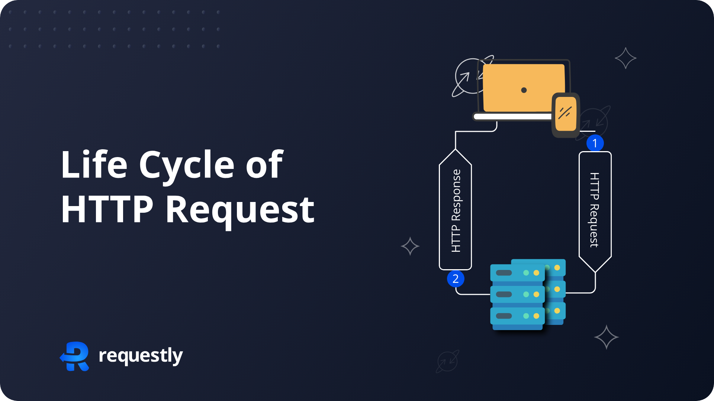
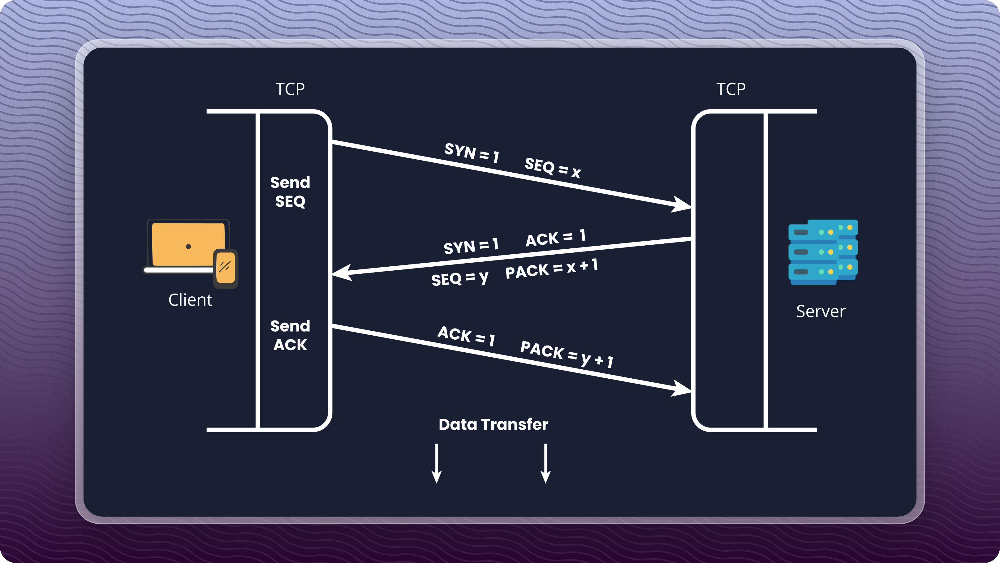
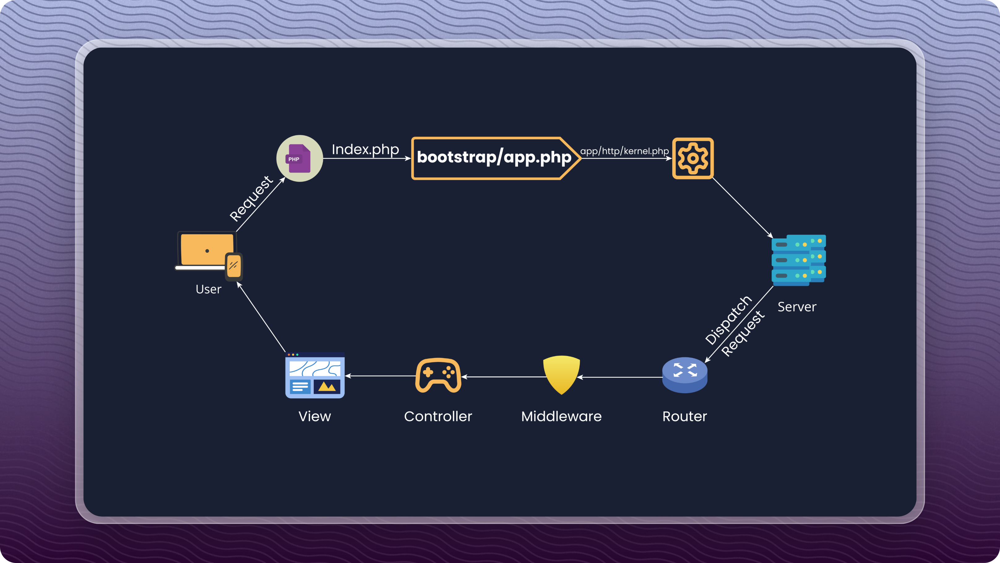
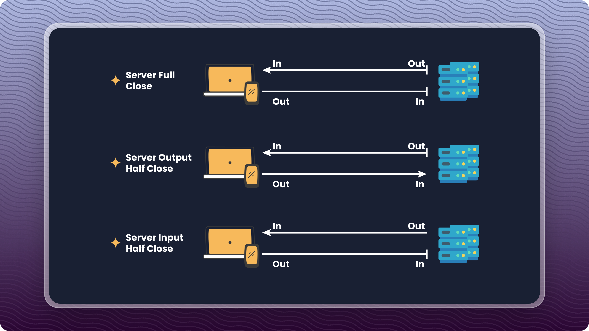

---

# Life Cycle of an HTTP Request

## Introduction

An **HTTP request** is a message sent by a client (such as a web browser, mobile app, or API consumer) to a server, requesting a resource or asking the server to perform an action.

It is one of the **most fundamental concepts in web development**, forming the backbone of how websites, web applications, and APIs communicate.

Understanding the **life cycle of an HTTP request** helps developers:

* Debug issues effectively
* Optimize performance
* Build reliable APIs
* Understand what happens *behind the scenes* when a user clicks a link or submits a form

---

## Overview of HTTP Request Methods

HTTP defines several request methods, each describing a specific intent:

1. **GET:** Used to retrieve data from the server. It is the most common HTTP method and does not modify any data on the server.
2. **POST:** Used to send data to the server, often to create or update resources. The data is sent in the body of the request.
3. **PUT:** Used to update an existing resource or create a new one if it doesn’t exist.
4. **DELETE:** Used to request the deletion of a resource on the server.
5. **PATCH:** Used for making partial updates to an existing resource, typically for modifying specific fields rather than replacing the entire resource.
6. **HEAD:** Similar to GET, it only retrieves a resource’s headers, not the body.
7. **OPTIONS:** Used to query the server about what the server supports HTTP methods and features for a specific resource.

Each method communicates *what action the client wants the server to perform*.

---

## What Is an HTTP Request?

An **HTTP request** is a structured message sent from a client to a server using the **Hypertext Transfer Protocol (HTTP)**.

It tells the server:

* **What** resource is needed
* **How** it should be processed
* **What data or metadata** is included

HTTP requests are used for:

* Loading web pages
* Submitting forms
* Fetching data from APIs
* Updating or deleting server resources

---

## Components of an HTTP Request

An HTTP request consists of several core parts:

### 1. Request Line

The first line of the request, which includes:

* **HTTP Method** (GET, POST, PUT, etc.)
* **Request URI** (e.g., `/users/1`)
* **HTTP Version** (e.g., HTTP/1.1)

**Example:**

```
GET /index.html HTTP/1.1
```

---

### 2. Request Headers

Headers provide **metadata** about the request.

Common headers include:

* **Content-Type** – Format of the request body (e.g., `application/json`)
* **User-Agent** – Identifies the client
* **Authorization** – Credentials or tokens
* **Accept** – Expected response format

---

### 3. Request Body (Optional)

Contains the data sent to the server.
Used mainly with:

* POST
* PUT
* PATCH

Examples include:

* JSON data
* Form data
* File uploads

---

### 4. Query Parameters

Optional key-value pairs appended to the URL.

**Example:**

```
/users?id=123&name=John
```

Commonly used with GET requests to filter or search data.

---

## Life Cycle of an HTTP Request (High-Level)

At a high level, an HTTP request follows this flow:

1. Client initiates request
2. DNS resolves domain name
3. TCP connection is established
4. Request is sent to the server
5. Server processes the request
6. Server sends a response
7. Client receives and renders the response
8. Connection is closed or reused

---

## High-Level HTTP Request–Response Cycle



**Diagram Description:**
This diagram illustrates the basic request-response loop:

* The client sends an **HTTP Request** to the server
* The server processes it
* The server sends back an **HTTP Response**
* The client receives and displays the result

This is the simplest mental model of HTTP communication.

---

## Step-by-Step Life Cycle of an HTTP Request

### 1. Client Initiates the Request

The process begins when a user:

* Types a URL
* Clicks a link
* Submits a form
* Makes an API call

The browser or client constructs an HTTP request with:

* Method
* Headers
* Optional body

---

### 2. DNS Resolution

Human-readable domain names (e.g., `google.com`) must be converted into IP addresses.

Steps:

* Browser checks cache
* Queries DNS resolver
* Receives IP address of the server

Without DNS, the browser wouldn’t know *where* to send the request.

---

### 3. TCP Connection Establishment (3-Way Handshake)



Before HTTP communication begins, a **TCP connection** is established:

1. **SYN** – Client requests a connection
2. **SYN + ACK** – Server accepts and responds
3. **ACK** – Client confirms

This creates a reliable, duplex communication channel.

---

### 4. HTTP Request Sent to the Server

Once the TCP connection is ready:

* The HTTP request is transmitted
* Includes headers, method, URL, and body (if any)

---

### 5. Server Processes the Request

On the server side:

* Request is received
* Routed to the correct handler or controller
* Middleware may run (authentication, logging, validation)
* Database queries may be executed
* Business logic is applied

---

## Server-Side Request Processing Flow



**Diagram Description:**
This diagram shows how a request flows **inside a server framework**:

* Request enters via the server
* Routed to the appropriate endpoint
* Passes through middleware
* Handled by a controller
* Generates a response (JSON, HTML, etc.)

---

### 6. Server Sends the Response

The server responds with:

* **Status code** (e.g., 200, 404, 500)
* **Response headers**
* **Response body** (HTML, JSON, XML, etc.)

---

### 7. Client Receives and Renders the Response

The client:

* Parses the response
* Renders HTML
* Executes JavaScript
* Makes additional requests (images, CSS, APIs)

This may trigger **multiple additional HTTP requests**.

---

### 8. Connection Closure or Reuse

* **HTTP/1.0** – Connection closed after response
* **HTTP/1.1** – Keep-Alive allows reuse
* **HTTP/2** – Multiplexing multiple requests on one connection

---

##  HTTP Connection Termination (Full & Half Close)



**Diagram Description:**
This diagram illustrates how TCP connections terminate:

* **Full Close** – Both input and output streams are closed
* **Half Close** – One side stops sending but can still receive data

---

## Terminating an HTTP Request

### 1. Graceful Close

* Client waits for the server to finish sending data
* Both sides close output channels cleanly
* No data loss or connection reset

---

### 2. Full Close vs Half Close

* **Full Close**: `close()` shuts down both directions
* **Half Close**: `shutdown()` closes only one direction (input or output)

Used in streaming and long-lived connections.

---

## Common Challenges in HTTP Request Handling

Handling HTTP requests efficiently can present several challenges that affect performance and reliability:

1. **Network Latency:** Delays transmitting data between the client and server can slow the response time.
2. **Cross-Origin Resource Sharing (CORS) Issues:** Security restrictions prevent browsers from requesting different domains, requiring proper CORS configurations.
3. **Large Payloads:** Sending large amounts of data in HTTP requests can lead to slow performance or timeouts.
4. **Handling Concurrent Requests:** Managing multiple simultaneous requests, especially in high-traffic applications, can overwhelm the server and cause bottlenecks.
5. **Error Handling:** Dealing with incorrect or unexpected requests, such as malformed headers or invalid payloads, requires proper error detection and handling mechanisms.

---

## Best Practices for HTTP Request Handling

To overcome these challenges and ensure smooth communication, following these best practices is essential:

1. **Optimize Request Payloads:** Keep the request payload minimal and concise to avoid performance issues and reduce bandwidth consumption.
2. **Implement CORS Properly:** Ensure proper CORS headers are set to securely handle requests across different domains.
3. **Use HTTP/2 or HTTP/3:** Leverage newer HTTP versions to enable multiplexing and reduce latency by allowing multiple requests over a single connection.
4. **Handle Errors Gracefully:** Always implement clear error responses with helpful status codes (e.g., 400 for bad requests) to guide the client in case of issues.
5. **Cache Responses:** Use proper caching mechanisms to reduce the number of requests and improve response times for frequently accessed resources.
6. **Rate Limiting:** Protect your server from abuse and ensure fair resource usage by implementing rate-limiting mechanisms for incoming requests.

---

## Analogy: HTTP Requests as a Food Court 🍔

* **Client** → Customer
* **Server** → Food court
* **Endpoints** → Restaurants
* **Request** → Food order
* **Response** → Prepared meal
* **Connection close** → Leaving the counter

Once the food is served, the connection is no longer needed — *happy meal!* 😄

---

## Conclusion

The life cycle of an HTTP request is a carefully orchestrated process involving:

* DNS
* TCP
* HTTP
* Server-side logic
* Response handling

By understanding each stage, developers can:

* Debug faster
* Optimize performance
* Build scalable and reliable web systems

HTTP may look simple on the surface — but under the hood, it’s a beautifully coordinated system that powers the modern web.

---

