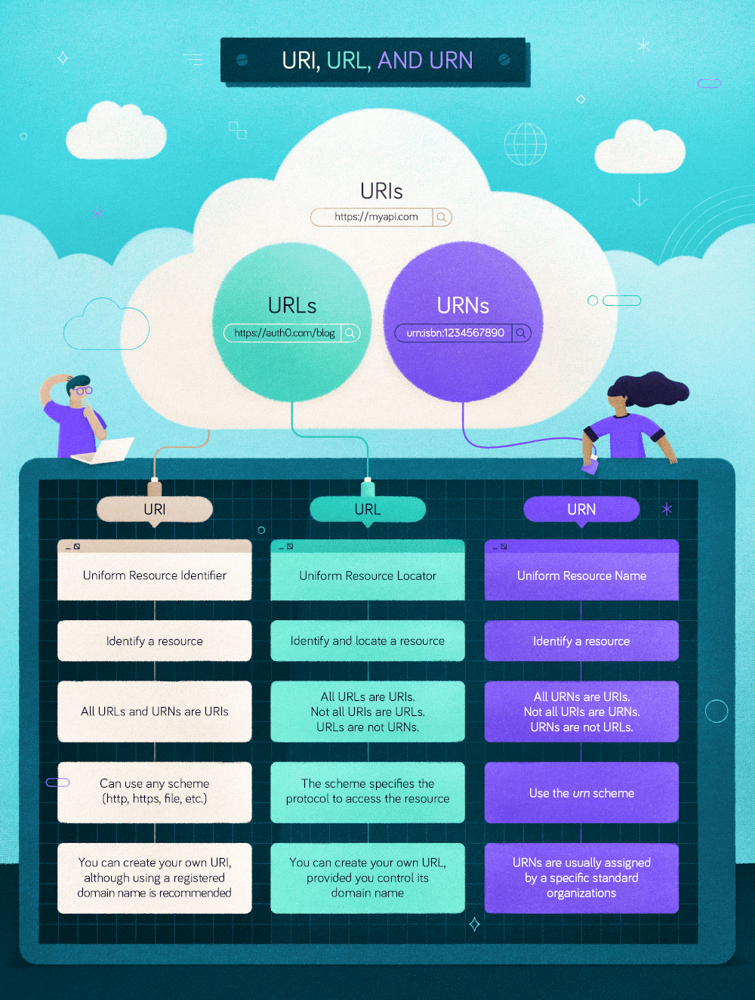

---

# Difference Between URL and URI

**Last Updated:** 12 July 2025

## Lesson Objectives

By the end of this lesson, learners should be able to:

* Define **URI**, **URL**, and **URN**
* Explain how URL, URI, and URN are related
* Identify the components of a URL/URI
* Choose the correct term when designing or documenting APIs
* Avoid common misconceptions between URLs and URIs

---

## 1. Introduction

In web browsers and Internet-based applications, we constantly interact with strings such as:

```
https://www.geeksforgeeks.org/
```

These strings point to web pages, images, APIs, documents, and other resources.
Two important concepts are used to describe such identifiers:

* **URI (Uniform Resource Identifier)**
* **URL (Uniform Resource Locator)**

Although often used interchangeably, **they are not the same thing**.

---

## 2. What Is a URI (Uniform Resource Identifier)?

A **URI** is a **string of characters that uniquely identifies a resource** on the Internet.

* Identification can be done by:

    * **Location**
    * **Name**
    * **Or both**

A URI does **not necessarily tell you how to access the resource** — it only ensures that the resource can be uniquely identified.

### Key Characteristics of URI

* It is the **most general concept**
* It is an **identifier**, not always an address
* It follows a standardized syntax (RFC 3986)
* It can represent:

    * A URL
    * A URN
    * Or both

> 💡 Think of a URI like identifying a person by a unique national ID number — it identifies, but doesn’t tell you where they live.

---

### 📌 Diagram Placeholder 1

*(Insert the “URI contains URL” circle diagram here)*

---

## 3. What Is a URL (Uniform Resource Locator)?

A **URL** is a **specific type of URI** that:

* Identifies a resource **and**
* Specifies **how and where to access it**

In simple terms, a URL is an **address**.

### Examples of URLs

```
https://jwt.io
https://auth0.com/docs/get-started
mailto:friend@example.com
ftp://ftpserver.com/files
```

### Key Characteristics of URL

* Always includes a **scheme/protocol**
* Tells the browser **how to retrieve the resource**
* Points to a **network location**

> 💡 A URL is like a full home address — it identifies the house and tells you how to get there.

---

## 4. Anatomy of a URL

A URL has a **uniform structure** composed of several parts.

### General Syntax

```
scheme://authority/path?query#fragment
```

### Components Explained

| Part          | Description                                  |
| ------------- | -------------------------------------------- |
| **Scheme**    | Protocol used (http, https, ftp, mailto)     |
| **Authority** | Domain name + optional port                  |
| **Path**      | Location of resource on the server           |
| **Query**     | Optional parameters                          |
| **Fragment**  | Reference to a specific part of the resource |

---

### Example

```
https://www.geeksforgeeks.org/dsa/minimum-cost-graph/
```

* **Scheme:** https
* **Authority:** [www.geeksforgeeks.org](http://www.geeksforgeeks.org)
* **Path:** /dsa/minimum-cost-graph/

---

### 📌 Diagram Placeholder 2

*(Insert the “URL structure: protocol, hostname, filename” diagram here)*

---

## 5. What Is a URN (Uniform Resource Name)?

A **URN** is a type of URI that:

* Identifies a resource **by name**
* Is **location-independent**
* Is intended to be **persistent over time**

Unlike URLs, URNs **do not tell you where the resource is located**.

### URN Syntax

```
urn:<namespace-identifier>:<namespace-specific-string>
```

### Examples

```
urn:isbn:1234567890
urn:ietf:rfc:2648
urn:ISSN:0167-6423
```

### Key Characteristics of URN

* Persistent and globally unique
* Issued by standard organizations
* Commonly used for:

    * Books
    * Standards
    * Academic and official documents

---

### 📌 Diagram Placeholder 3

*(Insert the “URI vs URL vs URN” infographic here)*

---

## 6. Relationship Between URI, URL, and URN

The relationship can be summarized as:

* **All URLs are URIs**
* **All URNs are URIs**
* **Not all URIs are URLs**
* **URLs and URNs are different types of URIs**

### Simple Analogy

| Concept | Real-World Analogy  |
| ------- | ------------------- |
| URI     | A unique identifier |
| URL     | Home address        |
| URN     | National ID number  |

---

## 7. Key Differences Between URL and URI

| Feature           | URL                                                            | URI                    |
| ----------------- | -------------------------------------------------------------- | ---------------------- |
| Purpose           | Locates a resource                                             | Identifies a resource  |
| Protocol Included | Yes                                                            | Not required           |
| Scope             | Subset                                                         | Superset               |
| Access Method     | Included                                                       | Not necessary          |
| Example           | [https://www.geeksforgeeks.org](https://www.geeksforgeeks.org) | urn:isbn:0-294-56559-3 |

---

## 8. URLs vs Links (Important Clarification)

* A **URL** is a string (address)
* A **link (hyperlink)** is an HTML element that **uses a URL**

```html
<a href="https://example.com">Visit Example</a>
```

✔ URL can exist without a link
❌ A link cannot exist without a URL

---

## 9. Practical Usage in APIs & Authentication

### API Identifiers (Audience)

In systems like Auth0:

* API identifiers are **URIs**
* They are **logical identifiers**
* They are **not accessed via HTTP**

Example:

```
https://myapi.example.com
```

> Auth0 will never send a request to this URI — it’s only used for identification.

---

## 10. Common Misconceptions

❌ URL and URI mean the same thing
✔ URL is a type of URI

❌ Every URI can be opened in a browser
✔ Only URLs are meant for access

❌ URNs are obsolete
✔ URNs are still used in standards and identity systems

---

## 11. Summary

* **URI** is the umbrella term for identifying resources
* **URL** identifies **and locates** a resource
* **URN** identifies a resource **independently of location**
* URLs are what we use daily, but URIs are the foundation of the Web

### One-Line Takeaway

> **Every URL is a URI, but not every URI is a URL.**



---

