# The Lifecycle of a Request

## 1. The Dispatcher Servlet

Spring MVC is designed around the “front controller pattern”, where a central dispatching controller (i.e., a “Servlet” in Java terms), the DispatcherServlet, provides all the logic to process incoming requests, and delegates the actual work to configurable components, such as user-defined controllers.

---
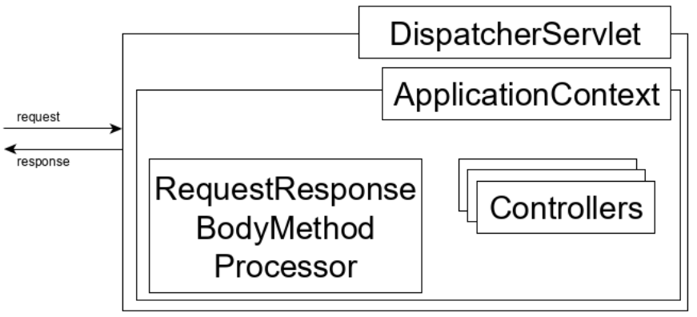
---

Schematically, this flow is represented by the following diagram:

So before an HTTP request hits a Controller endpoint that we developed, it gets handled by Spring’s DispatcherServlet. The logic in this class includes the following steps:

    1. determine what controller method is the destination for the request
    2. deserialize the HTTP request body into objects according to the signature of the method
    3. execute the method
    4. convert the output (if any) produced by the method into the response by serializing it according to the format specified in the request

In this lesson, we’ll examine how the DispatcherServlet implements these steps. To this end, we’ll hit an endpoint that accepts a non-empty request body and returns a non-void output.

The create(CampaignDto) method of the CampaignController fits these conditions well. Let’s start by placing a breakpoint inside this method:

---
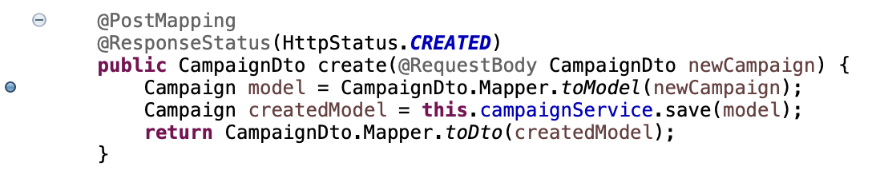
---

We’re aiming to inspect the request’s flow before it hits this breakpoint and after executing the return statement.

Then we’ll add another breakpoint, this time on the first line of the doDispatch() method of the DispatcherServlet:

---
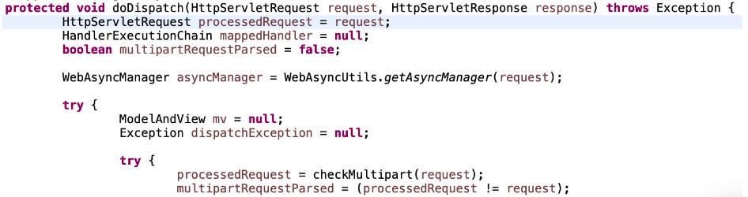
---

> **Note:** in the Resources section, you’ll find links on how to open library classes in Eclipse and IntelliJ, in case you don’t have much experience with this.

Now let’s start the application in debug mode, and send a valid request for our endpoint:

Postman request: Create Campaign

---
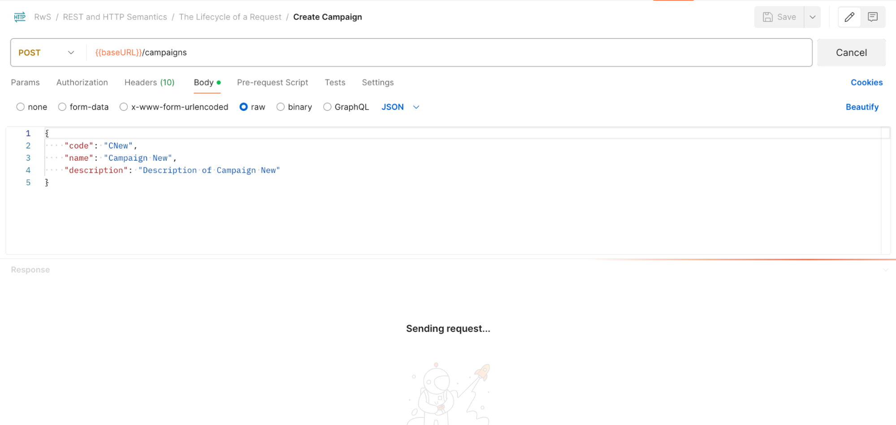
---

As expected, the execution of the code stops at the doDispatch() method, where we just put a breakpoint.

In this method, we may identify the “milestones” of the request elaboration, which involves the steps mentioned earlier:

---

---

The getHandler() method identifies the controller method the request should hit.

Afterwards, the handler is actually invoked. The deserialization of the request body and serialization of the response content is part of this process.

## 2. Resolving the Request Handler

Now let’s step into the getHandler() method and see what it does:

---
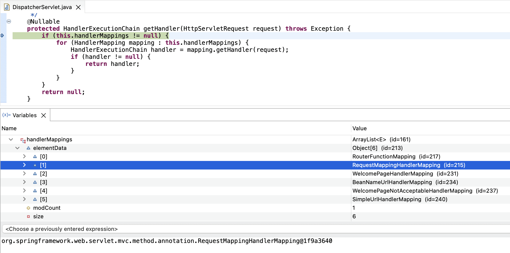
---

As we can see, its logic is quite simple; it iterates over all HandlerMapping instances stored in the handlerMappings field until the first matching handler is found.

The Spring framework is the one establishing the order in which these elements are processed as part of the initial setup. The RequestMappingHandlerMapping instance has the highest priority.

This class is responsible for handling methods in the controllers annotated with @RequestMapping, precisely what we have in our CampaignController. Therefore, the first element should be selected during the iteration.

So let’s move forward and step into the getHandler() method, which is implemented in the AbstractHandlerMapping parent class:

---
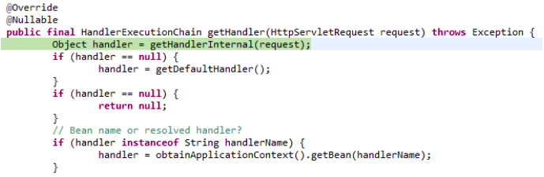
---

Let’s step into the invoked method, and then again into the (super) AbstractHandlerMethodMapping getHandlerInternal method:

---
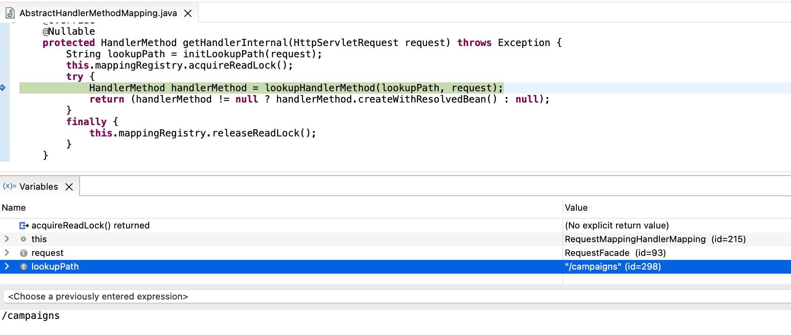
---

As expected, here we can see that the lookupPath variable is assigned with the “/campaigns” value.

Then we can step into this lookupHandlerMethod() that’s responsible for finding the best-matching handler method for the request:

---
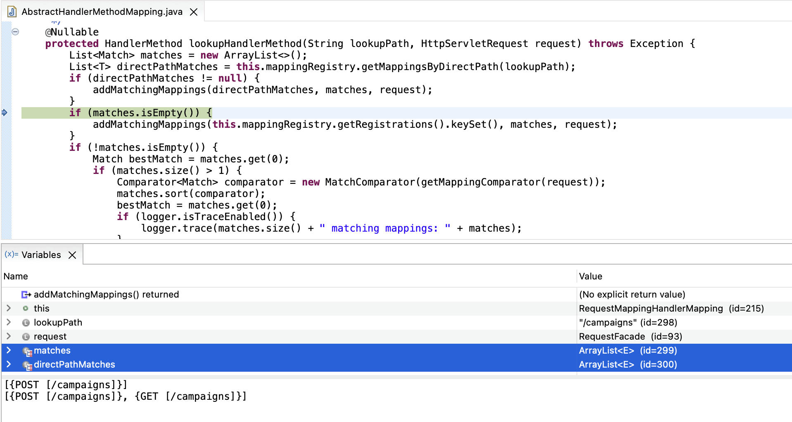
---

The logic is straightforward. The method first narrows down the endpoints based on the request path, then it filters out the ones that don’t match other request aspects (like the HTTP Method, as in this case), and if there’s still more than one candidate, it compares the matches to resolve which one has precedence.

Now we can “Step Return”/”Step Out” back to the doDispatch() method of the DispatcherServlet class that we started from to confirm that the returned HandlerMethod is, in fact, referencing the “create” method in the CampaignController. Then we can move forward to the second milestone, the HandlerAdapter.handler method:

---
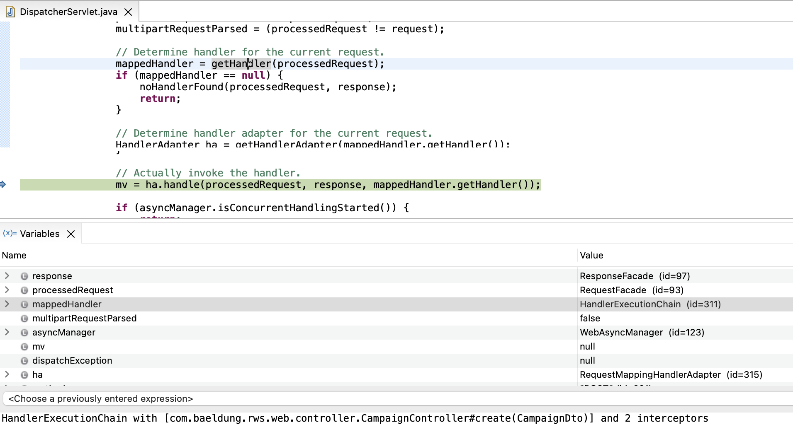
---

## 3. Deserialization

At this point, we’ll jump ahead in the process by setting a breakpoint in the ServletInvocableHandlerMethod.invokeAndHandle method and resuming up to that point:

---
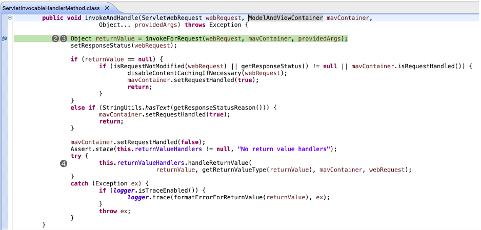
---

In this method, we can clearly see the key method that will invoke the handler method (for which the request body will have to be deserialized), and that retrieves the returnValue that will be processed at a later stage.

Let’s step into the invokeForRequest function:

---
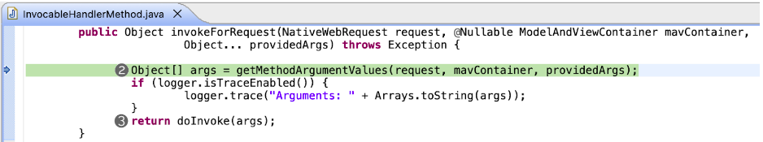
---

Before invoking the request, the framework must gather all the arguments that are required in the handler method signature. Let’s delve deeper into this getMethodArgumentValues method:

---
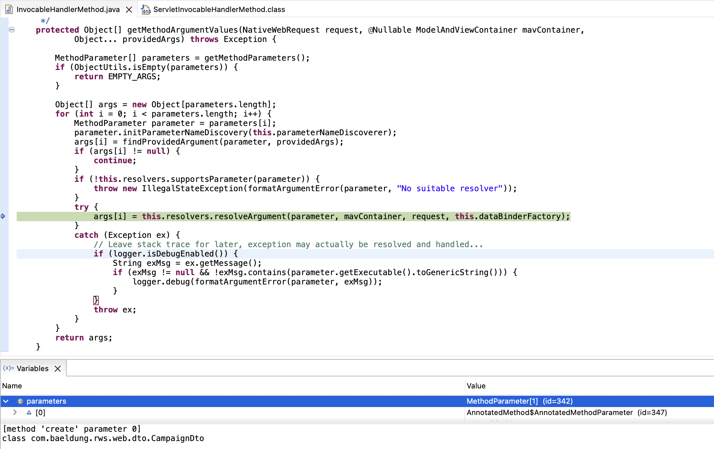
---

We can move forward into the loop that processes the method parameters. Inspecting the variables, we can confirm that the method has only one parameter, which is of type CampaignDto.

If we move inside the resolveArgument, we can see that it determines a RequestResponseBodyMethodProcessor is a suitable resolver for this argument:

---
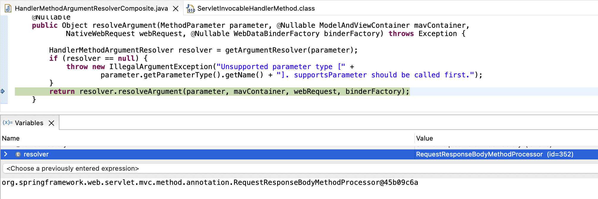
---

And in turn, this one tries to read the content with a message converter:

---
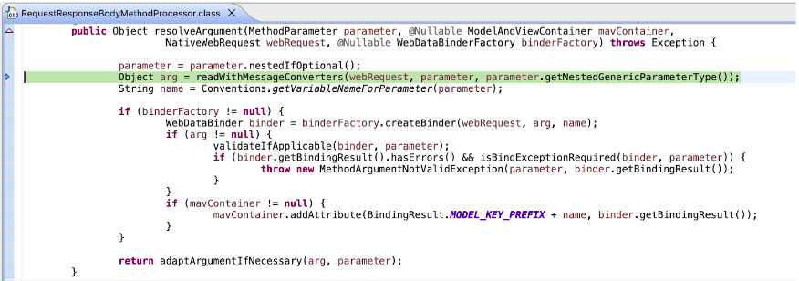
---

Let’s step into this readWithMessageConverters method, and then further to the same method with a different signature inside the class:

---
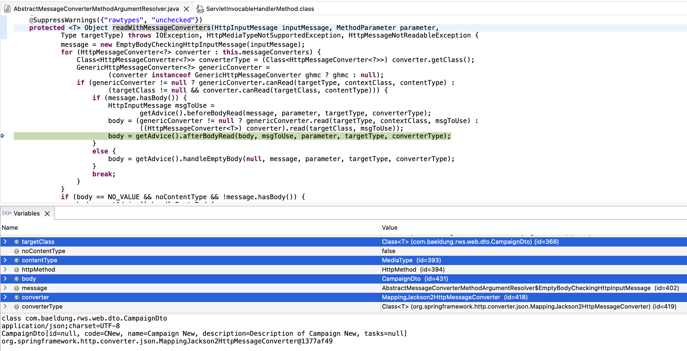
---

Simply put, the resolver is checking if any of its configured messageConverters are capable of processing the request based on the value of the Content-Type (application/json;charset=UTF-8) and of the target class it should deserialize (CampaignDto).

As we can see, the MappingJackson2HttpMessageConverter was the one able to do this, and the body is correctly mapped to an Object.

## 4. Invoking the Handler Method

Now let’s “Step Return / Out” to the InvocableHandlerMethod.invokeForRequest method to confirm that the handler method is executed correctly with the resolved arguments:

---
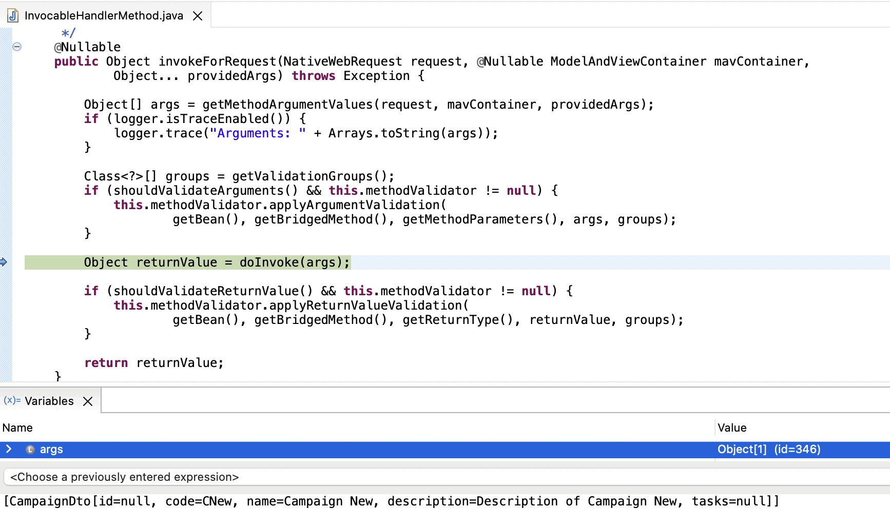
---

As soon as we “Step Over” the doInvoke(args) command, the breakpoint placed in the CampaignController will be triggered, confirming that it’s at this stage that the endpoint is executed:

---
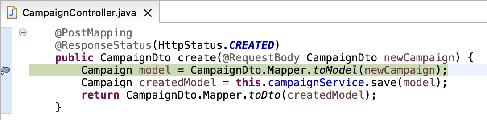
---

We can now “Step Return / Out” a few steps back to the ServletInvocableHandlerMethod to confirm the returnValue is indeed a new CampaignDto (with an assigned id), and then move forward to the next step in the process, where this return value object is handled:

---
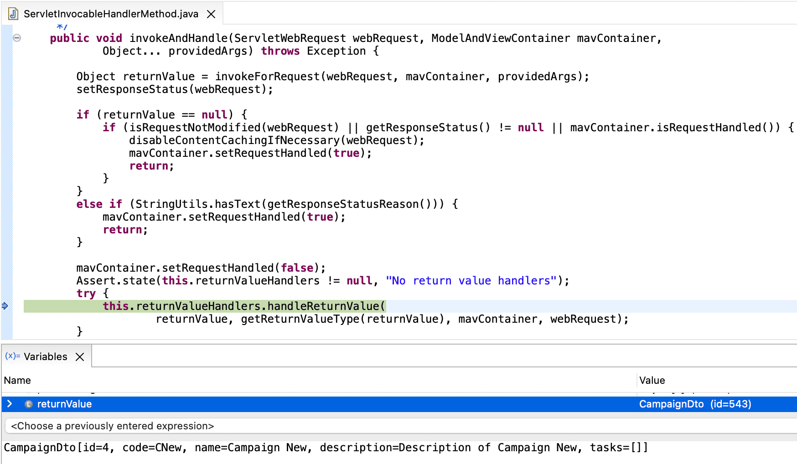
---

## 5. Serialization

We can move into the handleReturnValue to see that it proceeds similar to the request body handling logic:

---
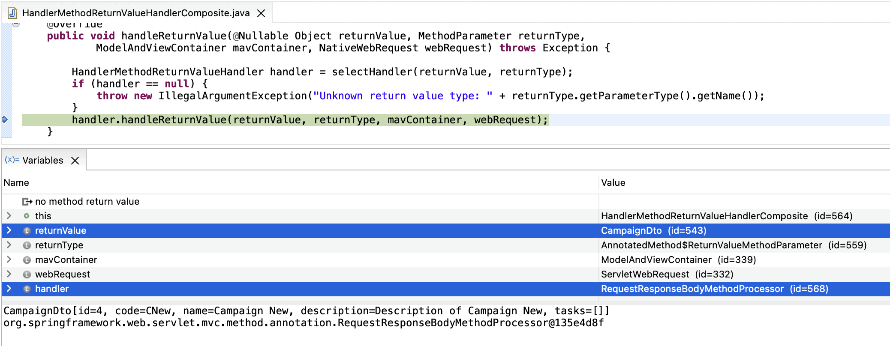
---

Simply put, the framework establishes that the RequestResponseBodyMethodProcessor (which was used to process the request body) is also a suitable “return value handler” for this response value, as per the expected type, which naturally is a CampaignDto.

Let’s step into this method:

---
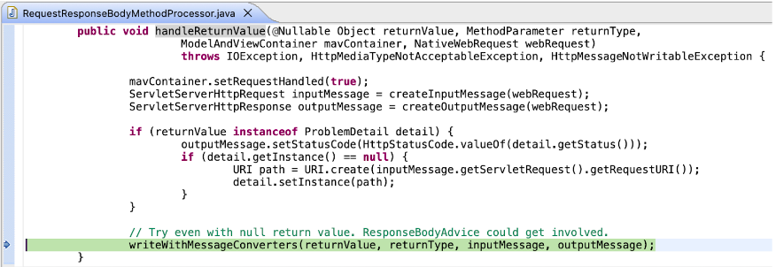
---

Analogous to the deserialization process, the processor calls a method that indicates it will make use of the same message converters as before, but this time to write the response body.

Let’s confirm this by diving into this method:

---
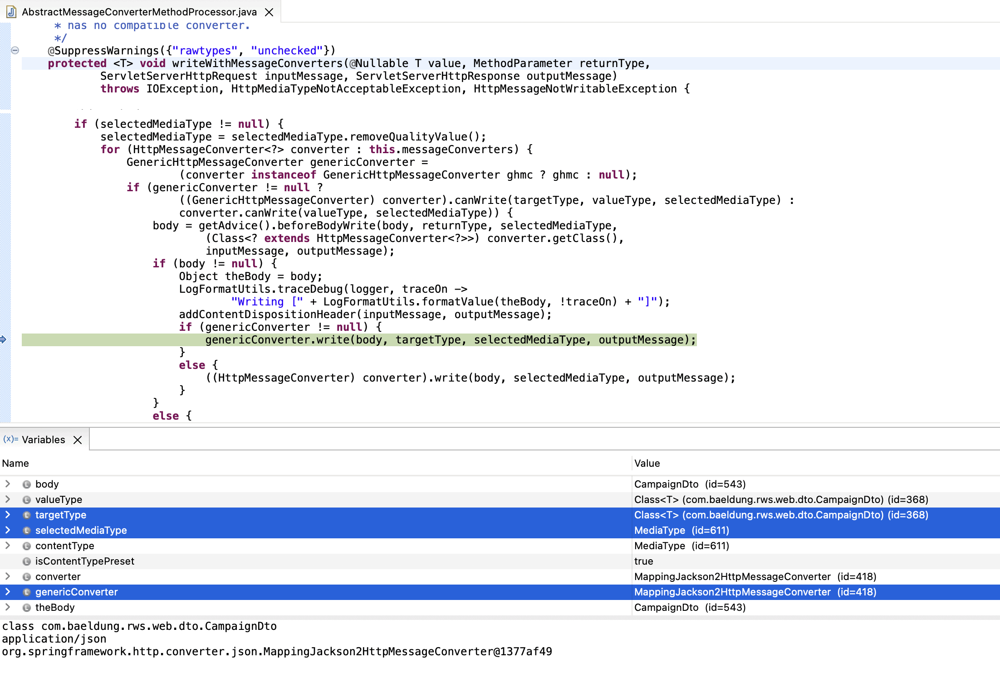
---

This method is rather complex, but it can be summarized into the following steps:

    1. It determines which Media Type is expected or required for the response body (application/json).
    2. It resolves which converter is suitable for that Media Type, and for the target class (CampaignDto).

Unsurprisingly, the MappingJackson2HttpMessageConverter is selected once more to serialize the body by writing into the output response.

We can finally resume the debug process to obtain the JSON-formatted response from the service:

---
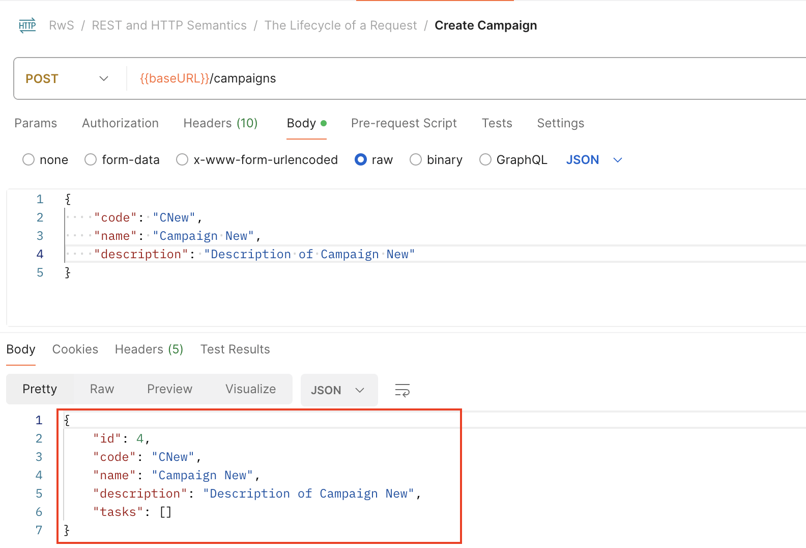
---

## 6. Exception Handling

Even though we’ll explore Spring’s Exception Handling mechanisms in future lessons, it’s worth taking the time to point out how it takes part in the process we’ve analyzed throughout this presentation.

If you’ve been closely following along the debug process, you might have noticed that the DispatcherServlet and its associated mechanism do provide some exception-handling logic to provide a suitable response for the errors that bubble up to this stage:

---
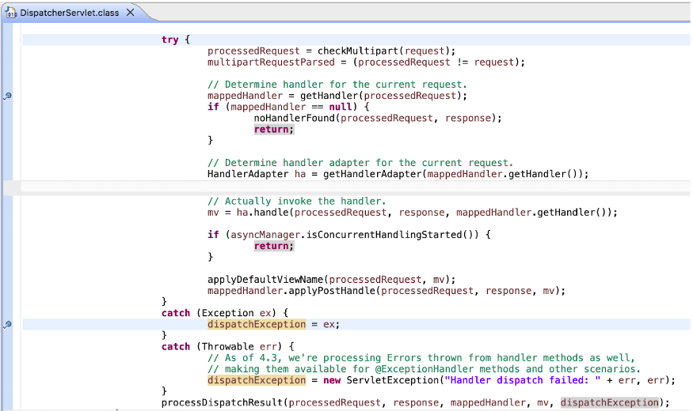
---

To sum up, any exception that occurs as part of the normal process isn’t passed forward to higher levels of the call stack, and instead tries to resolve a suitable response for it.

We can also appreciate that some of the “return value handlers” also provide some special treatment for ProblemDetail response bodies, which, as we’ll see in future lessons, is a standard format for error responses.

The RequestResponseBodyMethodProcessor, which we’ve seen in action in this lesson, is one such case:

---
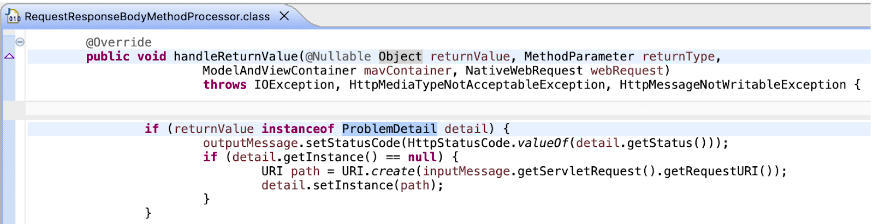
---

And the HttpEntityMethodProcessor is another very common case, since it handles ResponseEntity return values, like the ones retrieved by the ResponseEntityExceptionHandler (used commonly to extend a @ControllerAdvice global error handler):

---
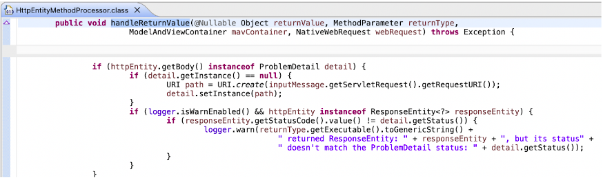
---

Finally, it’s worth pointing out that we provide a link in the Resources section to a video where we show the debug process visually. It is based on an older version of the course, the codebase is different, but the process is roughly the same, so it might still be helpful to follow along and learn about this mechanism.

---