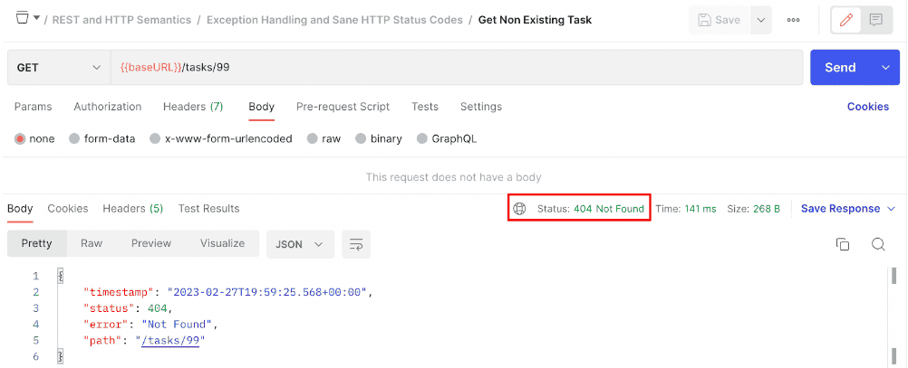
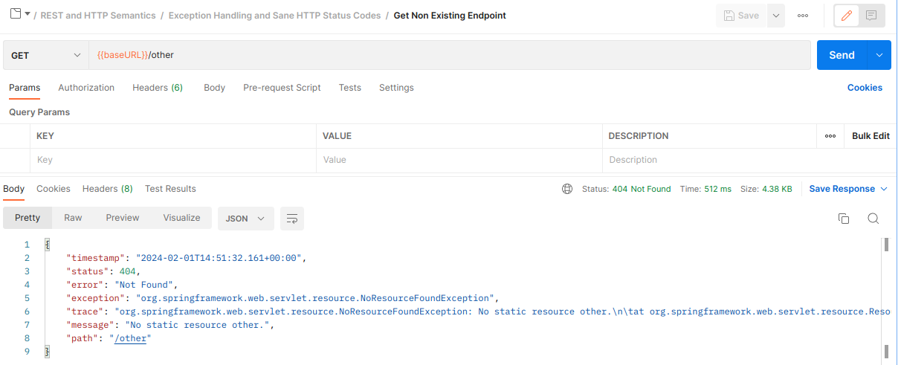
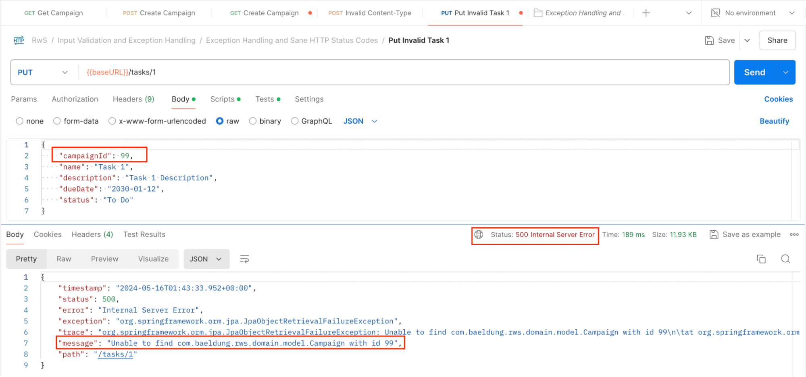
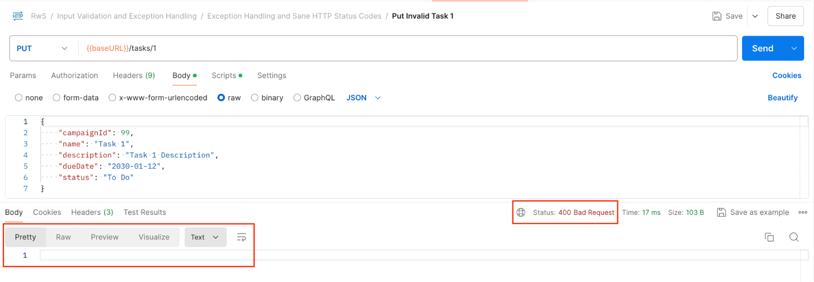
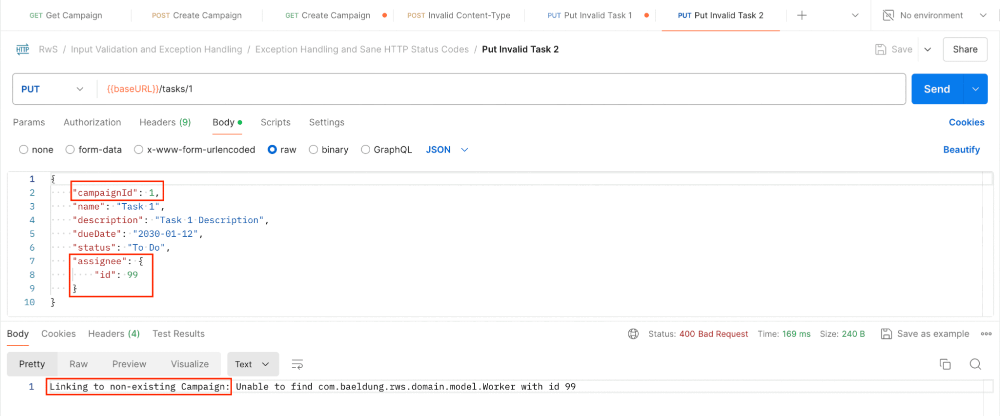
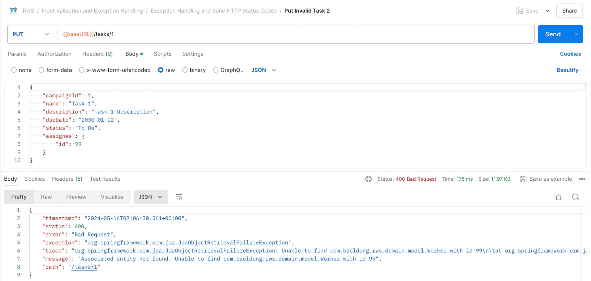

# 1. Error Responses and Sane HTTP Status Codes

As we’ve seen, HTTP semantics become very handy in defining and clearly transmitting the different aspects that characterize an API and its behavior under different situations.

**When it comes to Exception handling, the HTTP Status code plays a critical role for the Client to understand at first glance the nature of the error**, together with any relevant information contained in the response body to narrow down the exact cause and either guide toward a solution, or at least be able to communicate the problem appropriately to the user.

Two status groups come into play here: the 4xx Client Errors, which indicate a scenario where the client seems to have erred, and 5xx Server Errors, to imply that the server is aware that it has misbehaved or is incapable of performing the requested method.

So **whenever we determine that the cause of the error is on the Client’s side, and thus in their power to fix and present a valid request, we should present an insightful 4xx response status and information to guide them towards this direction.**

Some of the principal status codes of this group include:

* **400 – Bad Request:** usually indicates a malformed request syntax
* **401 – Unauthorized:** to express that the request lacks valid authentication credentials to access the resource
* **403 – Forbidden:** indicates that the server understood the request but refuses to fulfil it, often because the provided credentials are insufficient to grant access
* **404 – Not Found:** Indicates that the server can’t find a representation for the target resource
* **405 – Method Not Allowed:** Indicates that the HTTP Method presented isn’t supported for the target resource
* **415 – Unsupported Media Type:** announces that the content is in a format not supported by this method on the target resource. This can usually be determined by the Content-Type header provided in the request.

With 5xx error responses, there shouldn’t be any action the Client can do to “fix” the error and present a valid request. However, we still have to present a suitable status code and potentially relevant information to at least inform the Client if it’s a temporary or permanent condition.

The main 5xx error codes are:

* **500 – Internal Server Error:** This is the most common 5xx error status, as it encompasses the cases where the server encountered an unexpected condition that prevented it from fulfilling the request (e.g., a database connection error, third-party connection issue, file processing errors, etc.).
* **503 – Service Unavailable:** Used to express that the server can’t handle the request due to a temporary overload or scheduled maintenance.

---

## 2. The ResponseStatusException

We’ll start by focusing on a special exception that our application already uses from previous lessons.

Let’s open the TaskController class and have a look at its findOne method implementation:

```java
@GetMapping(value = "/{id}")
public TaskDto findOne(@PathVariable Long id) {
    Task model = taskService.findById(id)
            .orElseThrow(() -> new ResponseStatusException(HttpStatus.NOT_FOUND));

    return TaskDto.Mapper.toDto(model);
}
```
As we can see, we’re using the ResponseStatusException to conveniently respond with a suitable 404 – Not Found HTTP response status when the service can’t retrieve an entity for the specified id param.

As with most Exceptions, we can also include a custom error message in the constructor invocation to provide some relevant context information:

> new ResponseStatusException(HttpStatus.NOT_FOUND, "Couldn't find the requested Task")

Let’s start the application using “mvn spring-boot:run” from the command line, or using the IDE and Postman to trigger this exception:

> Postman Request: Get Non Existing Task




As expected, the response retrieves the HTTP Status code we indicated. The exception message isn’t included just anywhere in the response, but we’ll get to that in a moment.

---

## 3. Spring and Spring Boot’s Built-in Error Handling

Let’s dive into the Error Handling support that Spring and Spring Boot bring to the table.

For this, we’ll first open the main RwsbApp class and disable the ErrorMvcAutoConfiguration to appreciate how errors are normally retrieved without Boot’s support:

> @SpringBootApplication(exclude = ErrorMvcAutoConfiguration.class)

Now we’ll restart the application and execute the request again:

> Postman Request: Get Non Existing Task


As we can see, without Boot, we’re obtaining an HTML response, which doesn’t make it easy for other services to consume our RESTful APIs to extract useful information.

Now let’s revert the change, again enabling the autoconfiguration in the main class to obtain the JSON-formatted response that Boot generates.

Furthermore, since it’s not always possible to check the application logs to discover the exact cause of the error, we’ll try to enhance the response body to include some debug information that can shed light on this, and help in the development process.

Fortunately, Boot collects some useful error information, which isn’t retrieved by default as a security measure to avoid exposing the service’s internal aspects. However, the response can easily include this by setting up simple application properties. Let’s open the application.properties file and add the following:

> server.error.include-message=always
> server.error.include-exception=true
> server.error.include-stacktrace=always

Now we’ll recheck the response after restarting the application:

> Postman Request: Get Non Existing Task


We can now see a few new interesting fields in the response. The most useful one is the “message” field that guides us to the cause of the error. In this case, it’s the custom error message we defined when throwing the ResponseStatusException.

Boot internally gathers the error data and stores it as request attributes; exposes an ErrorController, which handles requests mapped to “/error”; and routes the exceptions to this endpoint to process the data and provide this error response.

We have to make an important clarification at this stage. In general, the error-handling logic should guide the client to solve the problem, but it shouldn’t be used as a debugging tool. If used that way, it might expose implementation internals, with the risk of leaking information that can be exploited. That’s why Boot doesn’t retrieve all of this information out of the box, and why we should be cautious to enable it only in development environments or conscious of its security implications.

Now let’s trigger some different exceptions, this time thrown by the framework itself, instead of by our own logic.

We can see, for example, how Spring automatically retrieves a 404 response when we request a non-existing target resource:

> Postman Request: Get Non Existing Endpoint



Similarly, suppose we request a Method that’s not supported for a resource. In this case, we’ll obtain a 405 response, including an “Allow” header that indicates the HTTP Methods that are actually supported by the application, as required by the HTTP Semantics spec:

> Postman Request: Invalid Method – Put on tasks list


Furthermore, if we perform a call to an endpoint presenting the incorrect media type, we’ll obtain a 415 response, including an “Accept” header as suggested by the official specs:

> Postman Request: Invalid Content-Type


Now let’s jump to a case that triggers an unexpected exception that the framework can’t determine the nature of, so as to provide a suitable 4xx client error status:

> Postman Request: Put Invalid Task 1



As the error message indicates, in this case, we’re trying to associate a non-existing Campaign with the Task we’re modifying.

This scenario shouldn’t be represented with a 500 – Internal Server Error because it’s obviously an error in the request that the Client can fix. The service should receive a 400 – Bad Request response, ideally with a friendlier message.

Naturally, we could consider refactoring the logic for this endpoint to check if the Campaign exists before trying to update the Task and throwing a ResponseStatusException, similar to how the GET operation works. Still, for the purpose of this lesson, we’ll just handle the exception whenever the application triggers it.

---

## 4. Controller-Level @ExceptionHandler

For this, we’ll be using the @ExceptionHandler annotation.

In short, we can include this annotation in a Controller method to handle the exceptions raised in any of its endpoints, passing in the type of Exception that we want to handle as a parameter.

Let’s open the TaskController and add an exception handler for the error we just saw:

```java
@ExceptionHandler({ JpaObjectRetrievalFailureException.class })
@ResponseStatus(HttpStatus.BAD_REQUEST)
public void resolveException() { }
```

As we can see, this mechanism allows us to use the same @ResponseStatus annotation in any other Controller endpoint to specify the response status we want to deliver.

Let’s re-launch the app, and execute the request once again:

> Postman Request: Put Invalid Task 1



We can see that the response status is now the one we wanted, but since we gained complete control of the response and we’re returning a void, the body is simply empty.

Now let’s see the different capabilities offered by the @ExceptionHandler mechanism to be able to provide a more helpful response.

---

## 5. @ExceptionHandler Method Arguments and Return Values

The framework supports several different method arguments and return types in the handler method. In the Resource section, you can find a link to the official docs with the full list of options.

Some of the most useful method arguments we can use are the actual Exception object, and the ServletRequest and ServletResponse instances. Let’s modify our handler method:

```java
@ExceptionHandler({ JpaObjectRetrievalFailureException.class })
public String resolveException(
  JpaObjectRetrievalFailureException ex,
  ServletRequest request,
  HttpServletResponse response) {
    response.setStatus(HttpStatus.BAD_REQUEST.value());
    return "Linking to non-existing Campaign: " + ex.getMessage();
}
```

Note that we’re getting rid of the @ResponseStatus feature and programmatically manipulating the response status. Also, we’re returning a String that includes the exception message.

Now, a quick heads up before checking the response this time. We must be careful when making assumptions regarding the nature of the exception we’re handling. We have to keep in mind that the same error can be triggered in different scenarios, some of which might even require retrieving a different HTTP response status or error message.

Let’s restart the service, but this time send a different request:

> Postman Request: Put Invalid Task 2



In this case, the associated Campaign is ok. The assignee reference is the faulty one, which makes our error message not suitable.

This is a trivial example, but it shows how we must be careful when handling exceptions.

A feature that can help in this aspect is the possibility of referring, both for the @ExceptionHandler argument, as well as for the method parameter, to either the top-level exception being propagated or to any of the nested “cause” exceptions in the hierarchy:

```java
@ExceptionHandler({ EntityNotFoundException.class })
public String resolveException(
        JpaObjectRetrievalFailureException ex,
        ServletRequest request,
        HttpServletResponse response) {
    // …
}
```

With this, the handler method will still be invoked in the scenarios we just saw because the EntityNotFoundException is the nested cause of the top-level JpaObjectRetrievalFailureException finally thrown by the framework.

The error body is still not very useful to be consumed by another service, since it’s a plain String.

We could create a custom error body class to retrieve just any suitable response structure, or, probably even better, reuse the functionality that Boot already provides out of the box.

Let’s explore these options.

---

## 6. Retrieving an Error Object

If we want to retrieve a custom JSON object body to contain the error information, we can simply create a POJO and retrieve it in our @ExceptionHandler.

Let’s create a simple com.baeldung.rwsb.web.error.CustomErrorBody record to this end:

```java
public record CustomErrorBody(

    String errorMessage,

    String errorCode) { }
```

And now, modify our handler in the TaskController:

```java
@ExceptionHandler({ EntityNotFoundException.class })
public CustomErrorBody resolveException(
        JpaObjectRetrievalFailureException ex,
        ServletRequest request,
        HttpServletResponse response) {

    response.setStatus(HttpStatus.BAD_REQUEST.value());

    return new CustomErrorBody("Associated entity not found: " + ex.getMessage(), "INVALID_CAMPAIGN_ID");
}
```

If we restart the application at this point and send the request again, we can see the response body uses this new structure:

> Postman Request: Put Invalid Task 2


---

## 7. Relying on Boot’s Error Handling Mechanism

If we recall what Boot provides to the application to handle errors, we can see that in order to rely on its mechanism, the main thing we have to do is direct the flow to the “/error” endpoint that’s routed to the ErrorController class it defines in the context.

Let’s update our method now to do this:

```java
@ExceptionHandler({ EntityNotFoundException.class })
public ModelAndView resolveException(
        JpaObjectRetrievalFailureException ex,
        ServletRequest request,
        HttpServletResponse response) {
    request.setAttribute(RequestDispatcher.ERROR_STATUS_CODE, HttpStatus.BAD_REQUEST.value());
    request.setAttribute(RequestDispatcher.ERROR_MESSAGE, "Associated entity not found: " + ex.getMessage());
    ModelAndView mav = new ModelAndView();
    mav.setViewName("/error");
    return mav;
}
```

As we said, this controller makes use of certain request parameters in order to generate a proper response. That’s why we’re using this approach here, instead of trying to modify the response as we did before.

Let’s see this in action by restarting the service and calling the same request as before:

> Postman Request: Put Invalid Task 2



As we can see, with this approach, we’re able to both manipulate the error response quite flexibly, as well as be consistent with the rest of the error responses retrieved by the service.

---