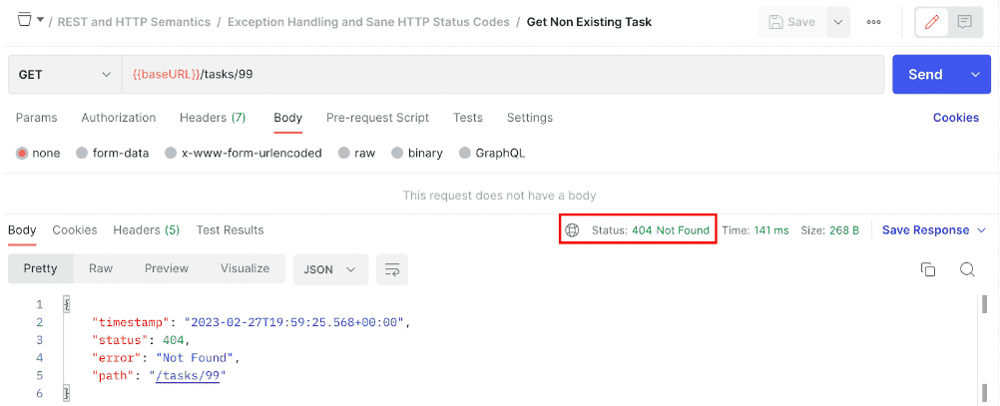
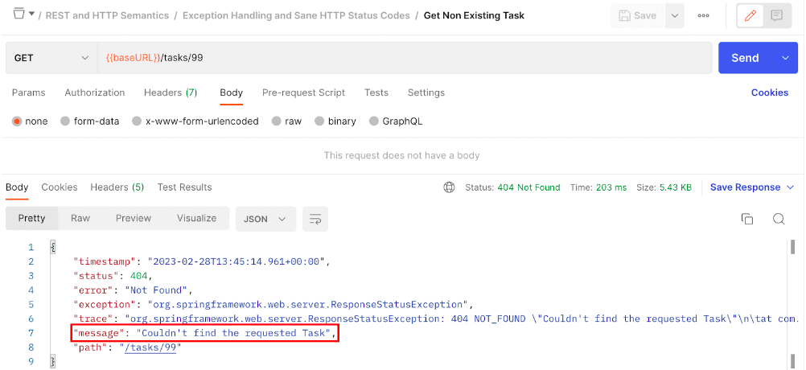
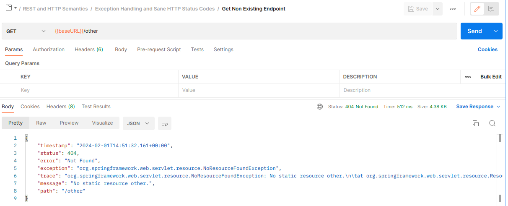
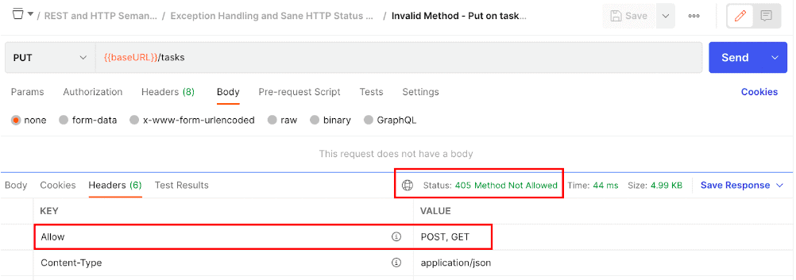
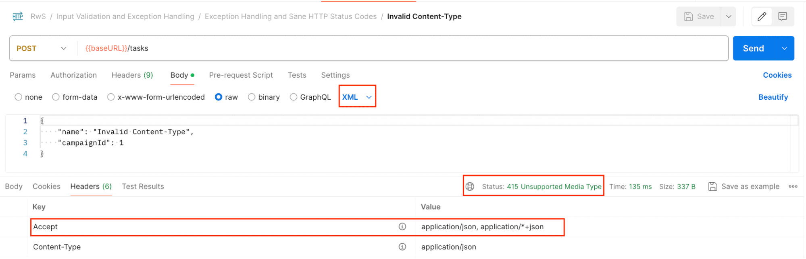
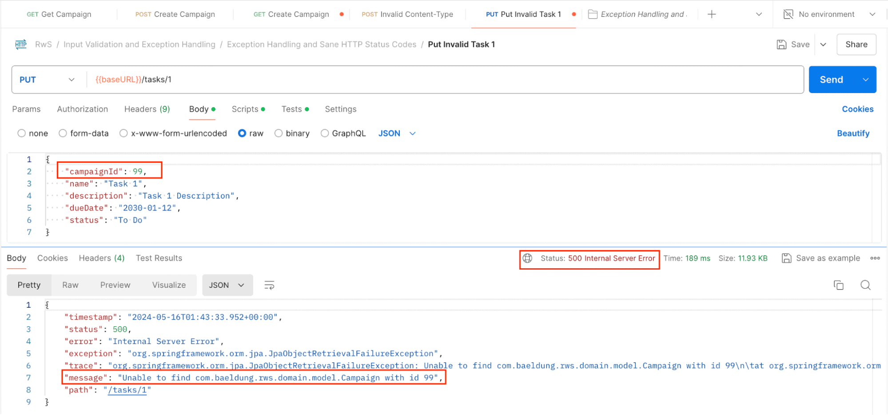
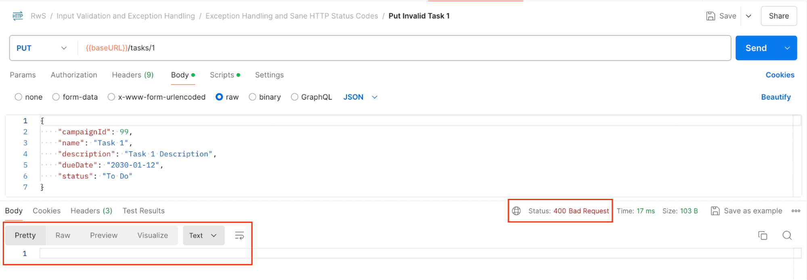
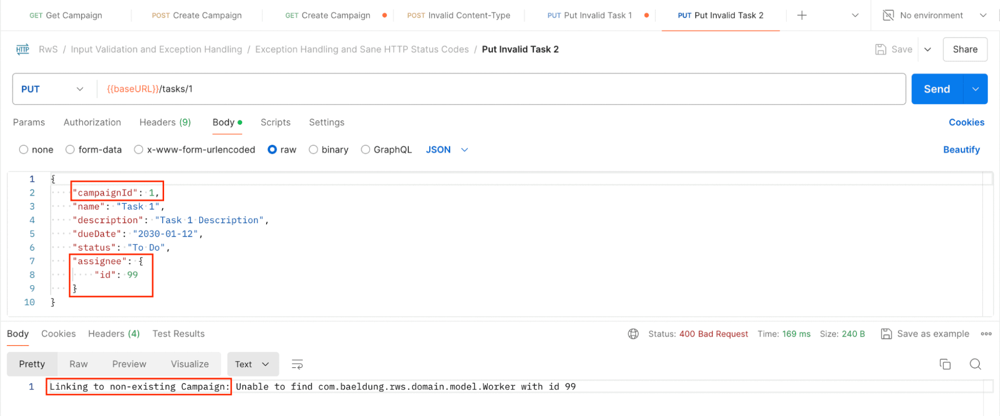
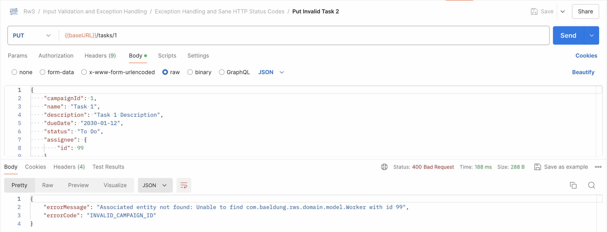
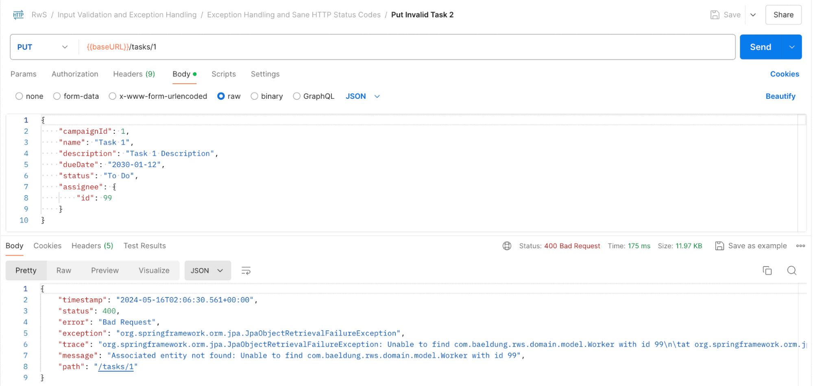

# Exception Handling and Sane HTTP Status Codes

## 1. Objective

In this lesson, we examine how HTTP Status Codes should be used correctly when handling errors in a REST API.

We focus on:

* Understanding the semantics of HTTP status codes in failure scenarios
* Distinguishing client errors from server errors
* Leveraging Spring and Spring Boot support for meaningful responses
* Implementing controller-level exception handling

The goal is to ensure that our API communicates errors clearly, predictably, and consistently.

---

# 2. Error Responses and Proper HTTP Status Codes

HTTP status codes are not just numbers — they communicate the nature of the failure immediately.

When a request fails, the status code helps the client determine:

* Whether the problem is fixable on their side
* Whether authentication or authorization is required
* Whether the resource exists
* Whether the server is experiencing issues

Two main groups are relevant in error handling:

* **4xx – Client Errors**
* **5xx – Server Errors**

---

## 2.1 4xx – Client Errors

These indicate that the client made a mistake and can potentially correct the request.

Common 4xx codes:

| Status                           | Meaning                        | When to Use                         |
| -------------------------------- | ------------------------------ | ----------------------------------- |
| **400 – Bad Request**            | Malformed request              | Invalid syntax, validation errors   |
| **401 – Unauthorized**           | Authentication missing/invalid | No valid credentials provided       |
| **403 – Forbidden**              | Access denied                  | Credentials valid but insufficient  |
| **404 – Not Found**              | Resource does not exist        | Entity not found                    |
| **405 – Method Not Allowed**     | Unsupported HTTP method        | Using PUT where only GET is allowed |
| **415 – Unsupported Media Type** | Invalid Content-Type           | Sending XML when JSON is expected   |

Rule of thumb:

> If the client can fix the request and retry, return a 4xx code.

---

## 2.2 5xx – Server Errors

These indicate that the server failed to fulfill a valid request.

Common 5xx codes:

| Status                          | Meaning                  | When to Use                         |
| ------------------------------- | ------------------------ | ----------------------------------- |
| **500 – Internal Server Error** | Unexpected failure       | Database crash, unhandled exception |
| **503 – Service Unavailable**   | Temporary unavailability | Overload or maintenance             |

Important:

> The client cannot fix a 5xx error by changing the request.

---

# 3. Using `ResponseStatusException`

Spring provides `ResponseStatusException` for convenient status handling inside controllers.

### Example: Returning 404 When Resource Is Missing

```java
@GetMapping("/{id}")
public TaskDto findOne(@PathVariable Long id) {

    Task model = taskService.findById(id)
        .orElseThrow(() -> 
            new ResponseStatusException(HttpStatus.NOT_FOUND)
        );

    return TaskDto.Mapper.toDto(model);
}
```



If the task does not exist:

* HTTP 404 is returned
* No manual response construction required

---

## Adding a Custom Message

```java
.orElseThrow(() ->
    new ResponseStatusException(
        HttpStatus.NOT_FOUND,
        "Couldn't find the requested Task"
    )
);
```

Spring Boot can expose this message in the response body (depending on configuration).

---

# 4. Spring Boot’s Built-In Error Handling

Spring Boot automatically configures an error-handling mechanism.

If an exception occurs:

* Error data is stored as request attributes
* The request is routed to `/error`
* `BasicErrorController` generates the response

Without Boot auto-configuration, errors often return HTML responses, which are not ideal for REST APIs.

With Boot enabled, errors return structured JSON like:

```json
{
  "timestamp": "2024-01-01T10:00:00",
  "status": 404,
  "error": "Not Found",
  "message": "Couldn't find the requested Task",
  "path": "/tasks/99"
}
```


---

## 4.1 Enabling Debug Information

By default, Boot hides sensitive information.

In `application.properties`, you can enable additional fields:

```properties
server.error.include-message=always
server.error.include-exception=true
server.error.include-stacktrace=always
```

⚠️ Important:

These settings should only be enabled in development environments.
Exposing stack traces in production is a security risk.



---

# 5. Framework-Generated Errors

Spring automatically returns appropriate status codes in many situations.

### Example: Non-existing endpoint

Request:

```
GET /unknown-endpoint
```

Response:

```
404 Not Found
```



---

### Example: Unsupported Method

Request:

```
PUT /tasks
```

Response:

```
405 Method Not Allowed
Allow: GET, POST
```



Spring includes the `Allow` header as required by HTTP specifications.

---

### Example: Unsupported Media Type

Request with incorrect `Content-Type`:

```
Content-Type: text/plain
```

Response:

```
415 Unsupported Media Type
```



Spring may also include an `Accept` header indicating supported formats.

---

# 6. Handling Unexpected Application Exceptions

Suppose a PUT request fails because a related entity (e.g., Campaign) does not exist.

Spring may throw a `JpaObjectRetrievalFailureException`, which results in:

```
500 Internal Server Error
```



But this is incorrect.

The problem is not server failure — it is a bad request.

The correct response should be:

```
400 Bad Request
```

This is where `@ExceptionHandler` becomes useful.


---

# 7. Controller-Level `@ExceptionHandler`

We can define an exception handler inside the controller.

### Basic Example

```java
@ExceptionHandler(JpaObjectRetrievalFailureException.class)
@ResponseStatus(HttpStatus.BAD_REQUEST)
public void resolveException() {
}
```

Now the status is correct (400), but:

* The body is empty



---

# 8. Customizing the Response

Spring allows flexible method arguments and return types.

### Accessing the Exception and Response

```java
@ExceptionHandler(JpaObjectRetrievalFailureException.class)
public String resolveException(
        JpaObjectRetrievalFailureException ex,
        ServletRequest request,
        HttpServletResponse response) {

    response.setStatus(HttpStatus.BAD_REQUEST.value());

    return "Linking to non-existing Campaign: " + ex.getMessage();
}
```

Now:

* Status is set manually
* The response body contains the message

However, returning plain text is not ideal for REST APIs.

---

# 9. Handling Nested Exceptions

Sometimes the top-level exception wraps a more meaningful cause.

For example:

```
JpaObjectRetrievalFailureException
    └── EntityNotFoundException
```

We can handle the nested cause directly:

```java
@ExceptionHandler(EntityNotFoundException.class)
public String resolveException(
        JpaObjectRetrievalFailureException ex,
        ServletRequest request,
        HttpServletResponse response) {

    response.setStatus(HttpStatus.BAD_REQUEST.value());
    return "Associated entity not found";
}
```

Spring can match nested causes in the exception chain.



---

# 10. Returning a Custom Error Object

Plain strings are not ideal for machine-to-machine communication.

Better approach: return a structured JSON object.

### Define Error Body

```java
public record CustomErrorBody(
        String errorMessage,
        String errorCode
) {}
```

---

### Use It in Handler

```java
@ExceptionHandler(EntityNotFoundException.class)
public CustomErrorBody resolveException(
        JpaObjectRetrievalFailureException ex,
        ServletRequest request,
        HttpServletResponse response) {

    response.setStatus(HttpStatus.BAD_REQUEST.value());

    return new CustomErrorBody(
            "Associated entity not found: " + ex.getMessage(),
            "INVALID_CAMPAIGN_ID"
    );
}
```

Now the response is structured JSON:

```json
{
  "errorMessage": "Associated entity not found...",
  "errorCode": "INVALID_CAMPAIGN_ID"
}
```

This is far more useful for clients.



---

# 11. Delegating to Spring Boot’s `/error` Endpoint

Instead of manually constructing the response, we can reuse Boot’s built-in mechanism.

To do that:

1. Set required request attributes
2. Forward to `/error`

### Example

```java
@ExceptionHandler(EntityNotFoundException.class)
public ModelAndView resolveException(
        JpaObjectRetrievalFailureException ex,
        ServletRequest request,
        HttpServletResponse response) {

    request.setAttribute(
            RequestDispatcher.ERROR_STATUS_CODE,
            HttpStatus.BAD_REQUEST.value()
    );

    request.setAttribute(
            RequestDispatcher.ERROR_MESSAGE,
            "Associated entity not found: " + ex.getMessage()
    );

    ModelAndView mav = new ModelAndView();
    mav.setViewName("/error");

    return mav;
}
```

Now:

* Boot handles formatting
* Response structure is consistent
* We maintain centralized error formatting



---

# 12. Important Design Considerations

## 12.1 Don’t Use Error Responses as Debug Tools

Error responses should:

* Help the client fix the issue
* Provide meaningful feedback

They should NOT:

* Expose stack traces
* Leak database structure
* Reveal internal implementation details

---

## 12.2 Choose Status Codes Carefully

Incorrect:

```
500 Internal Server Error
```

Correct (if client error):

```
400 Bad Request
```

Choosing the right status code improves:

* API usability
* Debugging clarity
* Client integration experience
* Contract reliability

---

# 13. Key Takeaways

* 4xx errors → client responsibility
* 5xx errors → server responsibility
* Use `ResponseStatusException` for quick solutions
* Use `@ExceptionHandler` for controller-level customization
* Prefer structured JSON error bodies
* Reuse Spring Boot’s `/error` endpoint for consistency
* Never expose sensitive information in production

---

# Final Thought

Sane HTTP status codes are not optional in REST APIs.

They are part of the contract.

Clear status codes combined with structured error bodies create APIs that are:

* Predictable
* Professional
* Secure
* Easy to integrate

That is the foundation of production-ready REST error handling in Spring.

---