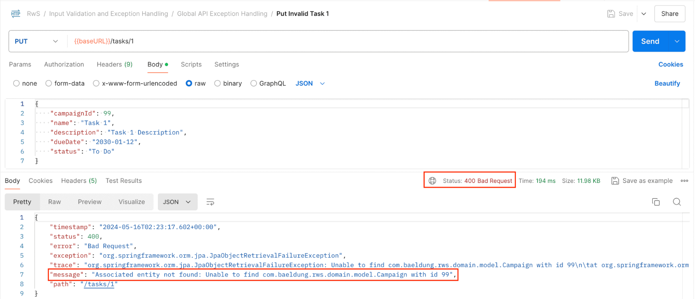
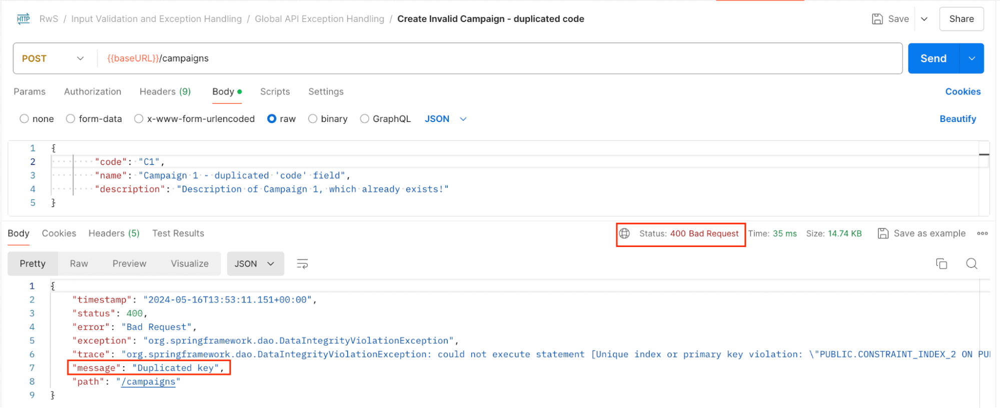
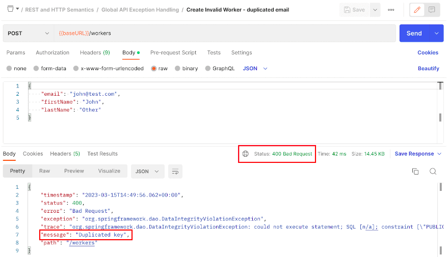
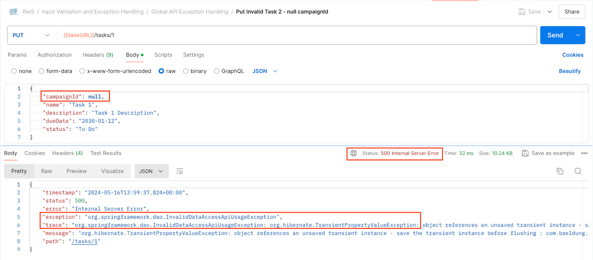
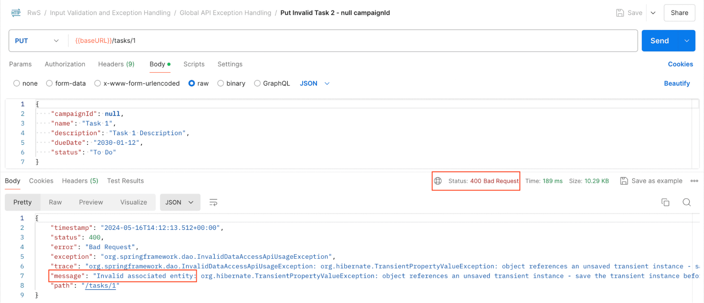
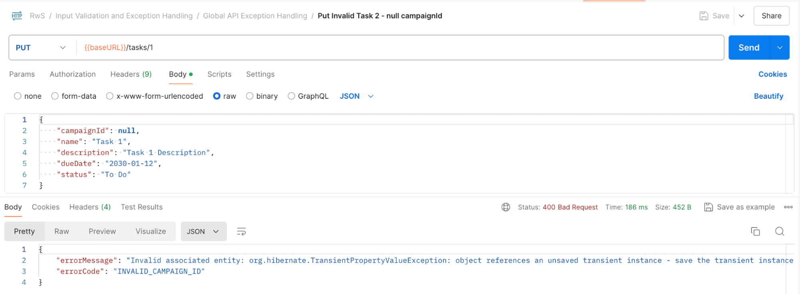
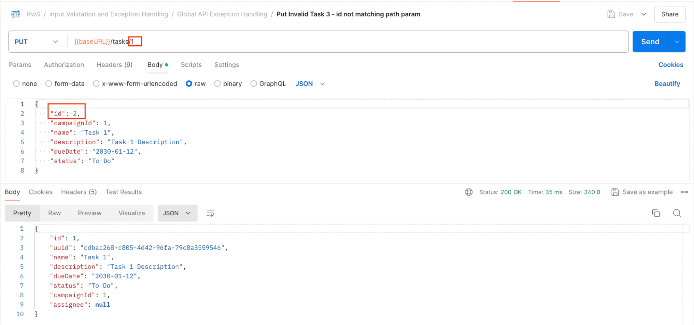
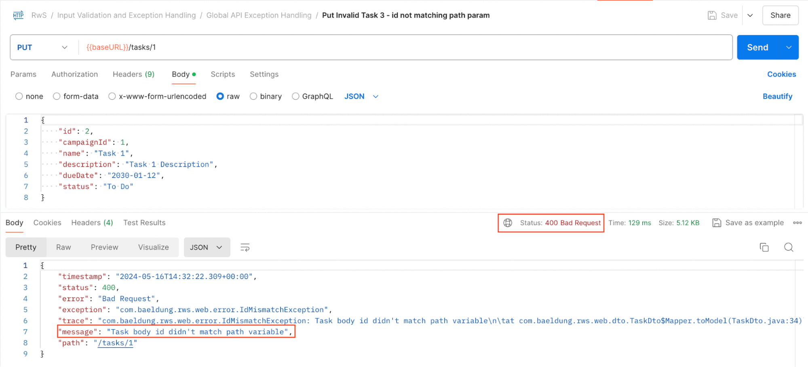

# Global API Exception Handling

---

# 1. Goal

In this lesson, we’ll learn how to handle exceptions **globally**.

We’ll move the controller-based exception handler functionality into a single global exception handler class.

---

# 2.1 Controller-Based vs. Global Exception Handling

In a previous lesson, we learned how to handle exceptions at a **Controller level**, resolving any error raised in the endpoints provided by that particular class.

However:

* Different REST controllers often proceed consistently.
* They handle resources similarly.
* They often face the same predicaments.
* In many cases, the nature of the exception determines how we should respond, regardless of where it was triggered.

Defining the same exception-handling logic in each controller is:

* Inefficient
* Repetitive

To address this, Spring provides a **global exception-handling mechanism** that allows us to follow a **DRY approach** without modifying the application design just to implement common logic.

---

## Advantages of a Global Exception Handler

### 1. Consistency

All handler methods are placed in the same class.
Any changes to the implementation are reflected globally.

### 2. Avoid Duplicate Code

The same exception thrown by different controllers will be handled by the same method.

### 3. Maintenance

Since the core error-handling logic is placed in one location, it becomes easier to:

* Manage
* Group scenarios
* Introduce changes
* Debug issues

With this in mind, let’s create our global exception handler.

---

# 2.2 Creating the Global Exception Handler

Let’s start by analyzing the exception handler previously defined inside `TaskController`:

```java
@ExceptionHandler({ EntityNotFoundException.class })
public ModelAndView resolveException(JpaObjectRetrievalFailureException ex,
        ServletRequest request, HttpServletResponse response) {
    request.setAttribute(RequestDispatcher.ERROR_STATUS_CODE, HttpStatus.BAD_REQUEST.value());
    request.setAttribute(RequestDispatcher.ERROR_MESSAGE, "Associated entity not found: "
                + ex.getMessage());
    ModelAndView mav = new ModelAndView();
    mav.setViewName("/error");
    return mav;
}
```

---

## Creating the Global Class

We create:

```
com.baeldung.rwsb.web.error.CustomExceptionsHandler
```

Annotate it with:

```java
@ControllerAdvice
public class CustomExceptionsHandler {
```

We move the exception handler method into this class and rename it to reflect its purpose more clearly:

```java
@ControllerAdvice
public class CustomExceptionsHandler {

    @ExceptionHandler({ EntityNotFoundException.class })
    public ModelAndView resolveEntityNotFoundException(JpaObjectRetrievalFailureException ex,
            ServletRequest request, HttpServletResponse response) {
        request.setAttribute(RequestDispatcher.ERROR_STATUS_CODE, HttpStatus.BAD_REQUEST.value());
        request.setAttribute(RequestDispatcher.ERROR_MESSAGE, "Associated entity not found: "
                    + ex.getMessage());
        ModelAndView mav = new ModelAndView();
        mav.setViewName("/error");
        return mav;
    }
}
```

The method was renamed to `resolveEntityNotFoundException` because we will likely add additional handlers later.

---

## Adding Another Handler

Since the exception is raised only for Tasks, we add another handler to demonstrate global behavior:

```java
@ExceptionHandler({ DataIntegrityViolationException.class })
public String resolveDuplicatedKey(ServletRequest request) {
    request.setAttribute(RequestDispatcher.ERROR_STATUS_CODE, HttpStatus.BAD_REQUEST.value());
    request.setAttribute(RequestDispatcher.ERROR_MESSAGE, "Duplicated key");
    return "/error";
}
```

Important note:

Because this class is not inside a `@RestController` (and therefore does not inherit `@ResponseBody`), returning a simple `String` relies on the Spring MVC View Resolver to map the view to Spring Boot’s `/error` endpoint.

---

## Testing the Global Handlers

Launch the application and test the following Postman requests:

* Put Invalid Task 1



* Create Invalid Campaign – duplicated code



* Create Invalid Worker – duplicated email



The handlers are invoked regardless of which controller raised the exception.

---

## Precedence Rule

It is worth mentioning:

You can combine controller-level and global exception handling.

Controller-level handlers take precedence over global ones.

---

# 2.3 Handling Different Errors in the Same Method Handler

We previously saw that `EntityNotFoundException` is thrown when associating a Task with a non-existing Campaign or Worker.

Now consider:

**Put Invalid Task 2 – null campaignId**



This triggers a different exception.

Our existing handlers do not manage this case.

Since the error is similar in nature (invalid value for `campaignId`) and should be treated the same way, we update the handler to handle both exceptions:

```java
@ExceptionHandler({ EntityNotFoundException.class, TransientObjectException.class })
public ModelAndView resolveEntityNotFoundException(Exception ex, ServletRequest request,
            HttpServletResponse response) {
    request.setAttribute(RequestDispatcher.ERROR_STATUS_CODE, HttpStatus.BAD_REQUEST.value());
    request.setAttribute(RequestDispatcher.ERROR_MESSAGE, "Invalid associated entity: "
                + ex.getMessage());
    ModelAndView mav = new ModelAndView();
    mav.setViewName("/error");
    return mav;
}
```

---

## What We Changed

* Added `TransientObjectException.class` to the annotation
* Generalized the parameter type to `Exception`
* Updated the error message to be more generic

Restart the application and test:

* Put Invalid Task 2 – null campaignId



The error is now handled consistently.

---

# 2.4 Retrieving a Custom Error Object

If we want to return a custom JSON body instead of forwarding to `/error`, we can return a custom object.

We use the `CustomErrorBody` record in:

```
com.baeldung.rwsb.web.error
```

Since this class is not a `@RestController`, we must explicitly add `@ResponseBody`:

```java
@ResponseBody
@ExceptionHandler({ EntityNotFoundException.class, TransientObjectException.class })
public CustomErrorBody resolveEntityNotFoundException(
  Exception ex,
  ServletRequest request,
  HttpServletResponse response) {
    response.setStatus(HttpStatus.BAD_REQUEST.value());
    return new CustomErrorBody("Invalid associated entity: " + ex.getMessage(), "INVALID_CAMPAIGN_ID");
}
```

Restart the application and test again.



---

## Alternative: Using ResponseEntity

A common alternative is to use `ResponseEntity`, which:

* Implicitly adds `@ResponseBody`
* Allows setting headers
* Allows setting status
* Uses a fluent API

```java
@ExceptionHandler({ EntityNotFoundException.class, TransientObjectException.class })
public ResponseEntity resolveEntityNotFoundException(Exception ex) {
    return ResponseEntity.badRequest()
      .header("Custom-Header", "Value")
      .body(new CustomErrorBody("Invalid associated entity: " + ex.getMessage(), "INVALID_CAMPAIGN_ID"));
}
```

With this approach:

* We can remove the `HttpServletResponse` parameter
* The response is fully defined in the `ResponseEntity`

Restart and test again:

* Put Invalid Task 2 – null campaignId


---

# 2.5 Handling Custom Exceptions

Now we learn how to leverage HTTP semantics directly through custom exceptions.

Consider:

**Put Invalid Task 3 – id not matching path param**



Our current logic ignores the id in the body and uses only the path parameter.

For learning purposes, we introduce validation in `TaskDto.Mapper`:

```java
public static Task toModel(TaskDto dto, Long requestedId) {
    if (dto.id() != null && requestedId != null && !requestedId.equals(dto.id())) {
        throw new IdMismatchException("Task body id didn't match path variable");
    }
    // …
}
```

The mapper throws a custom exception when it cannot proceed.

---

## Defining the Custom Exception

In:

```
com.baeldung.rwsb.web.error
```

We define:

```java
@ResponseStatus(HttpStatus.BAD_REQUEST)
public class IdMismatchException extends IllegalArgumentException {

    public IdMismatchException() {
        super("ids didn't match");
    }

    public IdMismatchException(String s) {
        super(s);
    }
}
```

Important detail:

The `@ResponseStatus(HttpStatus.BAD_REQUEST)` annotation tells Spring:

Whenever this exception bubbles up, return HTTP 400.

This allows:

* Automatic status setting
* Consistent HTTP semantics
* No need for explicit handler logic

Restart and test:

* Put Invalid Task 3 – id not matching path param



The response is now handled correctly.

---

# 2.6 A Note on ResponseEntityExceptionHandler

If you have experience with Spring MVC, you may have extended:

```
ResponseEntityExceptionHandler
```

inside your `@ControllerAdvice` class.

This base class provides built-in handling for many Spring framework exceptions.

However:

Since Spring Web MVC 6, this class returns responses formatted according to the **Problem Details specification (RFC7807)**.

We do not use it here because that format will be covered in a different lesson.

---

# Final Conclusion

Global exception handling using `@ControllerAdvice` allows us to:

* Centralize exception logic
* Maintain consistent error responses
* Avoid duplicated code
* Improve maintainability
* Apply proper HTTP semantics

It also supports:

* Handling multiple exceptions in a single method
* Returning structured JSON bodies
* Using `ResponseEntity`
* Leveraging `@ResponseStatus` for semantic exceptions
* Combining global and controller-level handlers

Global API exception handling is a key architectural component in building robust, production-ready Spring Boot REST APIs.

---