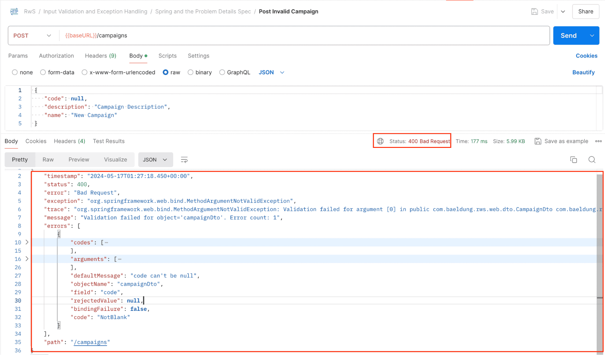
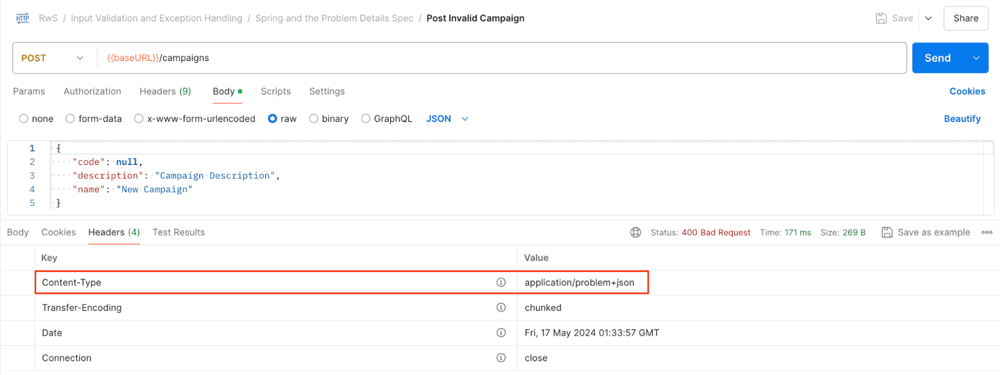
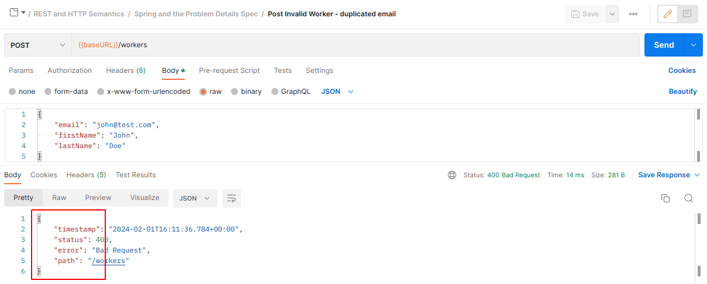
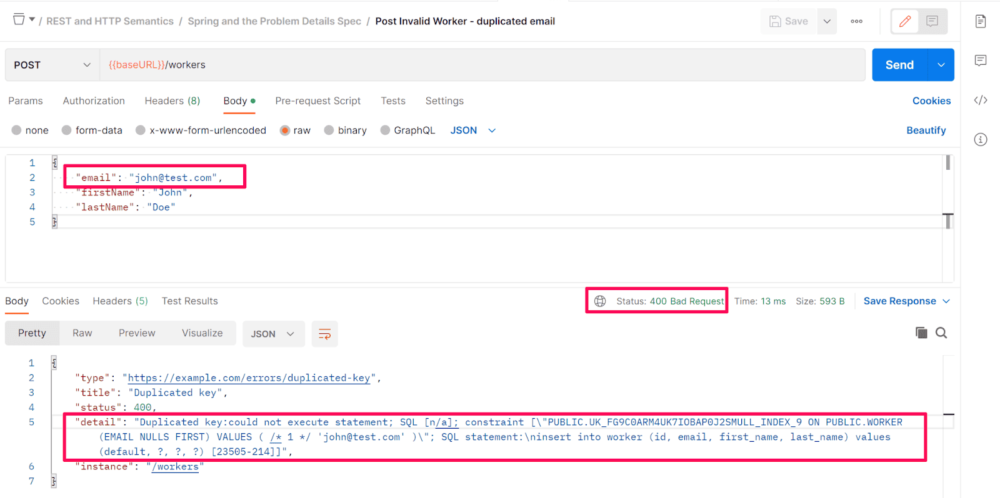
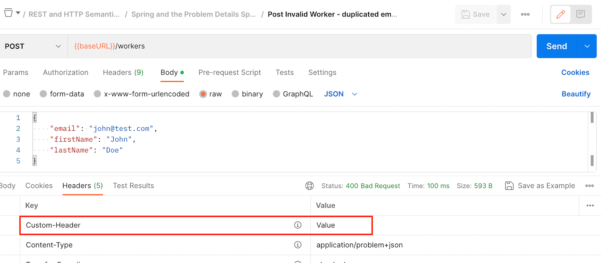
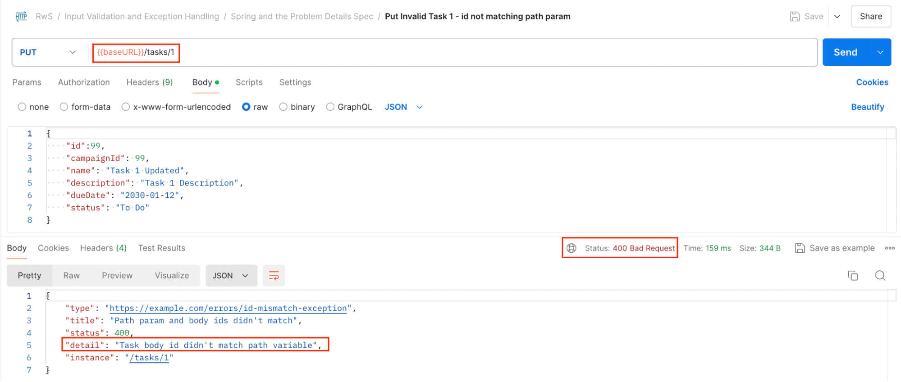
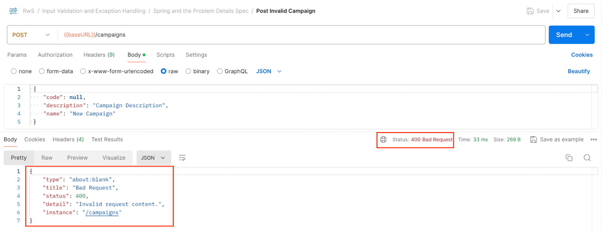
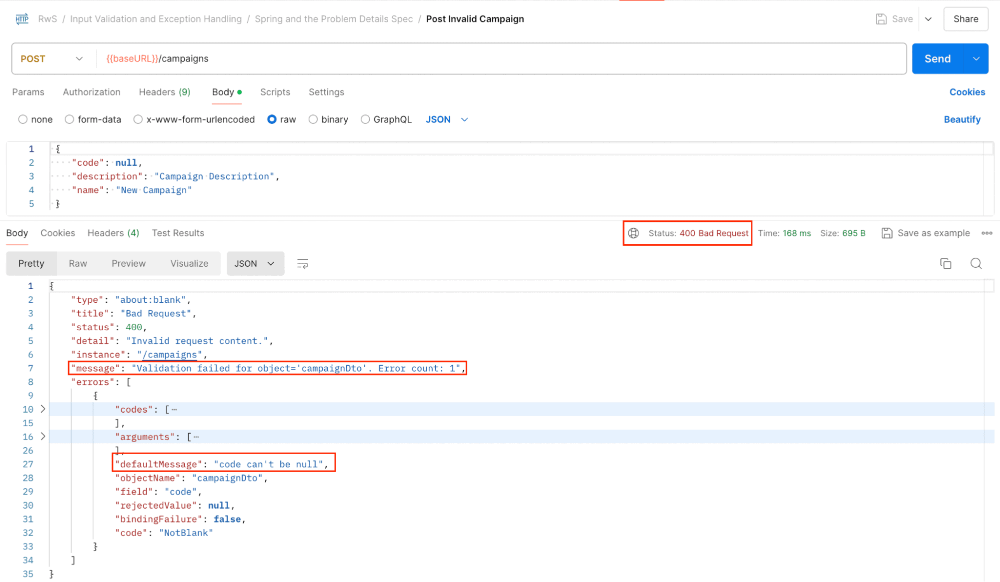
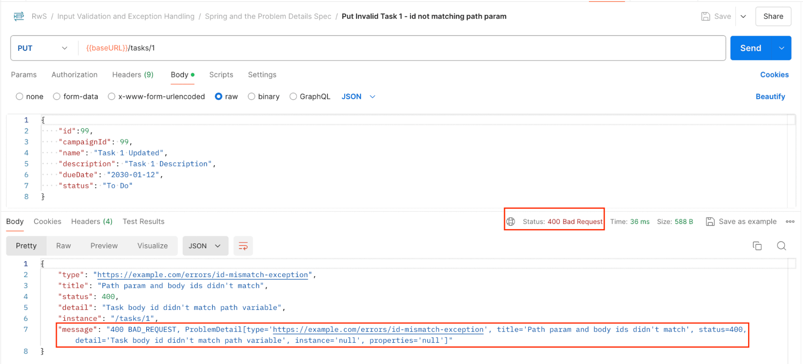

# Spring and the Problem Details Spec

## 2.1. The Problem Details Specification

HTTP semantics use the response status code to express the result of the operation and to point out the cause if an error occurs. However, sometimes the status code alone isn’t enough to sort out the nature of the error and guide the client toward a solution.

The purpose of the **“Problem Details for HTTP APIs” specification (RFC 7807)** is to standardize a format to communicate machine-readable error details in an HTTP response.

Spring Boot already provides custom Error Handling support out of the box that retrieves relevant error information in the response body. However, complying with a standard format is usually desirable, especially for a RESTful service that is mostly independent of the client consuming it.

The Problem Details specification defines a consistent structure for error responses, allowing clients to process error information in a predictable way. The standard format includes specific fields, which we will analyze throughout these notes.

---

## 2.2. Spring Boot’s Support for Problem Details

The Spring framework has supported the Problem Details specification starting with **Spring 6** and **Spring Boot 3**.

### Default Boot Error Response



When launching a Spring Boot application and triggering an error (for example, by sending an invalid POST request with a null required field such as “code”), Boot returns:

* Relevant error information
* Validation details
* Structured JSON
* HTTP status code

This default behavior helps guide the client toward sending a valid request.

However, this format does not follow the Problem Details specification by default.

---

### Enabling Problem Details in Boot

Spring Boot allows switching to the Problem Details format by adding the following property to `application.properties`:

```properties
spring.mvc.problemdetails.enabled=true
```

After restarting the application and sending the same invalid request, the response format changes to align with the Problem Details specification.


---

### Standard Problem Details Fields

When enabled, the response contains the following fields defined by the specification:

* **type**
  A URI pointing to human-readable documentation for the problem type.
  If there is no additional semantic information beyond the HTTP status code, `"about:blank"` is used.

* **title**
  A short, human-readable summary of the problem type.

* **status**
  The HTTP status code generated by the server.

* **detail**
  A human-readable explanation specific to this occurrence of the problem.

* **instance**
  A URI reference identifying the specific occurrence of the problem.
  By default, Boot uses the current request’s relative URL.

---

### Media Type

The specification declares a specific media type:

```
application/problem+json
```



When Problem Details support is enabled, the service returns this value in the `Content-Type` header.

---

### Important Limitation in Boot

It is important to understand that Spring Boot does **not** fully support the Problem Details specification in its default Error Handling mechanism.

When setting:

```properties
spring.mvc.problemdetails.enabled=true
```

Boot simply enables a **Spring MVC feature** that generates Problem Details responses for **Spring MVC exceptions only**.

Because of this:

* Spring MVC exceptions return Problem Details format.
* Other exceptions still return Boot’s default error structure.

This may lead to inconsistent response formats within the same application.

---

## 2.3. Enabling ProblemDetails Support by Extending ResponseEntityExceptionHandler

Independent of Boot’s error handling, the Spring Web framework provides built-in support for the Problem Details specification.

Even before Spring 6, Spring offered the `ResponseEntityExceptionHandler` class. Developers could extend this class inside an `@ControllerAdvice` to:

* Use convenient exception handling logic.
* Customize the response body via provided method hooks.

With **Spring 6**, `ResponseEntityExceptionHandler` enforces the Problem Details format and bypasses Boot’s exception handling mechanism for the standard exceptions it handles.

---

### Implementation

First, remove:

* All `server.error.*` properties.
* `spring.mvc.problemdetails.enabled`.

Then extend `ResponseEntityExceptionHandler`:

```java
@ControllerAdvice
public class CustomExceptionsHandler extends ResponseEntityExceptionHandler {
    // …
}
```


After restarting the application, Spring MVC exceptions will now produce Problem Details responses using this pure Spring approach.

However:

* Only exceptions handled by the web library are formatted as Problem Details.
* Other exceptions (for example, `DataIntegrityViolationException`) will still not automatically use the Problem Details format unless explicitly handled.



---

## 2.4. Problem Details for Custom Exception Handlers

Spring allows returning either:

* A `ProblemDetail`
* An `ErrorResponse`

from an `@ExceptionHandler` method to generate an RFC 7807 response.

Let’s examine these elements.

---

### The ProblemDetail Class

`ProblemDetail` is the core representation of an RFC 7807 problem detail.

Example:

```java
@ExceptionHandler({ EntityNotFoundException.class, TransientObjectException.class })
public ProblemDetail resolveEntityNotFoundException2(Exception ex,
        ServletRequest request,
        HttpServletResponse response) {

    ProblemDetail problemDetail =
        ProblemDetail.forStatusAndDetail(HttpStatus.BAD_REQUEST,
            "Invalid associated entity: " + ex.getMessage());

    problemDetail.setType(URI.create("https://example.com/errors/invalid-associated-entity"));
    problemDetail.setTitle("Invalid associated entity");

    return problemDetail;
}
```

Here we:

* Set the HTTP status.
* Set the detail message.
* Define a custom `type` URI.
* Define a custom `title`.

`ProblemDetail` is the recommended way when:

* You need to control body fields.
* You plan to add non-standard fields later.

---

### ErrorResponse and ErrorResponseException

`ErrorResponse` is an interface exposing:

* HTTP status
* Headers
* Body (in RFC 7807 format)

`ErrorResponseException`:

* Implements `ErrorResponse`.
* Provides convenience setters for populating the internal `ProblemDetail`.
* Is the base class for all Spring MVC exceptions.

Example:

```java
@ExceptionHandler({ DataIntegrityViolationException.class })
public ErrorResponse resolveDuplicatedKey(DataIntegrityViolationException ex) {

    ErrorResponseException response =
        new ErrorResponseException(HttpStatus.BAD_REQUEST);

    response.setDetail("Duplicated key:" + ex.getMessage());
    response.setType(URI.create("https://example.com/errors/duplicated-key"));
    response.setTitle("Duplicated key");

    response.getHeaders().add("Custom-Header", "Value");

    return response;
}
```

This example:

* Sets `detail`, `type`, and `title`.
* Modifies HTTP headers.
* Returns a fully structured Problem Details response.

However, caution must be exercised to avoid exposing sensitive internal details, such as database internals.




---

## 2.5. ProblemDetails for Custom Exceptions

Custom exceptions can directly adopt the Problem Details format by extending `ErrorResponseException`.

Example:

```java
public class IdMismatchException extends ErrorResponseException {

    public IdMismatchException(String message) {
        super(HttpStatus.BAD_REQUEST);
        super.setType(URI.create("https://example.com/errors/id-mismatch-exception"));
        super.setTitle("Path param and body ids didn't match");
        super.setDetail(message);
    }
}
```

Key points:

* No need for `@ResponseStatus`.
* The HTTP status is part of the parent class.
* The exception automatically serializes to Problem Details format.

This approach ensures consistent formatting across custom exceptions.



---

## 2.6. Custom Problem Detail Fields

RFC 7807 allows extending the Problem Details object with custom, non-standard fields.

Spring enables this using the `ProblemDetail.setProperty()` method.

---

### Improving Validation Error Responses

Default validation responses may lack sufficient guidance for fixing invalid input.



We can override `handleExceptionInternal` in `ResponseEntityExceptionHandler`:

```java
@Override
protected ResponseEntity<Object> handleExceptionInternal(
        Exception ex,
        @Nullable Object body,
        HttpHeaders headers,
        HttpStatusCode statusCode,
        WebRequest request) {

    ResponseEntity<Object> response =
        super.handleExceptionInternal(ex, body, headers, statusCode, request);

    if (response.getBody() instanceof ProblemDetail problemDetailBody) {

        problemDetailBody.setProperty("message", ex.getMessage());

        if (ex instanceof MethodArgumentNotValidException subEx) {

            BindingResult result = subEx.getBindingResult();

            problemDetailBody.setProperty("message",
                "Validation failed for object='" +
                result.getObjectName() +
                "'. Error count: " +
                result.getErrorCount());

            problemDetailBody.setProperty("errors",
                result.getAllErrors());
        }
    }

    return response;
}
```

---

### What This Customization Does

1. Calls the parent implementation to preserve default behavior.
2. Adds a `"message"` field using the exception message.
3. For `MethodArgumentNotValidException`:

    * Adds a summarized validation message.
    * Adds an `"errors"` field with detailed violations.





This restores helpful validation feedback while remaining compliant with the Problem Details format.

---

### Practical Impact

For example:

* If a request sends an invalid ID format.
* The default `detail` field may not clearly explain the issue.
* The custom `"message"` field can provide clearer diagnostic information.

The key takeaway:

We can use `ProblemDetail.setProperty()` to thoughtfully extend the response and include additional fields that help clients correct their requests—without breaking compliance with the Problem Details specification.

---

# Conclusion

Spring 6 and Spring Boot 3 provide structured support for the Problem Details specification (RFC 7807). Key concepts include:

* Enabling Problem Details via configuration.
* Understanding Boot’s partial support.
* Using `ResponseEntityExceptionHandler` for full Spring-based support.
* Returning `ProblemDetail` or `ErrorResponse` from `@ExceptionHandler` methods.
* Extending `ErrorResponseException` for custom exceptions.
* Adding non-standard fields with `setProperty()`.

Together, these mechanisms allow building consistent, standards-compliant, and customizable error responses in modern Spring applications.

---