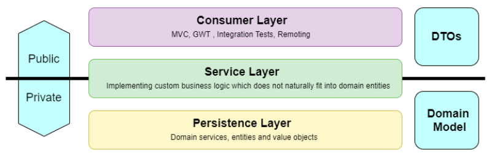
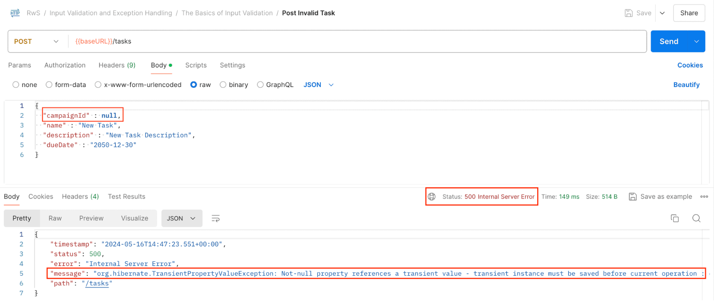
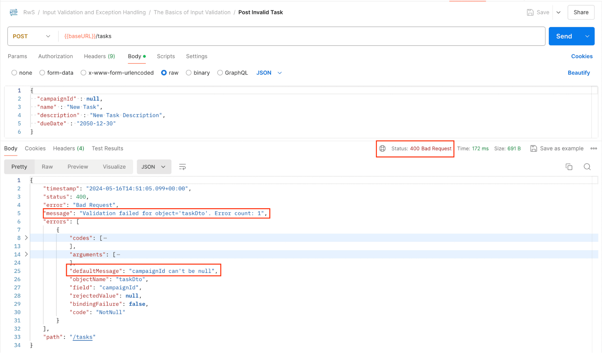
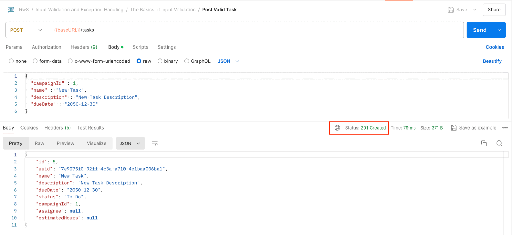

# The Basics of Input Validation

---

# 1. Goal

An application is only as good as the data it handles. As developers, we’re responsible for validating the data it receives and ensuring its integrity.

In this lesson, we focus on **input validation** — making sure that the data entering our system is correct, consistent, and meaningful before we process or persist it.

---

# 2.1. The Validations Dependency

Systems rely on valid data, so validating user input is a common requirement in most applications.

The **Jakarta Bean Validation specification** has become the **de facto standard** for handling validation logic. The most popular implementation of this specification is **Hibernate Validator**.

In a Spring Boot application, validation support is enabled by adding the following dependency to the `pom.xml`:

```xml
<dependency>
    <groupId>org.springframework.boot</groupId>
    <artifactId>spring-boot-starter-validation</artifactId>
</dependency>
```

Looking at the dependency hierarchy of `spring-boot-starter-validation`, we can see that it includes:

* Hibernate Validator
* Jakarta Validation API

This means we get a fully integrated validation framework with minimal configuration.

---

# 2.2. Application Layers and Validations



It’s a common practice to organize web applications into three layers:

1. **Consumer/Presentation Layer**
2. **Service Layer**
3. **Persistence Layer**

Validation can occur in each of these layers.

While we can write and run validations manually, it’s cleaner to let supporting frameworks check the data when appropriate. For example:

* The framework can evaluate incoming data **before passing it to controllers**.
* Business constraints can be validated **when a service method is invoked**.
* Entity constraints can be triggered **just before persistence**.

Validating at multiple points in the application flow is not a bad practice — it increases robustness.

For example, domain model entities may already contain Bean Validation annotations that are triggered upon persistence.

However, in this lesson, we focus on adding validations in the **Presentation Layer**. This allows us to:

* Reject invalid requests early
* Avoid unnecessary processing
* Provide clearer and more helpful error responses

---

# 2.3. The Out-Of-The-Box Response With an Invalid Input

Let’s consider creating a new invalid `Task`.

In this case, the request does not indicate which `Campaign` the `Task` should be associated with.



The error is caught late — during persistence — and the response is:

* HTTP Status: **500 – Internal Server Error**
* Error message: unclear and not intuitive

Problems with this approach:

* It doesn’t use proper HTTP semantics.
* A 500 status implies a server failure.
* The error message does not clearly explain what the client did wrong.

Our goal is to:

* Catch the error much earlier in the request lifecycle.
* Return a meaningful status code (e.g., 400 – Bad Request).
* Provide clear information about what needs to be corrected.

---

# 2.4. Specifying and Triggering Constraints

Input validation is typically implemented:

* In web controllers
* On fields defined by DTOs

## Validating the `TaskDto`

We decorate the DTO fields with Jakarta Bean Validation annotations:

```java
public record TaskDto(
    Long id,

    String uuid,

    @NotBlank(message = "name can't be blank")
    String name,

    @Size(min = 10, max = 50,
       message = "description must be between 10 and 50 characters long")
    String description,

    @Future(message = "dueDate must be in the future")
    LocalDate dueDate,

    TaskStatus status,

    @NotNull(message = "campaignId can't be null")
    Long campaignId,

    WorkerDto assignee,

    @Min(value = 1, message = "estimatedHours can't be less than 1")
    @Max(value = 40, message = "estimatedHours can't exceed 40")
    Integer estimatedHours) {

    // …
}
```

### Constraints Added

* `@NotBlank` → name must not be null, empty, or whitespace.
* `@Size` → description length between 10 and 50 characters.
* `@Future` → dueDate must be in the future.
* `@NotNull` → campaignId cannot be null.
* `@Min` / `@Max` → estimatedHours must be between 1 and 40.

Each annotation supports a custom `message`, which is included in validation responses.

---

## Triggering Validation with `@Valid`

To activate validation, we annotate the DTO parameter in the controller:

```java
@PostMapping
@ResponseStatus(HttpStatus.CREATED)
public TaskDto create(@RequestBody @Valid TaskDto newTask) {
    // …
}

@PutMapping(value = "/{id}")
public TaskDto update(@PathVariable Long id,
  @RequestBody @Valid TaskDto updatedTask) {
    // …
}
```

When Spring sees `@Valid`, it:

1. Deserializes the request body.
2. Applies validation rules immediately.
3. Stops execution if validation fails.

Validation is triggered as soon as the data reaches the Presentation Layer.

---

# 2.5. Boot Support and Validation Responses

Spring Boot includes a default error handling mechanism.

To ensure validation errors are included in the response, we configure:

```
server.error.include-binding-errors=always
```

This property ensures that validation binding errors are returned in the HTTP response.



After restarting the application and sending an invalid request:

* HTTP Status: **400 – Bad Request**
* Response includes clear validation messages

This is significantly better than the earlier 500 response.

Now, when valid input is submitted, the POST operation succeeds as expected.



---

# 2.6. Implementing Validations for All DTOs

Validation should be applied consistently across all input models.

---

## Updating `CampaignDto`

```java
public record CampaignDto(
    Long id,

    @NotBlank(message = "code can't be null")
    String code,

    @NotBlank(message = "name can't be blank")
    String name,

    @Size(min = 10, max = 50,
      message = "description must be between 10 and 50 characters long")
    String description,

    Set<TaskDto> tasks) {
    
    // …
}
```

Controller:

```java
@PostMapping
@ResponseStatus(HttpStatus.CREATED)
public CampaignDto create(@RequestBody @Valid CampaignDto newCampaign) {
    // …
}

@PutMapping(value = "/{id}")
public CampaignDto update(@PathVariable Long id,
  @RequestBody @Valid CampaignDto updatedCampaign) {
    // …
}
```

---

## Updating `WorkerDto`

```java
public record WorkerDto(
    Long id,

    @NotBlank(message = "email can't be blank")
    @Email(message = "You must provide a valid email address")
    String email,

    String firstName,

    String lastName) {

    // …
}
```

Controller:

```java
@PostMapping
@ResponseStatus(HttpStatus.CREATED)
public WorkerDto create(@RequestBody @Valid WorkerDto newWorker) {
    // …
}

@PutMapping(value = "/{id}")
public WorkerDto update(@PathVariable Long id,
  @RequestBody @Valid WorkerDto updatedWorker) {
    // …
}
```

By applying `@Valid` consistently across controllers, we ensure:

* All incoming requests are validated.
* Invalid data never reaches business logic.
* Error responses remain consistent.

---

# 2.7. Conclusion

In this lesson, we learned how to implement basic input validation in a Spring application.

Key takeaways:

* Use `spring-boot-starter-validation` to enable validation.
* Apply Bean Validation annotations to DTO fields.
* Trigger validation using `@Valid` in controller methods.
* Configure Spring Boot to return binding errors.
* Return proper HTTP semantics (400 instead of 500).

One important consideration:
If we analyze our design carefully, we may realize that the validations defined for our resources might not be suitable for all API operations. Sometimes, each API operation requires its own specific validation rules.

Input validation is not just a technical requirement — it’s a critical design responsibility that ensures data integrity, improves API usability, and strengthens system reliability.

---