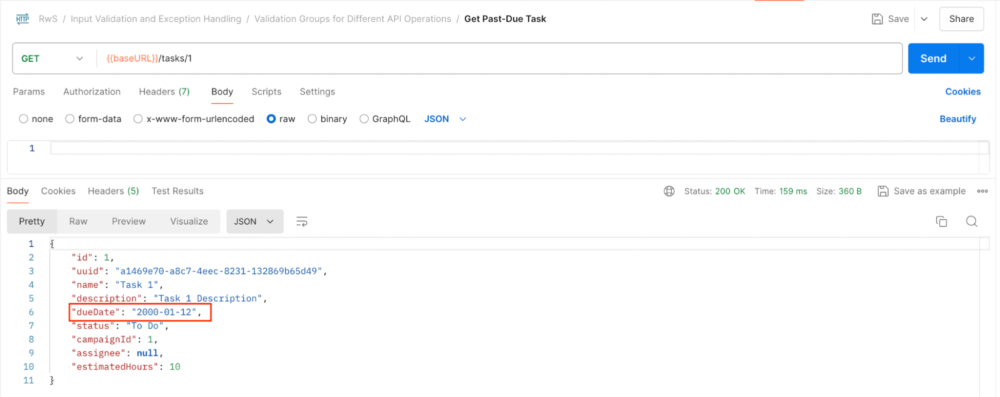
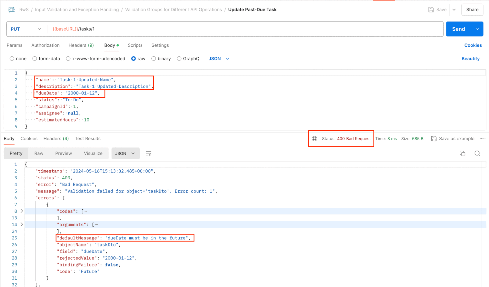
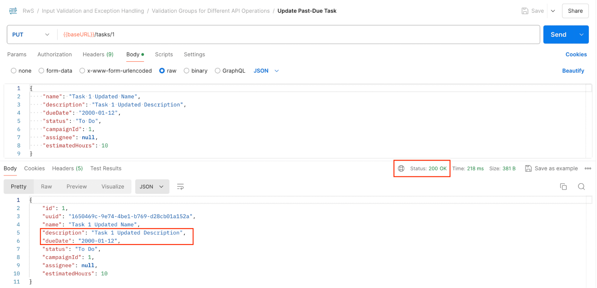
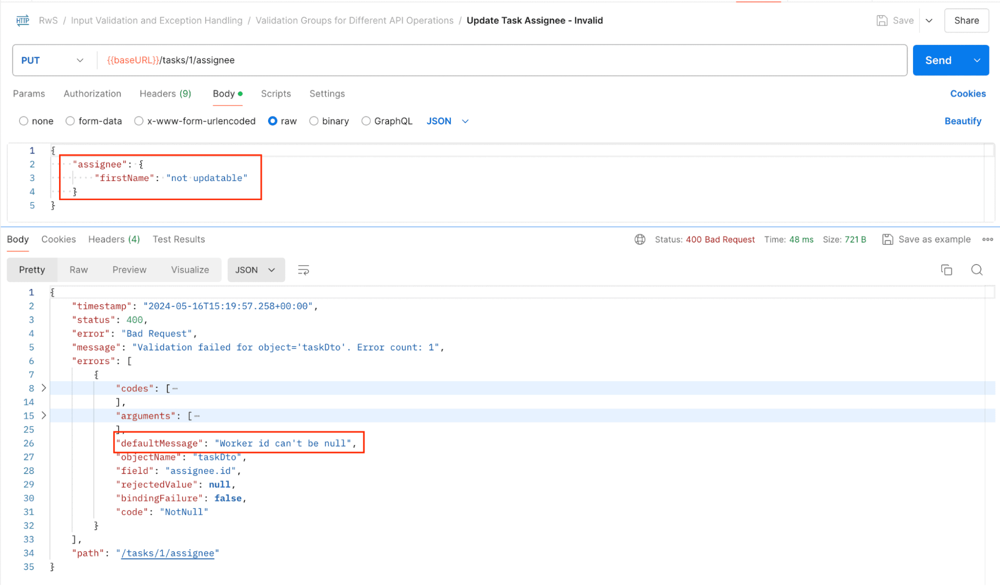

# Validation Groups for Different API Operations

---

## 1. Goal

In this lesson, we’ll analyze a more advanced input validation feature, which will allow us to cover different constraint requirement scenarios for our Resources.

---

## 2.1. Our Project’s Current Input Validations

We have some standard input validations implemented in our presentation-layer DTOs.

For instance, let’s have a look at our `TaskDto` class:

```java
public record TaskDto(
    Long id,

    String uuid,

    @NotBlank(message = "name can't be blank")
    String name,

    @Size(min = 10, max = 50,
    message = "description must be between 10 and 50 characters long")
    String description,

    @Future(message = "dueDate must be in the future")
    LocalDate dueDate,

    TaskStatus status,

    @NotNull(message = "campaignId can't be null")
    Long campaignId,

    WorkerDto assignee,

    @Min(value = 1, message = "estimatedHours can't be less than 1")
    @Max(value = 40, message = "estimatedHours can't exceed 40")
    Integer estimatedHours) {

    // …

}
```

If we inspect the corresponding `TaskController` endpoints, we’ll see that these validations are triggered for the “creation” and “update” operations by using the `@Valid` annotation:

```java
@PostMapping
@ResponseStatus(HttpStatus.CREATED)
public TaskDto create(@RequestBody @Valid TaskDto newTask) {
    // …
}

@PutMapping(value = "/{id}")
public TaskDto update(@PathVariable Long id,
  @RequestBody @Valid TaskDto updatedTask) {
    // …
}
```

Now let’s focus on one particular use case for our application.

---

## 2.2. Validation Groups and the @Validated Annotation

Imagine we created a Task some time ago that went past its due date. We included a Task with this characteristic in our mocked database.



Now we simply need to modify the “name” and “description” fields, keeping the rest as they are.



As we can see, we can’t perform the operation because we indicated that the “dueDate” field should always be a future date.

The bottom line here is that, occasionally, each REST operation requires particular validations.

For this, we can define “groups” of validations in our DTOs, and then indicate which group we want to trigger in each scenario.



Let’s see how we can do that in our `TaskDto` class:

```java
public record TaskDto(
    Long id,

    String uuid,

    @NotBlank(groups = { TaskUpdateValidationData.class, Default.class },
      message = "name can't be blank")
    String name,

    @Size(groups = { TaskUpdateValidationData.class, Default.class },
      min = 10, max = 50,
      message = "description must be between 10 and 50 characters long")
    String description,

    @Future(message = "dueDate must be in the future")
    LocalDate dueDate,

    @NotNull(groups = { TaskUpdateValidationData.class },
      message = "status can't be null")
    TaskStatus status,

    @NotNull(groups = { TaskUpdateValidationData.class, Default.class },
      message = "campaignId can't be null")
    Long campaignId,

    WorkerDto assignee,

    @Min(groups = { TaskUpdateValidationData.class, Default.class },
      value = 1,
      message = "estimatedHours can't be less than 1")
    @Max(groups = { TaskUpdateValidationData.class, Default.class },
      value = 40,
      message = "estimatedHours can't exceed 40")
    Integer estimatedHours) {

    // …

    public static interface TaskUpdateValidationData {
    }
}
```

What we’re doing here is:

* defining a plain “TaskUpdateValidationData” interface that will represent the “update” validation group
* using it to indicate which validations should be executed for the update operation
* using the `jakarta.validation.groups.Default` interface provided by the Jakarta Validation API to indicate which validations we want to run when no validation group is specified, such as when the constraints are triggered using the base `@Valid` annotation
* for the “dueDate” field, by not setting any group, it’ll be associated only with the “Default” group (i.e., it won’t be checked when we trigger the “update” validations)
* we also added a new `@NotNull` constraint for the status field that the framework will trigger just for the “update” operation

Now we have to indicate that we want to use this group in the input of the PUT operation. Let’s open the `TaskController`:

```java
@PutMapping(value = "/{id}")
public TaskDto update(@PathVariable Long id,
  @RequestBody @Validated(TaskUpdateValidationData.class)
  TaskDto updatedTask) {
    // …
}
```



As we can see, we have to use Spring’s `@Validated` annotation, which supports passing the class representing the validation group we want to execute.

Let’s restart the application, and confirm the update operation can be processed successfully.

Now let’s move on to the other API operations in our project.

---

## 2.3. Group Validations for Nested Object

Before moving forward to other DTOs, let’s have a quick look at the functionality provided for the Tasks Resource in the `TaskController` class:

```java
@PutMapping(value = "/{id}/status")
public TaskDto updateStatus(@PathVariable Long id, @RequestBody TaskDto taskWithStatus) {
    // …
}

@PutMapping(value = "/{id}/assignee")
public TaskDto updateAssignee(@PathVariable Long id, @RequestBody TaskDto taskWithAssignee) {
    // …
}
```

We’re also receiving a `TaskDto` request body object for these additional operations, but we haven’t triggered any data check on them up to this point. Naturally, they require special validations, so let’s implement group validations here.

### Update Status

For the `updateStatus` method, it’s pretty trivial. We only need to check that the status field isn’t null by adding a new group and using it in the existing constraint:

```java
public record TaskDto(
    // …

    @NotNull(groups = { TaskUpdateStatusValidationData.class, TaskUpdateValidationData.class },
      message = "status can't be null")
    TaskStatus status,

    // …
    ) {

    // …

    public interface TaskUpdateStatusValidationData {
    }
}
```

Then we’ll use it in the controller:

```java
public TaskDto updateStatus(
  @PathVariable Long id,
  @RequestBody @Validated(TaskUpdateStatusValidationData.class) TaskDto taskWithStatus)
```

---

### Update Assignee

The `updateAssignee` endpoint is trickier.

We typically expect:

* a request body object with an `assignee` field with the nested `id` field set
* or, less commonly but still valid, a null `assignee` field if we want to “unassign” the Task

For this, we’ll define the new constraint group, and include a `@Valid` annotation on the assignee attribute to trigger the nested checks accordingly:

```java
public record TaskDto(
    // …

    @Valid
    WorkerDto assignee,

    // …
    ) {

    // …

    public interface TaskUpdateAssigneeValidationData {
    }
}
```

Inside the `WorkerDto`, we’ll use the Task-scoped group for the corresponding field:

```java
@NotNull(groups = { TaskUpdateValidationData.class, TaskUpdateAssigneeValidationData.class },
  message = "Worker id can't be null")
Long id,
```

Note that we’re applying this check for the regular Task “update” operation as well, since it’s also suitable for that scenario.

The final step is to use this group in the parameter of the corresponding controller method:

```java
@PutMapping(value = "/{id}/assignee")
public TaskDto updateAssignee(@PathVariable Long id,
  @RequestBody @Validated(TaskUpdateAssigneeValidationData.class) TaskDto taskWithAssignee) {
    // …
}
```

Now let’s restart the application, and confirm this is working as expected.

The input is validated as expected.

We included additional valid requests to check that the following cases were working as expected:

* assigning to a different Worker
* unassigning a Task

---

### Special Case: Creating a Task with Assignee

When we create a Task, it will always be unassigned at first, as per our business rules. So, naturally, we don’t expect that request to pass an assignee.

We could add a `@Null` constraint to the assignee field valid for the `Default` group that is used for creation in the `TaskDto` so that the API is clear towards this.

However, in this case, we’ve been defining a permissive API, not a strict one that doesn’t allow passing extra fields.

So both for consistency and to analyze a new feature, we’ll allow the request to pass an assignee field, but we don’t want to trigger any validation on that data since our logic will simply ignore it.

To resolve this, the Jakarta Validation API provides an annotation that allows converting the validation group upon cascading to a nested field.

In this case, we want to avoid cascading the `Default` validation group:

```java
public record TaskDto(

    // …
    
    @Valid
    @ConvertGroup(from = Default.class, to = WorkerOnTaskCreateValidationData.class)
    WorkerDto assignee,
    
    //…
    
    ) {

    // …
    
    public interface WorkerOnTaskCreateValidationData {
    }
}
```

No constraint will be applied if we don’t use this group in the `WorkerDto`, and the assignee data will be simply ignored when creating a new Task.

---

## 2.4. Implementing Group Validations for All DTOs

Let’s take a quick moment to implement validations for our other DTOs.

There won’t be any special case here, so we’ll proceed consistently, like we did with the `TaskDto`.

We’ll use the `Default` validation group for the “create” operation, and then a new group for the “update” process.

### WorkerDto

```java
public record WorkerDto(
    //…
    ) {

    // …

    public interface WorkerUpdateValidationData {
    }
}
```

We’re defining a validation group for the “update” operation but not applying it to any constraint.

With this, we’re simply indicating that we don’t want to apply any validation for this operation when we declare it in the controller method:

```java
@PutMapping(value = "/{id}")
public WorkerDto update(@PathVariable Long id,
  @RequestBody @Validated(WorkerUpdateValidationData.class) WorkerDto updatedWorker) {
    // …
}
```

---

### CampaignDto

```java
public record CampaignDto(
    Long id,

    @NotBlank(message = "code can't be null")
    String code,

    @NotBlank(groups = { CampaignUpdateValidationData.class, Default.class },
      message = "name can't be blank")
    String name,

    @Size(groups = { CampaignUpdateValidationData.class, Default.class },
      min = 10, max = 50,
      message = "description must be between 10 and 50 characters long")
    String description,

    Set<TaskDto> tasks) {

    // …
    
    public interface CampaignUpdateValidationData {
    }
}
```

With this, we’re indicating that:

* the `code` field shouldn’t be blank for the creation process
* the `name` and `description` attributes should meet the constraints for both operations

The last step is to use the validation group in the corresponding controller:

```java
@PutMapping(value = "/{id}")
public CampaignDto update(@PathVariable Long id,
  @RequestBody @Validated(CampaignUpdateValidationData.class) CampaignDto updatedCampaign) {
    // …
}
```

---

## 2.5. Conclusion

In this lesson, we learned how to cover more complex validation scenarios by using validation groups and how Spring supports this.

We analyzed different cases where this mechanism can be helpful, and then implemented it in our project to meet the requirements.

---