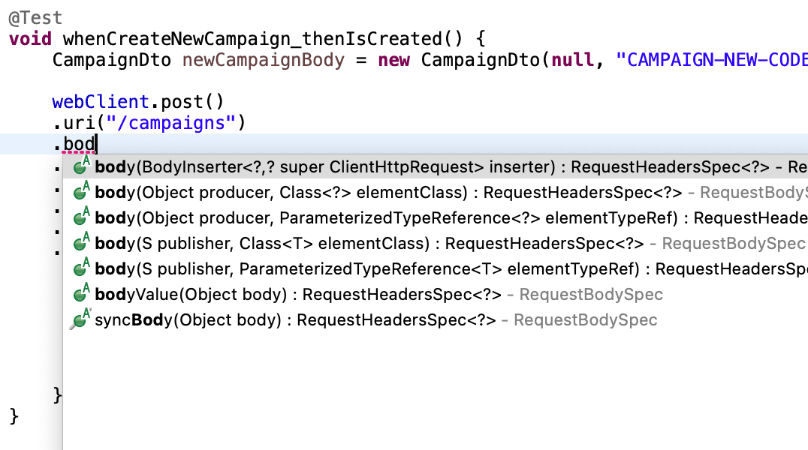
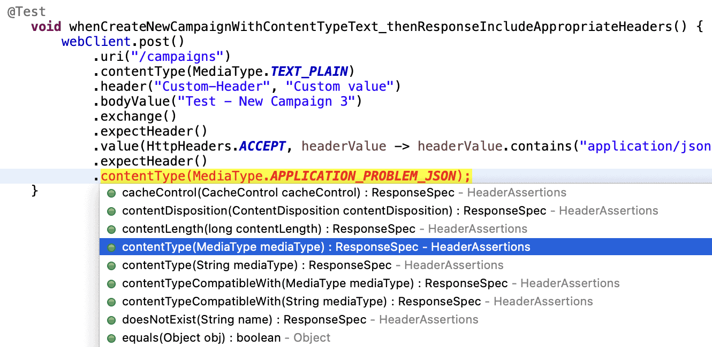
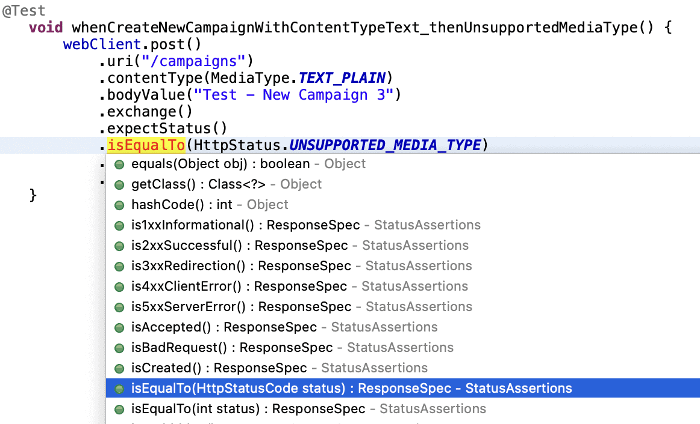
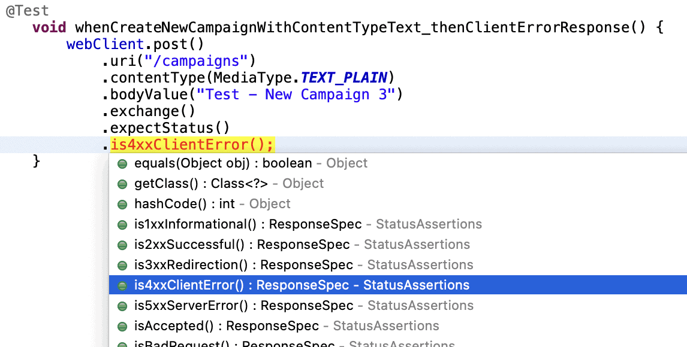

# How To Test HTTP Semantics

## 1. Goal

In this lesson, we learn **how to test HTTP semantics and HTTP verbs using `WebTestClient`**.

HTTP semantics describe **how HTTP operations behave and how clients and servers communicate correctly** using:

* HTTP methods (GET, POST, PUT, DELETE)
* Request bodies
* Response bodies
* HTTP status codes
* HTTP headers
* Error formats

Testing these aspects ensures that the API **behaves according to HTTP standards and specifications**.

In this lesson we will learn how to test:

* HTTP operations (POST, PUT, GET)
* Request body handling
* Input validation
* HTTP response status codes
* HTTP headers
* Unknown response body structures
* Standardized error responses
* Complex assertions on request and response exchanges

All tests are written using **Spring WebFlux’s `WebTestClient`**, which allows us to perform **end-to-end HTTP tests**.

---

# 2. Testing HTTP Operations

## 2.1 Testing POST HTTP Methods and Defining the Request Body

The **POST method** is commonly used to **create new resources**.

When testing a POST endpoint we must verify:

1. The **correct HTTP method is used**
2. The **request body is sent correctly**
3. The API returns the **correct HTTP response status**
4. The response contains the **expected representation of the created resource**

### Example Test

```java
@Test
void whenCreateNewCampaign_thenIsCreated() {
    CampaignDto newCampaignBody = new CampaignDto(
      null,
      "CAMPAIGN-NEW-CODE",
      "Test - New Campaign 1",
      "Description of new test campaign 1",
      null);

    webClient.post()
      .uri("/campaigns")
      .body(Mono.just(newCampaignBody), CampaignDto.class)
      .exchange()
      .expectStatus()
      .isCreated()
      .expectBody(CampaignDto.class)
      .value(newCampaign -> {
        assertThat(newCampaign.id()).isNotNull();
        assertThat(newCampaign.tasks()).isNotNull();
        assertThat(newCampaign.tasks()).isEmpty();
        assertThat(newCampaign.code()).isEqualTo(newCampaignBody.code());
        assertThat(newCampaign.name()).isEqualTo(newCampaignBody.name());
        assertThat(newCampaign.description()).isEqualTo(newCampaignBody.description());
      });
}
```

### Key Concepts

**1. Specifying the HTTP method**

```java
webClient.post()
```

This indicates that the request is a **POST operation**.

---

**2. Defining the target URI**

```java
.uri("/campaigns")
```

This specifies the **resource endpoint**.

---

**3. Providing the request body**

```java
.body(Mono.just(newCampaignBody), CampaignDto.class)
```

Because **WebTestClient uses the reactive stack**, the body must be provided as a **Reactor Publisher** such as:

* `Mono`
* `Flux`

Since the request body is already available, a simpler method can be used:



```java
.bodyValue(newCampaignBody)
```

This automatically converts the DTO into JSON.

---

**4. Executing the request**

```java
.exchange()
```

This performs the **actual HTTP request**.

---

**5. Verifying the response status**

```java
.expectStatus().isCreated()
```

This validates that the API returned:

**HTTP 201 – Created**

---

### Validating the Response Body

```java
.expectBody(CampaignDto.class)
```

This maps the JSON response to `CampaignDto`.

Assertions verify that:

* The **id is generated**
* The **tasks list is initialized**
* The **fields match the request body**

```java
assertThat(newCampaign.id()).isNotNull();
assertThat(newCampaign.tasks()).isEmpty();
assertThat(newCampaign.code()).isEqualTo(newCampaignBody.code());
```

---

### Important Note

These tests focus on ensuring the API **adheres to HTTP standards**, not only that business logic works.

---

# 2.2 Testing HTTP PUT and Ensuring Accurate Field Updates

The **PUT method** is used to **update existing resources**.

When testing PUT endpoints we must ensure:

* The correct resource is targeted
* The request body describes the new state
* Only allowed fields are updated
* The correct response status is returned

### Example Test

```java
@Test
void givenPreloadedData_whenUpdateExistingCampaign_thenOkWithSupportedFieldUpdated() {
    TaskDto taskBody = new TaskDto(
      null,
      null,
      "Test - Task",
      "Description of task",
      LocalDate.of(2030, 01, 01),
      TaskStatus.DONE,
      null,
      null);

    Set<TaskDto> tasksListBody = Set.of(taskBody);

    CampaignDto updatedCampaignBody = new CampaignDto(
      null,
      "CAMPAIGN-CODE-UPDATED",
      "Test - Updated Campaign 1",
      "Description of updated test campaign 1",
      tasksListBody);

    webClient.put()
      .uri("/campaigns/2")
      .bodyValue(updatedCampaignBody)
      .exchange()
      .expectStatus()
      .isOk()
      .expectBody(CampaignDto.class)
      .value(dto -> {
        assertThat(dto.id()).isEqualTo(2L);
        assertThat(dto.code()).isNotEqualTo(updatedCampaignBody.code());
        assertThat(dto.name()).isEqualTo(updatedCampaignBody.name());
        assertThat(dto.description()).isEqualTo(updatedCampaignBody.description());
        assertThat(dto.tasks()).isNotEmpty()
            .noneMatch(task -> task.name().equals(taskBody.name()));
    });
}
```

### Key Validations

The test verifies:

* Correct resource updated (`id = 2`)
* **Name and description are updated**
* **Code is not updated**
* **Tasks are not modified improperly**

### Response Status

```java
.expectStatus().isOk()
```

This validates the response:

**HTTP 200 – OK**

---

### Important Testing Consideration

Tests that **create or modify data may interfere with other tests**.

Reasons:

* Tests may run **in any order**
* They share the **same in-memory database**

Therefore tests must be written **carefully to avoid side effects**.

---

# 2.3 Request and Response Headers

HTTP operations often depend on **metadata contained in headers**.

Examples include:

* `Content-Type`
* `Accept`
* Custom headers

### Example Test

```java
@Test
void whenCreateNewCampaignWithContentTypeText_thenResponseIncludeAppropriateHeaders() {
    webClient.post()
      .uri("/campaigns")
      .contentType(MediaType.TEXT_PLAIN)
      .header("Custom-Header", "Custom value")
      .bodyValue("Test - New Campaign 3")
      .exchange()
      .expectHeader()
      .value(HttpHeaders.ACCEPT, headerValue -> headerValue.contains("application/json"))
      .expectHeader()
      .contentType(MediaType.APPLICATION_PROBLEM_JSON);
}
```

### Key Features

Setting the **Content-Type**:

```java
.contentType(MediaType.TEXT_PLAIN)
```

Adding **custom headers**:

```java
.header("Custom-Header", "Custom value")
```

---

### Verifying Response Headers

Example:

```java
.expectHeader().contentType(MediaType.APPLICATION_PROBLEM_JSON)
```

This confirms the server returned the correct **response content type**.

WebTestClient also provides flexible methods for verifying **non-standard headers**.



---

# 2.4 Response Status

The **HTTP response status code** is the most important indicator of the operation result.

### Example Test

```java
@Test
void whenCreateNewCampaignWithContentTypeText_thenUnsupportedMediaType() {
    webClient.post()
      .uri("/campaigns")
      .contentType(MediaType.TEXT_PLAIN)
      .bodyValue("Test - New Campaign 3")
      .exchange()
      .expectStatus()
      .isEqualTo(HttpStatus.UNSUPPORTED_MEDIA_TYPE)
      .expectHeader()
      .value(HttpHeaders.ACCEPT, headerValue -> headerValue.contains("application/json"));
}
```

### HTTP Status Verified

```
415 – Unsupported Media Type
```

Since `WebTestClient` does not have a helper method for this status, we use:

```java
.isEqualTo(HttpStatus.UNSUPPORTED_MEDIA_TYPE)
```



---

### RFC 9110 HTTP Semantics

The test also checks that the **Accept header** is returned to guide the client toward supported media types.

This ensures compliance with the **HTTP Semantics specification (RFC 9110)**.

---

### Verifying Status Groups

WebTestClient can also validate **status categories**.

Example:

```java
.expectStatus().is4xxClientError();
```

Example test:

```java
@Test
void whenCreateNewCampaignWithContentTypeText_thenClientErrorResponse() {
    webClient.post()
      .uri("/campaigns")
      .contentType(MediaType.TEXT_PLAIN)
      .bodyValue("Test - New Campaign 3")
      .exchange()
      .expectStatus()
      .is4xxClientError();
}
```

This verifies that the response belongs to the **4xx client error category**.



---

# 2.5 Handling Unknown Response Body Structures

Most endpoints map responses into **DTO classes**.

However, sometimes:

* The structure is unknown
* The structure is dynamic
* We don't have a specific class

In such cases we can deserialize the response into:

```
Map<String, Object>
```

### Example Test

```java
@Test
void givenPreloadedData_whenGetNonExistingCampaign_thenNotFoundErrorWithUnknownStructure() {
    ParameterizedTypeReference<Map<String, Object>> mapType =
      new ParameterizedTypeReference<Map<String, Object>>() {};
      
    webClient.get()
      .uri("/campaigns/99")
      .exchange()
      .expectStatus()
      .isNotFound()
      .expectBody(mapType)
      .value(mapResponseBody -> {
        assertThat(mapResponseBody).containsEntry("status", 404);
        assertThat(mapResponseBody).containsEntry("title", "Not Found");
      });
}
```

### Important Note

If the response returns a **list of objects**, we must use:

```
Collection<Map<String, Object>>
```

instead of a single map.

---

# 2.6 Standardizing Error Responses Using ProblemDetail

Many APIs standardize error responses using the **RFC 7807 Problem Details specification**.

Spring provides support for this using the `ProblemDetail` class.

### Example Test

```java
@Test
void givenPreloadedData_whenGetNonExistingCampaign_thenNotFoundErrorWithProblemDetailsFormat() {
    webClient.get()
      .uri("/campaigns/99")
      .exchange()
      .expectStatus()
      .isNotFound()
      .expectHeader()
      .contentType(MediaType.APPLICATION_PROBLEM_JSON)
      .expectBody(ProblemDetail.class)
      .value(problemDetailResponseBody -> {
        assertThat(problemDetailResponseBody.getStatus()).isEqualTo(404);
        assertThat(problemDetailResponseBody.getTitle()).isEqualTo("Not Found");
      });        
}
```

### Validations

This test verifies:

* HTTP status `404`
* Content-Type `application/problem+json`
* Response structure follows **RFC 7807**

Fields checked:

```
status
title
```

---

# 2.7 Performing Complex Assertions

Sometimes we need **more control over the exchange result**.

`WebTestClient` allows us to process the result using:

```
.consumeWith()
```

This provides access to:

* Request headers
* Response headers
* Response body
* Cookies
* Full exchange details

### Example

```java
@Test
void givenPreloadedData_whenCreateCampaign_thenResponseConsumeWith() {
    CampaignDto newCampaignBody = new CampaignDto(
      null,
      "CAMPAIGN-CONSUMEWITH",
      "Test - New Campaign - consumeWith",
      "Description of new test campaign",
      null);

    webClient.post()
      .uri("/campaigns")
      .bodyValue(newCampaignBody)
      .exchange()
      .expectStatus()
      .isCreated()
      .expectBody(CampaignDto.class)
      .consumeWith(exchangeResult -> {
        assertThat(exchangeResult.getRequestHeaders())
          .extractingByKey(HttpHeaders.CONTENT_TYPE)
          .asInstanceOf(InstanceOfAssertFactories.LIST)
          .contains(MediaType.APPLICATION_JSON_VALUE);

        assertThat(exchangeResult.getResponseCookies()).isEmpty();

        assertThat(exchangeResult.getResponseBody().code()).isNotNull();
      });
}
```

### What This Test Validates

1. The **request header contains `application/json`**

2. The **response has no cookies**

3. The **response body contains a generated campaign code**

---

### When `consumeWith()` Is Useful

This approach is helpful when:

* Assertions need **custom logic**
* Assertions must be **conditional**
* We need access to **both request and response**
* We want to **reuse validation logic**

---

# Summary

Testing HTTP semantics ensures that APIs behave correctly according to **HTTP standards**.

Using **WebTestClient**, we can test:

* HTTP methods (`POST`, `PUT`, `GET`)
* Request bodies
* Response bodies
* HTTP headers
* Response status codes
* Error formats
* Unknown response structures
* Complete request–response exchanges

Key techniques include:

* `.bodyValue()` for request bodies
* `.expectStatus()` for response status validation
* `.expectHeader()` for header assertions
* `.expectBody()` for response body validation
* `.consumeWith()` for advanced exchange inspection

These tests ensure that the API **correctly implements HTTP semantics and remains predictable for clients**.

---