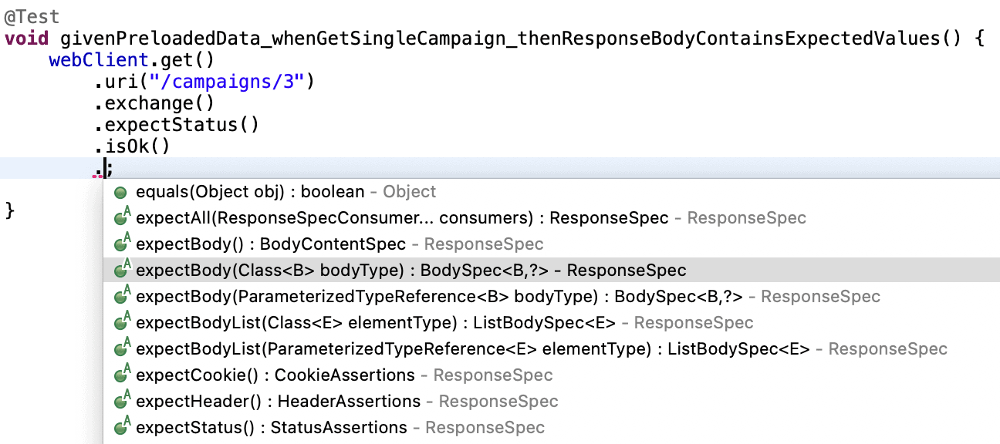
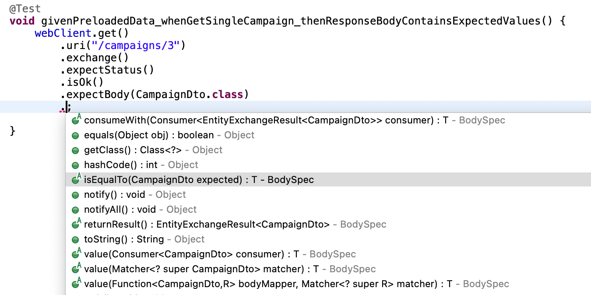
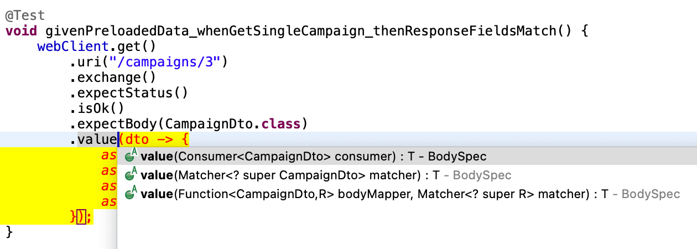

# WebTestClient API Assertions

---

# 1. Goal

In this lesson, we dive deeper into **assertions with WebTestClient**, focusing on verifying the **response body content**.

So far, we’ve asserted HTTP status codes. Now we’ll validate:

* The structure of returned JSON
* The mapped DTO objects
* Specific response fields
* Collections of resources

To keep the scope focused, we will test only **GET endpoints**.

---

# 2. Mapping the Response Body

When testing an endpoint, the most important part is usually the **response body**.

Let’s start with a basic test:

```java
@Test
void givenPreloadedData_whenGetSingleCampaign_thenResponseBodyContainsExpectedValues() {
    webClient.get()
        .uri("/campaigns/3")
        .exchange()
        .expectStatus()
        .isOk();
}
```

At this stage, we are only asserting the HTTP status.

---

## 2.1 Using `expectBody(Class<T>)`



Since our endpoint returns a `CampaignDto`, we can map the JSON response into that class:

```java
.expectBody(CampaignDto.class)
```

This tells `WebTestClient`:

> Deserialize the JSON response into a `CampaignDto`.

Now we can assert on the mapped object.

---

# 3. Asserting by Equality

The most intuitive assertion approach is using `isEqualTo`.



```java
@Test
void givenPreloadedData_whenGetSingleCampaign_thenResponseBodyContainsExpectedValues() {
    webClient.get()
        .uri("/campaigns/3")
        .exchange()
        .expectStatus()
        .isOk()
        .expectBody(CampaignDto.class)
        .isEqualTo(new CampaignDto(
            3L,
            "C3",
            "Campaign 3",
            "About Campaign 3",
            Collections.emptySet()
        ));
}
```

---

## How This Works

* The response JSON is mapped to a `CampaignDto`
* `isEqualTo` compares it with the expected object
* The comparison relies on the DTO’s `equals()` implementation

Since `CampaignDto` is a **Java Record**, it automatically compares **all fields**.

---

## ⚠ Limitation of Equality-Based Assertions

This approach requires:

* All fields to match
* Nested collections to match
* Complete object construction

For example, if `CampaignDto` had associated `TaskDto` objects, you would need to construct and include them — even if they are irrelevant to the test.

This creates unnecessary overhead.

---

# 4. Asserting Granularly (Recommended Approach)

A better approach is to assert only the fields you care about.

Instead of `isEqualTo`, use `.value(...)`.

```java
@Test
void givenPreloadedData_whenGetSingleCampaign_thenResponseFieldsMatch() {
    webClient.get()
        .uri("/campaigns/3")
        .exchange()
        .expectStatus()
        .isOk()
        .expectBody(CampaignDto.class)
        .value(dto -> {
            assertThat(dto.id()).isEqualTo(3L);
            assertThat(dto.description()).isNotBlank();
            assertThat(dto.name()).contains("Campaign");
            assertThat(dto.code()).doesNotContainAnyWhitespaces();
        });
}
```

> Note: We import
> `import static org.assertj.core.api.Assertions.assertThat;`

---

## What We’re Verifying

* `id` equals `3`
* `description` is not blank
* `name` contains `"Campaign"`
* `code` has no whitespace

This is:

* More flexible
* More readable
* Less brittle
* Focused on business behavior

---

## Why This Is Better for REST Testing

REST tests should validate:

* Contract behavior
* Critical fields
* Expected constraints

They should **not duplicate object construction logic**.

Granular assertions keep tests expressive and maintainable.



---

# 5. Asserting Collections

When an endpoint returns a list, use:

```java
.expectBodyList(Class<E>)
```

---

## Example: GET /campaigns

```java
@Test
void givenPreloadedData_whenGetCampaign_thenResponseConsumeWith() {
    webClient.get()
        .uri("/campaigns")
        .exchange()
        .expectStatus()
        .isOk()
        .expectBodyList(CampaignDto.class)
        .value(campaignsList -> {
            assertThat(campaignsList).hasSizeGreaterThanOrEqualTo(3);

            assertThat(campaignsList)
                .extracting(CampaignDto::code)
                .contains("C1", "C2", "C3");

            assertThat(campaignsList)
                .flatExtracting(CampaignDto::tasks)
                .extracting(TaskDto::name)
                .contains("Task 1", "Task 2", "Task 3", "Task 4");
        });
}
```

---

## What Happens Here

We assert:

1. The list contains at least 3 campaigns
2. Codes `"C1"`, `"C2"`, `"C3"` exist
3. Nested task names exist in the response

Notice the power of:

* `extracting(...)`
* `flatExtracting(...)`

This allows expressive assertions over nested collections.

---

# 6. Testing Other Resources

## 6.1 Task Resource

```java
@SpringBootTest(webEnvironment = WebEnvironment.RANDOM_PORT)
public class TaskEndToEndApiTest {

    @Autowired
    WebTestClient webClient;

    @Test
    void givenPreloadedData_whenGetSingleTask_thenResponseFieldsMatch() {
        webClient.get()
            .uri("/tasks/1")
            .exchange()
            .expectStatus()
            .isOk()
            .expectBody(TaskDto.class)
            .value(dto -> {
                assertThat(dto.id()).isEqualTo(1L);
                assertThat(dto.description()).isNotBlank();
                assertThat(dto.campaignId()).isNotNull();
                assertThat(dto.dueDate()).hasYear(2030);
            });
    }

    @Test
    void givenPreloadedData_whenGetTasks_thenResponseFieldsMatch() {
        webClient.get()
            .uri("/tasks")
            .exchange()
            .expectStatus()
            .isOk()
            .expectBodyList(TaskDto.class)
            .value(tasksList -> {
                assertThat(tasksList).hasSizeGreaterThanOrEqualTo(2);

                assertThat(tasksList)
                    .extracting(TaskDto::campaignId)
                    .allMatch(campaignId -> campaignId > 0);

                assertThat(tasksList)
                    .extracting(TaskDto::name)
                    .allSatisfy(name ->
                        assertThat(name).contains("Task"));
            });
    }
}
```

---

## 6.2 Worker Resource

```java
@SpringBootTest(webEnvironment = WebEnvironment.RANDOM_PORT)
public class WorkerEndToEndApiTest {

    @Autowired
    WebTestClient webClient;

    @Test
    void givenPreloadedData_whenGetSingleWorker_thenResponseFieldsMatch() {
        webClient.get()
            .uri("/workers/1")
            .exchange()
            .expectStatus()
            .isOk()
            .expectBody(WorkerDto.class)
            .value(dto -> {
                assertThat(dto.id()).isEqualTo(1L);
                assertThat(dto.email()).contains("@");
            });
    }
}
```

Since there is no endpoint listing all workers, a single GET test is sufficient.

---

# 7. Key WebTestClient Assertion Methods

| Method                     | Purpose                  |
| -------------------------- | ------------------------ |
| `expectStatus()`           | Assert HTTP status       |
| `expectBody(Class<T>)`     | Map single object        |
| `expectBodyList(Class<E>)` | Map collection           |
| `isEqualTo()`              | Full object comparison   |
| `value(Consumer<T>)`       | Granular assertions      |
| `expectBody().jsonPath()`  | Raw JSON path assertions |

---

# 8. Best Practice Summary

### Use `isEqualTo()` when:

* Testing simple value objects
* You want full equality verification

### Use `value(...)` when:

* You want granular assertions
* You want flexibility
* You want cleaner REST contract tests

### Use `expectBodyList()` when:

* Endpoint returns collections

---

# 9. Conceptual Takeaway

With WebTestClient, API testing follows this pattern:

1. Perform request
2. Assert HTTP status
3. Map response body
4. Assert fields or collections

The most professional approach is:

* Validate behavior
* Assert important fields
* Avoid brittle equality-based tests
* Keep tests readable and expressive

---

You are now asserting:

* Single resources
* Collections
* Nested objects
* Specific fields
* Structural integrity

That’s a strong foundation for robust REST API testing.

---