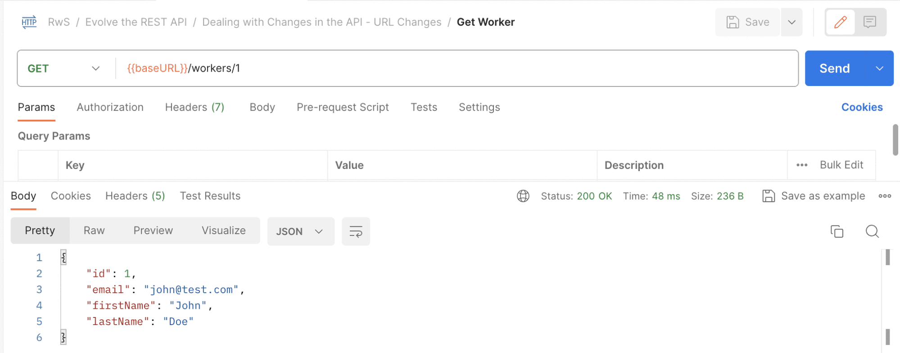
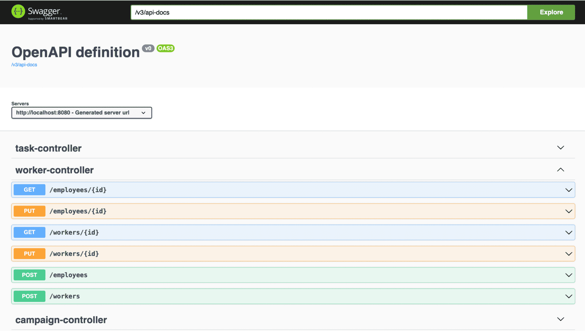
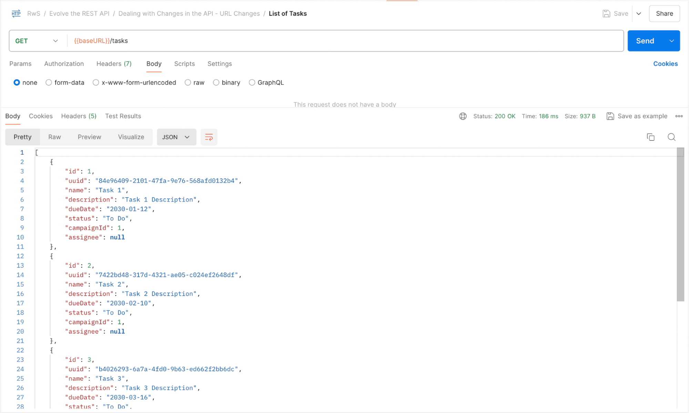
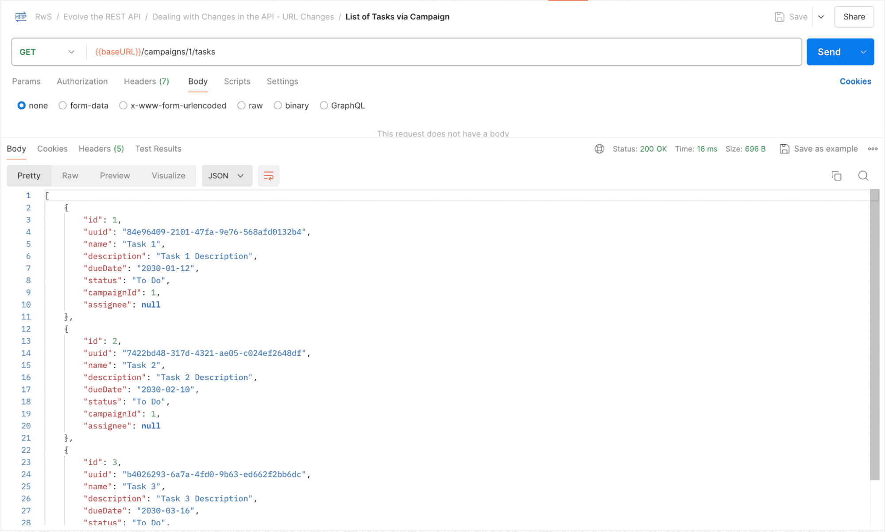
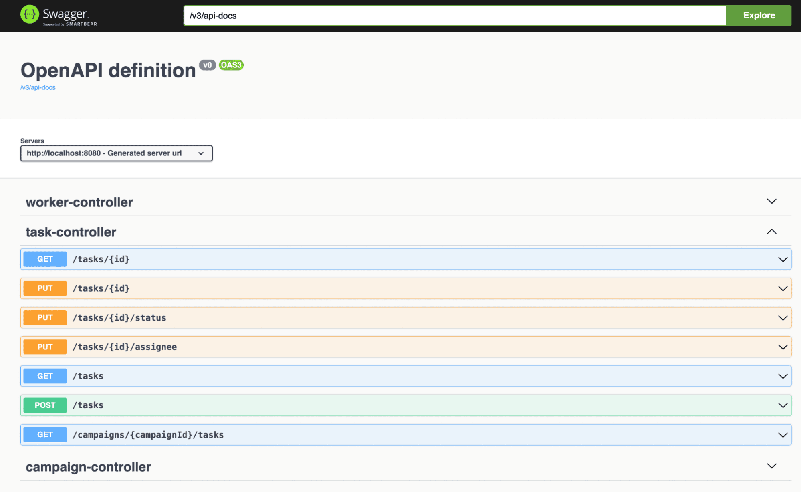
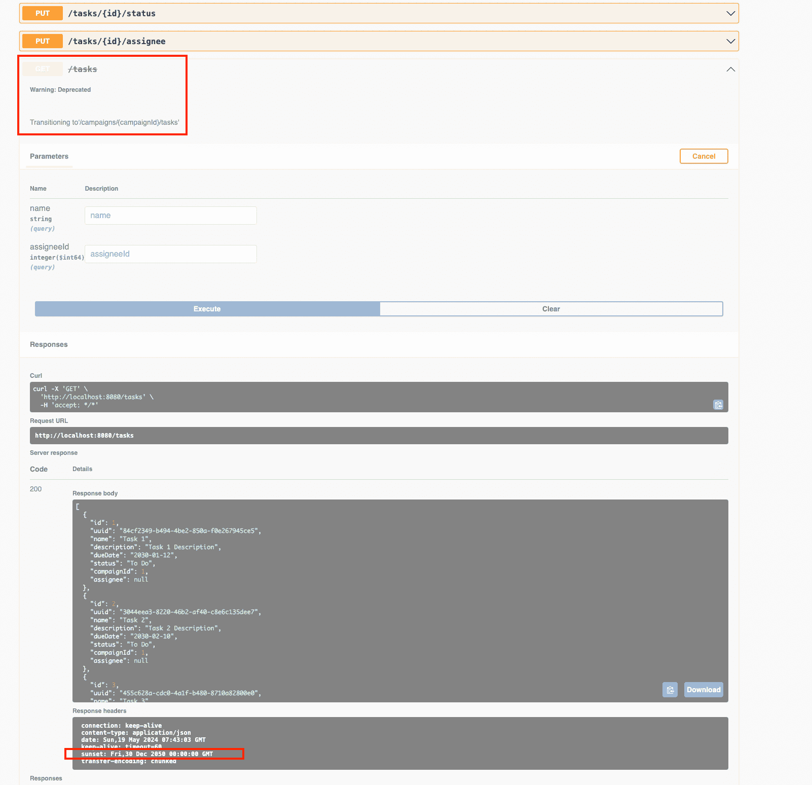
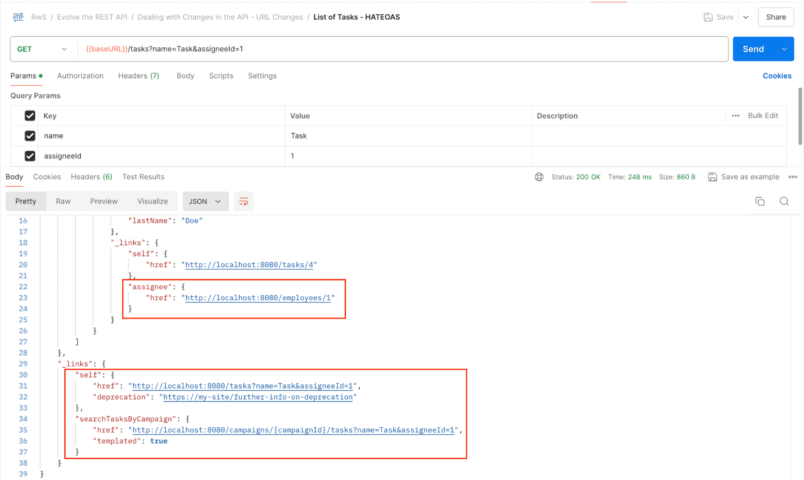

# Dealing with Changes in the API – URL Changes

---

## 1. Goal

Explore strategies for managing API URL changes in Spring Boot applications, focusing on minimising disruptions for client applications and maintaining backward compatibility throughout the transition.

---

## 2. Simple URL Renaming

### The Problem

Renaming a URL path (e.g. `/workers` → `/employees` for improved domain semantic clarity) immediately breaks any client hardcoded to the old path.

### Strategy: Support Both Paths Simultaneously

Spring's `@RequestMapping` annotation accepts an **array of URL paths**, making it trivial to keep both paths active during a transition period:

```java
@RestController
@RequestMapping(value = { "/employees", "/workers" })
public class WorkerController {
    // all methods respond to both paths
}
```
> Postman Request: Get Worker


> Postman Request: Get Employee


Both endpoints respond correctly — existing clients using `/workers` continue to work, while new clients or updated clients can use `/employees`.

### Documentation

Update API documentation to reflect the new endpoint. With OpenAPI/Swagger, the new path is picked up automatically and will appear in the Swagger UI at `/swagger-ui/index.html`.



---

## 3. URL Changes with Different Parameter Handling

### The Problem

Sometimes a URL change introduces structural differences — not just a rename. For example, introducing a nested resource path:

```
Old: /tasks
New: /campaigns/{campaignId}/tasks
```

These two paths have different URL parameters (`campaignId` is present in one but not the other), so a simple array of paths in `@RequestMapping` is not enough on its own.

### Strategy: Optional Path Variables

Spring allows making path variables optional by setting `required = false` on `@PathVariable` or `@RequestParam`. This lets a single controller method handle both URL patterns:

```java
@RestController
public class TaskController {

    @GetMapping(value = { "/tasks", "campaigns/{campaignId}/tasks" })
    public List<TaskDto> searchTasks(
      @PathVariable(required = false) Long campaignId,
      @RequestParam(required = false) String name,
      @RequestParam(required = false) Long assigneeId) {
        // campaignId will be null when the /tasks path is used
    }
}
```

> **Note:** When adding multiple path patterns like this, any class-level `@RequestMapping(value = "/tasks")` must be removed, since not all nested paths share the same base. All other existing paths in the controller must then be updated to include the full path explicitly.

### Ripple Effect on Other Layers

A URL change like this can cascade through the entire application stack. In this example, `campaignId` becomes an additional filter condition, requiring updates to:

**Repository layer** — updated JPQL query with `campaignId` as an optional filter:
```java
@Query("SELECT t"
  + " FROM Task t"
  + " WHERE (:name IS NULL or t.name like %:name%)"
  + " AND (:assigneeId IS NULL or t.assignee.id = :assigneeId)"
  + " AND (:campaignId IS NULL or t.campaign.id = :campaignId)")
List<Task> findByCampaignIdAndNameContainingAndAssigneeId(
  @Param("campaignId") Long campaignId,
  @Param("name") String name,
  @Param("assigneeId") Long assigneeId);
```

**Service interface** — updated method signature:
```java
List<Task> searchTasks(Long campaignId, String nameSubstring, Long assigneeId);
```

**Service implementation:**
```java
public List<Task> searchTasks(Long campaignId, String nameSubstring, Long assigneeId) {
    return taskRepository.findByCampaignIdAndNameContainingAndAssigneeId(
      campaignId,
      nameSubstring != null ? nameSubstring : "",
      assigneeId);
}
```

**Controller** — passes the new parameter through to the service:
```java
List<Task> models = taskService.searchTasks(campaignId, name, assigneeId);
```

> Postman Request: List of Tasks


> Postman Request: List of Tasks via Campaign


> Once again, we can find the new endpoint in the API documentation:


> This demonstrates how even a small URL change can have a significant impact across multiple application layers.

---

## 4. URL Deprecation

### When to Deprecate

Two scenarios arise when supporting both old and new URLs:

1. **Both endpoints are kept permanently** — e.g. `/tasks` (general search) and `/campaigns/{campaignId}/tasks` (scoped search) serve genuinely different purposes
2. **Transitional period only** — the old URL is a stepping stone; it should eventually be removed

In the second case, the old endpoint should be formally **deprecated** to signal to clients that they need to migrate.

### The Limitation of Multiple Paths in One Method

When a single controller method handles multiple URL paths using an annotation array, it is **impossible to mark just one path as deprecated**. Spring treats the method as a whole.

**Solution:** Split into two separate methods — one for the deprecated path and one for the new path — and extract the shared logic into a private method to avoid code duplication (DRY principle):

```java
// Deprecated old endpoint
@Operation(
  deprecated = true,
  description = "Transitioning to '/campaigns/{campaignId}/tasks'"
)
@GetMapping(value = "/tasks")
public ResponseEntity<List<TaskDto>> searchTasks(
  @RequestParam(required = false) String name,
  @RequestParam(required = false) Long assigneeId) {

    HttpHeaders headers = new HttpHeaders();
    ZonedDateTime sunsetDateTime = ZonedDateTime.of(2050, 12, 30, 0, 0, 0, 0, ZoneOffset.UTC);
    String sunsetHeaderValue = sunsetDateTime.format(DateTimeFormatter.RFC_1123_DATE_TIME);
    headers.add("Sunset", sunsetHeaderValue);

    List<TaskDto> taskDtos = processSearch(null, name, assigneeId);
    return ResponseEntity.ok().headers(headers).body(taskDtos);
}

// New endpoint
@GetMapping(value = "campaigns/{campaignId}/tasks")
public List<TaskDto> searchTasksByCampaignId(
  @PathVariable Long campaignId,
  @RequestParam(required = false) String name,
  @RequestParam(required = false) Long assigneeId) {

    return processSearch(campaignId, name, assigneeId);
}

// Shared logic — avoids duplication
private List<TaskDto> processSearch(Long campaignId, String name, Long assigneeId) {
    List<Task> models = taskService.searchTasks(campaignId, name, assigneeId);
    return models.stream()
      .map(TaskDto.Mapper::toDto)
      .collect(Collectors.toList());
}
```

### Two Ways to Mark an Endpoint as Deprecated

| Annotation | Effect |
|---|---|
| `@Deprecated` (Java lang) | Standard Java deprecation; IDE warnings |
| `@Operation(deprecated = true, description = "...")` (Swagger) | Shows as deprecated in API docs with a custom transition message |

The Swagger `@Operation` annotation is preferable when guiding clients through the transition, as it allows an explanatory description message to appear in the documentation.

> Let’s restart the application, and confirm that the API documentation is showing the API as deprecated and retrieving the Sunset header field:


---

## 5. The Sunset Header

The `Sunset` HTTP response header communicates that a resource will become unavailable at a specific point in time, giving clients a concrete deadline to migrate.

### Adding the Sunset Header in Spring

```java
ZonedDateTime sunsetDateTime = ZonedDateTime.of(2050, 12, 30, 0, 0, 0, 0, ZoneOffset.UTC);
String sunsetHeaderValue = sunsetDateTime.format(DateTimeFormatter.RFC_1123_DATE_TIME);
headers.add("Sunset", sunsetHeaderValue);
return ResponseEntity.ok().headers(headers).body(taskDtos);
```

### Key Points About the Sunset Header

- The date is a **hint** — clients should not treat it as a guaranteed hard cutoff
- A `Link` relation type can accompany the header to provide further information (e.g. a link to migration docs), which can be delivered via HATEOAS/Hypermedia mechanisms
- By default, sunsetting applies only to the **specific resource requested**, but increased scope can be defined and communicated separately

---

## 6. Leveraging HATEOAS for URL Changes

HATEOAS (Hypermedia as the Engine of Application State) provides an elegant solution to URL changes when clients are **hypermedia-driven** — meaning they follow links from responses rather than hardcoding URLs.

### Benefits for URL Changes

- **Zero client-side change required for URL renames** — if a client discovers and uses links from the response (e.g. `/workers` → `/employees`), it simply follows whatever link the server now returns
- **Deprecation signalling** — HATEOAS specs like HAL allow links to be marked as deprecated; clients traversing a deprecated link are expected to notify their maintainers
- **Transition guidance built into the response** — links in the response can point clients directly to the replacement resource or show how to reformulate a request

### Example (HAL-style HATEOAS response for deprecated `/tasks`)

For instance, let’s analyze the implications of the information retrieved by the now deprecated GET /tasks response using the End module:

> Postman Request: List of Tasks – HATEOAS


* If the consumer is hypermedia-driven, then switching the /workers endpoints to /employees would need absolutely no change on the client application side, since the links are discovered and used from the response itself.
* HATEOAS allows indicating when a link is deprecated, providing a URL with further information. Specs like HAL indicate that services traversing a deprecated link should notify the maintainer in order to act upon this.
* The links themselves guide how to transition to alternative requests, as in this case, where it points out how a new “search” call can be formulated.

A hypermedia response can include a `self` link pointing to the new path, and a deprecation indicator — the client discovers the new URL automatically and can surface the deprecation warning to developers.

> This is the ideal long-term solution: clients that follow HATEOAS principles are inherently insulated from URL changes, since they never hardcode URLs in the first place.

---

## 7. Strategy Summary

| Scenario | Strategy |
|---|---|
| Simple URL rename | Array of paths in `@RequestMapping`; support both during transition |
| Nested resource URL (different params) | Optional `@PathVariable(required = false)`; single method handles both |
| Ripple effects through layers | Update repository query, service interface, service impl, and controller |
| Deprecating one of multiple paths | Split into two methods; extract shared logic to a private method |
| Communicating deprecation in docs | `@Operation(deprecated = true, description = "...")` Swagger annotation |
| Communicating removal deadline | `Sunset` HTTP response header with an RFC 1123 date |
| Long-term URL stability | HATEOAS — clients follow discovered links, not hardcoded URLs |

---

## 8. Key Principles

- **Never break clients immediately** — always support the old URL for a defined transition period
- **Communicate proactively** — update documentation and actively notify clients; don't rely on them spotting doc changes
- **Use the right deprecation tool for the job** — `@Deprecated` for Java-level warnings, `@Operation` for API docs, `Sunset` header for runtime runtime signals
- **Extract shared logic** — when splitting methods to support deprecation, use a private method to stay DRY
- **HATEOAS is the ideal** — hypermedia-driven clients are inherently resilient to URL changes

---