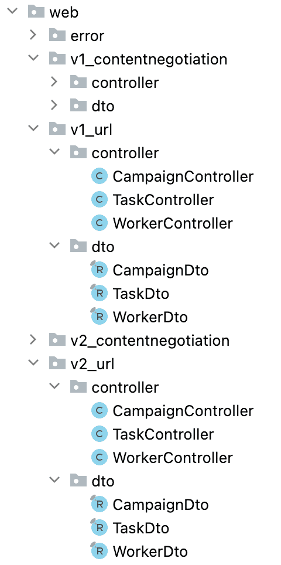
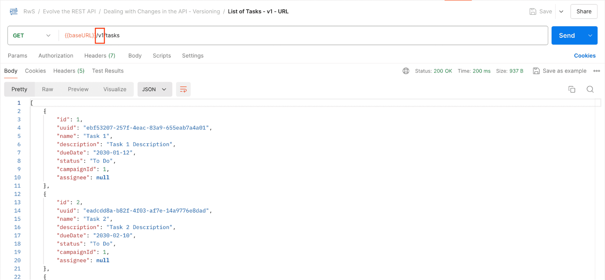
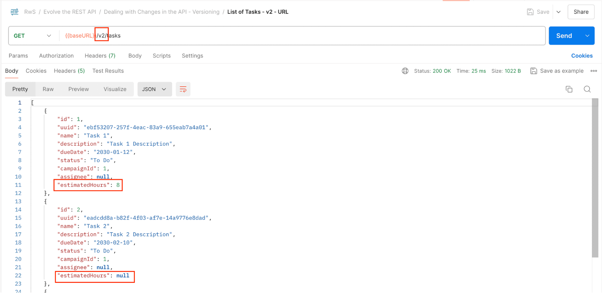
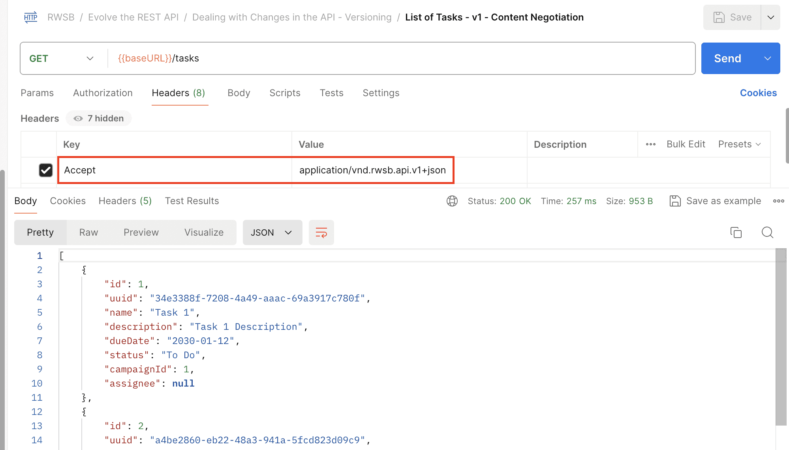
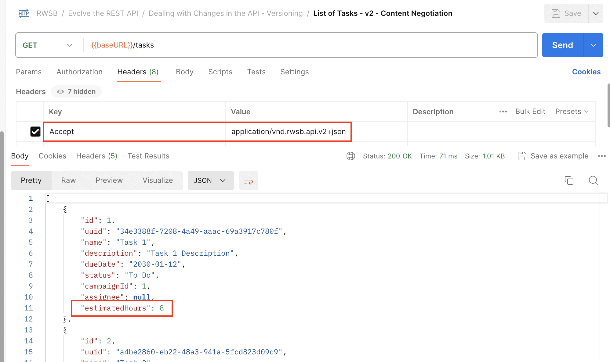
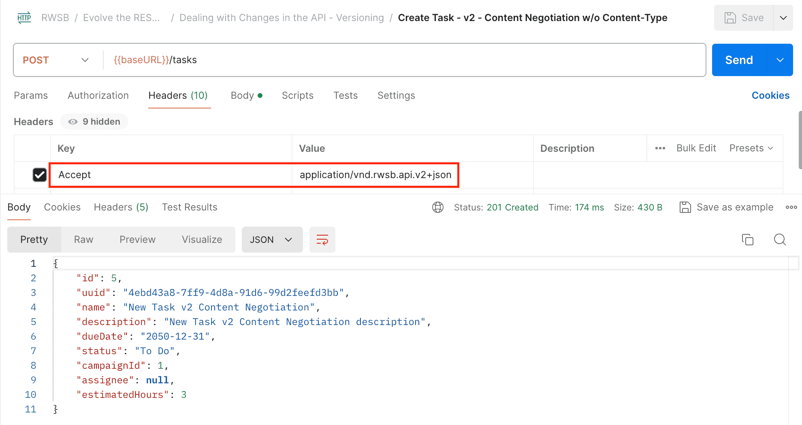
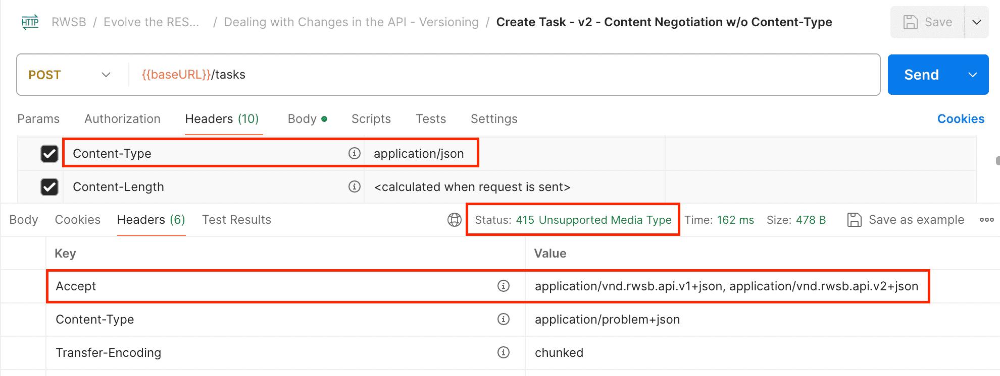
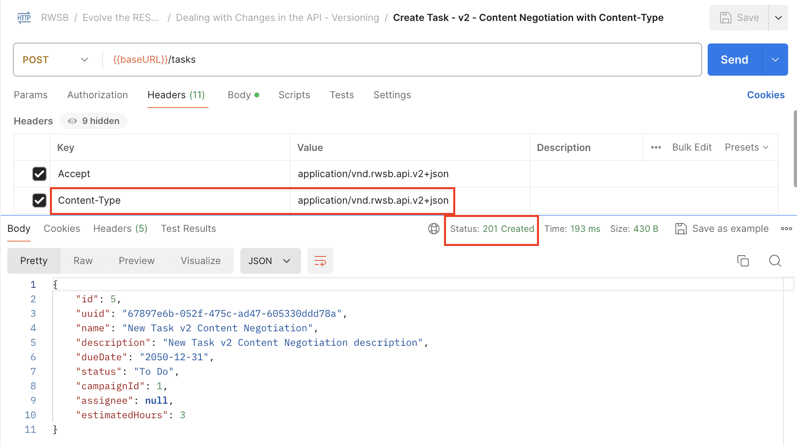

# Dealing with Changes in the API – Versioning

---

## 1. Goal

Dive into API versioning — analysing the complexities it implies, presenting the strategies used in practice, and examining how each is implemented in a Spring Boot project.

---

## 2. What Is API Versioning and When Is It Justified?

### Avoid It Where Possible

API versioning should be avoided as much as possible. It implies **forking the API implementation**, adding complexity to the entire solution, and requiring significant ongoing effort to support each version in parallel.

Before versioning, always consider whether the change can be handled through evolution strategies (additive fields, deprecation, content negotiation for single resources, etc.).

### When Versioning Is Justified

There are cases where breaking changes simply cannot be avoided. Two scenarios:

| Scenario | Approach |
|---|---|
| You control the client consuming the API | Sync both implementations at once — no versioning needed |
| You do NOT control the client | Versioning is justified — clients must be able to keep working until they can migrate at their own pace |

> The decision of what constitutes a valid scenario to justify versioning is often a **business decision**, not purely a technical one.

---

## 3. API Versioning Strategies

### 3.1 URL Versioning

The version is embedded directly in the URL path:

```
https://www.example.com/api/v1/resource
https://www.example.com/api/v2/resource
```

### 3.2 Query Parameter Versioning

The version is passed as a URL query parameter:

```
https://www.example.com/api/resource?version=1
https://www.example.com/api/resource?version=2
```

### 3.3 Header Versioning

The client specifies the version via a request header. Two sub-options:

**Custom header:**
```
API-version: 1
API-version: 2
```

**Standard headers (content negotiation via `Accept` / `Content-Type`):**
```
Accept: application/vnd.rwsb.api.v1+json
Accept: application/vnd.rwsb.api.v2+json
```

With header versioning, the **URL remains the same** across all versions — only the header changes.

> URL and content negotiation versioning are the most widely adopted strategies in practice.

---

## 4. Implementation Approaches

Two high-level implementation paths exist:

| Approach | Pros | Cons |
|---|---|---|
| **Fork the codebase** (separate git branches, separate deployed services, API Gateway for routing) | Clean separation; each version is independent | DevOps/infrastructure complexity |
| **Handle all versions in one Spring application** (separate packages per version) | Simpler infrastructure | Increased codebase complexity |

The single-application approach is examined here as it is more focused on Spring-specific patterns and easier to analyse directly.

---

## 5. Project Structure

The project uses separate `web` layer packages to isolate each version and approach cleanly:



```
com.baeldung.rwsb.web.v1_url
com.baeldung.rwsb.web.v2_url
com.baeldung.rwsb.web.v1_contentnegotiation
com.baeldung.rwsb.web.v2_contentnegotiation
```

Each package contains two sub-packages:

```
controller/   — CampaignController, TaskController, WorkerController
dto/          — CampaignDto, TaskDto, WorkerDto
```

This mirrors the package structure visible in the project:

- `v1_url` and `v2_url` — URL-versioned controllers and DTOs
- `v1_contentnegotiation` and `v2_contentnegotiation` — header-versioned controllers and DTOs

### The Breaking Change Used as an Example

A required `estimatedHours` field was added to the `Task` entity — a simple but clear breaking change:

- **V1 `TaskDto` mappers** — pass `null` to/from `estimatedHours` (simulating a pre-change codebase)
- **V2 `TaskDto` mappers** — map the new field correctly

This makes it immediately obvious which version a response came from.

---

## 6. Implementing URL Versioning

Add the version as a prefix to the `@RequestMapping` value on each controller. V1 controllers get `/v1/`, V2 controllers get `/v2/`:

**V1 controller:**
```java
@RestController(value = "campaignController.uri.v1")
@RequestMapping(value = "/v1/campaigns")
public class CampaignController {
    // …
}
```

**V2 controller:**
```java
@RestController(value = "campaignController.url.v2")
@RequestMapping(value = "/v2/campaigns")
public class CampaignController {
    // …
}
```

> Note: Unique bean names are required (e.g. `"campaignController.uri.v1"`) when multiple controllers of the same type coexist in the same Spring application context. This is specific to the single-application approach — it has nothing to do with the versioning mechanism itself.

> Postman Request: List of Tasks – v1 – URL


> Postman Request: List of Tasks – v2 – URL


### Result

- `GET /v1/tasks` → returns tasks **without** `estimatedHours`
- `GET /v2/tasks` → returns tasks **with** `estimatedHours`

### Alternative: Context Path Configuration

If using separate codebases or separate Spring web contexts, you can avoid changing `@RequestMapping` in every controller and instead set the base path at the application level:

```properties
server.servlet.context-path=/v1
```

---

## 7. Implementing Content Negotiation (Header) Versioning

Add a `produces` attribute to the class-level `@RequestMapping` annotation. The URL stays the same; the `Accept` header determines which version is served.

**V1 controller:**
```java
@RestController(value = "campaignController.contentNegotiation.v1")
@RequestMapping(value = "/campaigns", produces = "application/vnd.rwsb.api.v1+json")
public class CampaignController {
    // …
}
```

**V2 controller:**
```java
@RestController(value = "campaignController.contentNegotiation.v2")
@RequestMapping(value = "/campaigns", produces = "application/vnd.rwsb.api.v2+json")
public class CampaignController {
    // …
}
```

> Postman Request: List of Tasks – v1 – Content Negotiation


> Postman Request: List of Tasks – v2 – Content Negotiation


### Result

- `GET /campaigns` with `Accept: application/vnd.rwsb.api.v1+json` → V1 response
- `GET /campaigns` with `Accept: application/vnd.rwsb.api.v2+json` → V2 response (includes `estimatedHours`)

As we can see, the URL remains the same for both cases, but when the Accept header is set to “application/vnd.rwsb.api.v2+json”, we’re getting the new version of the resources, which in this case, is Tasks with the “estimatedHours” field.

Now let’s analyze a POST/PUT operation that receives a resource as input:

> Postman Request: Create Task – v2 – Content Negotiation w/o Content-Type


### Handling Write Operations (POST / PUT)

For `GET` requests, the `Accept` header alone is sufficient. For write operations, the request body also has a version — use the `consumes` attribute to enforce this:

```java
@RestController(value = "taskController.contentNegotiation.v2")
@RequestMapping(value = "/tasks", produces = "application/vnd.rwsb.api.v2+json")
public class TaskController {

    @PostMapping(consumes = "application/vnd.rwsb.api.v2+json")
    @ResponseStatus(HttpStatus.CREATED)
    public TaskDto create(@RequestBody @Valid TaskDto newTask) {
        // …
    }

    @PutMapping(value = "/{id}", consumes = "application/vnd.rwsb.api.v2+json")
    public TaskDto update(@PathVariable Long id,
      @RequestBody @Validated(TaskUpdateValidationData.class) TaskDto updatedTask) {
        // …
    }
}
```
And let’s proceed similarly for the other vX_contentnegotiation resources and versions, defining the corresponding consumes attribute on every single POST and PUT endpoint.

Now let’s relaunch the application and execute the same request again:

> Postman Request: Create Task – v2 – Content Negotiation w/o Content-Type


As we can see, the service now indicates that the Media Type of the input resource Postman uses by default (the standard “application/json”) isn’t suitable for the endpoint we’re trying to invoke.

Thus, with this, the client will have to explicitly indicate that it’s using a v2 resource in the request body via the Content-Type header:

> Postman Request: Create Task – v2 – Content Negotiation with Content-Type


Without `consumes`, the endpoint accepts any `Content-Type` (including the default `application/json`), which is ambiguous. With `consumes` set, clients that send the wrong `Content-Type` receive a `415 Unsupported Media Type` response — a clear, unambiguous signal to set the correct header.

To use the V2 POST endpoint correctly, the client must set both headers:
- `Accept: application/vnd.rwsb.api.v2+json`
- `Content-Type: application/vnd.rwsb.api.v2+json`

> **Recommendation:** Use standard `Accept` / `Content-Type` headers rather than custom headers. Standard headers are familiar to developers, well-documented on the web, and fully supported by Spring's content negotiation framework — no need to reinvent the wheel.

---

## 8. URL Versioning vs. Header Versioning — Pros and Cons

### URL Versioning

| Pros | Cons |
|---|---|
| Easy to read and test — version is visible in the URL | Adds complexity to the URL structure |
| Simple to implement | Multiplies the number of endpoints, cluttering documentation |
| Simpler routing rules when using a forked codebase or API Gateway | Every client must update URLs to migrate versions |

### Header Versioning (Content Negotiation)

| Pros | Cons |
|---|---|
| URL stays clean and stable across versions | Slightly harder to test manually (must set headers) |
| Same endpoint serves multiple API versions | Caching is more complex — caches must consider both URL and headers |
| Clear and explicit contract via `Accept` / `Content-Type` | May take clients more initial effort to understand |

---

## 9. Impact of HATEOAS on Versioning

HATEOAS introduces an additional dimension to the versioning decision:

**URL versioning + HATEOAS:**
- In complex systems where hyperlinked services each manage their own versioning cadence, URL-based versioning can be problematic
- The service embeds version-specific URLs in hypermedia links — but the client may not be ready to handle that version of the linked service
- The service is making a version decision that arguably belongs to the client

**Header versioning + HATEOAS:**
- The client retains control over which version it consumes via headers
- However, communicating available versions through hypermedia links is not straightforward
- One partial signal: the `Accept` response header in a `415 Unsupported Media Type` response indicates what media types the server does support

---

## 10. Key Principles

- **Versioning is a last resort** — exhaust evolution strategies (additive changes, deprecation, content negotiation at the resource level) before introducing a new version
- **Don't version until you must** — if you hadn't planned for versioning from the start, leave V1 endpoints as-is to avoid disrupting existing clients unnecessarily
- **URL versioning** is simpler and more visible; **header versioning** is cleaner and more aligned with REST principles
- **Use standard headers** (`Accept`, `Content-Type`) for header versioning rather than custom headers
- **Both `produces` and `consumes`** should be set on write endpoints to enforce unambiguous version contracts
- **Unique bean names** are required in a single-application multi-version setup — this is an implementation detail, not part of the versioning design

---