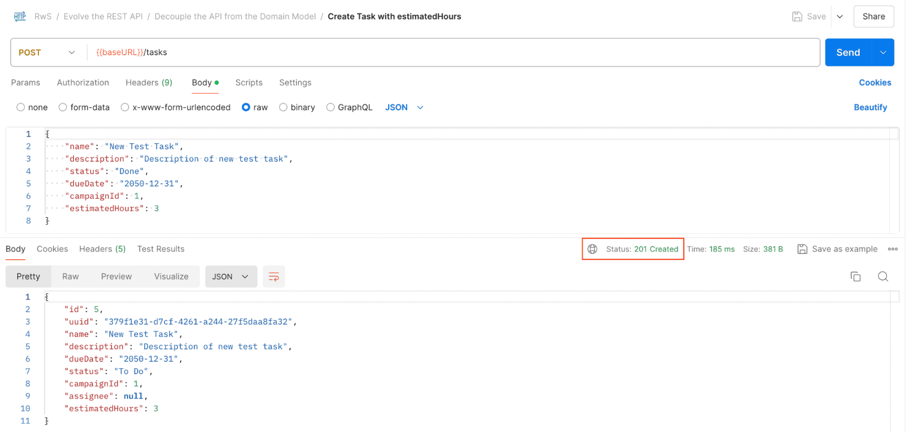
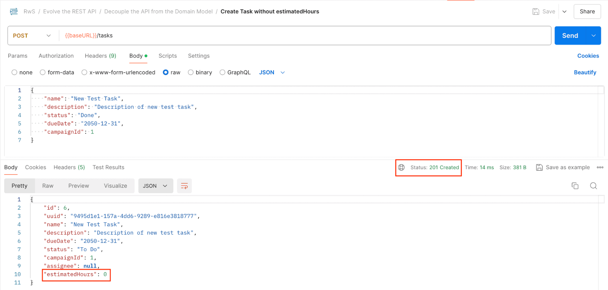
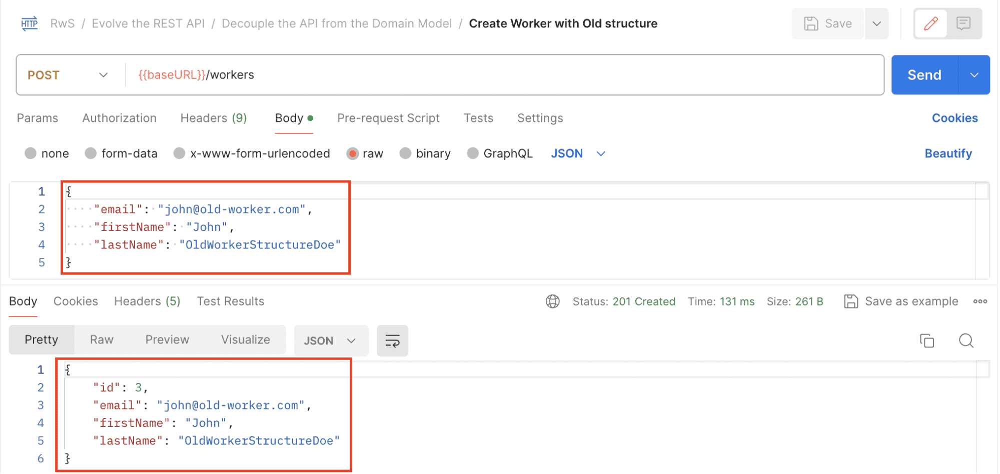
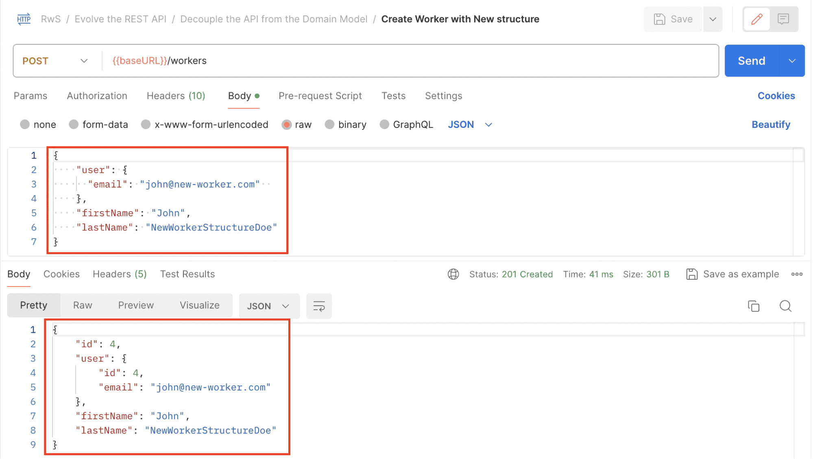
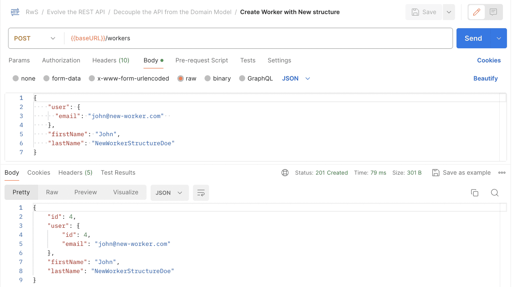

# Decouple the API From the Domain Model

---

## 1. Goal

Analyse how decoupling an API from its underlying domain model positively impacts its evolution. Focus on the role of DTOs in allowing smoother updates and greater flexibility when APIs need to change.

---

## 2. Clarifying Key Concepts

These terms are often used interchangeably but have distinct meanings in this context:

| Term | Definition |
|---|---|
| **Domain Model** | The application's business objects (e.g. `Campaign`, `Task`, `Worker`) |
| **Entity** | An object that can be persisted and manipulated in the database |
| **Resource** | A REST concept — a conceptual mapping to a set of entities, associated with an API endpoint |
| **DTO (Data Transfer Object)** | The data structure retrieved by the API, representing an entity structured to meet API requirements |

In simple projects, Domain Model and Entity are often the same class. Resource maps to an endpoint; DTO maps to the data shape that endpoint returns or accepts.

---

## 3. What Is Decoupling and Why Does It Matter?

Decoupling in API design creates a **flexible bridge between the internal domain model and the external API**. This separation allows the backend logic and the client-facing API to evolve somewhat independently of each other.

### DTOs as the Bridge

DTOs act as intermediaries that adapt data between the domain model and the API:

- Changes in the **domain model** → translated in the DTO → **API contract stays stable**
- Changes in **API requirements** → handled in the DTO → **domain model stays clean**

### Additional Benefits

- Can **reduce the number of service calls** when data is complex or spans multiple resources (though this is rare in resource-centric REST APIs)
- Plays well with **layered architecture** — the presentation/web layer is clearly responsible for the outward interface, while business logic stays in the service/domain layer
- Gives control over **data size**, **performance**, and **what is transmitted over the wire**

---

## 4. Reasons to Decouple

In simple or prototype applications, it may be acceptable to skip conversion and use techniques like Jackson annotations (`@JsonIgnore`) to hide fields directly on domain classes. In real projects, this is rarely appropriate.

Decoupling is suitable because:

- Conceptually, **entities are not the resource** — they are not the same thing as the data the API exposes
- **Entities typically store more data** than should be exposed to clients
- Tying the API contract directly to domain classes **compromises maintainability** — changes in the persistence or service layer directly break the API
- **Loose coupling** between the domain and the exposed interface is essential in real-world projects

---

## 5. Where to Perform the Conversion

The conversion between domain model and DTO must happen at a clearly defined point in the architecture. Options include:

| Location | Notes |
|---|---|
| **Presentation/web layer** (Controllers or inside the DTOs themselves) | Most common; keeps mapping logic close to the API boundary |
| **Service layer** | Possible but mixes API concerns into business logic |
| **AOP (Aspect-Oriented Programming)** | Cross-cutting; can be complex to manage |

In this course, conversion is performed in the **presentation layer** — either in the controller or within the DTO class itself via a nested `Mapper`.

---

## 6. DTOs as Decoupling Agents — Practical Scenarios

### 6.1 Adding a Required Field While Maintaining Backward Compatibility

**Requirement:** Add a required `estimatedHours` field to the `Task` resource.

The domain model enforces the constraint:

```java
@Entity
public class Task {
    // …
    @NotNull
    private Integer estimatedHours;
    // …
}
```

Without decoupling, existing clients that don't send `estimatedHours` would immediately break. With a DTO, a **default value** can be applied in the mapper, keeping the API backward compatible:

```java
public record TaskDto(
    // …
    Integer estimatedHours) {

    public static class Mapper {
        // …
        Task model = new Task(
          // …
          Optional.ofNullable(dto.estimatedHours()).orElse(0));
        // …
    }
}
```
Let’s start the application and check that this is, in fact, working as expected:

> Postman request: Create Task with estimatedHours


> Postman request: Create Task without estimatedHours


- Clients that **send** `estimatedHours` → value is used
- Clients that **don't send** `estimatedHours` → defaults to `0`; request still succeeds

The domain model gets the required field it needs. Existing clients are not broken. The DTO absorbs the change.

---

### 6.2 Supporting a Complex Domain Refactoring Without Breaking Clients

**Requirement:** Refactor `Worker` so that `email` is extracted into a separate `ServiceUser` entity.

**New domain model:**

```java
@Entity
public class ServiceUser {
    // …
    private String email;
}

@Entity
public class Worker {
    // …
    private ServiceUser user;
}
```

Without decoupling, clients sending a flat `email` field on the Worker would immediately break. With DTOs, the **presentation layer supports both the old and new structure simultaneously**:

```java
// New structure DTO
public record NewWorkerDto(
    UserDto user,
    // …
) { … }

// Old structure DTO — kept for backward compatibility
@Deprecated
@Schema(deprecated = true)
public record OldWorkerDto(
    String email,
    // …
) { … }
```

The controller uses **content negotiation** to route between them. Both map to the same underlying domain model:

```java
// Old approach — default, backward compatible
@PostMapping
@ResponseStatus(HttpStatus.CREATED)
public OldWorkerDto create(@RequestBody @Valid OldWorkerDto newWorker) {
    Worker model = OldWorkerDto.Mapper.toModel(newWorker);
    Worker createdModel = this.workerService.save(model);
    return OldWorkerDto.Mapper.toDto(createdModel);
}

// New approach — opt in via custom media type
@PostMapping(
    produces = "application/vnd.baeldung.new-worker+json",
    consumes = "application/vnd.baeldung.new-worker+json"
)
@ResponseStatus(HttpStatus.CREATED)
public NewWorkerDto createNewStructure(@RequestBody @Valid NewWorkerDto newWorker) {
    Worker model = NewWorkerDto.Mapper.toModel(newWorker);
    Worker createdModel = this.workerService.save(model);
    return NewWorkerDto.Mapper.toDto(createdModel);
}
```
The business logic in both methods is identical — only the DTO mapping differs. The domain model is free to evolve internally while the API presents a stable interface to both old and new clients.

As we can see, the logic is the same in both cases. The only difference is how each DTO is mapped to the domain model.

Let’s also confirm this with Postman requests:

> Postman request: Create Worker with Old structure


> Postman request: Create Worker with New structure


These examples show how DTOs, as decoupling agents, allow APIs to be dynamic and adaptable, evolving in response to new demands while maintaining a stable interface for end users.

---

## 7. Alternative Mapping Tools

Instead of hand-crafted DTO mappers, libraries like **MapStruct** and **ModelMapper** can automate the mapping process, reducing boilerplate code.

### MapStruct Example

Define `@Mapper` interfaces. MapStruct generates the implementation automatically. Only non-trivial mappings (e.g. accessing a nested field) need to be declared explicitly:

```java
@Mapper(componentModel = "spring")
public interface NewWorkerMapper {
    NewWorkerDto toDto(Worker model);
    // …
}

@Mapper(componentModel = "spring")
public interface OldWorkerMapper {
    @Mapping(target = "email", source = "model.user.email")
    OldWorkerDto toDto(Worker model);
    // …
}
```

### Using Mappers in the Controller

The mapper interfaces are injected as Spring components:

```java
public class WorkerController {

    private NewWorkerMapper newWorkerMapper;
    private OldWorkerMapper oldWorkerMapper;

    public WorkerController(
      // …
      NewWorkerMapper newWorkerMapper,
      OldWorkerMapper oldWorkerMapper) {
        this.newWorkerMapper = newWorkerMapper;
        this.oldWorkerMapper = oldWorkerMapper;
    }

    @PostMapping
    @ResponseStatus(HttpStatus.CREATED)
    public OldWorkerDto create(@RequestBody @Valid OldWorkerDto newWorker) {
        Worker model = oldWorkerMapper.toModel(newWorker);
        Worker createdModel = this.workerService.save(model);
        return oldWorkerMapper.toDto(createdModel);
    }

    @PostMapping(
        produces = "application/vnd.baeldung.new-worker+json",
        consumes = "application/vnd.baeldung.new-worker+json"
    )
    @ResponseStatus(HttpStatus.CREATED)
    public NewWorkerDto createNewStructure(@RequestBody @Valid NewWorkerDto newWorker) {
        Worker model = newWorkerMapper.toModel(newWorker);
        Worker createdModel = this.workerService.save(model);
        return newWorkerMapper.toDto(createdModel);
    }
}
```

The controller code looks nearly identical to the hand-crafted version — the difference is in where the mapping logic lives.

Let’s stop the Start application and instead launch the End Maven module to check that the requests we’ve triggered previously produce the same response as before:

> Postman request: Create Worker with Old structure


> Postman request: Create Worker with New structure


### Trade-offs of Using Mapping Libraries

| Benefit | Cost |
|---|---|
| Reduces boilerplate mapping code | Adds a third-party dependency to the project |
| Generates mappings automatically | Lose some control over how mappings are performed |
| Handles non-trivial mappings via annotations | Requires learning the library's API and conventions |
| — | Plain Java/Spring mappings are simpler and more transparent |

The choice between hand-crafted mappers and a library like MapStruct is a project-level decision based on team preference, project complexity, and how much boilerplate is acceptable.

---

## 8. Key Principles

- **DTOs are not just passive data carriers** — they are active agents of API stability and evolution
- **Decouple early** — tying the API contract to domain classes creates fragility that compounds over time
- **The DTO layer absorbs change** — domain model refactoring, new fields, structural changes, and deprecated representations are all handled at the DTO boundary without breaking the API contract
- **Content negotiation + DTOs** is a powerful combination — it allows multiple representations to coexist at the same endpoint, each backed by its own DTO
- **Keep mapping in the presentation layer** — this is the cleanest separation of concerns in a layered architecture
- **Libraries are optional** — MapStruct and ModelMapper reduce boilerplate but add dependencies; hand-crafted mappers are always a valid, transparent alternative

---