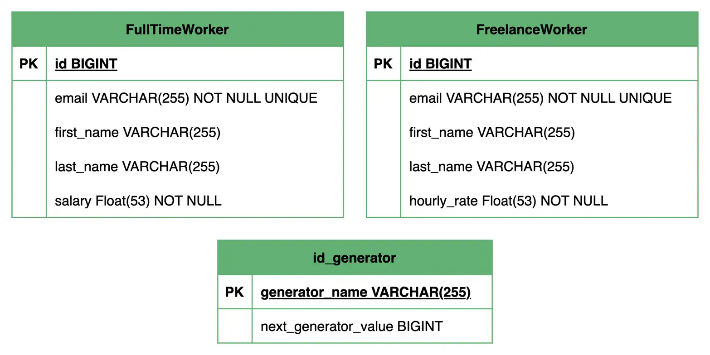
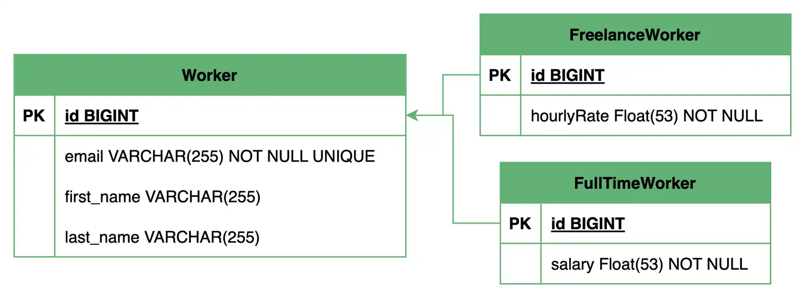

1. Overview
   In a previous introductory lesson on inheritance mapping, we took a brief overview of the four mapping strategies that JPA provides and implemented the first one, the single table strategy.

In this advanced lesson, we’ll continue our exploration and take a detailed look at the remaining three strategies.

We’ll continue working with the worker inheritance hierarchy from the introductory lesson, where we created two concrete entity subclasses, FullTimeWorker and FreelanceWorker.

The relevant module we need to import when starting this lesson is: inheritance-mapping-advanced-start.

If we want to reference the fully implemented lesson, we can import: inheritance-mapping-advanced-end.

2. Polymorphic Queries
   Before we dive into the code, let’s first understand the concept of polymorphic queries.

Polymorphic queries allow us to query the base class and retrieve instances of all its subclasses. For example, we could write a query to fetch all Worker entities, and JPA would return a list containing both FullTimeWorker and FreelanceWorker instances. Similarly, we can also query a specific subclass directly if we only want instances of that specific type.

The single-table strategy we previously explored handles polymorphic queries efficiently, as all data resides in a single table. However, the performance of these queries varies significantly across the other inheritance strategies we’re about to explore.

Currently, we’re working with in-memory repository implementations, hence we can’t practically demonstrate polymorphic queries using JPA. However, we’ll switch to JPA and Hibernate and learn how to retrieve entities from the database in the upcoming lessons. We encourage revisiting the inheritance mapping lessons to practically explore polymorphic queries with the different inheritance strategies.

3. Table per Class Strategy
   Now, let’s begin exploring the table-by-class strategy. In this strategy, each concrete class in the inheritance hierarchy is mapped to its own dedicated database table. The table for each class contains columns for all the specific fields declared in that class, including the inherited fields from the base class.

This means that the inherited fields are duplicated across the tables of the subclasses. Here, the abstract base entity doesn’t get mapped to its own table.

A significant challenge with this strategy is handling primary key generation. Since each subclass has its own table, simply using an auto-incrementing identity column for each table will lead to duplicate primary key values across different subclass tables. To ensure unique IDs across the entire hierarchy, JPA uses a separate table called a sequence table to manage primary key generation for the table per class strategy in a thread-safe manner.

Let’s see how we can configure this strategy in our base Worker entity:

@Entity
@Inheritance(strategy = InheritanceType.TABLE_PER_CLASS)
public abstract class Worker {
@Id
@GeneratedValue(strategy = GenerationType.TABLE, generator = "worker_id_generator")
@TableGenerator(
name = "worker_id_generator",
table = "id_generator",
pkColumnName = "generator_name",
pkColumnValue = "worker_id",
valueColumnName = "next_generator_value"
)
@Column(name = "id")
private Long id;

    // ...
}
Copy
Here, we annotate our base Worker entity with the @Inheritance annotation and set its strategy attribute to InheritanceType.TABLE_PER_CLASS. This instructs Hibernate to map each concrete subclass to a separate table.

Next, we set the GenerationType.TABLE strategy using the @GeneratedValue annotation on our primary key field.

Additionally, we configure an id_generator sequence table using the @TableGenerator annotation, with a unique name of worker_id_generator that matches the one used in the @GeneratedValue annotation.

We can reuse this id_generator sequence table for other inheritance hierarchies in our project, and the only thing we’ll need to update is the unique generator name and the pkColumnValue.

It’s worth noting that using the @TableGenerator annotation is optional. If we don’t specify it, Hibernate will create a sequence table with default names. However, customizing the attributes to specify custom and meaningful names is generally recommended to enhance clarity and control.

Additionally, since the fields of the subclasses won’t be shared for different tables, we can now use the @Column annotation on the subclass fields to specify the required column-level constraints, such as not null or unique.

After we’ve done the required changes, let’s execute the main() method and look at the generated database schema:

Since we’ve set the hibernate.hbm2ddl.auto configuration property to create-drop in our persistence.xml file, Hibernate automatically generates the database schema for us based on our entity mappings.

From the above database schema, we can see that separate tables are created for each concrete subclass. Each subclass table contains columns for the specific fields defined in that subclass entity, including the inherited fields from the base Worker entity.

Additionally, we have the id_generator table, which is used to manage unique primary IDs across all the subclass tables. Hibernate automatically increments the next_generator_value after fetching the current value.

This strategy is also relatively simple and straightforward to implement and can be used when the subclasses have a significant number of specific fields that require constraints. The query performance is also good when individual subclasses are queried. However, in the case of polymorphic queries, the query performance will be relatively slow as JPA will perform UNION operations behind the scenes to combine data from all subclasses.

Additionally, the table-based ID generation will be slow in high-concurrency environments, potentially impacting performance under heavy load.

4. Joined Table Strategy
   Next, the joined table strategy offers a more normalized database schema and addresses some of the limitations of the previous two strategies by reducing field redundancy and improving data integrity.

In this strategy, every class in the inheritance hierarchy, including the abstract base class, is mapped to its own database table. The base class table contains columns for the common fields declared in the base entity, while each subclass table contains columns only for the additional fields specific to that subclass. The primary keys of the subclass tables act as foreign key columns that reference the primary key of the base class table, establishing the inheritance relationship.

Let’s comment out the configuration for the previous strategy and update our base Worker entity to use this new strategy:

@Entity
@Inheritance(strategy = InheritanceType.JOINED)
public abstract class Worker {
@Id
@GeneratedValue(strategy = GenerationType.IDENTITY)
@Column(name = "id")
private Long id;

    // ...
}
Copy
Here, we modify the @Inheritance annotation on the Worker entity and set the strategy attribute to InheritanceType.JOINED.

Additionally, for this strategy, we switch back to using the GenerationType.IDENTITY strategy for primary key generation. Now, each of the three entities can manage its own auto-incrementing primary keys without conflicts across the inheritance hierarchy since we’re using foreign keys to establish the relationship between them.

Now, let’s examine the database schema generated using the joined table strategy:

As we can see, separate tables are created for the base Worker entity and its two subclasses.

The Worker table holds the common fields, while the FreelanceWorker and FullTimeWorker tables contain only their specific fields, with their primary keys serving as foreign keys referencing the primary key of the Worker table.

For this strategy, JPA uses JOIN statements to retrieve the complete entity data, which slows down query performance. When querying for the base entity or a subclass entity, Hibernate performs a join between the base class table and the corresponding subclass tables to fetch the necessary data. The performance impact becomes more significant with deeper inheritance hierarchies, as more joins are needed.

Despite this drawback, the joined table strategy is still a viable option when data normalization and data integrity are important factors in the project’s architectural design, and the inheritance hierarchy is not very deep.

5. Mapped Superclass Strategy
   The final strategy, mapped superclass, is slightly different from the previous strategies we’ve discussed so far. With this approach, inheritance exists only in our Java object model, not in the relational database. This means that the inheritance hierarchy is not actually mapped to the database.

The base class itself is not treated as a JPA-managed entity and doesn’t have its own table. Instead, its attributes are mapped as columns directly into the tables of its concrete subclasses. This results in a database schema similar to the table-per-class strategy, except without the sequence table.

This approach allows us to benefit from the advantages of inheritance in our Java codebase without affecting the database structure. Hibernate manages the mapping behind the scenes.

Again, let’s comment out our previous configuration and configure this final strategy in our Worker class:

@MappedSuperclass
public abstract class Worker {
// ...
}
Copy
Now, in our Worker class, we replace the @Entity and @Inheritance annotations with a single @MappedSuperclass annotation. This instructs JPA that Worker is not an entity itself but a class whose mappings should be inherited by its entity subclasses. On the other hand, the subclasses remain unchanged and continue to use the @Entity annotation.

However, with the above change, if we try to run the main() method in our LhjApp class, we’ll encounter an exception:

Exception in thread "main" org.hibernate.AnnotationException: Association 'com.baeldung.lhj.persistence.model.Task.assignee' targets the type 'com.baeldung.lhj.persistence.model.Worker' which is not an '@Entity' type
Copy
We encounter this exception as the Task entity has a many-to-one association with the Worker class through the assignee field. However, with the mapped superclass strategy, the Worker class is no longer an entity. It’s now a mapped superclass, which means it cannot be used as a target for associations. We need to be aware of this while we’re choosing mapped superclass as our inheritance mapping strategy.

Another limitation of this strategy is that polymorphic queries are not natively supported by JPA. Since the base class is not an entity, we cannot directly query for instances of the base class. However, queries on individual subclasses still perform well, as each subclass is mapped to its own table, and no joins are required to fetch the data.

To query the base class, we’ll have to manually combine the tables and write the required query ourselves. We’ll explore how to write queries in the next modules.