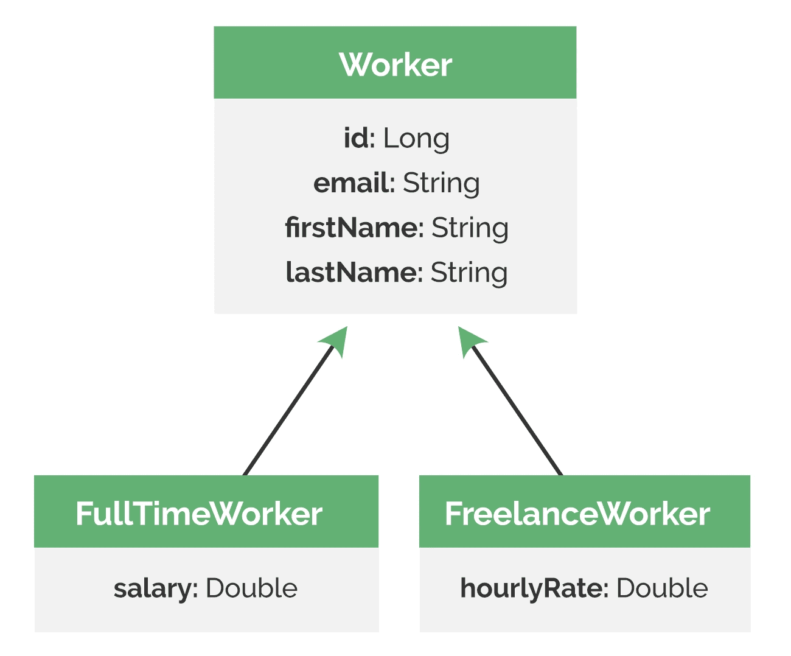
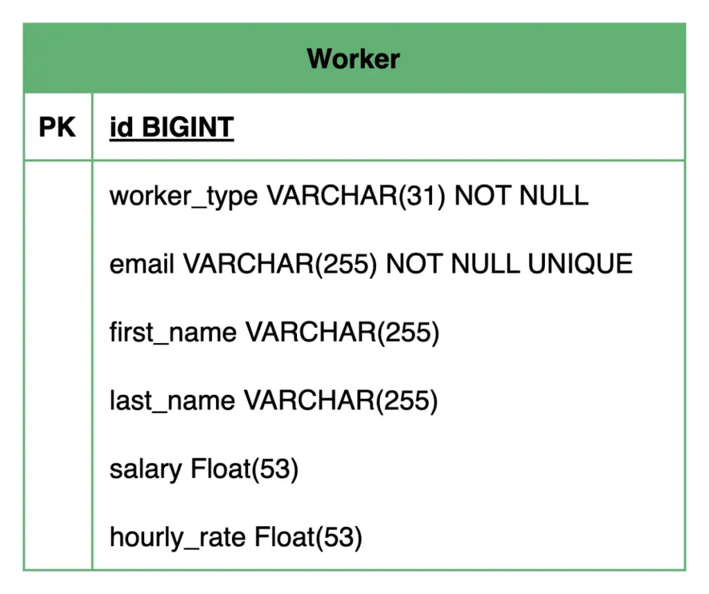

1. Overview
   Inheritance is a powerful feature of object-oriented design, but translating it to a relational database model requires careful consideration. JPA provides four strategies to map inheritance hierarchies present in our object model onto tables in our relational database.

In this lesson, we’ll get a brief overview of these different strategies and then take a detailed look at the first one.

The relevant module we need to import when starting this lesson is: inheritance-mapping-introduction-start.

If we want to reference the fully implemented lesson, we can import: inheritance-mapping-introduction-end.

2. Exploring the Inheritance Structure
   Inheritance is a fundamental concept in Object-Oriented Programming (OOP) where classes inherit properties and methods from a parent class. It allows us to create a hierarchy of classes and helps us model real-world relationships effectively.

Before we start exploring the different inheritance mapping strategies, let’s take a look at the inheritance structure of our domain entities that we’ll be working with throughout the lesson:

In our task management system, we have a base Worker entity representing the common attributes shared by all workers. We mark the Worker entity as an abstract class, as we don’t intend to create instances of this class directly. Instead, we have two concrete entity subclasses, FullTimeWorker and FreelanceWorker, extending the base Worker entity class.

The subclasses have a single specific attribute in addition to the inherited ones. The FullTimeWorker has a salary field, while the FreelanceWorker has an hourlyRate field. This hierarchy represents the different types of workers within our task management system.

Note: This adjustment to the standard project structure is already present in the start module for this lesson, enabling us to focus directly on the topic at hand.

3. JPA Inheritance Mapping Strategies
   Before we dive into the implementation, let’s briefly discuss the four inheritance strategies that JPA provides:

Single Table Strategy: With this strategy, we map the entire inheritance hierarchy to just one database table. This table includes columns for all the attributes of the base class and all of its subclasses. To identify which subclass a particular row belongs to, JPA uses a special discriminator column.
Table per Class Strategy: In this case, the abstract base class is not mapped to a database table. Instead, each concrete subclass in the inheritance hierarchy gets its own separate database table. Each of these tables contains all the attributes of that subclass, including the inherited fields.
Joined Table Strategy: Here, every class in the inheritance hierarchy, including the abstract base class, is mapped to its own database table. The table for the base class holds the common attributes, while each subclass table only contains the fields specific to it. These tables are linked together using the primary key and foreign key combinations.
Mapped Superclass Strategy: In this final strategy, the inheritance hierarchy only exists and is maintained in our Java code, but not in the database. Behind the scenes, Hibernate manages the translation and gives us an illusion that we’re working with regular Java classes with inheritance.
In this lesson, we’ll map our inheritance hierarchy to our relational database using the single table strategy. We’ll explore the remaining three strategies in detail in the upcoming advanced lesson.

4. Single Table Strategy
   As we’ve briefly discussed, in the single table strategy, JPA maps the entire inheritance hierarchy to a single database table. This table contains columns for all the fields declared in the base class and all its concrete subclasses.

To differentiate between the different subclasses stored in the same table, JPA uses a special column called a discriminator column. This column stores a predefined unique value for each subclass, allowing JPA to determine the correct entity type when retrieving data.

Let’s configure this strategy in our base abstract Worker entity:

@Entity
@Inheritance(strategy = InheritanceType.SINGLE_TABLE)
@DiscriminatorColumn(name = "worker_type")
public abstract class Worker {
// ...
}
Copy
Here, we annotate our base Worker entity with the @Inheritance annotation and set its strategy attribute to InheritanceType.SINGLE_TABLE. This instructs Hibernate to map the inheritance hierarchy to a single database table.

It’s worth noting that this strategy is the default inheritance strategy in JPA. If we use the @Inheritance annotation without specifying a strategy, Hibernate will automatically apply the single table strategy.

Additionally, we use the @DiscriminatorColumn annotation to define the name of the discriminator column as worker_type. If we don’t explicitly specify a discriminator column name, JPA defaults to using DTYPE as the column name. However, it’s generally recommended to provide a custom name that is more meaningful in the context of our domain model.

Next, we’ll specify the unique discriminator column value for each subclass using the @DiscriminatorValue annotation:

@Entity
@DiscriminatorValue("FULL_TIME")
public class FullTimeWorker extends Worker {
private double salary;
// ... standard getters and setters
}

@Entity
@DiscriminatorValue("FREELANCE")
public class FreelanceWorker extends Worker {
private double hourlyRate;
// ... standard getters and setters
}
Copy
In our FullTimeWorker and FreelanceWorker subclasses, we use the @DiscriminatorValue annotation to specify the discriminator value of FULL_TIME and FREELANCE, respectively. These values will be stored in the worker_type column to identify the specific subclass of each record. If we don’t specify a discriminator value explicitly, Hibernate uses the subclass name as the default value.

Remember that we’ve set the hibernate.hbm2ddl.auto configuration property to create-drop in our persistence.xml file, hence Hibernate automatically generates the database schema for us based on our entity mappings. Let’s see what the database schema looks like when using the single table strategy:

Here, we can see that a single Worker table is created with columns for all the common fields defined in the base Worker entity and the specific fields of its subclasses.

The worker_type column acts as the discriminator, storing the corresponding subclass discriminator value for each record. It’s set as NOT NULL, ensuring every row identifies its specific entity type.

The single table strategy provides a simple and straightforward way to map inheritance hierarchies. Querying performance is generally good since all the data resides in a single table. This strategy is particularly useful when the inheritance hierarchy is relatively small and stable, and the subclasses don’t have too many specific fields.

However, a significant drawback is that each row will only use a subset of the available columns, leaving the columns specific to other subclasses as NULL. This can lead to data integrity issues, as we cannot enforce constraints like NOT NULL on subclass-specific fields at the database level, even if they are logically required for that subclass.