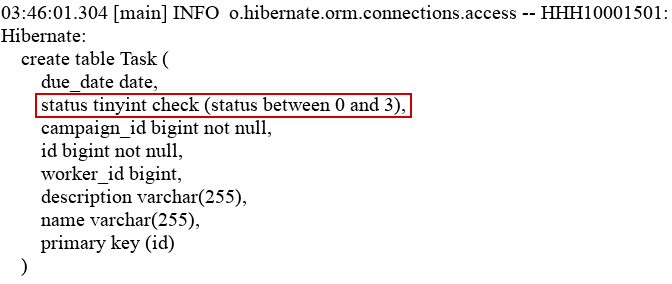
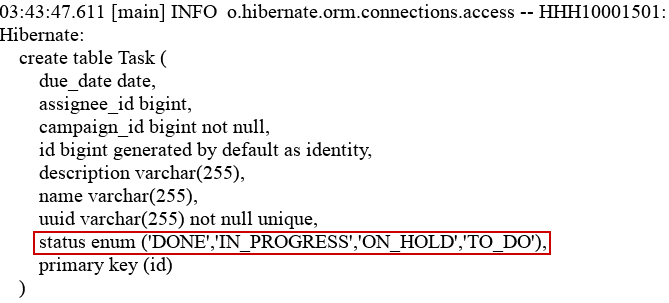
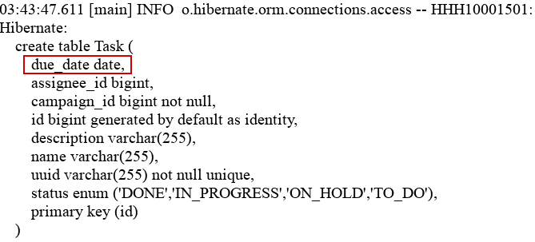
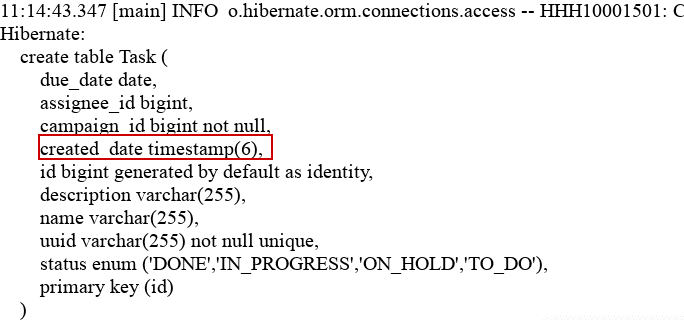
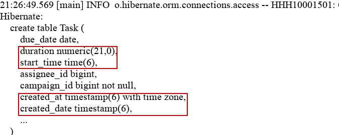

1. Overview
   In this lesson, we’ll explore how Hibernate and JPA handle enumerations and date or time types.

We’ll start by looking at enum mappings, exploring the default behavior, and seeing how we can customize it. Then, we’ll examine how date and time types are translated into database representations.

The relevant module we need to import when starting this lesson is mapping-enum-date-start.

To look at the fully implemented lesson as a reference, we can import mapping-enum-date-end.

2. Enum Mapping
   Enums, like TaskStatus below, represent constant sets of values:

public enum TaskStatus {
TO_DO, IN_PROGRESS, ON_HOLD, DONE;
}
Copy
JPA maps an enum constant to a database column either as an ordinal or as a string value. We can define this using the @Enumerated annotation.

2.1. Implicit Mapping
Let’s look at the TaskStatus enum usage in the Task:

@Column(name = "status")
private TaskStatus status;
Copy
In the code above, we define the status field without explicitly annotating how to map the TaskStatus enum type to the database. When we don’t specify the @Enumerated annotation, JPA defaults to @Enumerated(EnumType.ORDINAL).  This means that JPA will use the enum constant as an integer based on its index in the enum. Hence, the value will be persisted as 0, 1, 2, or 3.

To see this in action, let’s execute the main() method in  the mapping-enum-date-start module and check the console log for the Data Definition Language (DDL) output:

In the image above, Hibernate generates the Task table and maps the status to an SQL INTEGER type. The expected values are between 0 and 3.

This is the default behavior of how an enum is mapped to a database column.

Ordinal mapping can be more space-efficient since integers occupy less space than strings. However, this approach can cause issues if we reorder or remove constants, as the stored ordinal values may no longer match the updated enum.

2.2. Explicit Mapping
We could avoid issues related to reordering or removing constants by explicitly using the @Enumerated annotation. Let’s annotate the status field with the annotation:

@Column(name = "status")
@Enumerated(EnumType.STRING)
private TaskStatus status;
Copy
Here, we explicitly specify @Enumerated(EnumType.STRING), which instructs JPA to store the enum constant in the database rather than its ordinal value.

Next, let’s execute the updated code and check the console:

When using @Enumerated(EnumType.STRING), Hibernate maps the enum to a VARCHAR SQL type, storing the enum constant’s name. However, some databases, like MySQL and H2, support a native ENUM type, which stores a string with restricted allowed values.

Unlike the default behavior, changing the order of enum constants doesn’t cause issues. Using a string-based mapping is more robust because it remains unaffected by changes in the enum order.

3. Date and Time Mappings
   A typical relational database supports the following data types to store date and time:

DATE – stores the date only
TIME – stores time only
TIMESTAMP – stores both date and time
In our Task entity, we use the LocalDate to represent the due date:

@Column(name = "due_date")
private LocalDate dueDate;
Copy
Modern Hibernate versions automatically map Java date and time types to SQL and JDBC types without requiring annotations.

Even though we won’t be covering the legacy Date API usage in this course, it’s worth mentioning that if we’re using the java.util.Date or java.util.Calendar classes, JPA requires the @Temporal annotation to determine whether to store just the date, time, or both.

**Java Date/Time types** and their corresponding **SQL types** and **example stored values** 👇

| **Java Type**    | **SQL Type**            | **Example Stored Value**                  | **Description / Notes**                                                           |
| ---------------- | ----------------------- | ----------------------------------------- | --------------------------------------------------------------------------------- |
| `LocalDate`      | `DATE`                  | `2025-04-11`                              | Stores only a date (year, month, day) — no time or timezone.                      |
| `LocalTime`      | `TIME`                  | `14:30:00`                                | Stores only a time — no date or timezone.                                         |
| `LocalDateTime`  | `TIMESTAMP`             | `2025-04-11 14:30:00`                     | Stores both date and time, but no timezone information.                           |
| `Instant`        | `TIMESTAMP`             | `2025-04-22T10:39:46.471691446Z`          | Represents a point in time in UTC (always uses the "Z" timezone).                 |
| `Duration`       | `NUMERIC`               | `7200`                                    | Represents time duration in seconds (or milliseconds) — often stored as a number. |
| `ZonedDateTime`  | `TIMESTAMP` / `VARCHAR` | `2025-04-22T09:51:26+01:00[Africa/Lagos]` | Stores date, time, and time zone — may require string or custom mapping.          |
| `OffsetTime`     | `TIME`                  | `09:51:26+01:00`                          | Stores time with a timezone offset (but not the region name).                     |
| `OffsetDateTime` | `TIMESTAMP`             | `2025-04-11T09:51:26+01:00`               | Stores date, time, and offset from UTC — often used for precise timestamps.       |

### 💡 Key Takeaways:

* **`Local*` types** (`LocalDate`, `LocalTime`, `LocalDateTime`) are *timezone-agnostic*.
* **`Instant`**, **`Offset*`**, and **`ZonedDateTime`** types *include or depend on timezone or offset information*.
* Some SQL databases (like PostgreSQL) have specific types like `TIMESTAMP WITH TIME ZONE`, but others (like MySQL) store all timestamps as `TIMESTAMP` and leave timezone handling to the application layer.
* **`Duration`** isn’t directly supported by SQL — it’s usually stored as a numeric value (seconds, milliseconds, etc.).

* Importantly, not all databases support time zones by default. Therefore, we need to implement type conversion to store zone time properly.

3.2. Practical Examples
Let’s see this in action, observing how Hibernate maps the dueDate field when we run the main() method:

Here, Hibernate maps the LocalDate type to the SQL DATE type. Meaning only the date part is stored.

Furthermore, let’s add a new date field of LocalDateTime type named createdOn:

@Column(name = "created_date")
private LocalDateTime createdOn = LocalDateTime.now();
Copy
Next, let’s execute the main() method to see the schema generated by Hibernate:

Unlike the LocalDate type, Hibernate maps this to the TIMESTAMP type, meaning both the date and time will be stored.

Furthermore, let’s add more fields to the Task entity to see additional mappings in action:

@Column(name = "start_time")
private LocalTime startTime = LocalTime.now();

@Column(name = "duration")
private Duration duration = Duration.ofHours(2);

@Column(name = "created_at")
private Instant createdAt = Instant.now();
Copy
Here, we create three LocalTime, Duration, and Instant type fields. Next, let’s execute the main() method to see the generated DDL:

In the image above:

Hibernate maps startTime to a SQL TIME type, which stores only the time component.
Duration is mapped to a NUMERIC type, typically storing the duration in seconds.
createdAt, an Instant, is mapped to a TIMESTAMP type and stored in UTC, making it ideal for storing time-zone-agnostic timestamps.
The Instant type is particularly useful for applications serving users across multiple time zones. It represents an exact moment in time in UTC, which can later be converted to a user’s local time zone.

3.3. Handling Zone Time in Hibernate
Zone time includes either a UTC offset (e.g., +01:00) or a zone ID (e.g., Europe/Berlin). This can be essential for applications serving users across multiple time zones.

However, most relational databases don’t fully support zone time out of the box. Even when supported, databases often store only the offset, not the actual zone ID.

To properly store zone-aware timestamps, we can use the @TimeZoneStorage annotation. This gives us the flexibility to store the timestamp in one column and the time zone information in a separate column.

Depending on our requirements, we can also just store the instant as UTC TIMESTAMP, and then apply a timezone based on the context to get a ZonedDateTime.

Finally, we can also consider defining a custom converter, using the @Converter annotation to map ZonedDateTime to a string, which lets us store the full ISO-8601 representation, including the zone ID.