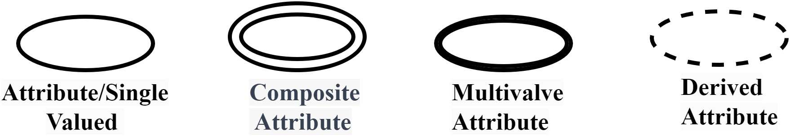
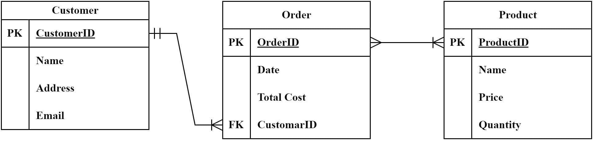

What Is an Entity Relationship Diagram?
Last updated: May 16, 2023

Written by:Rahmat Ullah Orakzai
Core ConceptsDatabases Definition Object-Oriented Programming

Learn through the super-clean Baeldung Pro experience:

>> Membership and Baeldung Pro.

No ads, dark-mode and 6 months free of IntelliJ Idea Ultimate to start with.

1. Introduction
   Entity-relationship diagram (ERD) is a significant tool utilized in data modeling, relational database design, and systems analysis for visually representing the relationships between entities within a system.

In this tutorial, we’ll look into the concept of an ERD, its components and types, and how to create an ERD.

2. Overview
   An Entity Relationship Diagram is a visual representation of different entities, their attributes, and relationships. ERDs are crucial in database design as they help identify and establish relationships among entities and serve as a blueprint for the database schema.

3. Components of an Entity Relationship Diagram
   Let’s take a look at the different components of an ERD.

3.1. Entities
In database design, we refer to an entity as a real-world object or concept that we can uniquely identify and represent within the database.

Suppose we have a sales database. In this case, entities within our database could include customers, products, and orders.

We define a strong entity as one that can be uniquely identified by its own attributes, while a weak entity cannot. A strong entity is represented by a rectangle, whereas a weak entity is represented by a double rectangle:

3.2. Attributes
An attribute is a characteristic or property of an entity that helps to define it.

Examples of attributes include customer name, product price, order date, and employee salary in a sales database. This is often shown as an oval or circle.

Let’s have a look at the different types of attributes:

Now, let’s discuss these:

Simple Attributes: A simple attribute that cannot be divided into subparts. For example, a person’s age or name can be considered a simple attribute
Composite Attributes: We define a composite attribute as an attribute that we can divide into subparts. For example, we can divide a person’s address into street, city, state, and zip code
Single-Valued Attributes: An attribute with only one value at a time. For example, a person’s gender or birth date can be considered a single-valued attribute
Multi-Valued Attributes: An attribute that can have multiple values simultaneously. For example, we can consider a person’s hobbies or phone numbers as a multi-value attribute
Derived Attributes: A derived attribute is an attribute that we can derive or calculate from other attributes. For example, we can calculate a person’s age from their birth date
3.3. Relationships
A relationship is a connection or association between two or more entities in a database. Types of relationships include one-to-one, one-to-many, many-to-one, and many-to-many relationships.

Examples of relationships include a customer placing many orders, an employee managing many products, and a product belonging to many categories in a sales database.

We represent relationships between entities using diamonds in ER diagrams, as shown below:

4. Types of Entity Relationship Diagrams
   Now that we know about the components of an ERD let’s explore its different types.

4.1. Conceptual ERD
A conceptual ERD is a high-level diagram that describes the overall structure of the database and the relationships among entities without including details of attributes. Conceptual ERDs are helpful for initial database design and for communicating with stakeholders who may not have technical knowledge.

An example of a conceptual ERD is a diagram that shows the relationship between customers, orders, and products in a sales database.

4.2. Logical ERD
A logical ERD is a diagram that includes the details of entities, their attributes, and the relationships among them. Logical ERDs are useful for refining the database design and communicating with technical stakeholders needing more detailed information.

An example of a logical ERD is a diagram showing customer attributes, orders, and products in a sales database.

4.3. Physical ERD
A physical ERD is a diagram that includes the implementation details of the database, such as table names, primary keys, foreign keys, and data types. Physical ERDs are useful for database implementation and communicating with administrators and developers.

5. Creating an ERD
   There are different steps involved in creating an ERD. Some of the common steps are:

Identify the entities: In the first step, we determine the main entities in the database and their relationships
Add attributes: In this step, we’ll add attributes to entities to provide more details and specificity
Define primary keys: In this step, we define a primary key for each entity to ensure uniqueness and data integrity
Define the relationships: In the second step, we define the relationships between entities using appropriate symbols
Now let’s look into an example of an ERD for a sales database:

We’ve first identified and included three entities: Customers, Orders, and Products. 

In the second step, we’ve added different attributes. For instance, the Customer entity has attributes such as customer ID, name, address, and email. 

In the third step, we’ve defined the primary and foreign keys. For example, the Order entity has an orderID as the primary key and a customerID as a foreign key.

Last but not least, we’ve defined the relationship. There is a one-to-many relationship between Customers and Orders, as each customer can have multiple orders, but each order can only belong to one customer. There is a many-to-many relationship between Orders and Products, as each order can contain multiple products, and each product can be included in multiple orders.

It is important that some ERDs need to be normalized to eliminate data redundancy and improve data consistency.

5.1. Best Practices for Creating an ERD
Now that we know how to create an ERD let’s look into some best practices for creating an ERD.

Keep it simple: Use simple language and symbols to create a concise and understandable diagram.
 Use appropriate naming conventions: Use appropriate and consistent naming conventions for entities and attributes to improve clarity and consistency.
Avoid data redundancy: Ensure the diagram follows normalization rules to eliminate redundancy and improve data consistency.
 Review and refine: Review and refine the diagram to ensure that it accurately represents the database design.
5.2. Tools for Creating an ERD
There are different tools available that we could use to create an ERD. Some of these tools are online, such as Lucidchart, Gliffy, and Draw.io.

We could also use desktop-based tools such as Microsoft Visio, MySQL Workbench, and erwin.

6. Conclusion
   In this tutorial, we learned about ERD, the components of an ERD, which include entities, attributes, and relationships, and the types of ERDs, which include conceptual, logical, and physical ERDs.

Creating an ERD requires careful planning, clear language and symbols, appropriate naming conventions, and adherence to normalization rules. A well-designed ERD can provide an accurate representation of the database schema and facilitate communication between stakeholders.