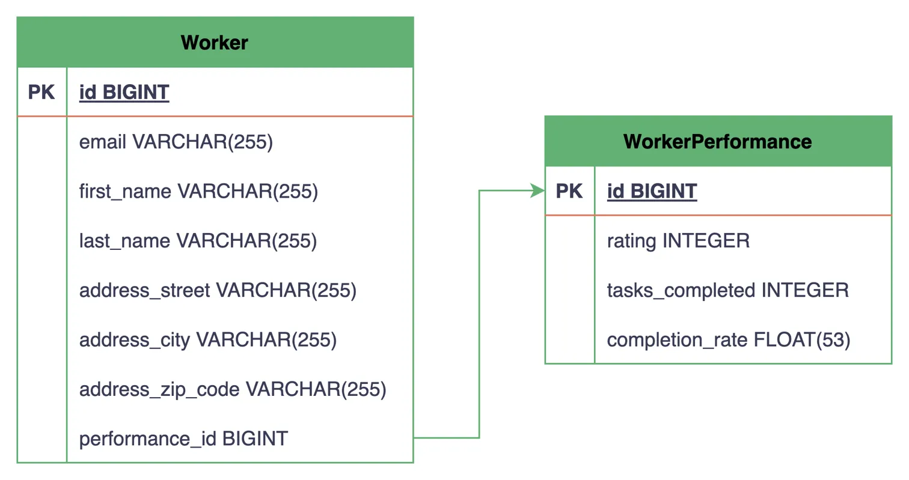
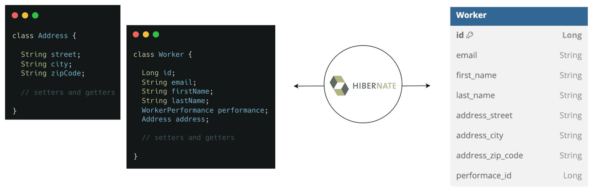
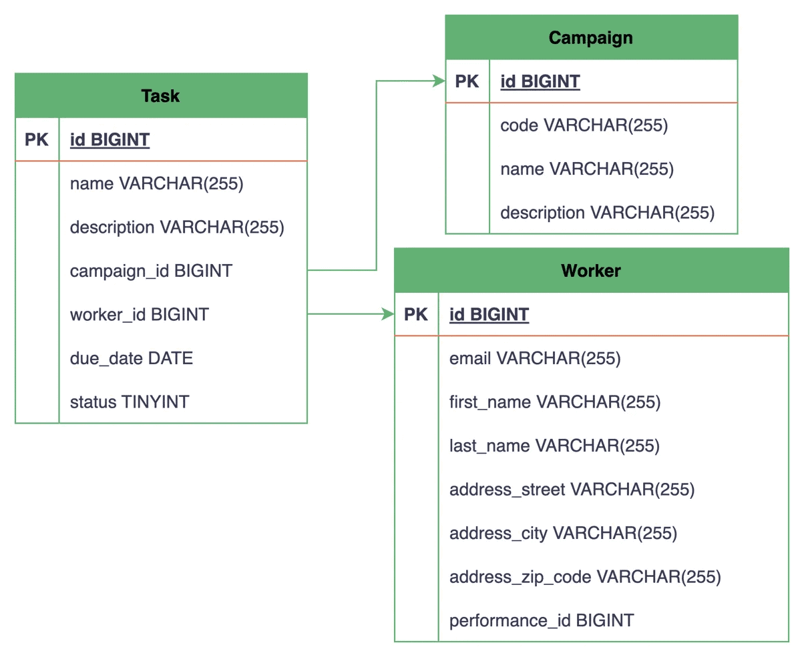
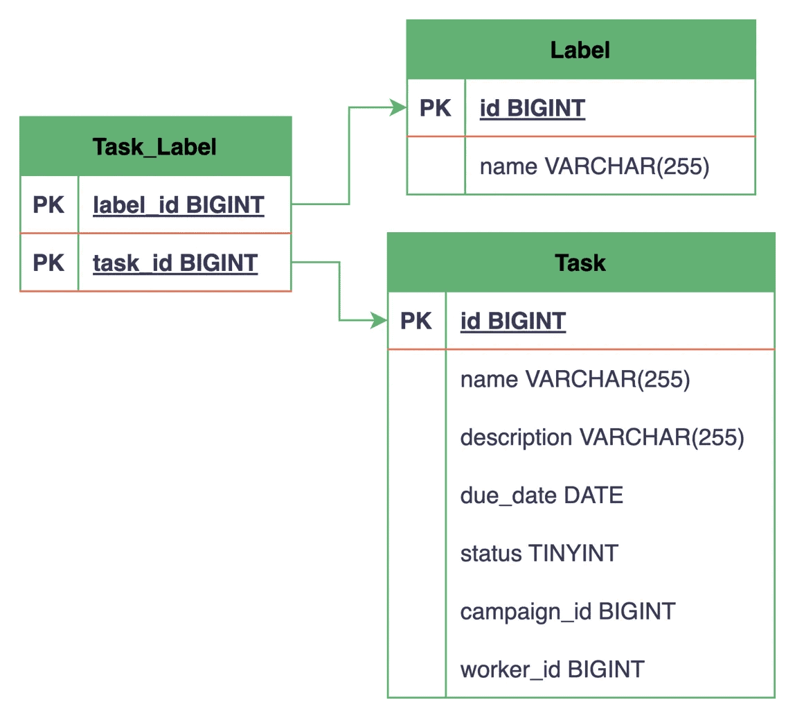

1. Overview
   In this lesson, we’ll explore how JPA defines entity relationships and how we can apply them in our solution.

One quick heads-up: Besides the standard core domain entities, we’ve added several new entity classes to our project specifically for this lesson to explore the different relationships. We’ll introduce them throughout the different sections as we need them, but it can still be useful to have a quick glance at them in the start module before starting with the lesson.

The relevant module we need to import when starting this lesson is: mapping-relationships-start.

If we want to reference the fully implemented lesson, we can import: mapping-relationships-end.

2. One-to-One Mapping
   A one-to-one relationship represents an association between two entities where each entity instance references exactly one instance of the other entity.

For our demonstration, we’ll establish a one-to-one relationship between our Worker and WorkerPerformance entities.

The Worker entity represents a user in our task management system, and the WorkerPerformance entity has fields to track each worker’s performance metrics like rating, number of tasks completed, and completion rate.

We could’ve added all the performance metric fields directly to our Worker entity. However, by mapping a one-to-one relationship with the WorkerPerformance entity, we separate core worker information from performance metrics while maintaining a clear association between them.

2.1. Mapping the Relationship
Now, to map this one-to-one relationship, we’ll add a reference to the WorkerPerformance entity in our Worker class:

@OneToOne
@JoinColumn(name = "performance_id", referencedColumnName = "id")
private WorkerPerformance performance;
Copy
Here, we add a new performance field and annotate it with the @OneToOne annotation. Additionally, we use the @JoinColumn annotation to specify the foreign key column performance_id in the Worker table that references the primary key column id of the WorkerPerformance table.

It’s worth noting that the @JoinColumn annotation is optional in this case. By default, to determine the foreign key column name, Hibernate uses the default naming strategy, where it concatenates the referencing field name and the name of the referenced entity’s field that is annotated with the @Id annotation, separated by an underscore. If we omit this annotation in the above code snippet, the column name would still be resolved as performance_id.

Similar to other fields in the Worker class, we can define getter and setter methods for our new performance field to allow access to this relationship.

Finally, let’s see how our two tables are represented in the database:

From the above entity-relationship diagram (ERD), we can see that the Worker table now includes a performance_id column that references the id column, i.e., the primary key of the WorkerPerformance table.

It’s important to note that Hibernate automatically creates the database tables and maps the foreign key since, for our demonstration, we’ve set the hibernate.hbm2ddl.auto configuration property to create-drop in our persistence.xml file.

2.2. Creating Reusable Components With @Embeddable
The one-to-one relationship works well for this case. However, there are cases where we might want to group related entity attributes together and create a reusable component at the Java level instead of creating a separate database table.

These grouped attributes are conceptually coupled to the parent entity model (we won’t be required to access them independently), and they don’t need their own identity or lifecycle.

For instance, our Worker entity contains several address-related fields, namely addressStreet, addressCity, and addressZipCode. Let’s create a reusable Address component out of these fields:

@Embeddable
class Address {
private String street;
private String city;
private String zipCode;

    // standard setters and getters
}
Copy
Here, we create a new Address class and annotate it with the @Embeddable annotation. Note that we’ve removed the address prefix from the field names in our Address component compared to the original fields in the Worker entity.

Next, we’ll remove the three separate address-related fields from our Worker entity and embed our Address component instead:

@Embedded
@AttributeOverrides({
@AttributeOverride(name = "street", column = @Column(name = "address_street")),
@AttributeOverride(name = "city", column = @Column(name = "address_city")),
@AttributeOverride(name = "zipCode", column = @Column(name = "address_zip_code"))
})
private Address address;
Copy
We add a reference field to our Address component and annotate it with the @Embedded annotation, which tells Hibernate that the fields present in the Address component are to be stored as part of the Worker entity.

Additionally, we define an array of @AttributeOverride annotations inside the @AttributeOverrides annotation to map the embedded fields to the corresponding column names in the Worker table. However, if the field names naturally match with the table column names, we can omit both of these annotations.

With this modification, let’s compare how the Worker class is represented in our Java code versus the database:

As we can see, a new separate table hasn’t been created for our Address component inside the database. Instead, its attributes are stored as columns in the Worker table itself. This makes Address a reusable component that we can embed inside other entities as well.

This approach is generally used when multiple entities in our project share the same fields, such as auditing-related fields like createdAt, updatedAt, createdBy, etc. It allows us to define these common attributes once and reuse them across our Java domain models.

3. Unidirectional vs. Bidirectional Associations
   Before we look at other relationship types, let’s understand the difference between unidirectional and bidirectional associations.

In a unidirectional association, only one entity has a reference to the other, allowing navigation in only one direction. So far, we’ve established a unidirectional one-to-one association, where the Worker entity has a reference to the WorkerPerformance entity but not the other way around.

Let’s make this association bidirectional by adding a reference to the Worker entity in the WorkerPerformance entity:

@OneToOne(mappedBy = "performance")
private Worker worker;
Copy
Here, we again use the @OneToOne annotation, but this time with the mappedBy attribute. We set its value to performance, which refers to the field name on the other side of the association, i.e., our Worker class.

The mappedBy attribute is crucial here, as it indicates that the foreign key is maintained in the Worker table.

Now that we’ve established a bidirectional association, we can navigate the relationship from either side:

Worker worker = DefaultWorkerRepository.findById(workerId);
WorkerPerformance performance = worker.getPerformance();
Copy
WorkerPerformance performance = DefaultWorkerPerformanceRepository.findById(performanceId);
Worker worker = performance.getWorker();
Copy
As demonstrated above, starting with either entity, we can navigate to its associated entity using the corresponding getter methods.

Hibernate recommends using bidirectional associations as they simplify querying and navigation between entities, and we’ll be defining them for all further relationships in this lesson.

However, we should always consider the specific needs of our application when deciding between unidirectional and bidirectional mappings. For instance, if our application requires the association to be navigable from only one side, a unidirectional association may be more appropriate.

Additionally, when using bidirectional associations, we need to be careful about maintaining consistency by keeping both sides of the relationship synchronized. Whenever we modify one side of the relationship, we need to ensure that the other side of the in-memory data is updated accordingly to prevent working with inconsistent data.

4. One-to-Many and Many-to-One Mappings
   One-to-many and many-to-one relationships are among the most common in relational databases. As the names suggest, one entity instance can be associated with multiple instances of another entity, while each of those instances is associated with only one instance of the first entity.

In our task management system, we have two scenarios where we can map a one-to-many/many-to-one relationship:

A Campaign consists of multiple tasks, but each Task belongs to a single Campaign.
A Worker can be assigned multiple tasks, but each Task is worked on by a single Worker at a time.
Let’s first map the many-to-one relationships in our Task entity, whose corresponding database table will contain the foreign key columns:

@ManyToOne(optional = false)
@JoinColumn(name = "campaign_id")
private Campaign campaign;

@ManyToOne
@JoinColumn(name = "worker_id")
private Worker assignee;
Copy
Here, we add campaign and assignee fields to our Task entity and annotate them with the @ManyToOne annotation to indicate that multiple tasks can be associated with a single Campaign and Worker, respectively.

Additionally, we use the @JoinColumn annotation to specify the foreign key column names that reference the primary keys of both the associated tables.

It’s also important to note that we set the optional attribute to false on the campaign field to ensure that every created Task must be associated with a Campaign, while the Worker is optional and can be assigned at a later stage. Currently, we’re working with in-memory repository implementations; however, when we switch to Hibernate in the upcoming lessons, we’ll encounter an exception if we try to save a Task entity with no Campaign attached.

Now, let’s map the inverse one-to-many relationships in our Campaign and Worker entities:

@Entity
class Campaign {
// ... existing fields

    @OneToMany(mappedBy = "campaign")
    private Set<Task> tasks = new HashSet<>();
    
    // setters and getters
}

@Entity
class Worker {
// ... existing fields

    @OneToMany(mappedBy = "assignee")
    private Set<Task> assignedTasks = new HashSet<>();

    // setters and getters
}
Copy
We create the tasks and assignedTasks fields in our Campaign and Worker entities, respectively. Then, we annotate both fields with the @OneToMany annotation and set the mappedBy attribute to the corresponding field names in the Task entity.

Finally, let’s see how these relationships are represented in the database:

The ERD shows the Task table having two new foreign key columns, campaign_id and worker_id, referencing the primary keys of the Campaign and Worker tables, respectively.

This setup allows us to create multiple tasks for a single campaign and assign different workers to them.

5. Many-to-Many Mappings
   A many-to-many relationship occurs when each instance of one entity can be associated with multiple instances of another entity and vice versa.

In relational databases, such relationships are implemented by introducing a third join table, also known as an associative table or junction table. This join table contains foreign keys referencing both the related tables​since neither table can have multiple foreign key references directly to the other.

We’ll explore two data modeling approaches when using the many-to-many relationship in JPA.

5.1. Mapping Using @JoinTable
In the first approach, we don’t explicitly create an entity class for our join table. Instead, we use the @JoinTable annotation to reference it.

Let’s see how to use this annotation by establishing a many-to-many relationship between our Task and Label entities. In our task management system, a Task can have multiple labels, such as urgent, bug, feature, etc., and each Label can be applied to multiple tasks. This setup allows us to categorize and filter the created tasks based on their labels.

First, let’s establish this relationship in our Task entity:

@ManyToMany
@JoinTable(
name = "Task_Label",
joinColumns = @JoinColumn(name = "task_id"),
inverseJoinColumns = @JoinColumn(name = "label_id")
)
private Set<Label> labels = new HashSet<>();
Copy
We define a new labels field that represents the collection of associated Label entities and annotate it with the @ManyToMany annotation.

Additionally, we use the name attribute of the @JoinTable annotation to specify the join table Task_Label. This table will be used to store the associations between the Task and Label entities.

Next, we use the joinColumns attribute to specify the foreign key column task_id that references the primary key of the Task table, while the inverseJoinColumns attribute specifies the foreign key column label_id that references the primary key of the Label table.

Now, to make this association bidirectional, we’ll add a tasks field to our Label entity:

@ManyToMany(mappedBy = "labels")
private Set<Task> tasks = new HashSet<>();
Copy
Similar to other bidirectional associations, we use the mappedBy attribute to specify the field name in the associating entity of the relationship.

Finally, let’s visualize how this relationship looks in our database:

Here, a separate Task_Label table gets created with two foreign key columns, task_id and label_id, that reference the primary key of the Task and Label tables, respectively. Neither the Task table nor the Label table has a direct reference to the other, and all associations are maintained through this new join table.

Together, both of the foreign key columns form the composite primary key of the join table, ensuring the uniqueness of each Task–Label pair. We’ll learn more about composite primary keys in the upcoming lessons.

5.2. Mapping by Declaring a New Entity
The @JoinTable annotation approach works well for basic many-to-many relationships where we don’t want to store any additional attributes in the join table. However, as our application evolves, we might discover that relationships themselves need to carry additional data.

To further explore this scenario, we’ll make use of our Worker and Skill entities. Let’s assume we want to track the various skills that our workers possess to help us with the task assignment process. Additionally, we want to store the level of proficiency the worker has in that particular skill and whether they hold any certification in it.

Now, to model the many-to-many relationship between the Worker and Skill entities, let’s create a new WorkerSkill entity class:

@Entity
class WorkerSkill {
@Id
private Long id;

    @ManyToOne
    @JoinColumn(name = "worker_id")
    private Worker worker;

    @ManyToOne
    @JoinColumn(name = "skill_id")
    private Skill skill;

    @Column(name = "proficiency_level")
    private Integer proficiencyLevel;

    @Column(name = "is_certified")
    private boolean isCertified;

    // standard setters and getters
}
Copy
In our WorkerSkill entity, we define its own primary key and establish many-to-one relationships with both the Worker and Skill entities. Additionally, we define specific attributes related to the relationship, like proficiencyLevel and isCertified.

Since we’ve created a new entity class, let’s also register it in our persistence.xml file:

<class>com.baeldung.lhj.persistence.model.WorkerSkill</class>
Copy
Next, let’s also update our Worker and Skill entities to reflect their relationship with this new association entity:

@Entity
class Worker {
// ... existing fields

    @OneToMany(mappedBy = "worker")
    private Set<WorkerSkill> workerSkills = new HashSet<>();

    // setters and getters
}

@Entity
class Skill {
// ... existing fields

    @OneToMany(mappedBy = "skill")
    private Set<WorkerSkill> workerSkills = new HashSet<>();

    // setters and getters
}
Copy
In both of our entity classes, we add a workerSkills collection, each annotated with the @OneToMany annotation and its mappedBy attribute pointing to its corresponding field in the WorkerSkill entity.

It’s important to note that through this approach, we effectively break a direct many-to-many mapping into two one-to-many mappings with a third entity in between.

Again, let’s end by looking at how the tables and their relationships are represented in the database:

Now, instead of a simple join table that only stores the association between two entities, we have a WorkerSkill table that also includes additional data in the proficiency_level and is_certified columns.

Similar to our other entities, we can create a repository implementation class for our WorkerSkill entity to enable us to query records either based on the workerId or skillId:

interface WorkerSkillRepository {
Set<WorkerSkill> findByWorkerId(Long workerId);

    Set<WorkerSkill> findBySkillId(Long skillId);

    WorkerSkill save(WorkerSkill workerSkill);
}
Copy
For most production use cases where we’re building an extensible system, we recommend using this dedicated entity approach for mapping many-to-many relationships. This approach provides more flexibility and can simplify future extensions to our data model, even if the current requirements don’t explicitly call for any additional attributes.

6. Running Our Application
   Now that we’ve established various types of relationships between our domain entities, let’s execute the main() method of our mapping-relationships-end module to verify that all our mappings are working correctly.

Our main() method does the important task of initializing our EntityManagerFactory:

public static void main(String... args) {
EntityManagerFactory emf = null;
try {
Logger logger = LoggerFactory.getLogger(LhjApp.class);
logger.info("Running Learn Hibernate and JPA App");

        emf = Persistence.createEntityManagerFactory("LHJ");
    } finally {
        if (emf != null && emf.isOpen()) {
            emf.close();
        }
    }
}
Copy
We can run the main() method directly from our IDE, or we can open a terminal, navigate to the mapping-relationships-end directory, and execute the following command:

mvn clean package exec:java -Dexec.mainClass=com.baeldung.lhj.LhjApp
Copy
Upon running the main() method, Hibernate attempts to create the EntityManagerFactory based on our persistence configuration. Additionally, this validates our entity mappings, as any issues with the relationship definitions cause errors during this initialization process.

Since we’ve set the hibernate.show_sql property to true in our persistence.xml file, we can observe the generated logs to see the SQL statements that Hibernate generates to create our database tables and establish the relationships between them.