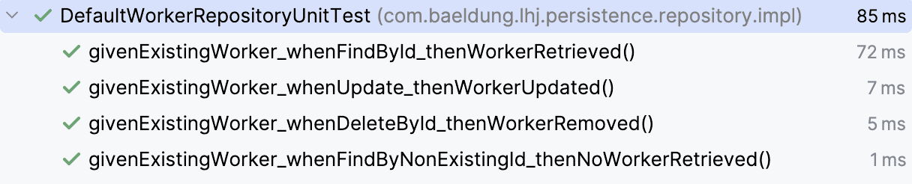

1. Overview
   In this lesson, we’ll explore how to perform basic CRUD (Create, Read, Update, and Delete) operations on our entities using JPA and Hibernate.

These operations are essential and commonly used in most database-driven applications.

The relevant module we need to import when starting this lesson is: basic-crud-operations-start.

If we want to reference the fully implemented lesson, we can import: basic-crud-operations-end.

2. Exploring Basic CRUD Operations
   Throughout the lesson, we’ll use the Worker entity in our task management system to implement these CRUD operations. Let’s start by looking at our WorkerRepository interface, which defines the CRUD methods we’ll be implementing throughout the lesson:

public interface WorkerRepository {
Worker save(Worker worker);

    Optional<Worker> findById(Long id);

    void update(Long id, Worker worker);

    void deleteById(Long id);
}
Copy
Note: This differs slightly from the standard solution we have for the rest of the course. We’ve included these four methods in all the repositories to cover all the relevant operations, but left the findAll method out of the scope of this lesson because it requires more advanced querying mechanisms.

Our DefaultWorkerRepository implementation class currently contains in-memory programmatic-based implementations for these methods, using a Java Collection as the data source. Throughout this lesson, we’ll replace it with a JPA-based implementation that actually persists the records in the configured database.

It’s important to note that we won’t modify the method signatures in the interface or the written unit test cases for the repository. Once we replace the in-memory implementation with the JPA-based one, the existing unit tests should continue to pass, ensuring that our new implementation behaves as expected.

While we’re focusing on basic CRUD methods in this lesson, we’ll explore how to implement more advanced querying and update operations using JPA and Hibernate in upcoming lessons.

3. Providing EntityManager to Our Repositories
   Our repository implementation needs access to an EntityManager instance to perform database operations using JPA.

Let’s create the JpaUtil class that provides this instance:

public class JpaUtil {
private static final EntityManagerFactory emf;

    static {
        emf = Persistence.createEntityManagerFactory("LHJ");
    }

    public static EntityManager getEntityManager() {
        return emf.createEntityManager();
    }

    public static void closeEntityManagerFactory() {
        if (emf != null && emf.isOpen()) {
            emf.close();
        }
    }
}
Copy
We first create a static EntityManagerFactory instance by referencing the LHJ persistence unit defined in our persistence.xml file.

Next, we define the getEntityManager() method that creates and returns a new EntityManager instance using the EntityManagerFactory. We’ll use the retrieved EntityManager instance to perform database operations using the overridden CRUD methods.

Finally, we’ve added a closeEntityManagerFactory() method, which we’ll call before the end of the application. It’s important to close the resources we’ve opened to avoid potential memory leaks.

4. Creating a Worker Record
   Let’s start by converting the save() method to use JPA for persisting new Worker entities in the database:

@Override
public Worker save(Worker worker) {
try (EntityManager entityManager = JpaUtil.getEntityManager()) {
entityManager.getTransaction().begin();
entityManager.persist(worker);
entityManager.getTransaction().commit();
return worker;
}
}
Copy
Here, we first retrieve an EntityManager instance using the getEntityManager() method from our BaseRepository class. To persist the Worker entity to the database, we pass our worker object to the persist() method.

Similar to the EntityManagerFactory, we need to close the EntityManager object. This is why we’ve enclosed the code in a try-with-resources block.

Note that we need to invoke the persist() method within a transaction. First, we use the EntityManager instance to start a new transaction using the begin() method on the EntityTransaction object returned by the getTransaction() method. Then, after persisting the entity, we commit the transaction using the commit() method.

We’ll learn more about transactions and their management in depth in a dedicated lesson later. For now, it’s enough to know that using transactions is essential whenever we’re modifying the state of the database, such as creating a new entity or updating an existing one.

5. Fetching a Worker Record
   Next, let’s look at how we can retrieve the persisted Worker records from the database by updating the corresponding method in the repository implementation:

@Override
public Optional<Worker> findById(Long id) {
try (EntityManager entityManager = JpaUtil.getEntityManager()) {
Worker retrievedWorker = entityManager.find(Worker.class, id);
return Optional.ofNullable(retrievedWorker);
}
}
Copy
Similar to our save() method, we start by retrieving an EntityManager instance. Then, we use its find() method to retrieve the Worker record with the specified id from the database.

The find() method takes the entity class we’re retrieving and the primary key value as parameters and returns the corresponding entity instance. If no database record exists against the provided id, it returns null. We wrap this result in an Optional object and return it to comply with the findById method definition.

Note that we didn’t need to start a transaction here, since we’re performing a single read operation and not modifying the state of the database.

6. Updating a Worker Record
   There are often scenarios where we need to update an existing database record. Let’s look at how we can modify persisted Worker entities using JPA:

@Override
public void update(Long id, Worker worker) {
try (EntityManager entityManager = JpaUtil.getEntityManager()) {
entityManager.getTransaction().begin();

        Worker retrievedWorker = entityManager.find(Worker.class, id);
        retrievedWorker.setFirstName(worker.getFirstName());
        retrievedWorker.setLastName(worker.getLastName());

        entityManager.getTransaction().commit();
    }
}
Copy
We start by retrieving the existing Worker entity using the find() method we’ve previously looked at.

Next, we modify the fields that support updating: firstName and lastName, using the corresponding setter methods. Naturally, the exact update logic may vary based on specific business rules or requirements.

Finally, we commit the started transaction, after which JPA automatically detects the changes made to the Worker instance and synchronizes them with the database. We don’t have to call any update or persist method explicitly for this case. Again, we’ll learn more about this behavior later in a more advanced lesson.

7. Deleting a Worker Record
   Finally, let’s use JPA to remove Worker records from the database:

@Override
public void deleteById(Long id) {
try (EntityManager entityManager = JpaUtil.getEntityManager()) {
entityManager.getTransaction().begin();

        Worker retrievedWorker = entityManager.find(Worker.class, id);
        entityManager.remove(retrievedWorker);

        entityManager.getTransaction().commit();
    }
}
Copy
Similar to the update() method, we first retrieve the Worker entity we want to delete using the find() method.

Then, we pass the retrievedWorker object to the remove() method, which marks the entity for deletion from the database. The actual deletion occurs when we commit the transaction.

8. Validating Our Implementation
   Now that we’ve replaced the in-memory implementation of our WorkerRepository with a JPA implementation, let’s verify that it works as expected and analyze the generated SQL statements in the logs to better understand how Hibernate translates our CRUD operations into database queries under the hood.

8.1. The main() Method Generated SQL Statements
We can invoke the WorkerRepository CRUD methods that we included in the main() method of our LhjApp class:

public static void main(final String... args) {
try {
Logger logger = LoggerFactory.getLogger(LhjApp.class);
logger.info("Running Learn Hibernate and JPA App");

        WorkerRepository workerRepository = new DefaultWorkerRepository();
        Worker worker = new Worker("john.doe@baeldung.com", "John", "Doe");
        workerRepository.save(worker);
        logger.info("Saved worker with id: {}", worker.getId());

        Worker retrievedWorker = workerRepository.findById(worker.getId())
          .orElseThrow(IllegalArgumentException::new);
        logger.info("Retrieved worker: {}", retrievedWorker);

        // ... other CRUD method calls
    } finally {
        JpaUtil.closeEntityManagerFactory();
    }
}
Copy
Remember that we’ve enabled SQL logging in our persistence.xml file, so Hibernate will automatically log the generated SQL statements.

We can run the main() method directly from our IDE, or we can open a terminal, navigate to the project’s root directory, and execute the following command:

mvn clean package exec:java -Dexec.mainClass=com.baeldung.lhj.LhjApp
Copy
Upon running the main() method, we’ll see output similar to the following:

Hibernate:
insert
into
Worker
(email, first_name, last_name, id)
values
(?, ?, ?, default)
INFO com.baeldung.lhj.LhjApp -- Saved worker with id: 1
Hibernate:
select
w1_0.id,
w1_0.email,
w1_0.first_name,
w1_0.last_name
from
Worker w1_0
where
w1_0.id=?
INFO com.baeldung.lhj.LhjApp -- Retrieved worker: Worker [id=1, email=john.doe@baeldung.com, firstName=John, lastName=Doe]
Copy
Without going into details, the logged SQL statements demonstrate how Hibernate automatically translates our JPA CRUD operations into their corresponding database queries. The generated INSERT and SELECT statements confirm that our JPA implementation interacts with the database as expected. In a more advanced lesson, we’ll see that Hibernate dynamically replaces the “?” placeholders with the actual parameter values when executing the SQL query at runtime.

At the end of the main method, we’re also making sure to close the EntityManagerFactory in the finally block.

8.2. Testing Our CRUD Methods
Now, let’s run our existing unit test cases to verify that our JPA implementation works as expected.

To run the test cases from the command line, we can navigate to the root directory and execute the following command:

mvn test -Dtest=DefaultWorkerRepositoryUnitTest
Copy
Here, we use the -Dtest parameter to only execute the test cases defined in the DefaultWorkerRepositoryUnitTest class.

Alternatively, to run the test cases from our IDE, we can right-click on our test class and select the option to run tests:

The passing test cases confirm that our JPA repository implementation is working as expected.

Note that although we’ve only focused on the Worker entity throughout this lesson, we’ve updated the repository implementations for the rest of the entities in the End module for reference.

We encourage exploring the whole solution, including the rest of the WorkerRepository interactions in the LhjApp class, to see how Hibernate translates our other CRUD method calls to their corresponding SQL statements.