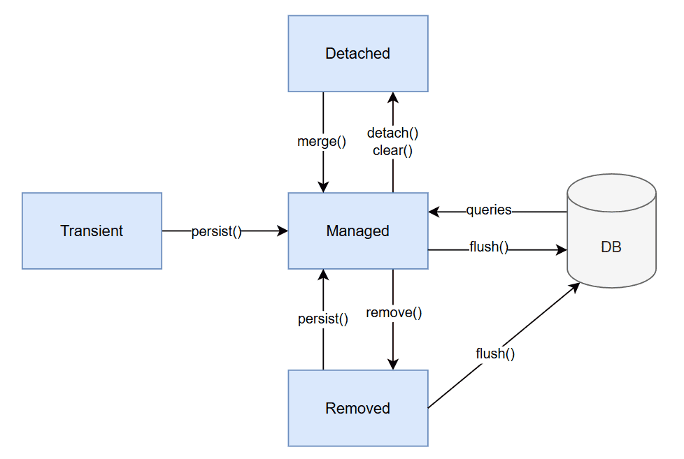

1. Overview
   In this lesson, we’ll explore the JPA entity lifecycle, the sequence of state changes an entity undergoes from its creation as a plain Java object to its final storage in or deletion from the database.

For our code examples, we’ll use a Worker entity named John Doe. We’ll walk through each stage of the lifecycle, starting with a new, unmanaged instance. Then, we’ll promote John to the managed state. Later, we’ll detach him from the persistence context, and finally, we’ll remove him both from the context and the database entirely.

The relevant module we need to import when starting this lesson is: entity-lifecycle-start.

If we want to reference the fully implemented lesson, we can import: entity-lifecycle-end.

2. Entity States and Transitions
   In JPA, entity instances are not just plain Java objects. They participate in a lifecycle managed by the persistence context, which is typically tied to the current EntityManager.

The persistence context is the part of JPA that keeps track of all the entities currently managed by the EntityManager. When an entity is in the “managed” state, it’s stored in this context. Any changes we make to that entity are automatically tracked, and JPA will update the database when the transaction is committed (or the context is flushed).

JPA defines four entity states:

Transient (New): The entity instance has just been instantiated using the new operator. It hasn’t been persisted yet, and it isn’t tracked by the persistence context.
Managed (Persistent): The entity is currently tracked by the persistence context. Changes to its state are automatically detected and synchronized with the database, usually when the transaction commits.
Detached: The entity was previously managed but is no longer associated with an active persistence context, for example, after a transaction ends.
Removed: The entity is marked for deletion in the persistence context. The actual deletion happens when the context is flushed or the transaction is committed.
This lifecycle determines how entities are tracked, how changes are detected, and how database operations like inserts, updates, or deletes are handled:

Keep in mind that entity lifecycle states are always relative to the current persistence context – typically bound to a specific EntityManager. While most frameworks handle this transparently, issues can still arise if we access or modify entities at different, separated stages in the application.

In the following sections, we’ll explore each of the state transitions from the diagram. For writing the code samples, we’ll use the com.baeldung.lhj.persistence.util.JpaUtil class present in the project.

3. The Transient State
   Let’s assume we are hiring a new worker, John Doe. We’ll first need a new Worker instance:

Worker john = new Worker("john.doe1@gmail.com", "John", "Doe");
Copy
Even though the Worker class is annotated with @Entity, this Java object is newly created, so it’ll have the “transient” state. In other words, this entity hasn’t yet been associated with the persistence context managed by the EntityManager.

EntityManager‘s contains() method verifies if an object is part of its persistence context. Let’s create an EntityLifecycleUnitTest class and verify that john isn’t a managed entity yet:

@Test
void whenANewEntityIsInstantiated_thenIsNotManagedByJpa_andHasNoID() {
try (EntityManager entityManager = JpaUtil.getEntityManager()) {
Worker john = new Worker("john.doe1@gmail.com", "John", "Doe");
boolean isManaged = entityManager.contains(john);

        assertFalse(isManaged, "a transient entity is not managed by the entity manager");
        assertNull(john.getId(), "a transient entity has no id");
    }
}
Copy
As expected, our Worker is simply a plain Java object holding data, and the persistence context is not aware of it. Additionally, it has no ID, meaning that it doesn’t correspond to any row in the database yet.

If the application discards a transient instance without saving it, it will be garbage collected like any other Java object, and no database operations will take place. On the other hand, we can persist() our Worker instance, promoting John to the state of a “managed” entity.

4. The Managed State
   Calling persist() on a transient entity moves the object into the “managed” state. Consequently, JPA will track every change we make to the object and decide if an UPDATE or INSERT is necessary.

Compared to “transient” entities, the “managed” ones are contained by the persistence context, and they do have an ID. Let’s write another test and verify that persist() results in the correct state transition:

@Test
void whenANewEntityIsPersisted_thenIsManagedByJpa_andHasAnID() {
try (EntityManager entityManager = JpaUtil.getEntityManager()) {
entityManager.getTransaction().begin();
Worker john = new Worker("john.doe2@gmail.com", "John", "Doe");
entityManager.persist(john);
entityManager.getTransaction().commit();

        boolean isManaged = entityManager.contains(john);
        assertTrue(isManaged, "a recently fetched or persisted entity should be in the JPA context");
        assertNotNull(john.getId(), "a managed entity has an id");
    }
}
Copy
In addition to the previous test, we commit the transaction, making sure the JPA provider flushes the persistence context. The ID is assigned to the entity at this point or earlier, depending on the generation strategy; in our example, it’s set during the persist() call.

As expected, calling persist() on a “transient” entity moves it into the “managed” state. However, this is not the only way an entity can become “managed”. For example, when we use JPA to fetch entities from the database, they are automatically loaded into the application and placed in the persistence context, entering the “managed” state as well.

Let’s test this – we’ll save a Worker entity and commit to the database. After that, we’ll fetch it using the find() method and expect JPA to return the very same, managed instance:

@Test
void givenAPersistedEntity_whenWeFetchIt_thenIsManagedByJpa_andHasAnID() {
try (EntityManager entityManager = JpaUtil.getEntityManager()) {
entityManager.getTransaction().begin();
Worker john = new Worker("john.doe3@gmail.com", "John", "Doe");
entityManager.persist(john);
entityManager.getTransaction().commit();

        Worker johnFromDb = entityManager.find(Worker.class, john.getId());

        boolean isManaged = entityManager.contains(johnFromDb);
        assertTrue(isManaged, "a managed entity should be in the JPA context");
        assertEquals(john, johnFromDb, "the fetched entity should be equal to the original one");
    }
}
Copy
5. The Detached State
   Detached entities – like transient ones – are not managed by the persistence context. However, they do have an ID, which means they correspond to a row in the database.

Simply put, “detached” entities were once “managed” ones, but they’re no longer associated with an active persistence context.

5.1. Detaching an Entity
In some scenarios, we may want to stop JPA from tracking a particular entity. To do this, we can transition the entity from the managed state to the detached state.

Detaching an entity can be done explicitly by calling entityManager.detach(entity). Alternatively, all entities can be detached at once using entityManager.clear(), or indirectly by closing the EntityManager:

@Test
void givenAManagedEntity_whenItsDetached_thenItsNoLongerManagedByJpa() {
try (EntityManager entityManager = JpaUtil.getEntityManager()) {
entityManager.getTransaction().begin();
Worker john = new Worker("john.doe4@gmail.com", "John", "Doe");
entityManager.persist(john);
entityManager.getTransaction().commit();

        assertTrue(entityManager.contains(john),
          "a persisted entity is managed by the entity manager");

        entityManager.detach(john);

        assertFalse(entityManager.contains(john),
          "a detached entity is no longer managed by the entity manager");
    }
}
Copy
In this test, we persist() the entity to put it into the “managed” state, and we commit() the changes to the DB. After that, we call detach() and verify that the entity is no longer part of the persistence context.

5.2. Merging an Entity
As we can see from the state transition diagram, merging entities is the opposite of detaching them. So, if we want to make persistent changes to a detached entity, we must reattach it to a new persistence context, typically using merge().

To test this, we’ll persist a Worker instance and commit the transaction. Then, we can get a detached entity by calling detach, as shown in the previous example. Alternatively, we can create a completely new Worker instance and manually set its ID to match the existing record from our database – john‘s ID.

Finally, we’ll invoke entityManager.merge() on the detached entity, and we’ll verify that the entity enters the managed state again:

@Test
void givenADetachedEntity_whenItsMerged_thenItsManagedByJpa() {
try (EntityManager entityManager = JpaUtil.getEntityManager()) {
entityManager.getTransaction().begin();
Worker john = new Worker("john.doe5@gmail.com", "John", "Doe");
entityManager.persist(john);
entityManager.getTransaction().commit();

        Worker detachedJohn = new Worker("john.doe5@gmail.com", "John", "Doe");
        detachedJohn.setId(john.getId());
        assertFalse(entityManager.contains(detachedJohn),
            "a detached entity is managed by the entity manager");

        entityManager.merge(detachedJohn);

        assertTrue(entityManager.contains(john),
            "a merged entity is managed by the entity manager");
        assertEquals(john, detachedJohn,
            "the merged entity should be equal to the original one");
    }
}
Copy
Merging is usually needed when we receive updates for a certain entity from an external source. For example, this is common when exposing a REST API and handling PUT requests.

6. The Removed State
   Let’s say John has decided to move on to a new opportunity, and we need to remove him from our system. In this case, we’ll transition the managed entity to the “removed” state by calling entityManager.remove() on it.

At this point, the entity is scheduled for deletion from the database. The actual SQL DELETE operation is typically executed when the transaction is committed or when the persistence context is flushed.

Let’s test this: Just like in the previous examples, we’ll first need to save John to the database. We can also run a find to confirm that it was successfully inserted into the Worker table.

After that, we’ll start a new transaction, invoke entityManager.remove(), and commit. Finally, we’ll run find() again and confirm that no row matches John’s ID:

@Test
void givenAManagedEntity_whenWeCallRemoveAndCommit_thenItsDeletedFromDB() {
try (EntityManager entityManager = JpaUtil.getEntityManager()) {
entityManager.getTransaction().begin();
Worker john = new Worker("john.doe6@gmail.com", "John", "Doe");
entityManager.persist(john);
entityManager.getTransaction().commit();

        Worker johnFromDb = entityManager.find(Worker.class, john.getId());
        assertNotNull(johnFromDb, "the entity should be found in the database" );

        entityManager.getTransaction().begin();
        entityManager.remove(john);
        assertFalse(entityManager.contains(john));  // already returns false, but the entity is actually present 
                                                    // in the persistence context until flush/commit
        entityManager.getTransaction().commit();

        johnFromDb = entityManager.find(Worker.class, john.getId());
        assertNull(johnFromDb, "the entity should be deleted from the database" );
    }
}
Copy
As we can see, even though entityManager.contains() returns false, the “removed” entities are still associated with the persistence context until the transaction commits. Additionally, if the transaction is reverted, for example, due to an error in another operation within the same transaction, the entity is no longer considered “removed” and returns to the “managed” state.

Understanding the JPA entity lifecycle is key to avoiding common pitfalls like DetachedEntityException, unexpected updates, or lost changes. Many of these issues arise from confusion about an entity’s current state: transient, managed, detached, or removed. By knowing how entities transition between these states, we’ll be better equipped to predict behavior, write safer persistence logic, and debug problems.