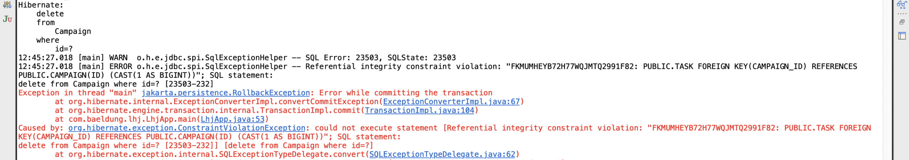
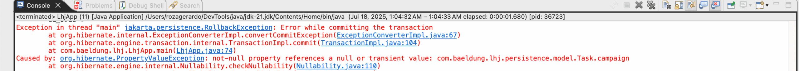

1. Overview
   In this lesson, we’ll explore how JPA and Hibernate handle entity relationships when operations are performed on them.

We’ll examine the strategies JPA provides to control how an operation affects (or cascades to) associated entities, how we can automatically remove child entities when they’re no longer referenced, and briefly introduce lazy and eager loading strategies.

The relevant module we need to import when starting with this lesson is: entity-relationships-and-operations-start.

For a fully implemented lesson as a reference, we can import: entity-relationships-and-operations-end.

2. Cascade Types
   Working with parent-child relationships in JPA often requires us to manage multiple entities together. For example, if we create a Campaign with several Task entities, we typically want to persist or remove all of them as a unit. Doing this manually can be tedious and error-prone.

By default, JPA doesn’t automatically perform any operation on the associated entities. If we don’t configure anything special, persisting a Campaign doesn’t save its tasks, and deleting it won’t remove them either. This can lead to inconsistent data or extra code to manage relationships explicitly.

That’s where cascade types come in handy – they tell Hibernate to propagate operations such as persist, merge, or remove automatically from a parent to its child or associated entities. This saves us from writing extra code and helps keep our data consistent.

In this section, we’ll focus primarily on configuring cascading for @OneToMany relationships, as this is the most common scenario in domain modeling. That said, cascade options can also be applied to other relationship types like @ManyToOne and @ManyToMany. We’ll highlight any special considerations as they come up.

2.1. CascadeType.PERSIST
A Campaign has many associated Task entities, mapped with @OneToMany. To save the associated tasks automatically when persisting a Campaign, we can set the annotation’s cascade parameter to CascadeType.PERSIST:

@Entity
public class Campaign {
@OneToMany(mappedBy = "campaign", cascade = CascadeType.PERSIST)
private Set<Task> tasks = new HashSet<>();

    // other fields, constructors, getters, and setters
}
Copy
Now, when we persist a Campaign, any new Task objects associated with it are also saved automatically. Let’s try this out in the main() method of LhjApp:

EntityManager entityManager1 = JpaUtil.getEntityManager();
EntityTransaction transaction1 = entityManager1.getTransaction();
transaction1.begin();

Campaign campaign1 = new Campaign();
campaign1.setName("Baeldung Course Marketing");
campaign1.setCode("BAEL_COURSE_MARKETING");

Task task1 = new Task();
task1.setName("Write a post");
task1.setCampaign(campaign1);

Task task2 = new Task();
task2.setName("Share on LinkedIn");
task2.setCampaign(campaign1);

campaign1.setTasks(Set.of(task1, task2));

entityManager1.persist(campaign1);
transaction1.commit();
entityManager1.close();
Copy
Note that, for this lesson, we’re creating and closing a new EntityManager for each operation, complemented by setting the hibernate.hbm2ddl.auto property to update. This helps avoid confusion caused by the persistence context cache, especially when dealing with detached entities or observing how operations affect relationships in isolation.

Let’s run the application and observe the queries generated by Hibernate while persisting the campaign object:

Hibernate:
insert
into
Campaign
...
Hibernate:
insert
into
Task
...
Hibernate:
insert
into
Task
...
Copy
It’s worth mentioning that, just like the persist() operation itself, CascadeType.PERSIST only takes effect on new (transient) entities—those that haven’t been persisted yet and don’t have an identifier. It won’t work properly if the tasks collection contains detached entities (for example, setting the ID on a new Task in the hope that it updates an existing one).

2.2. CascadeType.MERGE
To handle cases where we’re dealing with detached entities, we typically use the merge() operation instead. This operation can also be cascaded using CascadeType.MERGE:

@OneToMany(mappedBy = "campaign", cascade = {CascadeType.PERSIST, CascadeType.MERGE})
private Set<Task> tasks = new HashSet<>();
Copy
As we can see, JPA allows defining an array of CascadeType values when we want to enable cascading for more than one operation.

That said, handling detached entities and using merge() effectively is a more advanced topic, so we won’t be covering it in detail at this point, where we’re focusing on the basics.

2.3. CascadeType.DETACH
We won’t go into detail on this topic either, but it’s worth knowing that if we explicitly detach an entity from the persistence context, this operation can also be cascaded to associated entities using CascadeType.DETACH.

This ensures that the entire object graph is removed from the persistence context, which can help avoid unintended updates being persisted later on.

2.4. CascadeType.REMOVE
By default, when we delete an entity that is linked to others via relationships, JPA doesn’t automatically delete the associated entities, even if the association is strong or logically implies some form of containment. For example, deleting a Campaign that has related Task entities won’t remove those tasks by default.

To ensure that related entities are deleted alongside the entity we remove, we need to explicitly configure the relationship using CascadeType.REMOVE.

Before configuring this cascade strategy, let’s walk through a simple example deleting a Campaign entity with associated Task entities:

EntityManager entityManager2 = JpaUtil.getEntityManager();
EntityTransaction transaction2 = entityManager2.getTransaction();
transaction2.begin();

Campaign campaign1FromDB = entityManager2.find(Campaign.class, 1L);
entityManager2.remove(campaign1FromDB);

transaction2.commit();
entityManager2.close();
Copy
Running this will result in a runtime exception — either a ConstraintViolationException or a TransientObjectException, depending on whether the associated Task entities are still present in the persistence context:

This happens because each Task still holds a foreign key reference to the deleted Campaign, as defined in its @ManyToOne mapping:

@ManyToOne(optional = false)
private Campaign campaign;
Copy
Hibernate does not automatically null or clean up these references. So even if the foreign key were nullable (using optional = true), the removal would still fail.

Therefore, when performing a remove() operation, we typically have three options:

Manually update or remove the references on the other side of the relationship
Cascade the operation
Enable the orphanRemoval = true attribute, which we’ll analyze later
By using CascadeType.REMOVE, we can ensure that when a Campaign is deleted, all its associated Task entities are also removed:

@OneToMany(mappedBy = "campaign",
cascade = {CascadeType.PERSIST, CascadeType.MERGE, CascadeType.REMOVE})
private Set<Task> tasks = new HashSet<>();
Copy
With this setup, when we delete a Campaign, Hibernate will also delete all associated Task records. We can now run the app again, and this time it won’t raise any exceptions.

Hibernate generates the necessary SQL to delete the children first, keeping the database clean and consistent:

Hibernate:
delete
from
Task
where
id=?
Hibernate:
delete
from
Task
where
id=?
Hibernate:
delete
from
Campaign
where
id=?
Copy
Here, the Task entities are deleted first as children and then the Campaign entity as parent.

2.5. CascadeType.REFRESH
The refresh() operation tells JPA to reload the state of an entity from the database, discarding any unsaved (dirty) changes in memory. It can be used when we suspect the in-memory state is stale (e.g., changed by another transaction) or we want to undo changes and restore the DB version of the entity.

As we can imagine, refreshing a parent entity from the database doesn’t update its children by default. That may cause inconsistencies if the child entities have changed in the meantime.

So, we can use CascadeType.REFRESH to ensure that refreshing the parent also refreshes the associated children.

This reloads both the parent and children from the database, discarding any unsaved changes.

2.6. CascadeType.ALL
When we want full propagation, applying each cascade type individually is repetitive.

CascadeType.ALL is a shortcut that applies all cascade operations – PERSIST, MERGE, REMOVE, REFRESH, and DETACH:

@OneToMany(mappedBy = "campaign", cascade = CascadeType.ALL)
private Set<Task> tasks = new HashSet<>();
Copy
It ensures that all persistence operations on the parent are automatically applied to the children.

2.7. Choosing the Right Cascade Type
Let’s review each cascade type with practical guidance on when we typically use them and what we should watch out for:

| **Cascade Type** | **Behavior**                                                   | **Caution**                                                                   |
| ---------------- | -------------------------------------------------------------- | ----------------------------------------------------------------------------- |
| **PERSIST**      | Saves new child entities when we persist the parent            | Avoid if child entities should be managed or persisted independently          |
| **MERGE**        | Propagates updates to detached child entities                  | Can overwrite newer values if the detached instance is outdated               |
| **REMOVE**       | Deletes child entities when the parent is deleted              | Risk of unintentionally deleting shared or important child data               |
| **REFRESH**      | Reloads both parent and children from the database             | Discards any unsaved in-memory changes                                        |
| **DETACH**       | Detaches both parent and children from the persistence context | Changes made after detachment won’t be persisted                              |
| **ALL**          | Applies all cascade operations to the children                 | Too broad for many real-world use cases – can impact performance or integrity |

Cascade Type	Behavior	Caution
PERSIST	Saves new child entities when we persist the parent	Avoid if child entities should be managed or persisted independently
MERGE	Propagates updates to detached child entities	Can overwrite newer values if the detached instance is outdated
REMOVE	Deletes child entities when the parent is deleted	Risk of unintentionally deleting shared or important child data
REFRESH	Reloads both parent and children from the database	Discards any unsaved in-memory changes
DETACH	Detaches both parent and children from the persistence context	Changes made after detachment won’t be persisted
ALL	Applies all cascade operations to the children	Too broad for many real-world use cases – can impact performance or integrity
We want to avoid overusing cascading because it can cause performance issues in large object graphs and introduce subtle bugs – like accidentally deleting unrelated records. The best practice is to choose the minimum set of cascade types that meet our specific use case.

3. orphanRemoval
   Another important attribute when managing relationships between entities is orphanRemoval.

When set to true, orphanRemoval instructs JPA to automatically delete a child entity if it’s no longer referenced by its parent. To understand this behavior correctly, let’s briefly explain the concept of the “owning side” of a relationship.

3.1. Owning Side in Relationships
In bidirectional associations, JPA requires one side to be the “owning side”—the entity responsible for managing the relationship in the database. By default, this is the side that contains the foreign key.

That means that in our current Campaign-Task setup, the owning side is the Task entity, since we’re using the default behavior and this is the one containing the campaign_id foreign key.

We won’t perform this change, but if we wanted to switch ownership to the parent (Campaign), we could add a @JoinColumn to the parent’s side:

@OneToMany(mappedBy = "campaign", cascade = CascadeType.ALL)
@JoinColumn(name = "campaign_id")
private Set<Task> tasks = new HashSet<>();
Copy
Using the child as owner (i.e., the default behavior):

more clearly reflects the foreign key structure in the database
requires syncing any relevant changes in the child object when manipulating the collection from the parent
In contrast, setting the parent as the owner:

might be suitable when the parent naturally controls the lifecycle of its child entities, allowing us to modify the relationship just by managing the collection
can lead to less intuitive mappings and behavior
3.2. Using orphanRemoval
Let’s analyze a new example in our main() method. We’ll invoke a pre-existing helper method to easily set up new data, and then de-reference one of the new campaign’s tasks:

createCampaign2WithTasks34();

EntityManager entityManager3 = JpaUtil.getEntityManager();
EntityTransaction transaction3 = entityManager3.getTransaction();
transaction3.begin();

Campaign campaign2 = entityManager3.find(Campaign.class, 2L);
Task campaign2Task = campaign2.getTasks()
.iterator()
.next();
campaign2Task.setCampaign(null);

transaction3.commit();
entityManager3.close();
Copy
Note we’re proceeding by removing the reference from the child entity because we now understand that this is the owning side.

As expected, since the campaign field is marked as non-optional, this results in a constraint violation exception:

If the field were nullable, then this would break the relationship successfully, without requiring any action on the non-owning side (i.e., the collection).

Now, we can leverage the orphanRemoval feature by adding the attribute to the Campaign class:

@OneToMany(mappedBy = "campaign", cascade = CascadeType.ALL, orphanRemoval = true)
private Set<Task> tasks = new HashSet<>();
Copy
And then actually remove the unlinked task from the collection, right before committing the transaction:

campaign2Task.setCampaign(null);

campaign2.getTasks()
.remove(campaign2Task);

transaction3.commit();
entityManager3.close();
Copy
If we launch the application again, we can confirm that there is no exception and that a delete query is issued for the orphaned task:

Hibernate:
delete
from
Task
where
id=?
Copy
One important note: when using this feature, we should avoid replacing the entire collection by calling something like setTasks(new HashSet<>()). Instead, we should modify the existing collection in place—for example, by calling remove() or add() directly on it. This allows Hibernate to properly detect which child entities were removed.

4. Lazy vs. Eager Loading
   There is one more annotation that all relationship annotations include. The fetch parameter defines whether the associated entity or entities should be retrieved from the database immediately when the owning entity is loaded, or only when they are explicitly accessed in the code.

This topic comes with several considerations and caveats, so we’ll explore it in more depth in a future lesson.

For now, we’ll simply use the FetchType.EAGER strategy for our @OneToMany relationships, as it provides a simpler starting point until we’re ready to dive deeper:

@OneToMany(mappedBy = "campaign", orphanRemoval = true, fetch = FetchType.EAGER, cascade = CascadeType.ALL)
private Set<Task> tasks = new HashSet<>();
Copy
