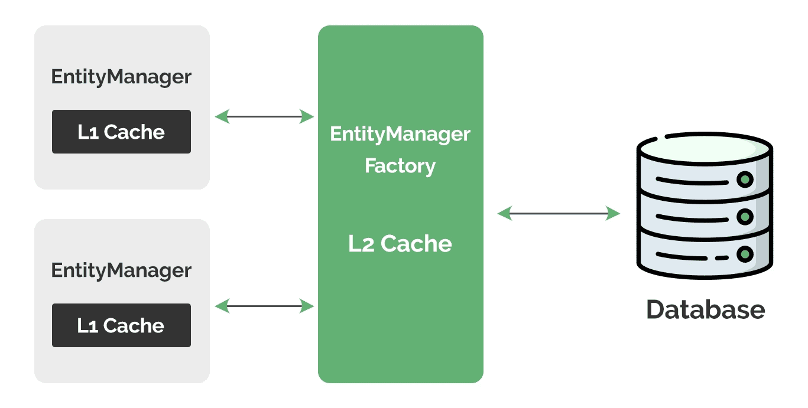

1. Overview
When working with database-driven applications, accessing data directly from the database can introduce significant performance overhead, particularly due to network latency and the cost of executing queries.

Caching provides an efficient solution to this problem by storing frequently accessed data in memory. This mechanism allows us to improve response times and reduce database load by retrieving entities from a fast in-memory cache instead of making redundant database calls.

The relevant module we need to import when starting this lesson is: basic-caching-mechanisms-start.

If we want to reference the fully implemented lesson, we can import: basic-caching-mechanisms-end.

2. JPA Caching Architecture
JPA defines a standard two-tier caching scheme to improve performance and reduce database access. This includes:

a built-in first-level cache (also referred to as the persistence context), which stores entities for the duration of a transaction or session.
and an optional second-level cache, which is shared across sessions.
Hibernate, as a JPA-compliant provider, supports both caching levels. However, to fully leverage second-level caching, we need to configure an external cache provider such as Ehcache or Infinispan.

Naturally, it’s important to keep in mind that neither the first-level nor the second-level cache automatically detect changes made to the database by other processes. If an entity is modified externally, JPA providers (like Hibernate) will still serve the stale cached version, unless we explicitly refresh the entity or clear the cache. This trade-off is part of what makes caching fast, but also something we must account for in concurrent or distributed environments.

We’ll explore each level in detail in the following sections.

3. The First-Level Cache
The first-level cache, also known as the session cache, is automatically enabled by default and cannot be disabled. It’s completely managed by the underlying JPA provider, and we don’t get any programmatic access to it.

It operates at the EntityManager level and stores entities that have been loaded or saved during the current persistence context. The entities remain cached until the EntityManager is closed or explicitly cleared using its close() and clear() methods, respectively.

Let’s open the main() method in our LhjApp class and examine its content:

// ... persisting a Campaign entity and creating an EntityManager instance
logger.info("Fetching Campaign - 1st Attempt");
entityManager.find(Campaign.class, campaign.getId());

logger.info("Fetching Campaign - 2nd Attempt");
entityManager.find(Campaign.class, campaign.getId());

logger.info("Fetching Campaign - 3rd Attempt");
entityManager.find(Campaign.class, campaign.getId());

logger.info("Clearing First-Level Cache");
entityManager.clear();

logger.info("Fetching Campaign - 4th Attempt");
entityManager.find(Campaign.class, campaign.getId());
Copy
Here, we retrieve a persisted Campaign entity using its primary key four times with the find() method of the EntityManager, and clear the cache in between to observe how it affects retrieval.

Let’s execute the main() method to understand how the first-level cache works in practice. Remember that we’ve already enabled SQL logging in our persistence.xml file, so Hibernate will automatically log the generated SQL statements:

[main] INFO  com.baeldung.lhj.LhjApp -- Fetching Campaign - 1st Attempt
Hibernate:
select
c1_0.id,
... additional columns
from
Campaign c1_0
...
[main] INFO  com.baeldung.lhj.LhjApp -- Fetching Campaign - 2nd Attempt
[main] INFO  com.baeldung.lhj.LhjApp -- Fetching Campaign - 3rd Attempt
[main] INFO  com.baeldung.lhj.LhjApp -- Clearing First-Level Cache
[main] INFO  com.baeldung.lhj.LhjApp -- Fetching Campaign - 4th Attempt
Hibernate:
select
c1_0.id,
-- ... same select query as above
Copy
As we can see above from the generated logs, even though we invoke the find() method four times, Hibernate only executes two SELECT queries to the database.

The first lookup call results in a cache miss, triggering a database query. However, the second and third calls result in a cache hit, returning the cached entity without hitting the database.

Next, when we call the clear() method on the EntityManager instance, we effectively empty the first-level cache. Hence, the subsequent entity lookup triggers a query to the database again.

4. The Second-Level Cache
While the first-level cache provides automatic caching within a single EntityManager session, its scope is limited. Once the EntityManager is closed, all the cached data is lost.

JPA addresses this limitation by providing a second-level cache, which acts as a shared cache across multiple EntityManager instances within the same EntityManagerFactory.

Unlike the first-level cache, we have to explicitly enable the second-level cache in our application. When enabled, Hibernate uses a combination of both cache levels when retrieving entities:

As visualized above, Hibernate first checks the isolated first-level cache of the current EntityManager instance. If the entity isn’t found, it then checks the shared second-level cache of the EntityManagerFactory, and finally, it queries the database if neither cache contains the requested entity.

A common use case for the second-level cache is sharing entity data across multiple web service requests. Typically, each HTTP request creates its own EntityManager instance with a fresh first-level cache. Without a second-level cache, frequently accessed entities would be loaded from the database for every request, creating unnecessary overhead.

It’s important to note that both the first-level and second-level caches only work for lookups using the primary key. Queries using JPQL or Criteria API that we’ve explored in previous lessons will still hit the database, though the results may be cached separately using query caching. This is beyond the scope of this lesson, but it’s good to be aware of its existence.

5. Enabling the Second-Level Cache
As previously mentioned, we need to explicitly enable the second-level cache. Let’s walk through the configuration steps required to enable it.

To enable the second-level cache, we need to integrate a cache provider with Hibernate. For this lesson, we’ll use Ehcache as our cache implementation. It is an implementation of the JCache (JSR-107) API, which is the standard caching API in the Java ecosystem.

5.1. Dependency and Configuration
Let’s start by adding the necessary dependencies to our project’s pom.xml file:

<dependency>
    <groupId>org.hibernate.orm</groupId>
    <artifactId>hibernate-jcache</artifactId>
</dependency>
<dependency>
    <groupId>org.ehcache</groupId>
    <artifactId>ehcache</artifactId>
    <version>${ehcache.version}</version>
    <exclusions> 
        <exclusion> 
            <groupId>org.slf4j</groupId> 
            <artifactId>slf4j-api</artifactId> 
        </exclusion> 
    </exclusions>
</dependency>
Copy
We first import the hibernate-jcache dependency, which is necessary to integrate a JCache-compliant cache provider with Hibernate. Next, we import the actual JCache-compliant provider using the ehcache dependency. We also need to exclude the slf4j-api dependency in this example because the version conflicts with the one that logback brings in.

Finally, let’s mark the entity we want to cache using the @Cacheable annotation:

@Entity
@Cacheable
public class Campaign {
// ... existing fields
}
Copy
By adding the @Cacheable annotation to our Campaign entity, we indicate that instances of this entity can be stored in the second-level cache. Hibernate will now cache Campaign entities when they’re loaded from the database, making subsequent retrievals faster.

5.2. Verifying Cache Behavior Using the Statistics API
To verify that our second-level cache works correctly, we’ll use Hibernate’s Statistics API. This API allows us to gain insights into the cache usage, including hit and miss counts.

First, we need to explicitly configure the statistics generation property in our persistence.xml file:

<property name="hibernate.generate_statistics" value="true"/>
Copy
Then, we add the getStatistics() method in the JpaUtil to get a Statistics instance from the EntityManagerFactory:

public static Statistics getStatistics() {
return emf.unwrap(SessionFactory.class).getStatistics();
}
Copy
With statistics enabled, let’s add the following code to our main() method, before the cache checks we analyzed in the previous section, to explore the second-level cache in action:

// ... persisting the Campaign entity
Statistics statistics = JpaUtil.getStatistics();
statistics.clear();

logger.info("Fetching Campaign From First EntityManager");
try (EntityManager entityManager1 = JpaUtil.getEntityManager()) {
entityManager1.find(Campaign.class, campaign.getId());
}
logger.info("Cache Miss Count : {}", statistics.getSecondLevelCacheMissCount());
logger.info("Cache Hit Count : {}", statistics.getSecondLevelCacheHitCount());

logger.info("Fetching Campaign From Second EntityManager");
try (EntityManager entityManager2 = JpaUtil.getEntityManager()) {
entityManager2.find(Campaign.class, campaign.getId());
}
logger.info("Fetching Campaign From Third EntityManager");
try (EntityManager entityManager3 = JpaUtil.getEntityManager()) {
entityManager3.find(Campaign.class, campaign.getId());
}
logger.info("Cache Miss Count : {}", statistics.getSecondLevelCacheMissCount());
logger.info("Cache Hit Count : {}", statistics.getSecondLevelCacheHitCount());
// ... previous first-level cache checks
Copy
Simply put, here we create multiple EntityManager instances and retrieve the same Campaign entity through each of them.

The Statistics object provides the getSecondLevelCacheMissCount() and getSecondLevelCacheHitCount() methods to track the cache miss and hit count, respectively.

To ensure we get accurate measurements for our demonstration, we call the clear() method on the statistics instance to reset counts from previous operations already present in the main() method.

Let’s now execute the main() method and extract the relevant logs to see how the second-level cache behaves across different EntityManager instances:

[main] INFO  com.baeldung.lhj.LhjApp -- Fetching Campaign From First EntityManager
[main] INFO  com.baeldung.lhj.LhjApp -- Cache Miss Count : 1
[main] INFO  com.baeldung.lhj.LhjApp -- Cache Hit Count : 0
[main] INFO  com.baeldung.lhj.LhjApp -- Fetching Campaign From Second EntityManager
[main] INFO  com.baeldung.lhj.LhjApp -- Fetching Campaign From Third EntityManager
[main] INFO  com.baeldung.lhj.LhjApp -- Cache Miss Count : 1
[main] INFO  com.baeldung.lhj.LhjApp -- Cache Hit Count : 2
Copy
As we can observe from the generated logs, the first retrieval results in a cache miss since the entity isn’t loaded in the second-level cache yet. However, after this initial miss, Hibernate loads the entity from the database and stores it in the shared cache.

Then, the subsequent retrievals using different EntityManager instances result in cache hits, proving that the entity is being shared across sessions through the second-level cache.

An important note here: we’ll likely still observe SQL queries being logged for each fetch. Upon closer inspection, we’ll notice:

The first query fetches the Campaign entity joined with its Task and Worker associations.
The second and third queries only fetch Task and Worker data, even though the Campaign itself comes from the cache.
This is expected behavior and occurs due to the following reasons:

The relationship to Task is configured with FetchType.EAGER, which means associated tasks are always loaded immediately.
Neither Task nor Worker are marked as @Cacheable.
The tasks collection itself is not configured for second-level caching.
Caching associated collections and nested entities requires additional configuration and fine-tuning. Since that’s beyond the scope of this lesson, we won’t cover it in detail here.

6. Using the Cache API
Beyond the automatic caching behavior, JPA provides a programmatic Cache API that allows us to interact directly with the second-level cache.

In the JpaUtil, we’ll add a helper method that invokes the getCache() method of our existing EntityManagerFactory to obtain a Cache instance:

public static Cache getCache() {
return emf.getCache();
}
Copy
Next, we’ll add the following code to our main() method to explore the Cache API:

Cache cache = JpaUtil.getCache();
boolean isCached = cache.contains(Campaign.class, campaign.getId());
if (isCached) {
logger.info("Campaign with id {} is present in the second-level cache", campaign.getId());
}

logger.info("Clearing Second-Level Cache");
cache.evict(Campaign.class, campaign.getId());
cache.evict(Campaign.class);
cache.evictAll();

isCached = cache.contains(Campaign.class, campaign.getId());
if (!isCached) {
logger.info("Campaign with id {} is not present in the second-level cache", campaign.getId());
}
Copy
Here, we first obtain a Cache instance, then use its contains() method to check if an entity of type Campaign is currently present in the second-level cache. We pass the primary identifier of the campaign instance that we’ve previously retrieved.

Then, we again call the contains() method after clearing the second-level cache.

The first method removes a specific Campaign entity, identified by its primary key, from the second-level cache. At the same time, the second method call removes all Campaign entities from the cache. Finally, the evictAll() method clears the entire second-level cache.

For the sake of demonstration, we will call all the eviction methods that the Cache API provides. However, ideally, we’ll only invoke the one that meets our business requirements.
Next, let’s run the main() method once more to see the Cache API in action:

[main] INFO  com.baeldung.lhj.LhjApp -- Campaign with id 1 is present in the second-level cache
[main] INFO  com.baeldung.lhj.LhjApp -- Clearing second-level cache
[main] INFO  com.baeldung.lhj.LhjApp -- Campaign with id 1 is not present in the second-level cache
Copy
The output confirms that our Campaign entity was initially present in the second-level cache from our previous operations. After calling the eviction methods, the entity is successfully removed from the cache, as verified by the final contains() check.

Through the Cache API, we gain programmatic control over the second-level cache, complementing the automatic caching behavior of the first-level cache. Understanding and effectively using these two caching mechanisms is essential for building performant database-driven applications that reduce database load.