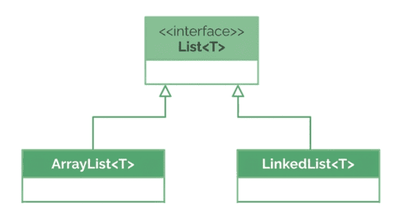
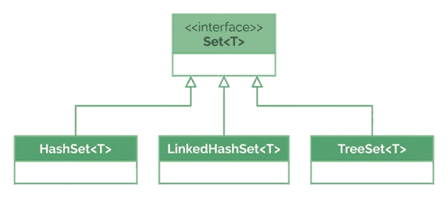
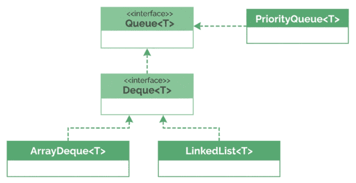
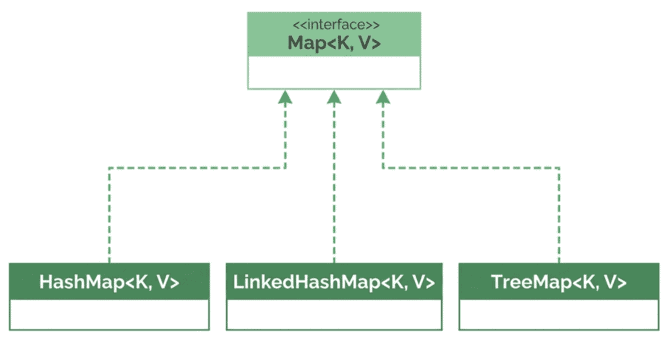

# Java Collections Framework 

## 1. Overview

We've already seen *why* collections are essential (arrays are fixed-size, verbose to search, and covariant). Now we step up to the framework's **high-level structure**: the core interfaces, the common implementations behind them, and how everything fits together.

The goal is a clear **map** of the framework's primary components and their relationships. There's no code to run for this lesson — it's conceptual.

---

## 2. The Core Interfaces

The Java Collections Framework is built around a set of **core interfaces**. These define the general behaviors expected from different types of collections, giving a consistent way to add, remove, and search for elements. This abstraction lets us work with collections uniformly, regardless of the specific implementation.

### 2.1. High-Level Interface Hierarchy

At the top sits the **`Collection`** interface, which gathers the fundamental behaviors for working with groups of elements.

```
              Iterable          (foundational — not part of the framework)
                 │
             Collection
        ┌────────┼────────┐
      List      Set      Queue                 Map   (separate; NOT a Collection)
                          │
                        Deque
```

- **`List`** — ordered sequences; focuses on positional access; allows duplicates.
- **`Set`** — emphasizes **uniqueness** of elements.
- **`Queue`** — adds insertion, extraction, and inspection operations. Typically (but not necessarily) a **First-In-First-Out (FIFO)** structure.
- **`Map`** — *not* a subtype of `Collection`, but still part of the framework. It organizes data as **key-value pairs**, enabling fast lookups and updates by unique key.

**`Iterable`** is the foundational interface that `Collection` extends. It isn't part of the framework itself, but it's what lets us iterate over a collection one element at a time — for example, with an enhanced `for` loop:

```java
for (String language : languages) {
    System.out.println(language);
}
```

> All collections declare the type of data they hold using **generics**, written between angle brackets, e.g. `List<String>`, `Map<String, Integer>`.

### 2.2. Interrelations Between Key Interfaces

These interfaces work together for a consistent experience. Once we know how to iterate over a `List`, the same principle applies to a `Set` and other collections.

`Map` is conceptually different, so it has its own methods for keys and values. However, the framework provides **`Collection` views** of a map — `keySet()`, `values()`, and `entrySet()` — so we can reuse familiar concepts like iteration.

---

## 3. Common Implementations

Behind each interface, Java provides ready-made classes we can use directly. Below are the key characteristics of the main `List`, `Set`, `Queue`, and `Map` implementations.

> **Thread safety:** None of these standard implementations are thread-safe by default. Separate thread-safe collections are provided elsewhere (e.g. in `java.util.concurrent`, or via `Collections.synchronizedXxx` wrappers).

### 3.1. List Implementations



Lists store elements in a **specific order** and **allow duplicates**; inserting and removing elements is easy.

- **`ArrayList`** — backed by a resizable array. Great for **fast random access**; ideal for read-heavy work.
- **`LinkedList`** — doubly-linked nodes. Better for **frequent insertions/removals** at the middle or beginning. Also implements `Deque`.

### 3.2. Set Implementations



Sets **avoid duplicate elements**.

- **`HashSet`** — efficient lookups via hashing; **no order guarantee**.
- **`LinkedHashSet`** — preserves **insertion order**.
- **`TreeSet`** — keeps elements **sorted** by natural order or a custom `Comparator`.

### 3.3. Queue Implementations



`Queue` typically represents a **FIFO** structure, but not always.

- **`PriorityQueue`** — a priority-based (not FIFO) queue. "Priority" determines the order in which elements are **removed (dequeued)**, not the order they were added; higher-priority elements come out first regardless of insertion time.
- **`Deque` (Double-Ended Queue)** — a subtype of `Queue` allowing insertion and removal at **both the front and the rear**. Supports both **queue (FIFO)** and **stack (LIFO)** operations, making it very versatile.
    - **`LinkedList`** implements `Deque` (as well as `List`).
    - **`ArrayDeque`** is another common `Deque` implementation — resizable array-based, usually faster than `LinkedList`.

### 3.4. Map Implementations



`Map` works with **key-value pairs**. Keys must be **unique** (no duplicate keys), but **values can be duplicated**.

- **`HashMap`** — the typical default; fast key-value storage; **no ordering**.
- **`LinkedHashMap`** — preserves **insertion order** (like `LinkedHashSet`).
- **`TreeMap`** — keeps keys **sorted** (like `TreeSet`).

### 3.5. Why There Is No Sorted List Implementation

There are sorted collections such as `TreeSet` and `TreeMap`, so why no auto-sorted `List`?

The `List` interface is designed around **ordered, positional access**, allowing duplicates and supporting efficient random access in some implementations. Continuously maintaining sort order would **conflict** with positional access, so lists are sorted **on demand** (e.g. `Collections.sort(list)`) rather than automatically.

> **Side note:** Sorted collections rely on the **`Comparable`** interface (natural ordering, via `compareTo`) and the **`Comparator`** interface (custom ordering) to determine element order.

### 3.6. How These Classes Fit Together

| Type | Class / Interface | Ordered? | Duplicates? | Key Features / Use Cases |
|---|---|---|---|---|
| **List** | `List` | Yes | Yes | Ordered collection, random access, allows duplicates |
| | `ArrayList` | Yes (by index) | Yes | Fast random access; good for read-heavy work |
| | `LinkedList` | Yes (by index) | Yes | Fast insertions/removals; also implements `Deque` |
| **Set** | `Set` | Depends on impl. | No | Unique elements only |
| | `HashSet` | No (unordered) | No | Fast lookup; no order guarantee |
| | `LinkedHashSet` | Yes (insertion) | No | Maintains insertion order |
| | `TreeSet` | Yes (sorted) | No | Sorted by natural/comparator order |
| **Queue** | `Queue` | Yes | Yes | Holds elements before processing; typically FIFO |
| | `Deque` | Yes (double-ended) | Yes | Add/remove at both ends; FIFO and LIFO |
| | `ArrayDeque` | Yes (insertion) | Yes | Resizable array-based; faster than `LinkedList` in most cases |
| | `PriorityQueue` | No | Yes | Elements retrieved by priority, not FIFO |
| **Map** | `Map` | Depends on impl. | No duplicate keys | Key-value pairs; keys unique |
| | `HashMap` | No | No duplicate keys | Fast lookup; no ordering |
| | `LinkedHashMap` | Yes (insertion) | No duplicate keys | Maintains insertion order |
| | `TreeMap` | Yes (sorted by key) | No duplicate keys | Keeps keys sorted |

All of these inherit from the core interfaces and follow similar naming patterns. Switching between implementations is usually straightforward once we understand `List`, `Set`, and `Map` — we just pick the class with the desired behavior or performance characteristics.

---

## 4. Additional Utilities in the Framework

Beyond the core classes, Java provides utility methods in **`java.util.Collections`**, plus collection-related helpers in **`java.util.Arrays`**. A couple of quick previews:

- `Collections.sort(list)` — sort a list in place.
- `Collections.emptyList()` — return an immutable list with zero elements.

These utilities extend the framework's power and simplify everyday tasks.

---

## 5. Conclusion

We explored the high-level structure of the Java Collections Framework: the core **`Collection`** interface and its subtypes **`List`**, **`Set`**, and **`Queue`**, plus the separate **`Map`** interface. We then reviewed common implementations — from `ArrayList` and `HashSet` to `PriorityQueue` and `HashMap` — and how they differ in **ordering**, **duplicates**, and **performance**.

With this map in hand — which collection type fits which use case — we're well-prepared to study each of them in depth.