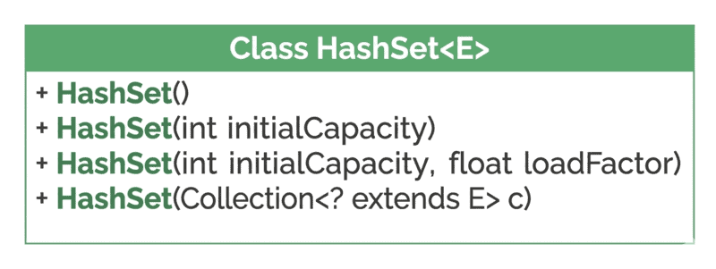

# Introduction to HashSet

## 1. Overview

In this lesson, we'll focus on the `HashSet` class, which represents a data structure for managing unique collections of objects.

We'll start by introducing the `Set` interface as a collection of unordered and unique elements, followed by taking a closer look at its most popular implementation, the `HashSet` class.

The relevant module we need to import when starting this lesson is: [introduction-hashset-start](https://github.com/Baeldung/learn-java-collections/tree/module4/introduction-hashset-start).

If we want to reference the fully implemented lesson, we can import: [introduction-hashset-end](https://github.com/Baeldung/learn-java-collections/tree/module4/introduction-hashset-end).

## 2. The Set Interface: Guarantee of Unique Elements

The `java.util.Set` interface in Java extends the `java.util.Collection` interface, which makes it a fundamental part of the Java Collections Framework. Essentially, it models the mathematical concept of a set of elements.

Key characteristics:

- **No duplicate elements**: unique elements are the most defining characteristic.
- **Ordering not defined**: the order of elements is implementation-dependent, so it isn't guaranteed unless we use an implementation that provides it, such as `LinkedHashSet` or `TreeSet`.
- **Allows null**: at most one null element. `TreeSet` is an exception, as it doesn't allow null elements.
- **Models a mathematical set abstraction**: designed to represent a mathematical set, allowing operations such as union, intersection, difference, and subset check.

## 3. The HashSet Class

`HashSet` is one of the concrete classes that implements the `Set` interface and inherits its characteristics.

It also has implementation-specific characteristics:

- **Uses a hash table**: internally backed by a `HashMap` for storage.
- **Allows one null element**: attempting to add a second null has no effect.
- **High performance**: efficient for fast lookups and modifications.
- **Non-synchronized**: not inherently thread-safe.

Common real-world uses include extracting unique elements from a collection (e.g., email addresses from various sources, deduplicating a log file, or user IDs from different system logs), implementing simple caches, graph algorithms, modeling mathematical set operations, and working with objects that have unique identifiers (product IDs, user IDs, transaction IDs).

## 4. Creating a HashSet

We can create a `HashSet` instance using one of four constructors. Let's open the test class `HashSetUnitTest` and try these out.



### 4.1. Default Constructor

The simplest and most commonly used constructor creates an empty `HashSet` instance.

```java
@Test
void givenDefaultHashSetConstructor_whenInitializing_thenEmptyHashSetCreated() {
    Set<String> defaultSet = new HashSet<>();
    assertNotNull(defaultSet);
    assertEquals(0, defaultSet.size());
}
```

Use this constructor when we don't know how many elements the set will eventually hold, or for small sets where the default capacity is likely sufficient. The `size()` method used here simply returns the number of elements in the `Set`.

### 4.2. Constructor Based on a Collection

This constructor creates a new `HashSet` containing all the unique elements from an existing collection.

```java
@Test
void givenCollection_whenCreatingHashSet_thenHashSetCopied() {
    List<Character> characterList = Arrays.asList('A', 'B', 'C', 'A', 'D');
    Set<Character> characterSet = new HashSet<>(characterList);
    assertEquals(4, characterSet.size());
}
```

Duplicate elements from the source list aren't added to the new `Set` — the size is 4, not 5, since there were only 4 unique elements in the list.

### 4.3. Constructors With Initial Capacity and Load Factor

Initial capacity and load factor define how a `HashSet` works internally.

Initial capacity is the number of "buckets" in the underlying hash table when the `HashSet` is first created — the number of elements the hash table can hold before it needs to be resized. Load factor measures how full the hash table can get before it automatically increases its capacity, with a value between 0 and 1.

In the previous examples, both attributes used their default values: an initial capacity of 16 and a load factor of 0.75.

We can specify just the initial capacity, leaving the load factor at its default:

```java
@Test
void givenInitialCapacity_whenCreatingHashSet_thenEmptySetCreated() {
    Set<Integer> capacitySet = new HashSet<>(20);
    assertNotNull(capacitySet);
}
```

This is useful when we have an idea of how many elements we expect to store, reducing the need for resizing.

We can also specify both the initial capacity and the load factor:

```java
@Test
void givenInitialCapacityAndLoadFactor_whenCreatingHashSet_thenEmptySetCreated() {
    Set<Double> customSet = new HashSet<>(5, 0.8f);
    assertNotNull(customSet);
}
```

A high load factor (e.g., 0.9) reduces memory consumption since it requires fewer rehashes, but increases the likelihood of [hash collisions](https://www.baeldung.com/java-hashmap-advanced#collisions-in-the-hashmap) — two different keys mapping to the same bucket index. A low load factor (e.g., 0.5) reduces collisions and improves performance for `Set` operations, but uses more memory.

The default load factor of 0.75f is a good balance for most general-purpose applications. Change it only with strong performance or memory requirements backed by profiling.

### 4.4. Creating a Set With Custom Class Elements

Now let's apply `HashSet` to a practical scenario, using our `Task` entity.

Since a `Set` contains unique elements, it needs to compare elements to avoid duplicates, using two essential methods: [`equals()` and `hashCode()`](https://www.baeldung.com/java-equals-hashcode-contracts).

By default, a class inherits these methods from `Object`, which simply compares object references — not useful here. Let's override both methods in `Task` so they uniquely identify a task by its code.

In the `Task` class, add `equals()`:

```java
@Override
public boolean equals(Object o) {
    if (this == o) return true;
    if (o == null || getClass() != o.getClass()) return false;
    Task task = (Task) o;
    return Objects.equals(code, task.code);
}
```

Then add `hashCode()`:

```java
@Override
public int hashCode() {
    return Objects.hash(code);
}
```

We need to override both methods, as the contract for `hashCode()` states that ["equal objects must have equal hash codes"](https://docs.oracle.com/en/java/javase/21/docs/api/java.base/java/lang/Object.html#equals(java.lang.Object)).

In the test class, create a few `Task` objects and a `List` containing them:

```java
@Test
void givenTaskEntity_whenUsingTaskAsElement_thenNewHashSetCreated() {
    Task task1 = new Task("T001", "Complete Report", "Finish the quarterly sales report", LocalDate.of(2025, 7, 15));
    Task task2 = new Task("T002", "Schedule Meeting", "Arrange a meeting with the client", LocalDate.of(2025, 7, 20));
    Task task3 = new Task("T001", "Review Code", "Review the new feature's code", LocalDate.of(2025, 7, 18));
    Task task4 = new Task("T003", "Prepare Presentation", "Create slides for the project update", LocalDate.of(2025, 7, 25));

    List<Task> collection = Arrays.asList(task1, task2, task3, task4);
    Set<Task> tasks = new HashSet<>(collection);

    assertEquals(3, tasks.size());
}
```

Using the `HashSet(Collection)` constructor, the resulting set has only 3 elements — the two tasks sharing code `T001` are correctly identified as duplicates.

## 5. Creating a Set Using Utility Methods

We can use the `Set.of()` and `Collections.singleton()` static factory methods to create [unmodifiable](https://docs.oracle.com/en/java/javase/24/docs/api/java.base/java/util/Set.html#unmodifiable) `Set` instances — a concise way to initialize sets, especially small, fixed ones.

### 5.1. Using Set.of()

This static method creates small, unmodifiable sets. Elements are passed directly as varargs (e1, e2, e3, e4, ...):

```java
@Test
void givenASetOfObjects_whenUsingSetOfMethod_thenSetCreated() {
    Set<String> fruitSet = Set.of("Apple", "Banana", "Orange");

    assertEquals(3, fruitSet.size());
}
```

Limitations: elements can't be null and must be unique, and we can't add or remove elements afterward.

### 5.2. Using Collections.singleton()

This static method creates an unmodifiable `Set` containing a single element:

```java
@Test
void givenASingleObject_whenUsingCollectionsSingletonMethod_thenSetCreated() {
    Set<String> fruitSet = Collections.singleton("Apple");

    assertEquals(1, fruitSet.size());
}
```

Use this when all we need is a `Set` with a single element.

## 6. Conclusion

In this lesson, we explored the `Set` interface and its guarantee of unique elements, then focused on `HashSet` as its most commonly used implementation. We looked at the four constructors available for creating a `HashSet`, including specifying initial capacity and load factor, and saw how overriding `equals()` and `hashCode()` is essential for using custom objects as set elements. Finally, we explored the `Set.of()` and `Collections.singleton()` utility methods for creating small, unmodifiable sets.