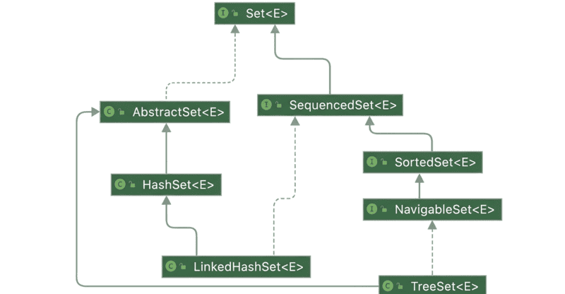

# Sorted Set and Natural Ordering (TreeSet)

## 1. Overview

There are situations where, in addition to enforcing uniqueness, we also need a `Set` that maintains its elements in a defined sorted order. In this lesson, we'll explore how `TreeSet` addresses this scenario, see how it works, review examples of its use, and discuss both its strengths and limitations.

The relevant module we need to import when starting this lesson is: `treeset-sorted-set-and-natural-processing-start`.

If we want to reference the fully implemented lesson, we can import: `treeset-sorted-set-and-natural-processing-end`.

## 2. TreeSet and Natural Ordering

A `TreeSet` is a self-balancing Red-Black tree that keeps every element in sorted order at all times. Compared to hash-based sets, operations such as add, contains, and remove have higher costs, since the tree must maintain balance. The benefit is that iteration is always sorted, and we also gain access to nearest-element queries that hash-based sets cannot provide.

By default, a `TreeSet` relies on each element's `Comparable` implementation. Strings, therefore, sort lexicographically, and integers sort numerically. We've presented natural ordering in previous lessons.

Let's open `TreeSetUnitTest` and add a new test, `whenUsingNaturalOrder_thenStringsSorted()`, to validate `TreeSet`'s natural order:

```java
@Test
void whenUsingNaturalOrder_thenStringsSorted() {
    TreeSet<String> languages = new TreeSet<>();
    languages.add("es");
    languages.add("fr");
    languages.add("de");
    List<String> ordered = new ArrayList<>(languages);
    assertEquals(List.of("de", "es", "fr"), ordered);
}
```

In this test, we created the `languages` variable, of type `TreeSet`, and inserted three language codes in scrambled order. Then we validated that the three codes are stored in alphabetical order. Regardless of the insertion sequence, the tree maintains balance and ensures the elements are always in ascending order: `de`, `es`, `fr`.

## 3. Custom Comparator Sorting

Java provides ways to sort the objects of a `TreeSet` in a way different from their natural order. Similar to what we've seen for other collections in previous modules, we can use `Comparator` to do that by providing it as a `TreeSet` constructor parameter.

Since comparators were introduced in previous lessons, let's see them in action straight away with a quick example:

```java
@Test
void whenUsingTaskComparator_thenTasksSortedByCodeLength() {
    Comparator<Task> byCodeLength = Comparator.comparingInt(t -> t.getCode().length());
    TreeSet<Task> tasks = new TreeSet<>(byCodeLength);
    tasks.add(new Task("02", "B", "B", null));
    tasks.add(new Task("010", "C", "C", null));
    tasks.add(new Task("1", "A", "A", null));

    List<String> codes = new ArrayList<>();
    for (Task task : tasks) {
        String code = task.getCode();
        codes.add(code);
    }
    assertEquals(List.of("1", "02", "010"), codes);
}
```

First, we create a comparator that compares by code length. Then we pass the comparator as an argument to the `TreeSet` constructor, so the elements are always kept in order by code length, and shorter codes appear first in the iteration.

Naturally, when a custom comparator is provided, `TreeSet` will ignore the natural ordering of the elements.

## 4. Range-View and Nearest Element Operations

As we'll see more clearly in the next section, `TreeSet` implements the `NavigableSet` interface, which itself extends `SortedSet`. These APIs provide useful methods for working with sorted collections and for navigating elements based on proximity to a target value.

Let's explore some of the most useful methods provided by these interfaces:

From `SortedSet`: `first()` returns the lowest element; `last()` returns the highest element; `subSet(from, to)` returns a view of elements from `from` (inclusive) to `to` (exclusive); `headSet(to)` returns a view of elements strictly less than `to`; `tailSet(from)` returns a view of elements greater than or equal to `from`.

From `NavigableSet`: `lower(e)` returns the greatest element strictly less than `e`; `floor(e)` returns the greatest element less than or equal to `e`; `ceiling(e)` returns the least element greater than or equal to `e`; `higher(e)` returns the least element strictly greater than `e`; `pollFirst()` retrieves and removes the lowest element; `pollLast()` retrieves and removes the highest element. Overloaded versions of `subSet()`, `headSet()`, and `tailSet()` allow control of inclusivity/exclusivity of bounds.

Finally, note that these range methods return live views backed by the original set. This means that updates in the view are reflected in the underlying `TreeSet`, and vice versa. Let's see a quick example:

```java
@Test
void whenUsingRangeQueries_thenCorrectElementsReturned() {
    TreeSet<Integer> scores = new TreeSet<>();
    scores.add(55);
    scores.add(70);
    scores.add(85);
    scores.add(95);
    scores.add(100);

    Integer floor = scores.floor(73);
    assertEquals(70, floor);

    Integer ceiling = scores.ceiling(73);
    assertEquals(85, ceiling);

    SortedSet<Integer> mid = scores.subSet(70, true, 95, false);
    assertEquals(List.of(70, 85), new ArrayList<>(mid));
}
```

The tree returns the floor and ceiling of the set of values correctly. Then it locates the elements between 70 inclusive and 95 exclusive and exposes the subset view backed by the original set.

## 5. Comparing HashSet and LinkedHashSet to TreeSet

Let's start by examining the class diagram for the three different `Set` structures, so that we can better visualize the differences between all of them.



To sum up the key points of the three main `Set` implementations:

All three extend `AbstractSet`. `LinkedHashSet` and `TreeSet` both implement the `SequencedSet` interface, which provides methods such as `getFirst()` and `getLast()`. `TreeSet` is unique in also implementing `SortedSet` and `NavigableSet`, which give it ordering and range-query capabilities.

In practice, hash-based sets (`HashSet` and `LinkedHashSet`) are faster for basic add/remove operations, but they don't keep elements sorted. `TreeSet` trades some write performance for maintaining sorted order at all times.

We can illustrate this by adding the same data into all three sets:

```java
@Test
void whenComparingThreeSets_thenOrdersDiffer() {
    List<String> data = List.of("es", "fr", "de");

    Set<String> hash = new HashSet<>(data);
    List<String> hashOrder = new ArrayList<>(hash);

    LinkedHashSet<String> linked = new LinkedHashSet<>(data);
    List<String> linkedOrder = new ArrayList<>(linked);

    TreeSet<String> tree = new TreeSet<>(data);
    List<String> treeOrder = new ArrayList<>(tree);

    assertNotEquals(hashOrder, linkedOrder);
    assertNotEquals(linkedOrder, treeOrder);
    assertEquals(List.of("de", "es", "fr"), treeOrder);
}
```

Here, the `TreeSet` produces elements in sorted order (`de`, `es`, `fr`). In contrast, `HashSet` provides no ordering guarantee, and `LinkedHashSet` preserves insertion order, so their orders differ from the `TreeSet`.

## 6. Practical Use-Case Example: Live Leaderboard

A game leaderboard must stay sorted as scores change. Let's use a `TreeSet` to accomplish this:

```java
@Test
void whenBuildingLeaderboard_thenTopScoresDescend() {
    TreeSet<Integer> scores = new TreeSet<>(List.of(68, 42, 73, 91, 55));
    Iterator<Integer> it = scores.descendingIterator();
    List<Integer> topThree = List.of(it.next(), it.next(), it.next());
    assertEquals(List.of(91, 73, 68), topThree);
}
```

The `scores` `TreeSet`, combined with a descending iterator, lets us retrieve the top scores directly in descending order. This avoids the need for an additional sort step, since the set always maintains elements in sorted order.

## 7. Performance and Pitfalls

Like every other Java data structure, `TreeSet` comes with some weak points:

Each insert or delete may trigger tree rebalancing, so we should avoid `TreeSet` for very write-heavy, order-insensitive data. A custom comparator must be consistent with `equals`; otherwise, logically equal elements may appear as duplicates, or distinct elements may be treated as the same. `TreeSet` is not thread-safe. We should not mutate the fields of an element that are used in comparison — changing the values that the comparator or natural ordering relies on after insertion can corrupt the tree's ordering and lead to unpredictable behavior.

## 8. Choosing Among Set Implementations

Closing this lesson, let's compare `TreeSet` with the other Java `Set` structures we've learned so far:

| Requirement | Best Choice | Typical Performance (lookup / insertion) | Notes |
|---|---|---|---|
| Pure uniqueness, no order | `HashSet` | Constant time, independent of set size | Lowest memory use, fastest inserts and lookups |
| Uniqueness + insertion order | `LinkedHashSet` | Constant time, independent of set size | Preserves insertion order with slight memory overhead |
| Uniqueness + always-sorted order / ranges | `TreeSet` | Slower, performance depends on set size | Extra memory use, slower writes, but supports sorted order and range queries |

Use a `TreeSet` when we need elements delivered in sorted order, nearest-element queries, or live range views. In most other cases, a hash-based set will be faster and lighter.

## 9. Conclusion

In this lesson, we've explored `TreeSet` as a sorted `Set` implementation backed by a Red-Black tree. We've looked at how natural ordering and custom `Comparator` sorting determine element arrangement, and we've examined the range-view and nearest-element operations provided by the `NavigableSet` and `SortedSet` interfaces.

We've also compared `TreeSet` with `HashSet` and `LinkedHashSet` to understand where each implementation fits. While hash-based sets offer faster write performance, `TreeSet` is the right choice when sorted iteration, proximity queries, or live range views are required.