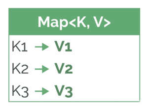
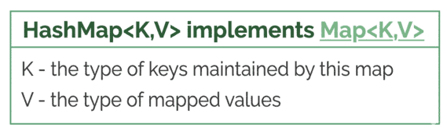
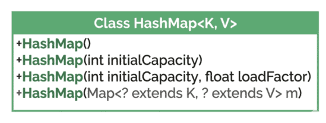
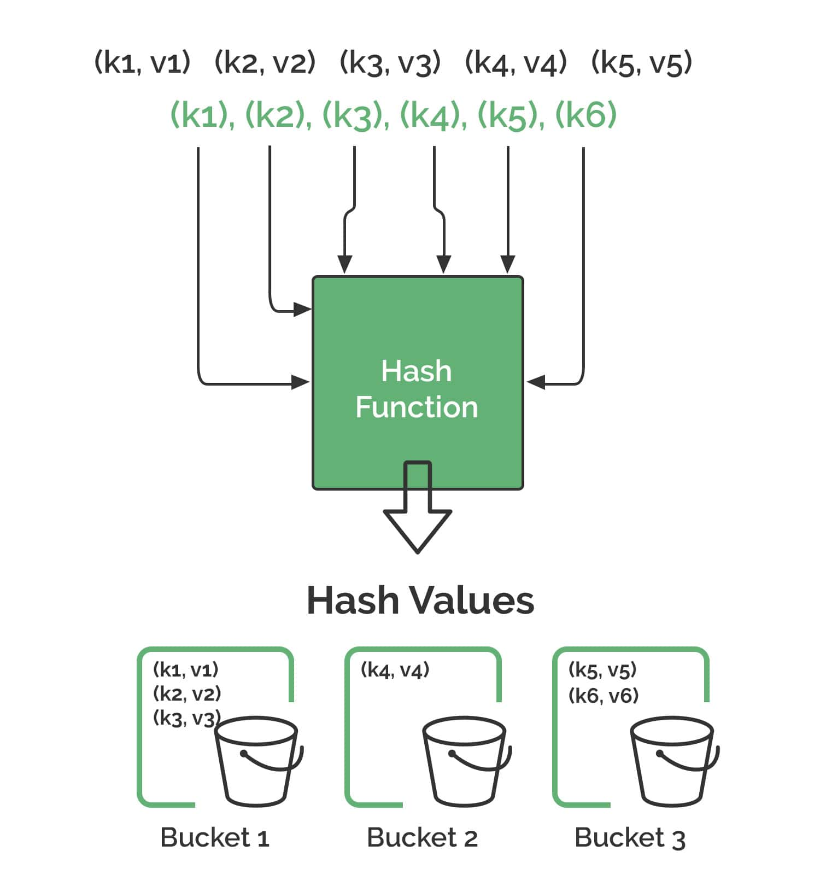

# Introduction to HashMap

Source: [Introduction to HashMap – Baeldung](https://www.baeldung.com/members/courses/learn-java-collections/lessons/lesson-1-introduction-to-hashmap)

## 1. Overview

This lesson focuses on the `HashMap` class: a data structure for storing data as key-value pairs. It covers the `Map` interface for key-value organization, the specifics of the `HashMap` implementation, and how to create one.

Relevant modules:
- Start: [introduction-hashmap-start](https://github.com/Baeldung/learn-java-collections/tree/module5/introduction-hashmap-start)
- End (fully implemented): [introduction-hashmap-end](https://github.com/Baeldung/learn-java-collections/tree/module5/introduction-hashmap-end)

## 2. The Map Interface: Key-Value Organization

`java.util.Map` represents how a key-value organization is structured and managed within the Java Collections Framework. It defines the contract for an object that maps keys to values.



Characteristics:

- **Key-Value storage**: A Key is a unique identifier; the Value is the data associated with it.
- **One-to-One mapping**: Each Key maps to at most one Value.
- **Three collection views**: Contents can be viewed as a collection of keys, values, or key-value mappings.
- **Ordering undefined**: Iteration order depends on the specific implementation.
- **Support for null keys and values**: Varies by implementation — some prohibit nulls, others allow them.

## 3. The HashMap Class

`HashMap` is a highly efficient, unordered, non-synchronized implementation of `Map`. It stores data in key-value pairs, where each unique key maps to a single value.



Implementation-specific characteristics:

- **Uses a hash table**: Stores key-value pairs using a hash table to organize storage.
- **Unordered**: No guaranteed order (insertion, alphabetical, etc.).
- **Fast performance**: Operations typically run in constant time on average — doesn't slow down as the map grows.
- **Allows nulls**: One null key and multiple null values permitted.
- **Not thread-safe**: `HashMap` is not synchronized.

Real-world use cases: simplified indexes (ID → record), caching, word/character frequency counters, user session storage, language dictionaries.

## 4. Creating a HashMap Instance Using Class Constructors

Four constructors are available. Examples live in the `HashMapUnitTest` class under `src/test/java`.



### 4.1. Default Constructor

Simplest way to create an empty `HashMap`.

```java
@Test
void givenDefaultHashMapConstructor_whenInitializing_thenMapCreated() {
    HashMap<String, Integer> map = new HashMap<>();

    assertNotNull(map);
    assertEquals(0, map.size());
}
```

Use when the eventual size is unknown, or for small maps where the default capacity is sufficient. `size()` returns the number of elements in the map.

### 4.2. Constructors with Initial Capacity and Load Factor

Default values: initial capacity **16**, load factor **0.75**. Capacity = number of "buckets"; load factor decides when capacity increases.

Specify initial capacity only:

```java
@Test
void givenHashMapConstructorForInitialCapacity_whenInitializing_thenMapCreated() {
    HashMap<String, Integer> map = new HashMap<>(32);

    assertNotNull(map);
    assertEquals(0, map.size());
}
```

An appropriate initial capacity reduces rehash operations — too small causes frequent rehashing, too large wastes memory.

Specify both capacity and load factor:

```java
@Test
void givenHashMapConstructorForInitialCapacityAndLoadFactor_whenInitializing_thenMapCreated() {
    HashMap<String, Integer> map = new HashMap<>(64, 0.8f);

    assertNotNull(map);
    assertEquals(0, map.size());
}
```

A high load factor reduces memory use (fewer rehashes) but increases collision likelihood. The default 0.75f is a good balance for most general-purpose applications.

### 4.3. Constructor Based on Another Map

Creates a new `HashMap` initialized with all elements from an existing `Map`. The new map's initial capacity is sufficient to hold all copied mappings.

```java
@Test
void givenHashMapConstructorForMapInstance_whenInitializing_thenMapCreated() {
    Map<String, String> originalMap = new HashMap<>();
    HashMap<String, String> copiedMap = new HashMap<>(originalMap);

    assertEquals(originalMap.size(), copiedMap.size());
}
```

Useful for quickly creating a new `HashMap` based on an existing one. Note: copying a `null` Map throws a `NullPointerException`.

## 5. Creating a HashMap Using Utility Methods

`Map.of()` and `Map.ofEntries()` are static factory methods that create **unmodifiable** map instances — concise, and useful for small maps with a known number of mappings.

### 5.1. Using Map.of()

Designed for small, unmodifiable maps. Key-value pairs are passed directly as arguments (overloaded for 0–10 pairs, 20 arguments total).

```java
@Test
void givenACollectionOfKeyValuePairs_whenUsingMapOf_thenMapCreated() {
    Map<String, Integer> map = Map.of(
        "apple", 1,
        "banana", 2,
        "orange", 3
    );

    assertEquals(3, map.size());
}
```

Wrap in a `HashMap` to make it mutable.

### 5.2. Using Map.ofEntries()

More flexible than `Map.of()`. Creates unmodifiable maps from an array or varargs of `Map.Entry` objects. Use when there are more than 10 pairs, or to define entries explicitly via `Map.entry(key, value)`.

```java
@Test
void givenACollectionOfKeyValuePairs_whenUsingMapOfEntries_thenMapCreated() {
    Map<String, String> map = Map.ofEntries(
      Map.entry("firstName", "John"),
      Map.entry("lastName", "Doe")
    );

    assertEquals(2, map.size());
}
```

`Map.Entry` models a key-value pair (covered in a later lesson).

### 5.3. Storing Richer Values: Mapping to a Task Entity

A simple type is often used as the key for fast lookup, while most of the information lives in the value. Example: a `Task` POJO (code, name, description, dueDate), keyed by its `code`.

```java
@Test
void givenTaskEntity_whenUsingTaskAsValue_thenMapCreated() {
    Task task1 = new Task("T001", "Complete Report", "Finish quarterly sales report", LocalDate.of(2025, 7, 15));
    Task task2 = new Task("T002", "Schedule Meeting", "Arrange team sync-up", LocalDate.of(2025, 7, 10));
    Task task3 = new Task("T003", "Review Code", "Review pull requests for Project X", LocalDate.of(2025, 7, 12));

    Map<String, Task> taskMap = Map.ofEntries(
      Map.entry(task1.getCode(), task1),
      Map.entry(task2.getCode(), task2),
      Map.entry(task3.getCode(), task3)
    );

    assertEquals(3, taskMap.size());
}
```

A custom class can also be used as the key, but care is needed in how the class is defined.

## 6. How Does a HashMap Work?

`HashMap` is based on a hash table data structure.



- When storing a key-value pair, `HashMap` calculates a numerical hash value for the key via `hashCode()`. This determines an index ("bucket") in an internal array where the pair is stored.
- **Hash collision**: when two different keys hash to the same bucket. `HashMap` resolves this by storing colliding entries together in the same bucket — a bucket can hold more than one pair.
- When retrieving a value, `HashMap` recalculates the key's hash to find the bucket, then walks its entries, using `equals()` to find the exact matching key.
- An ideal hash function distributes keys evenly across buckets, keeping add/retrieve/remove operations at average constant time.

## 7. Conclusion

The `Map` interface and its `HashMap` implementation are the go-to for looking up data by key. Choosing how to instantiate a `HashMap` mostly comes down to how much is known about the data up front:

- **Default constructor** — size unknown.
- **Sized constructor** — count roughly predictable, avoids costly resizes.
- **Static factories (`Map.of()` / `Map.ofEntries()`)** — small, fixed maps, concisely.

Next: the operations that make a `HashMap` useful in day-to-day code.