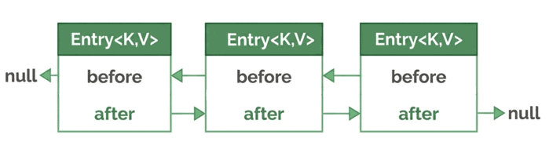

# Maintaining Insertion Order (LinkedHashMap)

Source: [Maintaining Insertion Order – Baeldung](https://www.baeldung.com/members/courses/learn-java-collections/lessons/lessons-4-linkedhashmap-maintaining-insertion-order)

## 1. Overview

This lesson introduces `LinkedHashMap`, a `Map` variant designed to preserve the order of its elements — combining the efficiency of hashing with predictable iteration. It covers how this map differs from others studied so far, what kinds of ordering it can maintain, and how those choices affect iteration and usage.

Relevant modules: `linkedhashmap-start` (start), `linkedhashmap-end` (fully implemented reference).

## 2. LinkedHashMap Features

The key feature of `LinkedHashMap` is a predictable iteration order. Internally, it uses a doubly-linked list connecting all entries, so iteration always follows the order in which elements are encountered.

`LinkedHashMap` extends `HashMap` and also implements `SequencedMap`, which defines maps with a well-defined encounter order and adds APIs for operating on both ends of the sequence.

### 2.1. Internal Structure: A Doubly-Linked List of Nodes

Internally, `LinkedHashMap` maintains its entries in a doubly-linked list. Each entry keeps references to the previous and next ones, preserving a predictable iteration order.



### 2.2. Insertion-Ordered LinkedHashMap (Default)

By default, a `LinkedHashMap` iterates in the order entries were inserted — the "encounter order" — consistently preserved across all three collection views (`entrySet()`, `keySet()`, `values()`).

```java
@Test
void givenLinkedMapOfTasks_whenPutTasksInSpecificOrder_thenTaskInsertionOrderPreserved() {
    taskMap.put(task2.getCode(), task2); // 1st
    taskMap.put(task3.getCode(), task3); // 2nd
    taskMap.put(task1.getCode(), task1); // 3rd
    List<String> expectedKeyOrder = List.of("T002", "T003", "T001");
    List<String> actualKeyOrder = new ArrayList<>(taskMap.keySet());
    assertEquals(expectedKeyOrder, actualKeyOrder, "LinkedHashMap should maintain insertion order.");
}
```

Iteration order matches insertion order exactly: T002, then T003, then T001.

Updating the value for an existing key does **not** affect iteration order:

```java
@Test
void givenLinkedMapOfTasks_whenUpdateTaskForExistingKey_thenTaskInsertionOrderUnchanged() {
    taskMap.put(task3.getCode(), task3);
    taskMap.put(task1.getCode(), task1);
    taskMap.put(task2.getCode(), task2);
    List<String> initialOrder = new ArrayList<>(taskMap.keySet());
    Task updatedTask1 = new Task("T001", "Start Report", "Start quarterly sales report", LocalDate.of(2050, 7, 15));
    taskMap.put(updatedTask1.getCode(), updatedTask1);
    List<String> newOrder = new ArrayList<>(taskMap.keySet());
    assertEquals(initialOrder, newOrder, "Updating an element should not alter its position.");
    assertEquals("Start Report", taskMap.get("T001").getName());
}
```

T001's value is updated, but its position in the iteration order stays the same.

### 2.3. Access-Ordered LinkedHashMap

A `LinkedHashMap` can also iterate from least-recently to most-recently accessed — useful for recency-aware iteration such as LRU caches. Accessing an entry moves it to the end of the iteration order. Not every operation counts as an access: `put` only updates the order if the value actually changed.

Opt in via the constructor `LinkedHashMap(int initialCapacity, float loadFactor, boolean accessOrder)`, setting `accessOrder` to `true`.

```java
@Test
void givenAccessOrderedLinkedMapOfTasks_whenGetTask_thenMapAccessOrderChanged() {
    Map<String, Task> taskMap = new LinkedHashMap<>(16, 0.75f, true);
    taskMap.put(task2.getCode(), task2);
    taskMap.put(task3.getCode(), task3);
    taskMap.put(task1.getCode(), task1);
    taskMap.get("T002");
    List<String> expectedOrderAfterAccess = List.of("T003", "T001", "T002");
    List<String> actualOrderAfterAccess = new ArrayList<>(taskMap.keySet());
    assertEquals(expectedOrderAfterAccess, actualOrderAfterAccess, "The accessed key 'T002' should move to the end.");
}
```

After `get("T002")`, the accessed entry moves to the end of the iteration order.

## 3. LinkedHashMap vs. HashMap

Both are hash-based `Map` implementations; `LinkedHashMap` extends `HashMap`, adding ordering guarantees on top of the basic hash table structure.

| Feature | LinkedHashMap | HashMap |
|---|---|---|
| Ordering | Predictable: insertion order (default) or access order (configurable) | No ordering guarantee |
| Internal Implementation | Hash table + doubly-linked list | Hash table |
| Basic Operations Performance | Near constant-time (slightly more overhead than HashMap) | Constant-time |
| Iteration Performance | Grows with number of stored elements | Grows with table capacity (can include empty slots) |
| Use Case | Preserving order while storing key-value pairs | Maximum speed when order is irrelevant |
| Memory Usage | Higher, due to extra node pointers for ordering | Lower, no linked list overhead |

## 4. Common Use Cases for LinkedHashMap

- **Caching (LRU)**: in access-order mode, `LinkedHashMap` can implement a simple Least Recently Used cache.
- **Ordered data formats**: useful for JSON, XML, or configuration files where field order matters.
- **Reproducing user input**: keeps the original sequence of user actions or inputs (logs, forms).
- **Tracking events**: maintaining chronological order of events in workflows or histories.
- **Configuration settings**: preserving property order in files for readability and grouping.

### 4.1. Practical Example: LRU Cache

An LRU cache is a fixed-size cache that automatically evicts the least recently used item when capacity is exceeded. `LinkedHashMap` makes this easy via access-order mode plus overriding `removeEldestEntry()`.

```java
private static class LruCache<K, V> extends LinkedHashMap<K, V> {
    private final int capacity;
    public LruCache(int capacity) {
        super(capacity, 0.75f, true);
        this.capacity = capacity;
    }
    @Override
    protected boolean removeEldestEntry(Map.Entry<K, V> eldest) {
        return size() > capacity;
    }
}
```

The map is configured in access-order mode (`true` flag), and `removeEldestEntry()` is overridden so the cache never exceeds the given capacity. This pattern is widely used where memory is limited or frequently accessed items need to stay available — e.g., caching API responses, database lookups, or recently opened files in an editor.

```java
@Test
void givenTaskCache_whenPutExceedsCapacity_thenLeastRecentlyUsedTaskRemoved() {
    LruCache<String, Task> cache = new LruCache<>(3); // can update the capacity here
    cache.put(task1.getCode(), task1); // Least recently used
    cache.put(task2.getCode(), task2);
    cache.put(task3.getCode(), task3); // Most recently used
    Task task4 = new Task("T004", "Another Task", "Another description", null);
    cache.put(task4.getCode(), task4);

    // The size is limited by the capacity we defined.
    assertEquals(3, cache.size(), "Cache size should remain equal to the defined capacity.");
    // Assert that the least recently used item has been removed.
    assertFalse(cache.containsKey(task1.getCode()), "Key 'T001' should have been removed.");
    // Assert that the other items are still present.
    assertTrue(cache.containsKey(task2.getCode()), "Task 'T002' should still be in the cache");
    assertTrue(cache.containsKey(task3.getCode()), "Task 'T003' should still be in the cache");
    assertTrue(cache.containsKey(task4.getCode()), "The new Task 'T004' is in the cache");
}
```

Inserting `"T004"` forces out the eldest entry, `"T001"`, demonstrating LRU behavior.

## 5. Conclusion

`LinkedHashMap` combines the fast lookups of a `HashMap` with the ordering guarantees of a doubly-linked list. By default, entries follow insertion order; with a special constructor, the order can instead reflect access, moving recently used entries to the end. This makes `LinkedHashMap` a strong choice whenever both map semantics and ordering matter — from preserving user input sequence to building simple LRU caches.