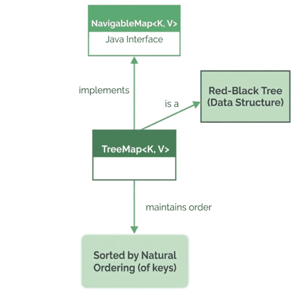

# Sorted Maps and Natural Ordering (TreeMap)

Source: [Sorted Maps and Natural Ordering – Baeldung](https://www.baeldung.com/members/courses/learn-java-collections/lessons/lesson-5-treemap-sorted-maps-and-natural-ordering)

## 1. Overview

`TreeMap<K, V>` is a `Map` implementation that keeps its entries sorted by key — the natural choice for iteration in key order, range queries, or "what comes next" lookups that `HashMap` can't give us.

Relevant modules:
- Start: [treemap-start](https://github.com/Baeldung/learn-java-collections/tree/module5/treemap-start)
- End (fully implemented): [treemap-end](https://github.com/Baeldung/learn-java-collections/tree/module5/treemap-end)

## 2. TreeMap: A Sorted Navigable Map

`TreeMap` keeps its keys in sorted order and lets us navigate them. Like `HashMap`, it extends `AbstractMap` and implements `Map`, but it also implements `NavigableMap` — giving ordered iteration, first/last lookups, "higher key"/"lower key" queries, and range views out of the box.

Internally, `TreeMap` is backed by a [Red-Black tree](https://www.baeldung.com/cs/red-black-trees), a self-balancing binary search tree that keeps keys sorted as entries are added and removed.



This sorted structure has a cost: `put()`, `get()`, and `remove()` run in **O(log n)**, versus `HashMap`'s average O(1). For most application code the difference is negligible, but it's worth remembering when ordering or range queries aren't actually needed.

## 3. TreeMap Sorted by Natural Ordering

By default, `TreeMap` sorts its keys using natural ordering, regardless of insertion order.

Setup — `TreeMap<String, Task> taskMap`, populated out of alphabetical order:

```java
TreeMap<String, Task> taskMap = new TreeMap<>();
Task taskA = new Task("TaskA", "Complete Report", "Finish quarterly sales report", LocalDate.of(2050, 7, 15));
Task taskB = new Task("TaskB", "Schedule Meeting", "Arrange team sync-up", LocalDate.of(2050, 7, 10));
Task taskC = new Task("TaskC", "Review Code", "Review pull requests for project", LocalDate.of(2050, 7, 12));
taskMap.put(taskB.getCode(), taskB);
taskMap.put(taskC.getCode(), taskC);
taskMap.put(taskA.getCode(), taskA);
```

```java
@Test
void givenTreeMapOfTasksAddedOutOfOrder_whenIterate_thenTasksSortedByKey() {
    NavigableSet<String> keySet = taskMap.navigableKeySet();
    Iterator<String> keyIterator = keySet.iterator();

    assertEquals("TaskA", keyIterator.next());
    assertEquals("TaskB", keyIterator.next());
    assertEquals("TaskC", keyIterator.next());
}
```

Despite insertion order being B, C, A, iteration order is TaskA, TaskB, TaskC — natural (lexicographical) order. We obtain a `NavigableSet` view via `navigableKeySet()`, then iterate with `next()` to confirm the sort.

## 4. TreeMap Sorted with a Custom Comparator

To sort differently from natural ordering, pass a `Comparator` to the constructor.

Example — sorting by task name instead of code. Since the keys are String task codes (not `Task` objects), the comparator looks up each code in a reference map and compares by the resolved name:

```java
@Test
void givenCustomSortedTreeMapOfTasks_whenIterate_thenKeysSortedByTaskNameReturned() {
    Map<String, Task> initialTaskMap = new HashMap<>();
    initialTaskMap.put(taskA.getCode(), taskA);
    initialTaskMap.put(taskB.getCode(), taskB);
    initialTaskMap.put(taskC.getCode(), taskC);

    Comparator<String> byName = Comparator.comparing(code -> initialTaskMap.get(code).getName());
    TreeMap<String, Task> byNameMap = new TreeMap<>(byName);
    byNameMap.putAll(initialTaskMap);
    NavigableSet<String> keySet = byNameMap.navigableKeySet();
    Iterator<String> keyIterator = keySet.iterator();

    assertEquals("Complete Report", byNameMap.get(keyIterator.next()).getName());
    assertEquals("Review Code", byNameMap.get(keyIterator.next()).getName());
    assertEquals("Schedule Meeting", byNameMap.get(keyIterator.next()).getName());
}
```

Keys now sort by task name: "Complete Report", "Review Code", "Schedule Meeting" — instead of natural key order.

## 5. Basic Operations and Navigation

`TreeMap` supports all standard `put`, `get`, `remove` operations, plus navigation over the sorted key set.

### 5.1. Adding and Removing

```java
@Test
void givenTreeMapOfTasks_whenPutAndRemoveTask_thenNaturalOrderPreserved() {
    Task newTask = new Task("TaskD", "Start Project", "Start a new project", LocalDate.of(2050, 7, 3));
    taskMap.put(newTask.getCode(), newTask);
    assertEquals("TaskD", taskMap.lastKey());

    taskMap.remove("TaskA");
    assertEquals("TaskB", taskMap.firstKey());
}
```

Adding "TaskD" makes it the last key (per natural ordering) — confirmed via `lastKey()`. Removing "TaskA" makes "TaskB" the first key, via `firstKey()`.

### 5.2. Navigating the Map

Several navigation methods locate entries or keys, making `TreeMap` well-suited to search operations.

`firstEntry()` / `lastEntry()`:

```java
@Test
void givenTreeMapOfTasks_whenFindFirstTask_thenFirstTaskReturned() {
    assertEquals(taskA, taskMap.firstEntry().getValue());
}
```

For a portion of the map, use `headMap()`, `tailMap()`, or `subMap()`. `subMap(K fromKey, K toKey)` returns a view whose keys range from `fromKey` (inclusive) to `toKey` (exclusive):

```java
@Test
void givenTreeMapOfTasks_whenSubMapOfTasks_thenSubMapOfTasksReturned() {
    SortedMap<String, Task> subMap = taskMap.subMap("TaskA", "TaskC");

    assertEquals(2, subMap.size());
    assertTrue(subMap.containsKey("TaskA"));
    assertTrue(subMap.containsKey("TaskB"));
    assertFalse(subMap.containsKey("TaskC"));
}
```

`subMap("TaskA", "TaskC")` returns keys >= "TaskA" and < "TaskC" (TaskA, TaskB).

## 6. A Practical Example – Dictionary

`TreeMap` automatically keeps entries sorted alphabetically by key — ideal for a dictionary. Setup, using a case-insensitive comparator:

```java
TreeMap<String, String> dictionary = new TreeMap<>(String.CASE_INSENSITIVE_ORDER);
dictionary.put("Compiler", "A program that translates code from a high-level language to a lower-level language.");
dictionary.put("API", "Application Programming Interface; a set of rules allowing different applications to communicate.");
dictionary.put("Tree", "A data structure consisting of nodes in a parent-child relationship.");
dictionary.put("Binary", "A numeric system that only uses two digits, 0 and 1.");
dictionary.put("Algorithm", "A set of step-by-step procedures for solving a problem or accomplishing a task.");
```

With default natural ordering, "API" would sort before "Algorithm" because uppercase letters precede lowercase ones lexicographically. `String.CASE_INSENSITIVE_ORDER` produces the dictionary-style ordering a reader expects.

Alphabetical ordering check:

```java
@Test
void givenDictionary_whenGetWords_thenWordsInAlphabeticalOrder() {
    assertEquals("Algorithm", dictionary.firstKey());
    assertEquals("Tree", dictionary.lastKey());

    String afterCompiler = dictionary.higherKey("Compiler");
    assertEquals("Tree", afterCompiler, "Tree should come after Compiler");
}
```

First/last keys confirm alphabetical order; `higherKey(K key)` confirms ordering between entries.

Range query — all terms before 'C':

```java
@Test
void givenDictionary_whenRangeLookup_thenSubsetOfWordsReturned() {
    SortedMap<String, String> earlyTerms = dictionary.headMap("C");

    assertEquals(3, earlyTerms.size());
    assertFalse(earlyTerms.containsKey("Compiler"));
    assertTrue(earlyTerms.containsKey("Binary"));
}
```

## 7. Conclusion

`TreeMap` is a sorted, navigable `Map` implementation that automatically orders keys using either natural ordering or a custom `Comparator`, enabling efficient navigation and range queries on top of standard map operations. The trade-off is the O(log n) cost of keeping the tree balanced — worth paying whenever the order of the keys is itself part of what the map needs to provide, as the dictionary example shows.