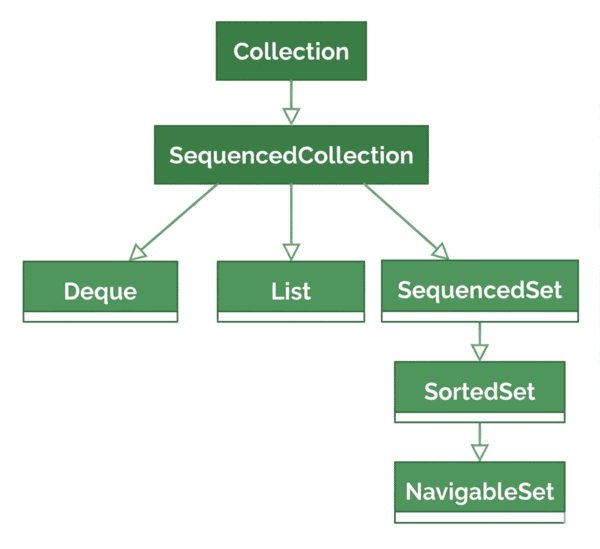
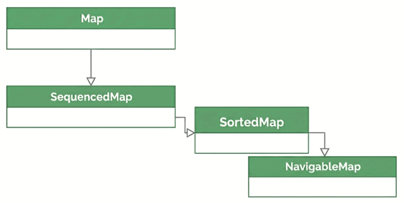

# Sequenced Collections

## 1. Overview

The Java collections framework lacks a unified interface for accessing elements in a defined, encounter order across different collection types.

In this lesson, we'll explore how Java 21's Sequenced Collections solves the problem of inefficient, inconsistent, and incomplete APIs.

The relevant module we need to import when starting this lesson is: `sequenced-collections-start`.

If we want to reference the fully implemented lesson, we can import: `sequenced-collections-end`.

## 2. The Sequenced Collections API

A "sequenced collection" in Java 21 represents a collection that has a well-defined, repeatable "encounter order". It means that there is a predictable "first" element, a "last" element, and a specific order for all elements in between. This is the order in which an iterator returns elements or when using a for-each loop.

Note that the sequenced collections API provides a common layer of functionality; however, it doesn't represent a sorted order. Further, the encounter order is not necessarily based on any natural or custom element sorting criteria.

Before Java 21, getting the last or the first element of a collection required knowing the specific collection type and its unique API. There was no single, unified method for this common operation.

As an example, to get the last task from a `List`, we had to know its size and use an index-based `get()` method, such as `list.get(list.size()-1)`. Similarly, to get the last task from a `Set`, we had to first convert the `Set` to a `List` and then, as before, use its size.

## 3. The New Interfaces

The introduction of sequenced collections interfaces in Java 21 addresses this problem by providing a unified set of methods.

### 3.1. SequencedCollection

The new `SequencedCollection` interface extends the `Collection` interface, with other interfaces extending it, directly or indirectly.



Specifically, `SequencedCollection` offers:

First and last elements: it guarantees that we can get and/or remove the first and last elements of the collection directly, with methods such as `getFirst()`, `getLast()`, `removeFirst()`, and `removeLast()`.

Successors and predecessors: each element (except the first and last) has a clear predecessor and successor.

Reversibility: it introduces the `reversed()` method, which provides a view of the collection with its encounter order inverted, allowing for simple, unified reverse iteration.

Note that the different interfaces within the sequenced collections API have unique characteristics, because they extend other interfaces in addition to the `SequencedCollection` interface. Here are some key methods and how they unify the API (using short-form notation without instantiation):

| Operation | Before Java 21 | With Java 21 (SequencedCollection) |
|---|---|---|
| Get the first element | `list.get(0)`, `deque.getFirst()`, `sortedSet.first()` | `collection.getFirst()` |
| Get the last element | `list.get(list.size()-1)`, `deque.getLast()`, `sortedSet.last()` | `collection.getLast()` |
| Add to the front | `list.add(0, e)`, `deque.addFirst(e)` | `collection.addFirst(e)` |
| Add to the end | `list.add(e)`, `deque.addLast(e)` | `collection.addLast(e)` |
| Get a reversed view | No common method; manual iteration required | `collection.reversed()` |

### 3.2. Deque in Java 21

The primary difference between the pre-Java 21 `Deque` and the `Deque` in Java 21 lies in its position within the Collections Framework inheritance hierarchy. In Java 21, `Deque` now extends the new interface `SequencedCollection`.

It's important to note that the common methods for working with both ends of a sequence (`addFirst(E)`, `addLast(E)`, `getFirst()`, `getLast()`, `removeFirst()`, and `removeLast()`) were already part of the `Deque` interface before Java 21. In Java 21, these methods were "promoted" to the new `SequencedCollection` interface.

The only new functionality in `Deque` is the `reversed()` method that it inherits from `SequencedCollection`, to obtain a reverse-ordered view of the `Deque`:

```java
@Test
void givenDequeOfTasks_whenUsingSequencedDeque_thenCanReverseView() {
    Deque<Task> taskDeque = new ArrayDeque<>();
    taskDeque.addLast(taskA);
    taskDeque.addLast(taskB);
    taskDeque.addLast(taskC);

    Deque<Task> reversedDeque = taskDeque.reversed();

    assertEquals(taskA, reversedDeque.getLast());
    assertEquals(taskC, reversedDeque.getFirst());
}
```

Note that `Deque` provides a covariant override of the `reversed()` method to return a `Deque` instead of a `SequencedCollection`.

### 3.3. List in Java 21

The `List` interface has been a core component of the Java Collections Framework since its inception. It represents an ordered collection (also known as a sequence) of elements accessible by their integer index.

In Java 21, `List` now extends `SequencedCollection`. This means that all `List` implementations (such as `ArrayList` or `LinkedList`) automatically inherit the new sequenced methods, providing a unified API. The main unique feature of `List` compared to `SequencedCollection` is its indexed access and manipulation.

The updated `List` fixes the issue of getting the last element that we mentioned earlier. Furthermore, we can now quickly obtain a reversed view:

```java
@Test
void givenListOfTasks_whenUsingSequencedList_thenCanGetLastTaskAndReverseView() {
    List<Task> taskList = new ArrayList<>();
    taskList.add(taskA);
    taskList.add(taskB);
    taskList.add(taskC);

    assertEquals(taskC, taskList.getLast());
    assertEquals(taskC, taskList.reversed().getFirst());
}
```

### 3.4. SequencedSet

`SequencedSet` extends both the `Set` interface and the new `SequencedCollection` interface, so it inherits the properties of both. The key difference between `SequencedSet` and `SequencedCollection` is that a `SequencedSet` enforces the uniqueness of elements, while `SequencedCollection` doesn't.

`SequencedSet` fixes the issue of getting the last element that we mentioned earlier:

```java
@Test
void givenSetOfTasks_whenUsingSequencedSet_thenGetLastTaskIsConsistent() {
    SequencedSet<Task> taskSet = new LinkedHashSet<>();
    taskSet.add(taskA);
    taskSet.add(taskB);
    taskSet.add(taskC);

    assertEquals(taskC, taskSet.getLast());
}
```

### 3.5. SequencedMap

`SequencedMap` doesn't directly extend `SequencedCollection`; however, its encounter order is similar to that of the elements of a `SequencedCollection`.

Its uniqueness is that the ordering applies to key-value mappings rather than individual elements. Further, it directly extends `Map` and is extended by other interfaces, directly or indirectly.



`SequencedMap` provides a unified way to access the first and last key-value pairs in a map (such as `LinkedHashMap` or `TreeMap`). For this, it has methods such as `firstEntry()`, `lastEntry()`, and a `reversed()` method that returns a reversed view of the map:

```java
@Test
void givenMapOfTasks_whenUsingSequencedMap_thenCanAccessFirstAndLastEntries() {
    SequencedMap<String, Task> taskMap = new LinkedHashMap<>();
    taskMap.put("TaskA", taskA);
    taskMap.put("TaskB", taskB);
    taskMap.put("TaskC", taskC);

    assertEquals("TaskA", taskMap.firstEntry().getKey());
    assertEquals("TaskC", taskMap.lastEntry().getKey());
}
```

## 4. When to Use Sequenced Collections?

Here are some real-world examples of when we can use sequenced collections.

Managing a history of actions: an application that tracks a user's recent actions, such as a web browser's history or a code editor's undo/redo history.

Processing jobs in a specific order: a task scheduler or a print queue often processes jobs in the order they are received. The next job to process is the first one in the queue, and sometimes we need to place a new, high-priority job at the front.

Maintaining ordered configuration or properties: in applications where configuration settings or properties need to be stored in a specific order (e.g., a list of plugins to load, or the order of layers in a graphics editor).

Displaying a sorted list of products: an e-commerce application might display a list of products in a specific, sorted order (e.g., by price, popularity, or customer rating). `SequencedSet` is perfect for this.

## 5. A Practical Example – Task History System

Let's develop a practical application of a Task History System using Java 21's new sequenced methods. The core logic is written only against the `SequencedCollection` interface, demonstrating how the same code can manage task history regardless of whether it's backed by an `ArrayList` or a `LinkedHashSet`. For this, let's define a service class in the `service` package:

```java
public class TaskHistoryManager {
    private final SequencedCollection<Task> history;

    public TaskHistoryManager(SequencedCollection<Task> history) {
        this.history = history;
    }

    public void addTask(Task task) {
        history.addLast(task);
    }

    public Task getLastTask() {
        if (history.isEmpty()) return null;
        return history.getLast();
    }

    public Task getFirstTask() {
        if (history.isEmpty()) return null;
        return history.getFirst();
    }

    public Task undoLastTask() {
        if (history.isEmpty()) return null;
        return history.removeLast();
    }

    public SequencedCollection<Task> getRecentHistory() {
        return history.reversed();
    }

    @Override
    public String toString() {
        return history.stream().map(Task::getCode).collect(Collectors.joining(" -> "));
    }
}
```

Now, let's open our `TaskHistorySystemUnitTest`, in which we've set up three `Task` objects. Let's add a unified method to check common history management operations:

```java
private void runCommonTests(SequencedCollection<Task> backingCollection) {
    TaskHistoryManager manager = new TaskHistoryManager(backingCollection);
    manager.addTask(taskA);
    manager.addTask(taskB);
    manager.addTask(taskC);

    assertEquals(taskA, manager.getFirstTask());
    assertEquals(taskC, manager.getLastTask());

    SequencedCollection<Task> recentHistory = manager.getRecentHistory();
    assertEquals(taskC, recentHistory.getFirst());
    assertEquals(taskA, recentHistory.getLast());

    assertEquals(taskC, manager.undoLastTask());
    assertEquals(taskB, manager.getLastTask());
}
```

Within the same `TaskHistorySystemUnitTest`, we can perform task history management with `ArrayList` or `LinkedHashSet`:

```java
@Test
void givenTaskHistoryManager_whenBackedByList_thenOk() {
    runCommonTests(new ArrayList<>());
}

@Test
void givenTaskHistoryManager_whenBackedBySet_thenOk() {
    runCommonTests(new LinkedHashSet<>());
}
```

## 6. Conclusion

In this lesson, we've seen how sequenced collections unify the way we access elements at the front and back of a collection, regardless of its concrete type. By programming against a single shared abstraction, code that maintains an ordered history, queue, or sequence no longer needs to branch on the specific collection implementation.

The practical payoff is that ordered-data APIs become simpler to read, easier to evolve, and consistent across the framework.