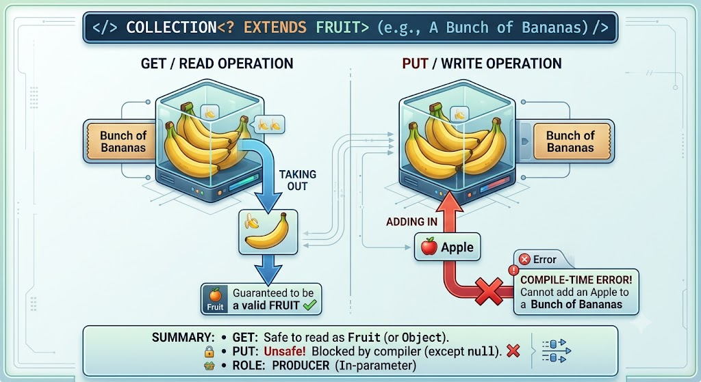
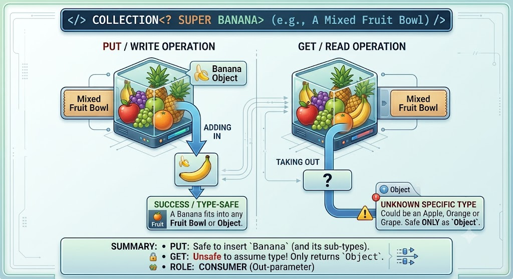
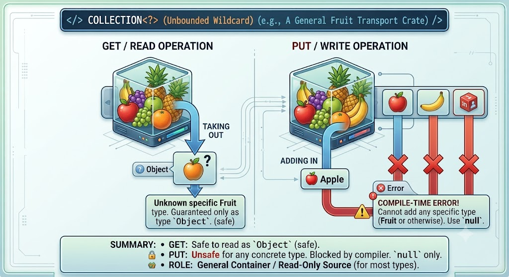

# Wildcards

## 1. Overview

In generic code, the question mark (`?`), called the wildcard, represents an unknown type. The wildcard can be used in a variety of situations: as the type of a parameter, field, or local variable; sometimes as a return type (though it is better programming practice to be more specific). The wildcard is never used as a type argument for a generic method invocation, a generic class instance creation, or a supertype.

Generics support [wildcards](https://docs.oracle.com/javase/tutorial/java/generics/wildcards.html), which are divided into three types:

Upper bounded wildcards — [`<? extends Number>`](https://docs.oracle.com/javase/tutorial/java/generics/upperBounded.html)

Unbounded wildcards — [`<?>`](https://docs.oracle.com/javase/tutorial/java/generics/unboundedWildcards.html)

Lower bounded wildcards — [`<? super Integer>`](https://docs.oracle.com/javase/tutorial/java/generics/lowerBounded.html)

Wildcard use should adhere to the [Get-Put principle](https://stackoverflow.com/questions/1292109/explanation-of-the-get-put-principle), which can be expressed as follows: use an `extends` wildcard when we only get values out of a structure; use a `super` wildcard when we only put values into a structure; and don't use a wildcard when we both want to get and put from/to a structure. This principle is also called Producer Extends, Consumer Super (PECS).

A useful analogy is fruit. Consider a bunch of bananas. This is a `Collection<? extends Fruit>`, in that it's a collection of a particular kind of fruit — but we don't know (from that declaration) what kind of fruit it's a collection of. We can get an item from it and know it will definitely be a fruit, but we can't add to it — we might be trying to add an apple to a bunch of bananas, which would definitely be wrong. We can add `null` to it, as that will be a valid value for any kind of fruit.

Now consider a fruit bowl. This is a `Collection<? super Banana>`, in that it's a collection of some type "greater than" `Banana` (for instance, `Collection<Fruit>` or `Collection<TropicalFruit>`). We can definitely add a banana to this, but if we fetch an item from the bowl we don't know what we'll get — it may well not be a banana. All we know for sure is that it will be a valid (possibly `null`) `Object` reference.

The two diagrams below lay out the mechanics of each analogy: what's safe to get, and what's safe to put.

**`Collection<? extends Fruit>` — the bunch of bananas (a producer, read-only):**



**`Collection<? super Banana>` — the fruit bowl (a consumer, write-only):**



**`Collection<?>` — the mystery fruit transport crate (a generalized, read-only structure):**



Quick reference:

| Feature | `? extends T` (Upper Bound) | `? super T` (Lower Bound) |
|---|---|---|
| Analogy | Bunch of bananas (`? extends Fruit`) | Fruit bowl (`? super Banana`) |
| Role | Producer (provides elements) | Consumer (accepts elements) |
| Read (`get`) | Safe → returns `T` | Unsafe → returns `Object` |
| Write (`add`) | Forbidden (only `null`) | Safe → accepts `T` |
| Keyword | PECS → **P**roducer **E**xtends | PECS → **C**onsumer **S**uper |

A small example of what won't work:

```java
public static class TestClass {
    public static void print(List<? extends String> list) {
        list.add("Hello, World!");
        System.out.println(list.get(0));
    }
}

public static void main(String []args) {
    List<String> list = new ArrayList<>();
    TestClass.print(list);
}
```

If we replace `extends` with `super`, everything is fine. Because we populate the list with a value before displaying its contents, it is a consumer. Accordingly, we use `super`.

## 2. Upper Bounded Wildcards

We can use an upper bounded wildcard to relax the restrictions on a variable. For example, say we want to write a method that works on `List<Integer>`, `List<Double>`, and `List<Number>` — we can achieve this by using an upper bounded wildcard.

To declare an upper-bounded wildcard, use the wildcard character (`?`), followed by the `extends` keyword, followed by its upper bound. Note that, in this context, `extends` is used in a general sense to mean either "extends" (as in classes) or "implements" (as in interfaces).

To write a method that works on lists of `Number` and its subtypes, such as `Integer`, `Double`, and `Float`, we would specify `List<? extends Number>`. The term `List<Number>` is more restrictive than `List<? extends Number>` because the former matches a list of type `Number` only, whereas the latter matches a list of type `Number` or any of its subclasses.

Consider the following `process` method:

```java
public static void process(List<? extends Foo> list) { /* ... */ }
```

The upper bounded wildcard `<? extends Foo>`, where `Foo` is any type, matches `Foo` and any subtype of `Foo`. The `process` method can access the list elements as type `Foo`:

```java
public static void process(List<? extends Foo> list) {
    for (Foo elem : list) {
        // ...
    }
}
```

In the for-each clause, the `elem` variable iterates over each element in the list. Any method defined in the `Foo` class can now be used on `elem`.

The `sumOfList` method returns the sum of the numbers in a list:

```java
public static double sumOfList(List<? extends Number> list) {
    double s = 0.0;
    for (Number n : list)
        s += n.doubleValue();
    return s;
}
```

The following code, using a list of `Integer` objects, prints `sum = 6.0`:

```java
List<Integer> li = Arrays.asList(1, 2, 3);
System.out.println("sum = " + sumOfList(li));
```

A list of `Double` values can use the same `sumOfList` method. The following code prints `sum = 7.0`:

```java
List<Double> ld = Arrays.asList(1.2, 2.3, 3.5);
System.out.println("sum = " + sumOfList(ld));
```

## 3. Unbounded Wildcards

The unbounded wildcard type is specified using the wildcard character (`?`), for example, `List<?>`. This is called a list of unknown type. There are two scenarios where an unbounded wildcard is a useful approach: if we're writing a method that can be implemented using functionality provided in the `Object` class, or when the code is using methods in the generic class that don't depend on the type parameter — for example, `List.size` or `List.clear`. In fact, `Class<?>` is so often used because most of the methods in `Class<T>` do not depend on `T`.

Consider the following method, `printList`:

```java
public static void printList(List<Object> list) {
    for (Object elem : list)
        System.out.println(elem + " ");
    System.out.println();
}
```

The goal of `printList` is to print a list of any type, but it fails to achieve that goal — it prints only a list of `Object` instances; it cannot print `List<Integer>`, `List<String>`, `List<Double>`, and so on, because they are not subtypes of `List<Object>`. To write a generic `printList` method, use `List<?>`:

```java
public static void printList(List<?> list) {
    for (Object elem: list)
        System.out.print(elem + " ");
    System.out.println();
}
```

Because for any concrete type `A`, `List<A>` is a subtype of `List<?>`, we can use `printList` to print a list of any type:

```java
List<Integer> li = Arrays.asList(1, 2, 3);
List<String>  ls = Arrays.asList("one", "two", "three");
printList(li);
printList(ls);
```

Note: the `Arrays.asList` method converts the specified array and returns a fixed-size list.

It's important to note that `List<Object>` and `List<?>` are not the same. We can insert an `Object`, or any subtype of `Object`, into a `List<Object>`. But we can only insert `null` into a `List<?>`. The Guidelines for Wildcard Use section below has more information on how to determine what kind of wildcard, if any, should be used in a given situation.

## 4. Lower Bounded Wildcards

The upper bounded wildcards section shows that an upper bounded wildcard restricts the unknown type to be a specific type or a subtype of that type, and is represented using the `extends` keyword. In a similar way, a lower bounded wildcard restricts the unknown type to be a specific type or a supertype of that type.

A lower bounded wildcard is expressed using the wildcard character (`?`), followed by the `super` keyword, followed by its lower bound: `<? super A>`.

Note: we can specify an upper bound for a wildcard, or we can specify a lower bound, but we cannot specify both.

Say we want to write a method that puts `Integer` objects into a list. To maximize flexibility, we would like the method to work on `List<Integer>`, `List<Number>`, and `List<Object>` — anything that can hold `Integer` values.

To write a method that works on lists of `Integer` and the supertypes of `Integer`, such as `Integer`, `Number`, and `Object`, we would specify `List<? super Integer>`. The term `List<Integer>` is more restrictive than `List<? super Integer>`, because the former matches a list of type `Integer` only, whereas the latter matches a list of any type that is a supertype of `Integer`.

The following code adds the numbers 1 through 10 to the end of a list:

```java
public static void addNumbers(List<? super Integer> list) {
    for (int i = 1; i <= 10; i++) {
        list.add(i);
    }
}
```

## 5. Wildcards and Subtyping

Generic classes or interfaces are not related merely because there is a relationship between their types. This differs from how inheritance works with regular, non-generic classes, and it's a common trap when first working with generics. However, we can use wildcards to create a relationship between generic classes or interfaces where one wouldn't otherwise exist.

Given the following two regular (non-generic) classes:

```java
class A { /* ... */ }
class B extends A { /* ... */ }
```

It would be reasonable to write the following code:

```java
B b = new B();
A a = b;
```

This example shows that inheritance of regular classes follows this rule of subtyping: class `B` is a subtype of class `A` if `B extends A`. This rule does not apply to generic types — `List<B>` is not a subtype of `List<A>`, even though `B` is a subtype of `A`:

```java
List<B> lb = new ArrayList<>();
List<A> la = lb;   // compile-time error
```

Given that `Integer` is a subtype of `Number`, what is the relationship between `List<Integer>` and `List<Number>`? Although `Integer` is a subtype of `Number`, `List<Integer>` is not a subtype of `List<Number>` — in fact, these two types are not related. The common parent of `List<Number>` and `List<Integer>` is `List<?>`.

In order to create a relationship between these classes so that the code can access `Number`'s methods through `List<Integer>`'s elements, use an upper bounded wildcard:

```java
List<? extends Integer> intList = new ArrayList<>();
List<? extends Number>  numList = intList;  // OK. List<? extends Integer> is a subtype of List<? extends Number>
```

Because `Integer` is a subtype of `Number`, and `numList` is a list of `Number` objects, a relationship now exists between `intList` (a list of `Integer` objects) and `numList`.

Putting the full hierarchy together: `List<Integer>` is a subtype of both `List<? extends Integer>` and `List<? super Integer>`. `List<? extends Integer>` is a subtype of `List<? extends Number>`, which is a subtype of `List<?>`. `List<Number>` is a subtype of both `List<? super Number>` and `List<? extends Number>`. `List<? super Number>` is a subtype of `List<? super Integer>`, which is a subtype of `List<?>`.

## 6. Wildcard Capture and Helper Methods

In some cases, the compiler infers the type of a wildcard. For example, a list may be defined as `List<?>` but, when evaluating an expression, the compiler infers a particular type from the code. This scenario is known as wildcard capture.

For the most part, we don't need to worry about wildcard capture, except when we see an error message that contains the phrase "capture of".

The `WildcardError` example produces a capture error when compiled:

```java
import java.util.List;

public class WildcardError {

    void foo(List<?> i) {
        i.set(0, i.get(0));
    }
}
```

In this example, the compiler processes the `i` input parameter as being of type `Object`. When the `foo` method invokes `List.set(int, E)`, the compiler is not able to confirm the type of object that is being inserted into the list, and an error is produced. When this type of error occurs it typically means that the compiler believes we are assigning the wrong type to a variable. Generics were added to the Java language for this reason — to enforce type safety at compile time.

The `WildcardError` example generates the following error when compiled by Oracle's JDK javac implementation:

```
WildcardError.java:6: error: method set in interface List<E> cannot be applied to given types;
    i.set(0, i.get(0));
     ^
  required: int,CAP#1
  found: int,Object
  reason: actual argument Object cannot be converted to CAP#1 by method invocation conversion
  where E is a type-variable:
    E extends Object declared in interface List
  where CAP#1 is a fresh type-variable:
    CAP#1 extends Object from capture of ?
1 error
```

In this example, the code is attempting to perform a safe operation, so how can we work around the compiler error? We can fix it by writing a private helper method which captures the wildcard. We can work around the problem by creating a private helper method, `fooHelper`, as shown in `WildcardFixed`:

```java
public class WildcardFixed {

    void foo(List<?> i) {
        fooHelper(i);
    }

    // Helper method created so that the wildcard can be captured
    // through type inference.
    private <T> void fooHelper(List<T> l) {
        l.set(0, l.get(0));
    }
}
```

Thanks to the helper method, the compiler uses inference to determine that `T` is `CAP#1`, the capture variable, in the invocation. The example now compiles successfully.

By convention, helper methods are generally named `originalMethodNameHelper`.

Now consider a more complex example, `WildcardErrorBad`:

```java
import java.util.List;

public class WildcardErrorBad {

    void swapFirst(List<? extends Number> l1, List<? extends Number> l2) {
      Number temp = l1.get(0);
      l1.set(0, l2.get(0)); // expected a CAP#1 extends Number,
                            // got a CAP#2 extends Number;
                            // same bound, but different types
      l2.set(0, temp);      // expected a CAP#1 extends Number,
                            // got a Number
    }
}
```

In this example, the code is attempting an unsafe operation. Consider the following invocation of the `swapFirst` method:

```java
List<Integer> li = Arrays.asList(1, 2, 3);
List<Double>  ld = Arrays.asList(10.10, 20.20, 30.30);
swapFirst(li, ld);
```

While `List<Integer>` and `List<Double>` both fulfill the criteria of `List<? extends Number>`, it is clearly incorrect to take an item from a list of `Integer` values and attempt to place it into a list of `Double` values.

Compiling the code with Oracle's JDK javac compiler produces errors like:

```
WildcardErrorBad.java:7: error: method set in interface List<E> cannot be applied to given types;
      l1.set(0, l2.get(0)); // expected a CAP#1 extends Number,
        ^
  required: int,CAP#1
  found: int,Number
  reason: actual argument Number cannot be converted to CAP#1 by method invocation conversion
  where E is a type-variable:
    E extends Object declared in interface List
  where CAP#1 is a fresh type-variable:
    CAP#1 extends Number from capture of ? extends Number
```

There is no helper method to work around this problem, because the code is fundamentally wrong: it is clearly incorrect to take an item from a list of `Integer` values and attempt to place it into a list of `Double` values.

## 7. Guidelines for Wildcard Use

One of the more confusing aspects when learning to program with generics is determining when to use an upper bounded wildcard and when to use a lower bounded wildcard.

For purposes of this discussion, it's helpful to think of variables as providing one of two functions.

An "in" variable serves up data to the code. Imagine a `copy` method with two arguments: `copy(src, dest)`. The `src` argument provides the data to be copied, so it is the "in" parameter. An "out" variable holds data for use elsewhere — in that same `copy(src, dest)` example, the `dest` argument accepts data, so it is the "out" parameter. Of course, some variables are used for both "in" and "out" purposes; this scenario is also addressed below.

We can use the "in" and "out" principle when deciding whether to use a wildcard and what type of wildcard is appropriate: an "in" variable is defined with an upper bounded wildcard, using the `extends` keyword; an "out" variable is defined with a lower bounded wildcard, using the `super` keyword. In the case where the "in" variable can be accessed using methods defined in the `Object` class, use an unbounded wildcard. In the case where the code needs to access the variable as both an "in" and an "out" variable, do not use a wildcard.

These guidelines do not apply to a method's return type. Using a wildcard as a return type should be avoided, because it forces programmers using the code to deal with wildcards.

A list defined by `List<? extends ...>` can be informally thought of as read-only, but that is not a strict guarantee. Suppose we have the following two classes:

```java
class NaturalNumber {

    private int i;

    public NaturalNumber(int i) { this.i = i; }
    // ...
}

class EvenNumber extends NaturalNumber {

    public EvenNumber(int i) { super(i); }
    // ...
}
```

Consider the following code:

```java
List<EvenNumber> le = new ArrayList<>();
List<? extends NaturalNumber> ln = le;
ln.add(new NaturalNumber(35));  // compile-time error
```

Because `List<EvenNumber>` is a subtype of `List<? extends NaturalNumber>`, we can assign `le` to `ln`. But we cannot use `ln` to add a natural number to a list of even numbers.

The following operations on the list are still possible: we can add `null`; we can invoke `clear`; we can get the iterator and invoke `remove`; and we can capture the wildcard and write elements that we've read from the list.

We can see that the list defined by `List<? extends NaturalNumber>` is not read-only in the strictest sense of the word, but we might think of it that way, since we cannot store a new element or change an existing element in the list.