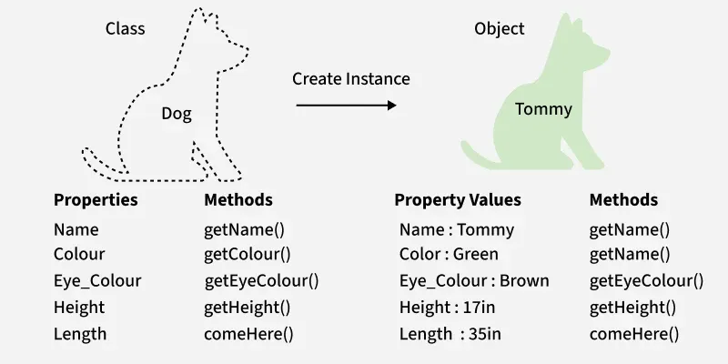
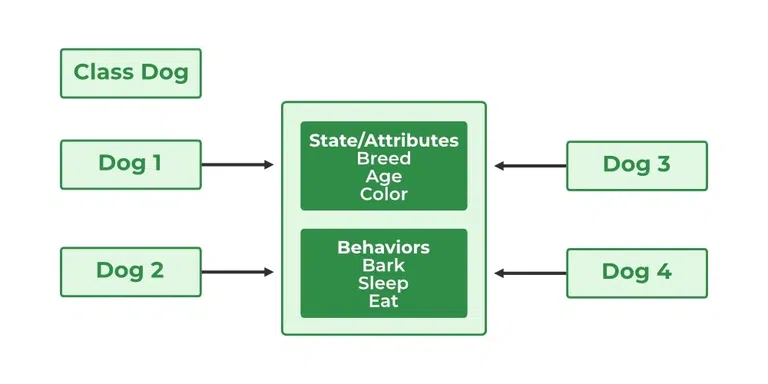

Excellent choice ✅ — I’ll now rewrite your **lesson notes on “Classes and Objects in Java”** in an **academic format** suitable for classroom use, incorporating both your uploaded document and the detailed content you pasted.

---

# **Lesson Notes: Classes and Objects in Java**

---

## **1. Introduction**

In Java, **classes** and **objects** form the foundation of **Object-Oriented Programming (OOP)**. These concepts allow developers to model real-world entities by combining data and behavior into reusable components.

* A **class** is a blueprint or template that defines the structure and behavior of objects.
* An **object** is a real instance of a class, representing an entity that holds specific data and can perform certain actions.

For example, if **Dog** is a class, then **Tommy** or **Bobby** can be objects (instances) of that class.

---

## **2. Class in Java**

### **Definition**

A **class** in Java is a user-defined data type that serves as a template for creating objects. It groups **fields (variables)** and **methods (functions)** that define the properties and behavior of its objects.

**Syntax Example:**

```java
class ClassName {
    // Fields (Data Members)
    // Methods (Member Functions)
}
```

### **Example: Student Class**

```java
class Student {
    int id;
    String name;

    // Constructor to initialize fields
    public Student(int id, String name) {
        this.id = id;
        this.name = name;
    }
}

public class Main {
    public static void main(String[] args) {
        // Creating an object of Student
        Student s1 = new Student(10, "Alice");

        System.out.println(s1.id);
        System.out.println(s1.name);
    }
}
```

**Output:**

```
10
Alice
```

### **Characteristics of a Class**

* A **class** is not a real-world object; it is a **template**.
* A **class** does not occupy memory until objects are instantiated.
* It may contain:

    * Data Members (variables)
    * Methods
    * Constructors
    * Nested Classes
    * Interfaces

---

## **3. Objects in Java**

### **Definition**

An **object** is a real instance of a class that contains its own copies of the class’s data members and methods.

Objects in Java have:

* **State:** Represented by fields (attributes or properties).
* **Behavior:** Represented by methods (actions or functions).
* **Identity:** A unique reference distinguishing one object from another.

### **Example: Dog Class**

```java
public class Dog {
    String name;
    String breed;
    int age;
    String color;

    // Constructor
    public Dog(String name, String breed, int age, String color) {
        this.name = name;
        this.breed = breed;
        this.age = age;
        this.color = color;
    }

    // Methods
    public String getName() { return name; }
    public String getBreed() { return breed; }
    public int getAge() { return age; }
    public String getColor() { return color; }

    @Override
    public String toString() {
        return ("Name: " + this.getName()
              + "\nBreed, Age, Color: " + this.getBreed() + ", "
              + this.getAge() + ", " + this.getColor());
    }

    public static void main(String[] args) {
        Dog tuffy = new Dog("Tuffy", "Papillon", 5, "White");
        System.out.println(tuffy.toString());
    }
}
```

**Output:**

```
Name: Tuffy
Breed, Age, Color: Papillon, 5, White
```

---

## **4. Object Instantiation**

Object instantiation is the process of creating an object from a class using the **`new`** keyword.

### **Syntax:**

```java
ClassName objectName = new ClassName();
```

When a class is instantiated:

* Memory is allocated on the **heap**.
* The constructor is invoked to initialize the object.
* A reference to the object is returned to the variable on the **stack**.

---

## **5. Ways to Create Objects in Java**

There are **four main ways** to create objects:

### **1. Using `new` Keyword**

The most common way to create objects.

```java
Test t = new Test();
```

---

### **2. Using Reflection**

Reflection allows runtime creation and inspection of classes.

```java
class Student { 
    public Student() {} 
}

public class Main {
    public static void main(String[] args) {
        try {
            Class<?> c = Class.forName("Student");
            Student s2 = (Student) c.getDeclaredConstructor().newInstance();
            System.out.println("Object created: " + s2);
        } catch (Exception e) {
            e.printStackTrace();
        }
    }
}
```

---

### **3. Using `clone()` Method**

Used to copy an existing object.

```java
class Geeks implements Cloneable {
    @Override
    protected Object clone() throws CloneNotSupportedException {
        return super.clone();
    }

    String name = "GeeksForGeeks";

    public static void main(String[] args) {
        Geeks obj1 = new Geeks();
        try {
            Geeks obj2 = (Geeks) obj1.clone();
            System.out.println(obj2.name);
        } catch (CloneNotSupportedException e) {
            e.printStackTrace();
        }
    }
}
```

**Output:**

```
GeeksForGeeks
```

---

### **4. Using Deserialization**

Recreates an object from a saved state (file).

```java
import java.io.*;

class Student implements Serializable {
    private String name;
    public Student(String name) { this.name = name; }
    @Override
    public String toString() { return "Student: " + name; }
}

public class Main {
    public static void main(String[] args) {
        // Serialization
        try (ObjectOutputStream out = new ObjectOutputStream(new FileOutputStream("student.ser"))) {
            out.writeObject(new Student("Alice"));
        } catch (IOException e) {
            e.printStackTrace();
        }

        // Deserialization
        try (ObjectInputStream in = new ObjectInputStream(new FileInputStream("student.ser"))) {
            Student s = (Student) in.readObject();
            System.out.println(s);
        } catch (Exception e) {
            e.printStackTrace();
        }
    }
}
```

**Output:**

```
Student: Alice
```

---

## **6. Initializing Objects**

Objects can be initialized in multiple ways:

### **a. Using Constructors**

A constructor initializes object fields at the time of creation.

### **b. Using Methods**

Objects can also be initialized by setter methods.

```java
public class Geeks {
    static String name;
    static float price;

    static void set(String n, float p) {
        name = n;
        price = p;
    }

    static void get() {
        System.out.println("Software name: " + name);
        System.out.println("Software price: " + price);
    }

    public static void main(String[] args) {
        Geeks.set("Visual Studio", 0.0f);
        Geeks.get();
    }
}
```

---

## **7. Anonymous Objects**

Anonymous objects are created without assigning a reference variable.
They are used for one-time actions, such as event handling.

```java
new Dog("Rocky", "Bulldog", 3, "Brown").getName();
```

These objects cannot be reused and are destroyed immediately after use.

---

## **8. Memory Allocation in Java Objects**

* **Stack:** Stores references to objects.
* **Heap:** Stores the actual objects.
* **Garbage Collector:** Automatically removes unused objects from memory.

---

## **9. Creating Multiple Objects**

To efficiently manage memory, multiple objects can be referenced using a single variable.

```java
Test test = new Test();
test = new Test();
```

In inheritance, the parent class reference can hold subclass objects:

```java
class Animal {}
class Dog extends Animal {}
class Cat extends Animal {}

public class Test {
    Animal obj = new Dog();
    obj = new Cat();
}
```

---
## **10. Compare Object creation and Object initialization**
| Concept of Comparison | Object Creation | Object Initialization |
| --- | --- | --- |
| Definition | Allocation of memory for a new object | Setting initial values to the object's fields |
| When it happens | When you use the new keyword, clone(), or reflection | After memory allocation, during object creation |
| What it does | Allocates memory for the object, sets default values (0, false, null, etc.), returns a reference to the memory location | Initializes instance variables, can include validation logic, can perform setup operations |
| Example | `java Student s1;                  // Just a reference, no object created s1 = new Student(1, "Alice"); // Object creation happens here` | `java public Student(int id, String name) {  // This is initialization     this.id = id;     this.name = name; }` |

## **11. Key Takeaways**

* **Class** is a blueprint; **Object** is its instance.
* Classes contain **fields, methods, and constructors**.
* Objects have **state, behavior, and identity**.
* There are multiple ways to create objects—`new`, reflection, cloning, deserialization.
* Memory management is handled automatically via **Garbage Collection**.
* **Anonymous** and **reusable** objects serve different purposes in design.

---

