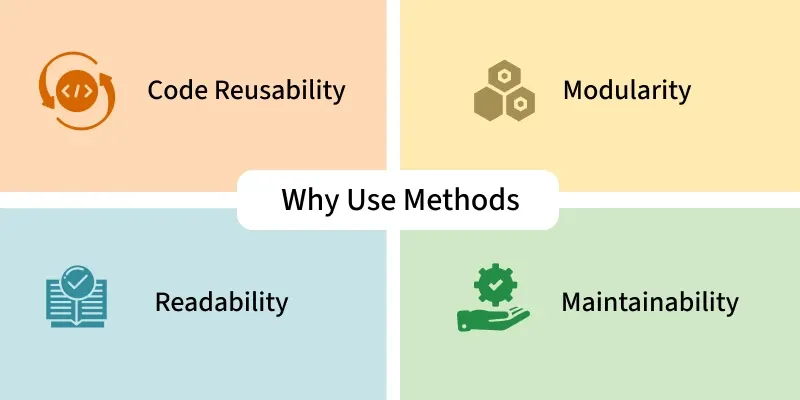
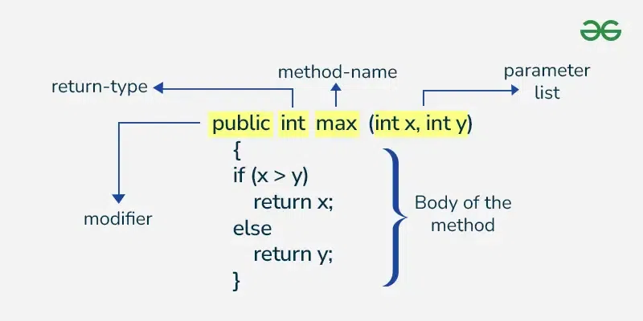
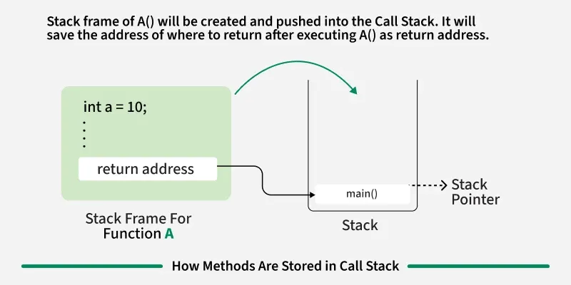

-----

# 📝 Java Methods: Concepts and Implementations

A **Java Method** is a block of code within a class that performs a specific task. They are essential for **code reuse**, **modularity**, and **organization**. All methods in Java must belong to a class and expose the behavior of objects.

## Why use methods

- **Code Reusability:** Write once, use multiple times without repeating code so that code reusability increase.
- **Modularity:** Dividing a program into separate methods allows each method to handle a specific task, making the code more organized and easier to manage.
- **Readability:** Smaller, named methods make the code easier to read and understand.
- **Maintainability:** It’s easier to fix bugs or update code when it's organized into methods.

## Method Declaration and Components

The full syntax of a method declaration includes several key components:


| Component | Description | Example |
| :--- | :--- | :--- |
| **Modifier** | Defines the access level and nature (e.g., `public`, `private`, `static`). | `public static` |
| **Return Type** | The data type of the value the method returns. Use `void` if no value is returned. | `int`, `void` |
| **Name** | A unique identifier (usually a verb, following **camelCase**). | `calculateSum` |
| **Parameters** | (Optional) Inputs to the method, enclosed in parentheses. | `(int a, int b)` |
| **Body** | Contains the logical statements the method executes. | `int sum = a + b;` |

### 🛠️ Example: Simple Method Structure

```java
public class Geeks {
    // 1. Method Definition: printMessage()
    public void printMessage() {
        System.out.println("Hello, Geeks!");
    }
    
    public static void main(String[] args) {
        // 2. Calling the method
        Geeks obj = new Geeks(); 
        obj.printMessage(); // Output: Hello, Geeks!
    }
}
```

-----

## Types of Methods in Java

Methods can be categorized based on their definition source and their association with the class.

### 1\. Predefined vs. User-defined Methods

| Type | Description | Example |
| :--- | :--- | :--- |
| **Predefined** | Already defined in Java class libraries (built-in). | `Math.random()`, `System.out.println()` |
| **User-defined** | Created by the programmer to meet specific requirements. | `calculateArea()`, `setName()` |

### 2\. Instance vs. Static Methods

| Feature | **Instance Methods** | **Static Methods** |
| :--- | :--- | :--- |
| **Association** | Belongs to a specific **object (instance)** of the class. | Belongs to the **class** itself. |
| **Keyword** | No `static` keyword used. | Declared with the `static` keyword. |
| **Access** | Can access **instance (non-static) variables** and **static variables**. | Can access **only static variables** directly. |
| **Calling** | Requires a class **object** (`obj.methodName()`). | Called directly using the **class name** (`ClassName.methodName()`). |

#### 🚀 Example: Instance Method (Requires Object)

```java
public class Student {
    String name; // Instance variable

    // Instance method (accesses instance variable)
    void displayInfo() {
        System.out.println("Name: " + name);
    }

    public static void main(String[] args) {
        Student s1 = new Student(); // Object created
        s1.name = "Alice";
        s1.displayInfo(); // Output: Name: Alice
    }
}
```

#### ⚙️ Example: Static Method (Class-Level)

```java
class Test {
    static void hello() {
        System.out.println("Hello");
    }
}

public class Geeks {
    public static void main(String[] args) {
        // Call static method directly using the Class Name
        Test.hello(); // Output: Hello
    }
}
```

-----

## Method Overloading

**Method Overloading** allows a single class to have **multiple methods with the same name** but different parameter lists. This is a form of **compile-time polymorphism**.

> **Note:** Methods **cannot** be overloaded by return type alone.

Method overloading can be achieved by:

1.  **Changing the Number of Parameters**
2.  **Changing the Data Types of Parameters**
3.  **Changing the Order of Parameters**

### 🧩 Example: Method Overloading

```java
class Product {
    // Overload 1: Two integer parameters
    public int multiply(int a, int b) {
        return a * b;
    }

    // Overload 2: Three integer parameters (Changed number of parameters)
    public int multiply(int a, int b, int c) {
        return a * b * c;
    }
    
    // Overload 3: Three double parameters (Changed data types)
    public double multiply(double a, double b, double c) {
        return a * b * c;
    }
}

public class Geeks {
    public static void main(String[] args) {
        Product ob = new Product();
        
        System.out.println("2-int product: " + ob.multiply(2, 3));      // Calls Overload 1
        System.out.println("3-int product: " + ob.multiply(2, 3, 4));   // Calls Overload 2
        System.out.println("3-double product: " + ob.multiply(2.5, 2.0, 1.0)); // Calls Overload 3
    }
}

// Output:
// 2-int product: 6
// 3-int product: 24
// 3-double product: 5.0
```

-----

## Method Call Stack

The **Call Stack** is a **Last-In-First-Out (LIFO)** data structure used by the Java Virtual Machine (JVM) to manage method calls and local variables during program execution.

* When a method is called, a new **stack frame** is pushed onto the stack.
* The method executes its code.
* When the method is finished, its stack frame is popped off the stack, and control returns to the calling method.

### 🪜 Example: Call Stack in Action

```java
public class CallStackExample {
    
    public static void C() {
        System.out.println("In Method C"); 
    } // C finishes, C's frame pops

    public static void B() {
        C(); // C is called, C's frame pushes
        System.out.println("In Method B"); 
    } // B finishes, B's frame pops

    public static void A() {
        B(); // B is called, B's frame pushes
        System.out.println("In Method A"); 
    } // A finishes, A's frame pops

    public static void D() {
        System.out.println("In Method D");
    } // D finishes, D's frame pops

    public static void main(String[] args) {
        A(); // Start: main calls A (main's frame already exists)
        D(); // After A finishes: main calls D
    }
}

/* Output:
In Method C
In Method B
In Method A
In Method D 
*/
```

