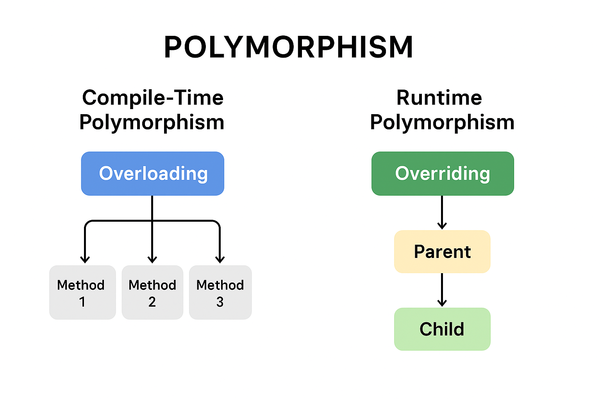

---

# 🧩 **Polymorphism in Java**

**Last Updated:** 24 Sep 2025

---

## 1. 🔍 Introduction

**Polymorphism** is one of the four fundamental principles of **Object-Oriented Programming (OOP)**, alongside **Encapsulation**, **Inheritance**, and **Abstraction**.

The term comes from the Greek words *poly* (many) and *morph* (forms), meaning **“many forms.”**

In Java, polymorphism allows one entity—such as a **method**, **object**, or **interface**—to take multiple forms depending on the context.

---

## 2. 💡 Concept Definition

* **Class:** Blueprint for creating objects.
* **Object:** Instance of a class.
* **Polymorphism:** Ability of an object or method to behave differently based on its actual class type.

In short:

> “One interface, multiple implementations.”

---

## 3. 🌍 Real-Life Analogy

A **person** can have different roles: a **father**, a **husband**, or an **employee**.
Depending on the context, the same individual behaves differently.

---

## 4. 🧠 Core Features of Polymorphism

| Feature                | Description                                                              |
| ---------------------- | ------------------------------------------------------------------------ |
| **Multiple Behaviors** | The same method name performs different actions depending on the object. |
| **Method Overloading** | Same method name with different parameter lists (Compile-time).          |
| **Method Overriding**  | Subclass redefines a method of its parent class (Runtime).               |
| **Runtime Decision**   | JVM determines which version of the method to call during execution.     |

---

## 5. 🧩 Types of Polymorphism in Java

| Type                          | Also Known As | Achieved Through   | Example                                         |
| ----------------------------- | ------------- | ------------------ | ----------------------------------------------- |
| **Compile-Time Polymorphism** | Static        | Method Overloading | Methods with same name but different parameters |
| **Runtime Polymorphism**      | Dynamic       | Method Overriding  | Subclass redefines a superclass method          |

---

## 6. ⚙️ **Compile-Time Polymorphism (Static)**

This occurs when multiple methods in the same class share the same name but have **different parameter type, number, or order**.

> The compiler decides which method to call **before runtime**.

## 🧮 Method Overloading Using Mathematical Operations (Area Calculation)

Method overloading allows us to define **multiple methods with the same name but different parameter lists**.
Let’s use `findArea()` to calculate the area of different shapes and handle parameters in different ways.

---

### 🧩 **Case 1: Different Number of Parameters (Same Type)**

We can overload `findArea()` by **changing the number of parameters** of the same type.

```java
class ShapeArea {

    // For a square: only one parameter
    double findArea(int length) {
        return length * length;
    }

    // For a rectangle: two parameters
    double findArea(int length, int width) {
        return length * width;
    }
}

public class Main {
    public static void main(String[] args) {
        ShapeArea area = new ShapeArea();

        System.out.println("Area of square: " + area.findArea(5));
        System.out.println("Area of rectangle: " + area.findArea(5, 10));
    }
}
```

**Output:**

```
Area of square: 25.0  
Area of rectangle: 50.0
```

✅ **Explanation:**
The compiler determines which version to call based on the **number of arguments** provided.

---

### 🧩 **Case 2: Different Order of Parameters (Different Types)**

We can also overload `findArea()` by changing the **order of parameter types**.

```java
class ShapeArea {

    // (int, double)
    double findArea(int length, double width) {
        System.out.println("Called (int, double)");
        return length * width;
    }

    // (double, int)
    double findArea(double width, int length) {
        System.out.println("Called (double, int)");
        return width * length;
    }
}

public class Main {
    public static void main(String[] args) {
        ShapeArea area = new ShapeArea();

        System.out.println("Area 1: " + area.findArea(5, 8.5));
        System.out.println("Area 2: " + area.findArea(7.5, 6));
    }
}
```

**Output:**

```
Called (int, double)
Area 1: 42.5
Called (double, int)
Area 2: 45.0
```

✅ **Explanation:**
Even though both methods have two parameters, they differ in the **order of data types**, so the compiler treats them as separate methods.

---

### 🧩 **Case 3: Different Parameter Types (Same Number)**

Finally, we can overload methods by using **different data types** but keeping the **same number of parameters**.

```java
class ShapeArea {

    // For integer dimensions
    int findArea(int length, int width) {
        System.out.println("Called int version");
        return length * width;
    }

    // For double dimensions
    double findArea(double length, double width) {
        System.out.println("Called double version");
        return length * width;
    }
}

public class Main {
    public static void main(String[] args) {
        ShapeArea area = new ShapeArea();

        System.out.println("Area (int): " + area.findArea(5, 10));
        System.out.println("Area (double): " + area.findArea(4.5, 6.2));
    }
}
```

**Output:**

```
Called int version
Area (int): 50
Called double version
Area (double): 27.9
```

✅ **Explanation:**
Both methods have two parameters, but they differ in **data type**.
The compiler picks the version that best matches the argument types during method call.

---

### 🧠 **Quick Review**

| **Overloading Case** | **Difference**          | **Example Signature**                                       |
| -------------------- | ----------------------- | ----------------------------------------------------------- |
| Case 1               | Number of parameters    | `findArea(int length)` vs `findArea(int length, int width)` |
| Case 2               | Order of parameters     | `findArea(int, double)` vs `findArea(double, int)`          |
| Case 3               | Data type of parameters | `findArea(int, int)` vs `findArea(double, double)`          |

✅ **Explanation:**
At compile-time, the compiler determines which version of `findArea()` to call based on argument types, number, and order.

---

## 7. ⚡ **Runtime Polymorphism (Dynamic)**

Also known as **Dynamic Method Dispatch**, this occurs when a method call is resolved at **runtime**, not compile-time.

This is achieved through **Method Overriding**.

### Example: Method Overriding

```java
class Parent {
    void print() {
        System.out.println("parent class");
    }
}

class Subclass1 extends Parent {
    @Override
    void print() {
        System.out.println("subclass1");
    }
}

class Subclass2 extends Parent {
    @Override
    void print() {
        System.out.println("subclass2");
    }
}

public class Main {
    public static void main(String[] args) {
        Parent a;
        a = new Subclass1();
        a.print();  // Calls Subclass1 version
        a = new Subclass2();
        a.print();  // Calls Subclass2 version
    }
}
```

**Output**

```
subclass1
subclass2
```

✅ **Explanation:**
The actual method invoked depends on the **object’s runtime type**, not the reference type.

---

## 8. 🧬 Extended Example — “Cats and Polymorphism”

This example illustrates both **inheritance** and **runtime polymorphism**.

```java
class Cat {
    public void run() {
        System.out.println("Run!");
    }
}

class Lion extends Cat {
    @Override
    public void run() {
        System.out.println("Lion runs at 80 km/h");
    }
}

class Tiger extends Cat {
    @Override
    public void run() {
        System.out.println("Tiger runs at 60 km/h");
    }
}

class Cheetah extends Cat {
    @Override
    public void run() {
        System.out.println("Cheetah runs at up to 120 km/h");
    }
}

class Dolittle {
    public void healCat(Cat cat) {
        System.out.println("The patient is healthy!");
        cat.run(); // Demonstrates dynamic behavior
    }
}

public class Main {
    public static void main(String[] args) {
        Dolittle doc = new Dolittle();
        doc.healCat(new Lion());
        doc.healCat(new Tiger());
        doc.healCat(new Cheetah());
    }
}
```

**Output**

```
The patient is healthy!
Lion runs at 80 km/h
The patient is healthy!
Tiger runs at 60 km/h
The patient is healthy!
Cheetah runs at up to 120 km/h
```

✅ **Key Insight:**
Even though the method parameter type is `Cat`, Java calls the correct overridden method at runtime for each subclass.

---

## 9. 🧱 Polymorphism with Interfaces

Java interfaces also demonstrate polymorphism.
Different, unrelated classes can share common behavior by implementing the same interface.

```java
interface CanSwim {
    void swim();
}

class Human implements CanSwim {
    public void swim() {
        System.out.println("I swim with an inflatable tube.");
    }
}

class Fish implements CanSwim {
    public void swim() {
        System.out.println("I swim by moving my fins.");
    }
}

class UBoat implements CanSwim {
    public void swim() {
        System.out.println("I move underwater using propellers.");
    }
}

public class Main {
    public static void main(String[] args) {
        CanSwim[] swimmers = { new Human(), new Fish(), new UBoat() };
        for (CanSwim s : swimmers) {
            s.swim(); // Dynamic binding
        }
    }
}
```

**Output**

```
I swim with an inflatable tube.
I swim by moving my fins.
I move underwater using propellers.
```

✅ **Explanation:**
All three classes implement the same `CanSwim` interface, but each behaves differently when `swim()` is called.

---

## 10. 🧩 Interview-Level Example — “Dancer” Program

```java
class Dancer {
    String name;
    int age;

    Dancer(String name, int age) {
        this.name = name;
        this.age = age;
    }

    void dance() {
        System.out.println(name + " dances like everyone else.");
    }
}

class Breakdancer extends Dancer {
    Breakdancer(String name, int age) {
        super(name, age);
    }
    @Override
    void dance() {
        System.out.println(name + " breakdances!");
    }
}

class ElectricBoogieDancer extends Dancer {
    ElectricBoogieDancer(String name, int age) {
        super(name, age);
    }
    @Override
    void dance() {
        System.out.println(name + " dances the electric boogie!");
    }
}

public class Main {
    public static void main(String[] args) {
        Dancer[] dancers = {
            new Dancer("Fred", 18),
            new Breakdancer("Jay", 19),
            new ElectricBoogieDancer("Marcia", 20)
        };

        for (Dancer d : dancers) {
            d.dance();
        }
    }
}
```

**Output**

```
Fred dances like everyone else.
Jay breakdances!
Marcia dances the electric boogie!
```

---

## 11. ⚖️ Advantages of Polymorphism

- ✅ Encourages **code reuse**
- ✅ Simplifies **maintenance and extension**
- ✅ Enables **dynamic method dispatch**
- ✅ Allows **generic programming**

---

## 12. ⚠️ Disadvantages

❌ May reduce clarity if overused
❌ Runtime binding adds a small **performance cost**

---

## 13. 🧩 Summary

| Concept                    | Description                            |
| -------------------------- | -------------------------------------- |
| **Polymorphism**           | One interface, multiple behaviors      |
| **Static (Compile-Time)**  | Achieved through method overloading    |
| **Dynamic (Runtime)**      | Achieved through method overriding     |
| **Interface Polymorphism** | Multiple classes sharing one interface |

---

## 14. 🧠 Quick Exercise

Try creating:

1. A superclass `Shape` with a method `area()`.
2. Subclasses `Circle`, `Rectangle`, and `Triangle` that override `area()` to calculate specific shapes’ areas.
3. In the `main()` method, store them in a `Shape[]` array and loop to print their areas.

---

