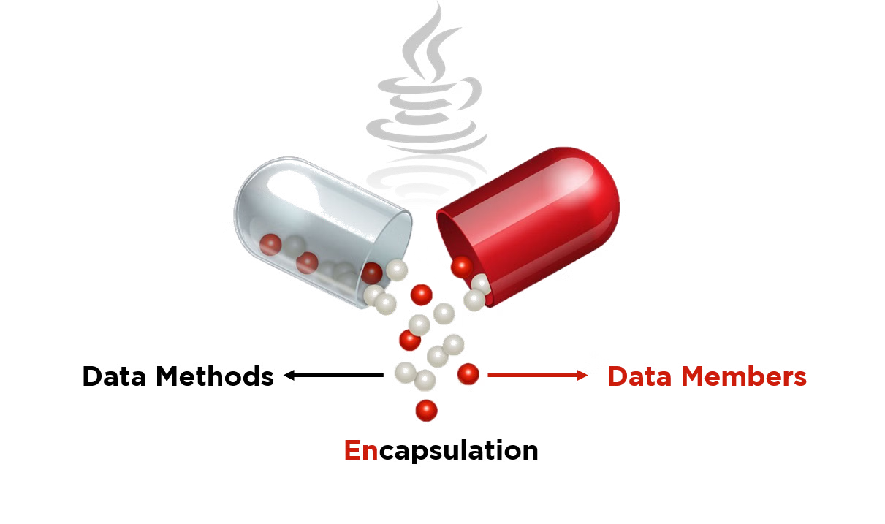
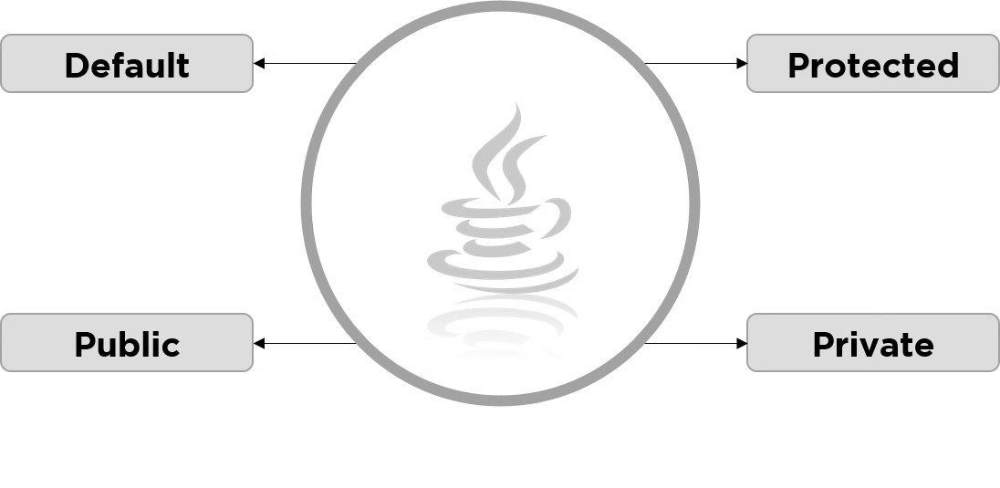

---

# **Lesson 12: Data Encapsulation in Java**

**Author:** Adapted from Haroon Ahamed Kitthu
**Course:** Object-Oriented Programming in Java

---

## **Lesson Overview**

Encapsulation is a core concept of object-oriented programming (OOP) that helps in protecting an object’s data by restricting direct access and exposing controlled interfaces. In Java, encapsulation ensures that the internal state of an object is hidden from external classes, enhancing data security, maintainability, and flexibility.

This lesson explores the concept of **data encapsulation**, its implementation in Java, access specifiers, practical examples, advantages, disadvantages, and real-world applications.

---

## **Learning Objectives**

By the end of this lesson, students will be able to:

1. Define encapsulation and understand its role in OOP.
2. Implement encapsulation in Java using private fields and public getter/setter methods.
3. Explain the purpose of access specifiers in data hiding.
4. Compare encapsulation and data hiding.
5. Apply encapsulation in real-world examples and validate data.
6. Identify the advantages and limitations of encapsulation in Java.

---

## **1. Introduction to Encapsulation**

**Definition:**
Encapsulation is the practice of bundling data (variables) and methods (functions) that operate on the data into a single unit or class. It restricts direct access to an object’s internal components, allowing controlled access through methods.

**Key Points:**

* Protects object integrity by preventing unintended modifications.
* Uses **access specifiers** (`private`, `public`, `protected`) to control visibility.
* Simplifies maintenance and improves code readability.

**Real-world Analogy:**

* Think of a car: the internal engine mechanics are hidden, but the car provides public interfaces like the steering wheel, accelerator, and brakes.

---

## **2. Encapsulation in Java**

In Java, encapsulation involves:

* Declaring class variables as `private` to restrict direct access.
* Providing `public` getter and setter methods to control read/write operations.

**Syntax:**

```java
<Access_Modifier> class <Class_Name> {
    private <Data_Member>;
    private <Data_Method>;
    
    // Public getter and setter methods
}
```

**Example 1: Basic Encapsulation (Employee Class)**

```java
package dc;

public class Employee {
    private String name;
    private int age;
    private int empID;

    public String getName() {
        return name;
    }

    public void setName(String newName) {
        this.name = newName;
    }

    public int getAge() {
        return age;
    }

    public void setAge(int newAge) {
        this.age = newAge;
    }

    public int getEmpID() {
        return empID;
    }

    public void setEmpID(int newEmpID) {
        this.empID = newEmpID;
    }
}

package dc;

public class Main {
    public static void main(String[] args) {
        Employee e = new Employee();
        e.setName("Robert");
        e.setAge(33);
        e.setEmpID(1253);

        System.out.println("Employee's name: " + e.getName());
        System.out.println("Employee's age: " + e.getAge());
        System.out.println("Employee's ID: " + e.getEmpID());
    }
}
```

**Output:**

```
Employee's name: Robert
Employee's age: 33
Employee's ID: 1253
```

---

## **3. Access Specifiers and Data Hiding**

Java provides four access specifiers to control visibility:


| Access Specifier | Visibility                                        |
| ---------------- | ------------------------------------------------- |
| Default          | Package-level access (if no specifier is defined) |
| Public           | Accessible from anywhere                          |
| Private          | Accessible only within the same class             |
| Protected        | Accessible within the package and subclasses      |

**Example: Public Access Specifier**

```java
package Simplilearn;

class Vehicle {
    public int tires;
    public void display() {
        System.out.println("I have a vehicle.");
        System.out.println("It has " + tires + " tires.");
    }
}

public class Display {
    public static void main(String[] args) {
        Vehicle veh = new Vehicle();
        veh.tires = 4;
        veh.display();
    }
}
```

**Output:**

```
I have a vehicle.
It has 4 tires.
```

**Example: Private Access Specifier**

```java
package Simplilearn;

class Student {
    private int rank;

    public int getRank() {
        return rank;
    }

    public void setRank(int rank) {
        this.rank = rank;
    }
}

public class School {
    public static void main(String[] args) {
        Student s = new Student();
        s.setRank(1022);
        System.out.println("Student rank is " + s.getRank());
    }
}
```

**Output:**

```
Student rank is 1022
```

**Example: Protected Access Specifier**

```java
package Simplilearn;

class Human {
    protected String stream;

    protected void display() {
        System.out.println("Hello, I am a " + stream + " Student");
    }
}

public class Student extends Human {
    public static void main(String[] args) {
        Student s = new Student();
        s.stream = "Computer Science and Engineering Technology";
        s.display();
    }
}
```

**Output:**

```
Hello, I am a Computer Science and Engineering Technology Student
```

---

## **4. Encapsulation vs. Data Hiding**

| Feature          | Data Hiding                 | Encapsulation                     |
| ---------------- | --------------------------- | --------------------------------- |
| Concept          | Parent process              | Sub-process of data hiding        |
| Access Specifier | Private only                | Private and Public                |
| Focus            | Hides method implementation | Combines data members and methods |
| Main Purpose     | Protects data               | Combines data with behavior       |

---

## **5. Getter and Setter Methods**

* **Getter methods** retrieve private variable values.
* **Setter methods** modify private variable values and can include validation.

**Example: EncapTest Class**

```java
public class EncapTest {
    private String name;
    private String idNum;
    private int age;

    public String getName() { return name; }
    public void setName(String newName) { name = newName; }

    public String getIdNum() { return idNum; }
    public void setIdNum(String newId) { idNum = newId; }

    public int getAge() { return age; }
    public void setAge(int newAge) { age = newAge; }
}

public class RunEncap {
    public static void main(String[] args) {
        EncapTest encap = new EncapTest();
        encap.setName("James");
        encap.setAge(20);
        encap.setIdNum("12343ms");
        System.out.println("Name: " + encap.getName() + " Age: " + encap.getAge());
    }
}
```

**Output:**

```
Name: James Age: 20
```

---

## **6. Case Study: CoffeeMachine Example**

Encapsulation is used to hide internal operations of a coffee machine, exposing only controlled methods to the user.

```java
import java.util.HashMap;
import java.util.Map;

public class CoffeeMachine {
    private Map<CoffeeSelection, CoffeeBean> beans;
    private Grinder grinder;
    private BrewingUnit brewingUnit;
    private Map<CoffeeSelection, Configuration> configMap;

    public CoffeeMachine(Map<CoffeeSelection, CoffeeBean> beans) {
        this.beans = beans;
        this.grinder = new Grinder();
        this.brewingUnit = new BrewingUnit();
        this.configMap = new HashMap<>();
        this.configMap.put(CoffeeSelection.ESPRESSO, new Configuration(8,28));
        this.configMap.put(CoffeeSelection.FILTER_COFFEE, new Configuration(30,480));
    }

    public Coffee brewCoffee(CoffeeSelection selection) throws CoffeeException {
        switch(selection) {
            case FILTER_COFFEE: return brewFilterCoffee();
            case ESPRESSO: return brewEspresso();
            default: throw new CoffeeException("CoffeeSelection [" + selection + "] not supported!");
        }
    }

    private Coffee brewEspresso() { /* Implementation */ return null; }
    private Coffee brewFilterCoffee() { /* Implementation */ return null; }

    public void addBeans(CoffeeSelection sel, CoffeeBean newBeans) throws CoffeeException { /* Implementation */ }
}
```

**Key Concept:** Internal methods and fields are hidden; public methods expose only controlled functionality.

---

## **7. Advantages of Encapsulation**

1. **Data Protection** – Restricts direct access to fields.
2. **Improved Security** – Prevents unauthorized access.
3. **Simplified Maintenance** – Internal changes do not affect external code.
4. **Flexibility** – Internal logic can be modified without changing interfaces.
5. **Code Reusability** – Promotes modular programming.
6. **Data Validation** – Getter/setter methods allow controlled updates.
7. **Reduced Complexity** – Hides internal implementations.
8. **Prevents Unintended Changes** – Only controlled modifications allowed.
9. **Enhances Readability** – Clear, clean interface for data interaction.

---

## **8. Disadvantages of Encapsulation**

1. **Increased Code Size** – Additional methods may increase verbosity.
2. **Slight Performance Overhead** – Indirect access may be slower.
3. **More Complex Structure** – Simple direct access may be preferable in some cases.
4. **Maintenance Overhead** – Validations in setters need careful management.
5. **Restricted Flexibility** – Users cannot bypass the predefined interfaces.

---

## **9. Summary**

* Encapsulation is a fundamental OOP principle combining **data** and **methods** in a single unit.
* Provides **controlled access** to class members through getters and setters.
* Improves **data security, maintainability, and modularity**.
* Practical applications include **bank accounts, employee records, and machinery systems**.
* Encapsulation complements other OOP principles like **abstraction and inheritance**.

---

## **10. Exercises**

1. Create a `Book` class with private fields: `title`, `author`, and `price`. Implement getter and setter methods with validation.
2. Modify the `BankAccount` class to include an interest rate. Add validation so the interest rate cannot be negative.
3. Explain in your own words how encapsulation helps maintain data integrity in real-world software systems.
4. Compare encapsulation and abstraction using two real-world examples.

---

## **11. References / Further Reading**

1. Haroon Ahamed Kitthu, *Java Programming for Beginners*
2. Oracle Java Documentation: [https://docs.oracle.com/javase/tutorial/java/concepts/](https://docs.oracle.com/javase/tutorial/java/concepts/)
3. Head First Java, 2nd Edition, Kathy Sierra & Bert Bates

---

This rewrite keeps all **concepts, code examples, outputs, and comparisons**, formatted as a **cohesive academic lesson note**.

---

If you want, I can also **create a one-page visual summary diagram** of **Encapsulation in Java** with **data flow and access control**, which is perfect for study or class notes.

Do you want me to make that?
