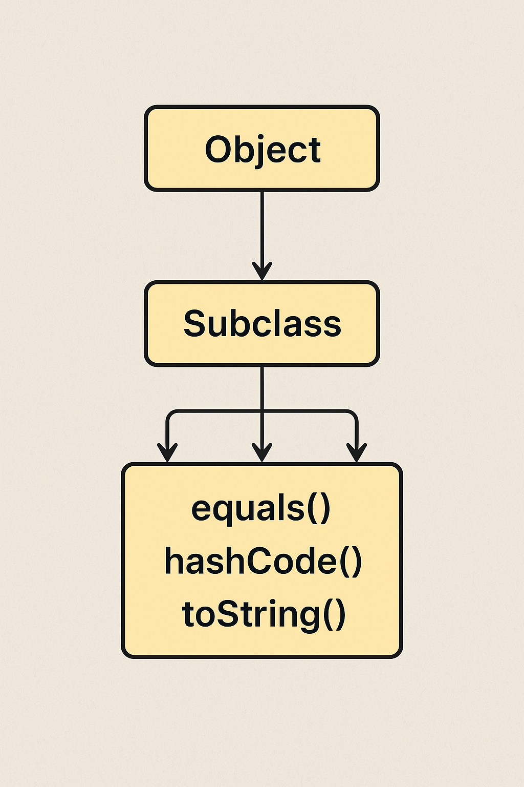

---

# **Lesson Notes: Object Class Methods and Constructors in Java**

### **Last Updated:** November 2025

### **Topic:** Object Class Methods and Constructor

### **Subject Area:** Java Object-Oriented Programming

---

## **1. Introduction**

In Java, all classes implicitly inherit from the **`java.lang.Object`** class — the ultimate superclass of every class in the Java hierarchy.
This inheritance means every object in Java automatically gains access to a set of fundamental methods that define its **behavior**, **identity**, and **lifecycle**.

Additionally, every class must call its parent’s **constructor** — starting from `Object` — to ensure proper creation of the object in memory.

This lesson discusses:

* **The constructor of the Object class**, and
* **Core methods automatically inherited by all Java classes**, including:

    * `hashCode()`
    * `toString()`
    * `equals()`
    * `wait()` and `notify()`
    * `getClass()`
    * `clone()`
    * `finalize()`

Each section explains the method’s purpose, contract, and includes code examples.

---

## **2. The Object Class Constructor**

All Java classes must call the `Object` constructor either **explicitly** or **implicitly**.
This constructor initializes the new object instance in memory before any subclass-specific initialization occurs.

### **2.1 Constructor Rules**

* Every constructor **must** call a superclass constructor as its first statement using `super()`.
* If not written explicitly, Java **automatically inserts** `super()` as the first line.
* Constructor chaining allows one constructor to invoke another within the same class using `this()`.

### **2.2 Examples**

#### **Explicit call to `super()`**

```java
public class MyClass {
    public MyClass() {
        super();  // Explicit call to Object constructor
        System.out.println("MyClass object created!");
    }
}
```

#### **Implicit call (compiler inserts `super()` automatically)**

```java
public class MyClass {
    public MyClass() {
        System.out.println("MyClass object created!");
    }
}
```

#### **Constructor Chaining Example**

```java
public class MyClass {
    public MyClass(int size) {
        System.out.println("Size constructor called: " + size);
    }

    public MyClass(String name, int size) {
        this(size); // calls the first constructor
        System.out.println("Name constructor called for " + name);
    }

    public static void main(String[] args) {
        new MyClass("Java", 10);
    }
}
```

**Output:**

```
Size constructor called: 10
Name constructor called for Java
```

> ✅ **Note:** Both `super()` and `this()` must be the *first line* in a constructor, hence they are mutually exclusive.

---

## **3. The `hashCode()` Method**

The **`hashCode()`** method returns an integer value that represents the internal memory address or “hash” of an object.
It is primarily used in **hash-based collections** such as `HashMap`, `HashSet`, and `Hashtable`.

### **3.1 Contract**

If two objects are considered equal by `equals()`, then they **must** have the same `hashCode()` value.

### **3.2 Basic Example**

```java
public class Foo {
    private int field1, field2;
    private String field3;

    public Foo(int field1, int field2, String field3) {
        this.field1 = field1;
        this.field2 = field2;
        this.field3 = field3;
    }

    @Override
    public boolean equals(Object obj) {
        if (this == obj) return true;
        if (obj == null || getClass() != obj.getClass()) return false;
        Foo f = (Foo) obj;
        return field1 == f.field1 && field2 == f.field2 &&
               (field3 == null ? f.field3 == null : field3.equals(f.field3));
    }

    @Override
    public int hashCode() {
        int hash = 1;
        hash = 31 * hash + field1;
        hash = 31 * hash + field2;
        hash = 31 * hash + (field3 == null ? 0 : field3.hashCode());
        return hash;
    }
}
```

### **3.3 Simplified with `Objects.hash()`**

```java
@Override
public int hashCode() {
    return Objects.hash(field1, field2, field3);
}
```

### **3.4 Caching a Hash Code (Immutable Object)**

```java
public final class ImmutableArray {
    private int[] array;
    private volatile int hash = 0;

    public ImmutableArray(int[] array) {
        this.array = array.clone();
    }

    @Override
    public int hashCode() {
        int h = hash;
        if (h == 0) {
            h = Arrays.hashCode(array);
            hash = h;
        }
        return h;
    }
}
```

---

## **4. The `toString()` Method**

The **`toString()`** method provides a **textual representation** of an object, often used for debugging or logging.

### **Default Behavior**

If not overridden, `Object.toString()` returns:

```
ClassName@HexadecimalHashCode
```

Example:

```java
User@659e0bfd
```

### **Custom Implementation**

```java
public class User {
    private String firstName, lastName;

    public User(String f, String l) {
        firstName = f;
        lastName = l;
    }

    @Override
    public String toString() {
        return firstName + " " + lastName;
    }

    public static void main(String[] args) {
        User user = new User("John", "Doe");
        System.out.println(user); // Automatically calls toString()
    }
}
```

**Output:**

```
John Doe
```

> ✅ **Note:** Always override `toString()` to provide meaningful class information.

---

## **5. The `equals()` Method**

The **`equals()`** method compares two objects for **logical equality** (by value), not **reference equality** (by memory).

### **5.1 Default Behavior**

The default `Object.equals()` checks whether two references point to the same object.

```java
Foo a = new Foo(1, 2, "bar");
Foo b = new Foo(1, 2, "bar");
System.out.println(a.equals(b)); // false by default
```

### **5.2 Overridden Example**

```java
@Override
public boolean equals(Object obj) {
    if (this == obj) return true;
    if (obj == null || getClass() != obj.getClass()) return false;
    Foo f = (Foo) obj;
    return field1 == f.field1 && field2 == f.field2 &&
           Objects.equals(field3, f.field3);
}
```

### **5.3 Best Practices**

* Always override `hashCode()` when you override `equals()`.
* Ensure **symmetry**, **transitivity**, and **consistency**.

---

## **6. The `getClass()` Method**

The **`getClass()`** method returns the **runtime class** of an object — useful for reflection and debugging.

```java
User user = new User(879745, "John");
System.out.println(user.getClass()); // class User
```

Even when using polymorphism:

```java
User another = new SpecificUser("1BBBB", 812345, "Jenny");
System.out.println(another.getClass()); // class SpecificUser
```

> ✅ `getClass()` always returns the most specific subclass type.

---

## **7. The `clone()` Method**

The **`clone()`** method creates a copy of an existing object.

### **Key Rules**

* The class must implement **`Cloneable`**.
* Otherwise, a `CloneNotSupportedException` is thrown.
* Use **deep copy** for mutable objects.

### **Example:**

```java
class Foo implements Cloneable {
    int w;
    String x;
    float[] y;

    public Foo clone() {
        try {
            Foo result = (Foo) super.clone();
            result.y = y.clone(); // deep copy for mutable field
            return result;
        } catch (CloneNotSupportedException e) {
            throw new AssertionError();
        }
    }
}
```

---

## **8. The `wait()` and `notify()` Methods**

These methods are used for **thread synchronization**.
They allow threads to communicate about the state of shared resources.

### **Example**

```java
final Object lock = new Object();

Thread t1 = new Thread(() -> {
    synchronized (lock) {
        try {
            System.out.println("Thread A waiting...");
            lock.wait();
            System.out.println("Thread A resumed!");
        } catch (InterruptedException e) { e.printStackTrace(); }
    }
});

Thread t2 = new Thread(() -> {
    synchronized (lock) {
        System.out.println("Thread B notifying...");
        lock.notify();
    }
});

t1.start();
t2.start();
```

> ⚠️ `wait()` and `notify()` must be used within a synchronized block.

---

## **9. The `finalize()` Method**

The **`finalize()`** method runs before the object is reclaimed by the garbage collector.
It provides a “last chance” cleanup mechanism.

### **Example**

```java
protected void finalize() throws Throwable {
    try {
        System.out.println("Cleaning up resources...");
    } finally {
        super.finalize();
    }
}
```

### **Modern Best Practice**

Avoid `finalize()`. Use:

* `try-with-resources`
* `AutoCloseable` interface
* `WeakReference` for cleanup notifications.

---

## **10. Summary Table of Key Object Methods**

| Method                | Purpose                 | Common Override? |
| --------------------- | ----------------------- | ---------------- |
| `equals()`            | Checks logical equality | ✅ Yes            |
| `hashCode()`          | Produces integer hash   | ✅ Yes            |
| `toString()`          | String representation   | ✅ Yes            |
| `clone()`             | Creates object copy     | ⚠️ Sometimes     |
| `getClass()`          | Returns runtime type    | ❌ No             |
| `wait()` / `notify()` | Thread communication    | ❌ No             |
| `finalize()`          | Cleanup before GC       | ⚠️ Deprecated    |

---

## **11. Conclusion**

The **Object class** defines the foundation for all Java objects — controlling their identity, behavior, and lifecycle.
Understanding these methods allows developers to:

* Design robust classes,
* Implement consistent equality checks,
* Manage resources safely,
* And debug or represent data meaningfully.

Together with constructors, these methods form the **core contract between Java objects and the JVM** — ensuring stability and predictability across the platform.

---

## The **inheritance tree of Object → Subclass → Method overriding flow** 
How methods like `equals()`, `hashCode()`, and `toString()` propagate from Object to user-defined classes

