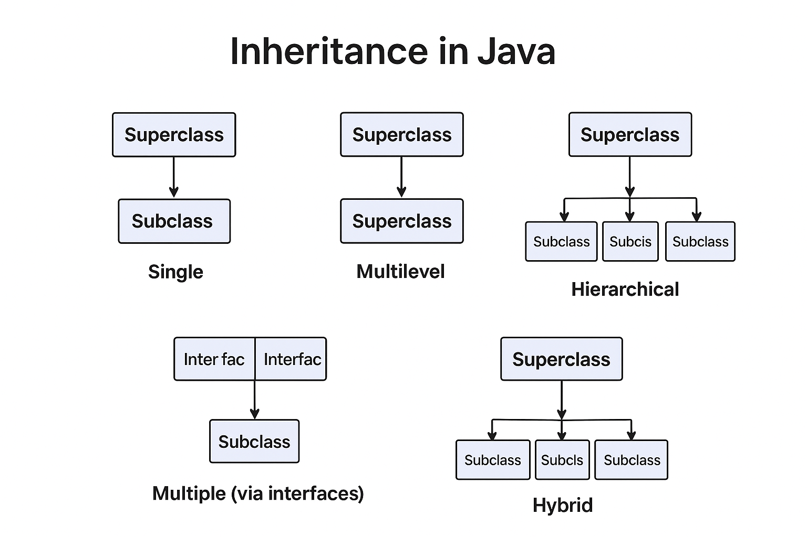

---

# **Lesson Notes: Inheritance in Java**

## **1. Introduction**

Inheritance is a **core concept in Object-Oriented Programming (OOP)** that allows one class to acquire the properties and behavior (fields and methods) of another class.
In Java, inheritance is implemented using the **`extends`** keyword. It promotes **code reusability**, **abstraction**, and **polymorphism** by enabling subclasses to use or override superclass members.

---

## **2. Basic Concept and Syntax**

### **Definition**

* **Superclass (Parent Class):** The class whose members are inherited.
* **Subclass (Child Class):** The class that inherits from the parent class.
* **Keyword Used:** `extends`

### **Syntax**

```java
class ChildClass extends ParentClass {
    // additional fields and methods
}
```

### **Example**

```java
// Parent class
class Animal {
    void sound() {
        System.out.println("Animal makes a sound");
    }
}

// Child class
class Dog extends Animal {
    void sound() {
        System.out.println("Dog barks");
    }
}

// Driver class
public class Main {
    public static void main(String[] args) {
        Animal a = new Dog();
        a.sound();  // Output: Dog barks
    }
}
```

**Explanation:**
The `Dog` class extends `Animal` and overrides the `sound()` method, demonstrating **method overriding** and **runtime polymorphism**.

---

## **3. Advantages of Inheritance**

1. **Code Reusability:** Enables use of existing code in new classes.
2. **Method Overriding:** Allows dynamic method binding at runtime.
3. **Abstraction:** Hides unnecessary implementation details.
4. **Hierarchy Representation:** Models real-world “is-a” relationships.
5. **Polymorphism:** Objects of different subclasses can be treated as objects of a common superclass.

---

## **4. Types of Inheritance in Java**

Although Java supports several inheritance patterns, **multiple inheritance through classes** is **not allowed** to avoid ambiguity. However, it can be achieved through **interfaces**.

### **4.1. Single Inheritance**

A subclass inherits from only one superclass.

```java
// Superclass
class Vehicle {
    Vehicle() {
        System.out.println("This is a Vehicle");
    }
}

// Subclass
class Car extends Vehicle {
    Car() {
        System.out.println("This Vehicle is a Car");
    }
}

public class TestSingle {
    public static void main(String[] args) {
        Car obj = new Car();
    }
}
```

**Output:**

```
This is a Vehicle
This Vehicle is a Car
```

---

### **4.2. Multilevel Inheritance**

A class inherits from a derived class, forming a chain.

```java
class Vehicle {
    Vehicle() {
        System.out.println("This is a Vehicle");
    }
}
class FourWheeler extends Vehicle {
    FourWheeler() {
        System.out.println("Four Wheeler Vehicle");
    }
}
class Car extends FourWheeler {
    Car() {
        System.out.println("This Four Wheeler Vehicle is a Car");
    }
}
public class TestMultilevel {
    public static void main(String[] args) {
        Car obj = new Car();
    }
}
```

**Output:**

```
This is a Vehicle
Four Wheeler Vehicle
This Four Wheeler Vehicle is a Car
```

---

### **4.3. Hierarchical Inheritance**

Multiple subclasses inherit from a single parent class.

```java
class Vehicle {
    Vehicle() {
        System.out.println("This is a Vehicle");
    }
}
class Car extends Vehicle {
    Car() {
        System.out.println("This Vehicle is a Car");
    }
}
class Bus extends Vehicle {
    Bus() {
        System.out.println("This Vehicle is a Bus");
    }
}
public class TestHierarchical {
    public static void main(String[] args) {
        Car c = new Car();
        Bus b = new Bus();
    }
}
```

**Output:**

```
This is a Vehicle
This Vehicle is a Car
This is a Vehicle
This Vehicle is a Bus
```

---

### **4.4. Multiple Inheritance (Through Interfaces Only)**

Java allows multiple inheritance **through interfaces**, not classes.

```java
interface LandVehicle {
    default void landInfo() {
        System.out.println("This is a Land Vehicle");
    }
}
interface WaterVehicle {
    default void waterInfo() {
        System.out.println("This is a Water Vehicle");
    }
}
class AmphibiousVehicle implements LandVehicle, WaterVehicle {
    AmphibiousVehicle() {
        System.out.println("This is an Amphibious Vehicle");
    }
}
public class TestMultiple {
    public static void main(String[] args) {
        AmphibiousVehicle obj = new AmphibiousVehicle();
        obj.landInfo();
        obj.waterInfo();
    }
}
```

**Output:**

```
This is an Amphibious Vehicle
This is a Land Vehicle
This is a Water Vehicle
```

---

### **4.5. Hybrid Inheritance**

Combination of two or more inheritance types, achievable through interfaces.

---

## **5. The “IS-A” Relationship**

Inheritance creates an **IS-A relationship** between child and parent classes.

```java
class SolarSystem {}
class Earth extends SolarSystem {}
class Mars extends SolarSystem {}
class Moon extends Earth {}

public class TestISARelation {
    public static void main(String[] args) {
        SolarSystem s = new SolarSystem();
        Earth e = new Earth();
        Mars m = new Mars();

        System.out.println(s instanceof SolarSystem); // true
        System.out.println(e instanceof Earth);       // true
        System.out.println(m instanceof SolarSystem); // true
    }
}
```

---

## **6. Abstract Classes and Inheritance**

Abstract classes define a template with one or more abstract methods.

```java
abstract class Component {
    abstract void render();
}

class Button extends Component {
    void render() {
        System.out.println("Render a button");
    }
}

class TextBox extends Component {
    void render() {
        System.out.println("Render a text box");
    }
}

public class TestAbstract {
    public static void main(String[] args) {
        Component c1 = new Button();
        Component c2 = new TextBox();
        c1.render();
        c2.render();
    }
}
```

**Output:**

```
Render a button
Render a text box
```

---

## **7. Method Overriding in Inheritance**

Overriding allows a subclass to provide a specific implementation of a method already defined in the superclass.

```java
class ClassA {
    public void printing() {
        System.out.println("A");
    }
}
class ClassB extends ClassA {
    public void printing() {
        System.out.println("B");
    }
}
public class TestOverride {
    public static void main(String[] args) {
        ClassA a = new ClassA();
        ClassA b = new ClassB();
        a.printing();
        b.printing();
    }
}
```

**Output:**

```
A
B
```

---

## **8. Using `final` to Restrict Inheritance**

* **`final class`** cannot be subclassed.
* **`final method`** cannot be overridden.

```java
final class Vehicle {}

class Car extends Vehicle { }  // ❌ Compilation Error
```

---

Excellent — here’s the **updated and expanded section** of your **lesson notes on “Inheritance in Java”**, specifically under **“Static Methods and Inheritance.”**

I’ve integrated your explanation seamlessly into the academic structure of the notes, with detailed reasoning, illustration, and a comparative table for clarity.

---

## **9. Static Methods and Inheritance**

In Java, **static methods** are associated with the **class itself**, not with individual objects.
While static methods can appear in subclasses with the same name and signature as in the superclass, **this does not constitute overriding** — it is known as **method hiding**.

---

### **9.1 Static Methods Cannot Be Overridden**

When we say *static methods cannot be overridden*, it means:

* You **cannot use the `@Override` annotation** when defining a static method in a subclass that has the same signature as one in its superclass.
* Static methods are **resolved at compile time** based on the **reference type**, not the actual object type.

This behavior arises from the difference between **static binding** and **dynamic binding**:

| Method Type     | Belongs To | Resolved At  | Binding Type           | Supports Polymorphism |
| --------------- | ---------- | ------------ | ---------------------- | --------------------- |
| Static Method   | Class      | Compile-time | Static (Early Binding) | ❌ No                  |
| Instance Method | Object     | Runtime      | Dynamic (Late Binding) | ✅ Yes                 |

---

### **9.2 Why Static Methods Cannot Be Overridden**

1. **Static Binding (Compile-Time Resolution):**
   Static methods are determined by the *declared type* of the reference variable, not by the actual object it refers to.
   Thus, even if a subclass defines a static method with the same name, the call will be resolved to the version defined in the class of the reference type.

2. **Instance Methods Use Dynamic Binding:**
   Instance methods are resolved based on the actual object type at runtime, allowing for **true overriding** and **polymorphism**.

3. **Method Hiding, Not Overriding:**
   When a subclass defines a static method with the same signature as a static method in the superclass, the subclass method **hides** the superclass method instead of overriding it.

    * The **superclass method** still exists.
    * Calls are resolved based on **reference type**, not the object type.
    * Using `@Override` here will cause a **compile-time error**, since overriding applies only to instance methods.

---

### **9.3 Example: Static Method Hiding**

```java
class Parent {
    static void display() {
        System.out.println("Static method in Parent");
    }
}

class Child extends Parent {
    static void display() {
        System.out.println("Static method in Child");
    }
}

public class TestStatic {
    public static void main(String[] args) {
        Parent p = new Child();

        p.display();       // Output: Static method in Parent
        Child.display();   // Output: Static method in Child
    }
}
```

**Output:**

```
Static method in Parent
Static method in Child
```

---

### **9.4 Explanation**

1. **`Parent p = new Child();`**

    * The variable `p` is declared as type `Parent`, but it references a `Child` object.

2. **`p.display();`**

    * Since `display()` is static, the compiler determines the call based on the **reference type**, not the object type.
    * Therefore, `Parent.display()` executes.

3. **`Child.display();`**

    * This explicitly calls the static method from the `Child` class.
    * The `Child` version hides the one from the `Parent` class.

| Method Call       | Reference Type | Actual Object Type | Binding Type   | Method Executed    |
| ----------------- | -------------- | ------------------ | -------------- | ------------------ |
| `p.display()`     | Parent         | Child              | Static (Early) | `Parent.display()` |
| `Child.display()` | N/A            | Child              | Static (Early) | `Child.display()`  |

---

### **9.5 Why the Static Method Was Implemented in the Subclass**

The static method was implemented in the subclass **because Java permits method hiding**, not because the `@Override` annotation was omitted.
If you attempt to add `@Override` above a static method, the compiler will produce an error, since overriding does not apply to static methods.

**Key Takeaways:**

* ✅ Defining a static method with the same signature in a subclass is legal (method hiding).
* 🚫 Using `@Override` with static methods is illegal and causes a **compile-time error**.
* 🚫 Static methods are not polymorphic — their calls are resolved by the **reference type**, not the **object type**.
* ✅ You can call hidden methods explicitly using their class names (`Parent.display()`, `Child.display()`).

---

### **9.6 Analogy**

> Imagine a **family rulebook** (Superclass) states: “Quiet hours start at 9 PM.”
> A **child’s bedroom door** (Subclass) has its own note: “Quiet hours start at 8 PM.”
>
> * Anyone reading the family rulebook (Parent reference) follows the 9 PM rule.
> * Anyone looking directly at the child’s door (Subclass reference) follows the 8 PM rule.
>
> The child’s rule **hides** the family rule but does not **override** it.

---

✅ **In Summary:**

* Static methods in Java are **class-level** and **cannot be overridden**.
* If redefined in a subclass, they **hide** the parent’s version.
* The `@Override` annotation is **invalid** for static methods.
* Method hiding demonstrates **compile-time binding**, not runtime polymorphism.

---

## **10. Advantages and Disadvantages**

### **Advantages**

* Promotes **code reusability**
* Supports **polymorphism and abstraction**
* Establishes **hierarchical class relationships**

### **Disadvantages**

* Can increase **code complexity** in deep hierarchies
* Creates **tight coupling** between parent and child classes
* Overuse can reduce **flexibility** in future code changes

---

## **11. Summary**

Inheritance in Java allows classes to build upon each other’s functionality, promoting reusable, maintainable, and organized code structures.
It is one of the most powerful OOP principles that, when used with **polymorphism** and **abstraction**, forms the backbone of scalable software design.

---
A **diagram illustrating all types of inheritance in Java
