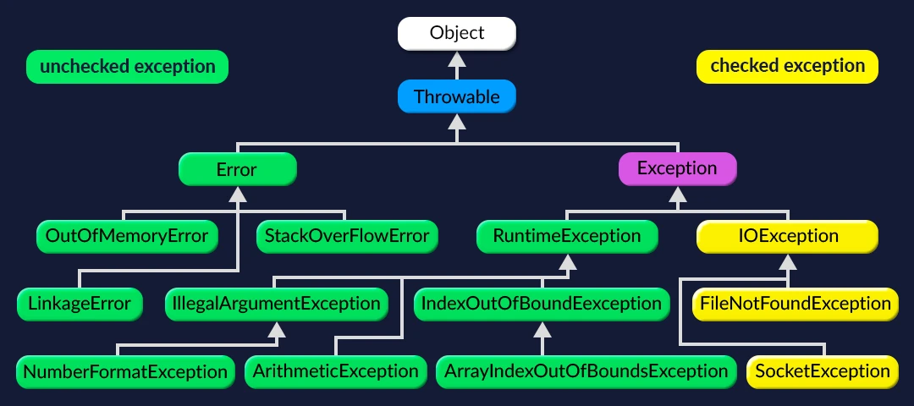
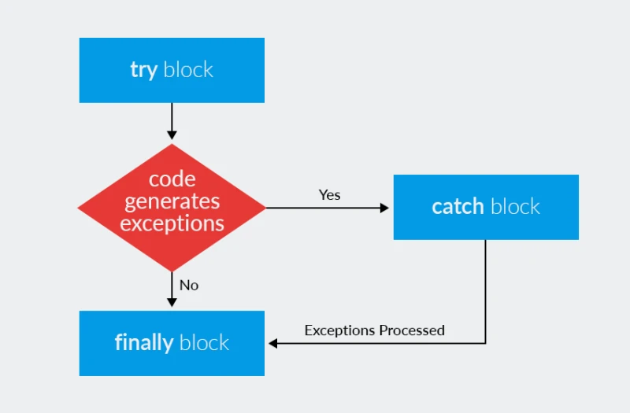

---

# **Lesson Notes: Exceptions in Java**

### **1. Introduction**

In real life, unexpected situations occur — a car won’t start, a file goes missing, or an internet connection drops.
Similarly, in programming, **exceptions** represent *unexpected events* that disrupt the normal flow of a program.
Java provides a robust **exception handling mechanism** to detect, handle, and recover from such errors.

---

### **2. What Is an Exception?**

An **exception** is an object representing an error or an unusual condition that occurs during program execution.

Example:

```java
int result = 10 / 0; // throws ArithmeticException
```

Output:

```
Exception in thread "main" java.lang.ArithmeticException: / by zero
```

---

### **3. Exception Hierarchy**

All exceptions in Java inherit from the **Throwable** class.
It has two main subclasses:

* **Error** — serious problems (e.g., JVM crashes, memory issues)
* **Exception** — recoverable problems during program execution

📘 *Diagram: Exception Hierarchy*
---


---

### **4. Types of Exceptions**

#### **(a) Checked Exceptions**

* Detected at **compile-time**.
* Must be handled using `try-catch` or declared with `throws`.
* Examples: `IOException`, `FileNotFoundException`, `SQLException`.

Example:

```java
try {
    BufferedReader reader = new BufferedReader(new FileReader("data.txt"));
    String line = reader.readLine();
} catch (IOException e) {
    System.out.println("Error reading file: " + e.getMessage());
}
```

---

#### **(b) Unchecked Exceptions**

* Occur at **runtime**.
* Subclasses of `RuntimeException`.
* Usually caused by programming errors.
* Examples: `ArithmeticException`, `NullPointerException`, `ArrayIndexOutOfBoundsException`.

Example:

```java
int[] numbers = {1, 2, 3};
System.out.println(numbers[5]); // throws ArrayIndexOutOfBoundsException
```

---

#### **(c) Errors**

* Critical system failures beyond the program’s control.
* Should not be handled.
* Examples: `OutOfMemoryError`, `StackOverflowError`.

---

### **5. Exception Handling Keywords**

| Keyword   | Description                                      |
| --------- | ------------------------------------------------ |
| `try`     | Defines a block where exceptions might occur.    |
| `catch`   | Handles the exception.                           |
| `finally` | Always executes (used for cleanup).              |
| `throw`   | Used to manually throw an exception.             |
| `throws`  | Declares that a method might throw an exception. |

📘 *Diagram: Exception Handling Flow*
---


---

### **6. Example: try-catch-finally**

```java
public class Example {
    public static void main(String[] args) {
        try {
            int result = 10 / 0;
        } catch (ArithmeticException e) {
            System.out.println("You can't divide by zero!");
        } finally {
            System.out.println("Execution complete.");
        }
    }
}
```

**Output:**

```
You can't divide by zero!
Execution complete.
```

---

### **7. Throwing and Declaring Exceptions**

You can **throw** exceptions manually and **declare** them in method signatures.

```java
public void checkNumber(int number) throws IllegalArgumentException {
    if (number < 0) {
        throw new IllegalArgumentException("Number must be positive!");
    }
    System.out.println("Number is valid.");
}
```

---

### **8. Creating Custom Exceptions**

Sometimes, you’ll want to define your own exceptions for specific cases.

**Example: DogIsNotReadyException**

```java
public class DogIsNotReadyException extends Exception {
    public DogIsNotReadyException(String message) {
        super(message);
    }
}
```

**Dog class using the custom exception:**

```java
public class Dog {
    String name;
    boolean collarOn;
    boolean leashOn;
    boolean muzzleOn;

    public Dog(String name) {
        this.name = name;
    }

    public void putCollar() { collarOn = true; }
    public void putLeash() { leashOn = true; }
    public void putMuzzle() { muzzleOn = true; }

    public void walk() throws DogIsNotReadyException {
        if (collarOn && leashOn && muzzleOn) {
            System.out.println("Let's go for a walk!");
        } else {
            throw new DogIsNotReadyException(name + " is not ready for a walk!");
        }
    }

    public static void main(String[] args) {
        Dog dog = new Dog("Buddy");
        dog.putCollar();
        dog.putMuzzle();

        try {
            dog.walk();
        } catch (DogIsNotReadyException e) {
            System.out.println(e.getMessage());
        }
    }
}
```

**Output:**

```
Buddy is not ready for a walk!
```

---

### **9. try-with-resources (Java 7+)**

Used for automatically closing resources (files, streams, etc.):

```java
try (BufferedReader reader = new BufferedReader(new FileReader("data.txt"))) {
    String line = reader.readLine();
    System.out.println(line);
} catch (IOException e) {
    System.out.println("Error reading file!");
}
```

No need for a `finally` block to close the reader — Java does it automatically.

---

### **10. Summary**

| Type                | Example                  | Checked?                | Handled by            |
| ------------------- | ------------------------ | ----------------------- | --------------------- |
| Error               | `OutOfMemoryError`       | No                      | JVM                   |
| Checked Exception   | `IOException`            | Yes                     | Programmer            |
| Unchecked Exception | `NullPointerException`   | No                      | Programmer (optional) |
| Custom Exception    | `DogIsNotReadyException` | Depends on parent class | Programmer            |

---

