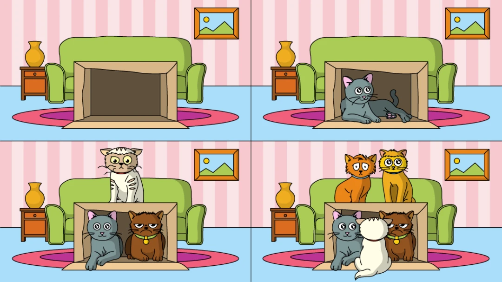

# **Lesson Notes: Variables**

---

## **1. What is a Variable?**

A **variable** is a **name given to a memory location** that stores data in a program.
It acts like a **container** used to hold different kinds of information — numbers, characters, or strings.

The value stored in a variable **can change** during program execution — which is why it’s called a *variable*.

---

### **Example:**

```java
int x = 100;
```

**Explanation:**

* `int` → data type
* `x` → variable name
* `100` → value assigned to the variable

Later, the value of `x` can be changed:

```java
x = 200;
```

Now, `x` holds **200** instead of **100**.

---

### **Analogy: Variables as Boxes**

You can think of a variable as a **box** used to store a value.

* You can put something inside the box (assign a value).
* You can check what’s inside (print the value).
* You can replace it with something else (reassign a new value).

**Example:**

> If you write the number *13* on a piece of paper and place it in a box,
> you can say “the box stores the value 13.”

Each variable (or box) has:

1. **Type** – what kind of data it holds (e.g., `int`, `String`, `double`)
2. **Name** – how you refer to it in your program
3. **Value** – the data stored inside it

---

### **Example Analogy Table**

| Real-life Example                    | Java Concept            |
| ------------------------------------ | ----------------------- |
| Cake box                             | Variable of type `Cake` |
| Shoe box                             | Variable of type `Shoe` |
| Box labeled “x” that holds number 13 | `int x = 13;`           |

---

## **2. Declaring Variables in Java**

Before using a variable, you must **declare** it — that is, tell Java what kind of data it will hold.

### **Syntax:**

```java
dataType variableName = value;
```

### **Examples:**

```java
int age = 30;           // integer type
float price = 10.25f;   // decimal number
String name = "John";   // text
char grade = 'A';       // single character
boolean isPassed = true;// true or false
```

---

### **Declaration and Assignment**

You can declare and assign separately:

```java
int a;
a = 100;
```

Or combine them in one line:

```java
int a = 100;
```

Once declared, you **cannot redeclare** a variable with the same name in the same scope.

---

### **Multiple Variable Declaration**

If multiple variables share the same type, they can be declared on one line:

```java
int x = 10, y = 20, z = 30;
```

---

## **3. Creating a Variable (Declaration Only)**

A variable is created using the following form:

```java
type name;
```

| Example     | Description                           |
| ----------- | ------------------------------------- |
| `int a;`    | Creates an integer variable named `a` |
| `String s;` | Creates a text variable named `s`     |
| `double c;` | Creates a decimal variable named `c`  |

**Common data types:**

* `int` → whole numbers
* `double` → decimal or fractional numbers
* `String` → text

---

## **4. Assignment**

The **assignment operator (`=`)** stores a value inside a variable.

**Syntax:**

```java
variableName = value;
```

This operation **copies** (not moves) the value on the right into the variable on the left.

---

### **Examples:**

```java
int i;
i = 3;          // assigns 3 to i
int a, b;
a = 1;
b = a + 1;      // assigns 2 to b
```

Another example:

```java
int x;
x = 3;
x = x + 1;      // x now becomes 4
```

---

### **Important:**

The `=` operator is **not** for comparison — it’s for assignment.
To compare two values, Java uses **`==`**.

Example:

```java
if (x == 4) {
    System.out.println("x is four");
}
```

---

## **5. Variable Naming Conventions**

To make code readable and avoid confusion, Java has **naming rules** and **best practices** for variables.

### **Rules**

* Must start with a **letter**, **$**, or **_**
  (cannot start with a number)
* Cannot contain **spaces**
* Cannot use **Java keywords** (e.g., `class`, `public`, `int`)
* Java is **case-sensitive** (`Age` ≠ `age`)
* Must be **descriptive and meaningful**

---

### **Best Practices**

| Good Practice                        | Example                                      |
| ------------------------------------ | -------------------------------------------- |
| Use **camelCase** for variable names | `itemPrice`, `studentName`                   |
| Use **UPPER_CASE** for constants     | `PI = 3.1416;`                               |
| Use descriptive names                | `int studentCount = 25;`                     |
| Avoid unclear names                  | ❌ `int x = 5;` ✅ `int numberOfStudents = 5;` |

---

## **6. Cats and Boxes (Fun Analogy)**

Just like you can only fit one cat in a small box 🐈,
you can only store **one value** in a variable at a time.

If you assign a new value to a variable, it **replaces** the old one.

**Example:**

```java
int x = 5;
x = 10; // The previous value (5) is replaced
```

Now the variable `x` only holds the new value `10`.

---

## **7. Example Demonstrated in Class**

```java
public class VariablesDemo {
    public static void main(String[] args) {
        int a = 100;
        int b = 200;
        int c = 300;

        System.out.println("The value of a is: " + a);
        System.out.println("The value of b is: " + b);
        System.out.println("The value of c is: " + c);

        System.out.println("Total: " + (a + b + c));
    }
}
```

### **Output:**

```
The value of a is: 100
The value of b is: 200
The value of c is: 300
Total: 600
```

---

## **8. Summary**

| Concept           | Description                                                   |
| ----------------- | ------------------------------------------------------------- |
| **Variable**      | A named memory location used to store data                    |
| **Declaration**   | Creating a variable by specifying its type and name           |
| **Assignment**    | Giving a variable a value using `=`                           |
| **Data Type**     | Defines what kind of data the variable can store              |
| **Scope**         | The area of the program where a variable can be accessed      |
| **Naming Rules**  | Start with a letter, no spaces, not a keyword, case-sensitive |
| **Best Practice** | Use meaningful names and camelCase formatting                 |

---

### **Key Takeaways**

* Think of variables as **labeled boxes** for storing values.
* Every variable has a **type**, **name**, and **value**.
* Use `=` to assign, not compare values.
* Follow naming conventions to write clean, professional code.
* Each statement ends with a **semicolon (`;`)**.
* Only one value can be stored in a variable at a time.

---