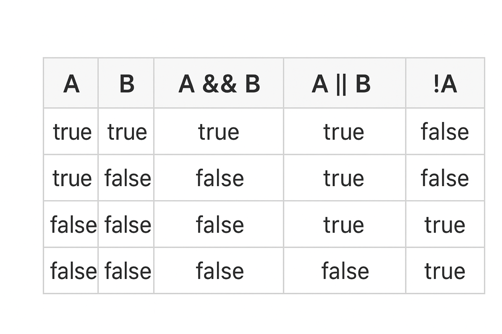

# **Lesson Notes – Module 1: Java Syntax**

## **Level 2, Lesson 6: Operators in Java**

---

## **1. Introduction to Operators**

An **operator** is a **symbol** that performs an operation on one or more **operands** (variables or values).

**Example:**

```java
int a = 10;
int b = 20;
int result = a + b;
```

Here:

* `+` → is an **operator** (performs addition)
* `a` and `b` → are **operands**
* `=` → is the **assignment operator**

> Operators in Java are used to perform mathematical, relational, logical, and assignment operations.

---

## **2. Categories of Operators**

| **Type**                        | **Purpose**                           |
| ------------------------------- | ------------------------------------- |
| Arithmetic Operators            | Perform mathematical operations       |
| Relational Operators            | Compare two values                    |
| Logical Operators               | Combine or invert Boolean expressions |
| Increment / Decrement Operators | Increase or decrease a value by 1     |
| Assignment Operators            | Assign or modify values               |
| Conditional (Ternary) Operator  | Shorthand form of if–else             |

---

## **3. Arithmetic Operators**

Used to perform basic mathematical operations.

| **Operator** | **Description** | **Example** | **Result**                |
| ------------ | --------------- | ----------- | ------------------------- |
| `+`          | Addition        | `a + b`     | Sum of `a` and `b`        |
| `-`          | Subtraction     | `a - b`     | Difference of `a` and `b` |
| `*`          | Multiplication  | `a * b`     | Product                   |
| `/`          | Division        | `a / b`     | Quotient                  |
| `%`          | Modulus         | `a % b`     | Remainder                 |

**Example:**

```java
int a = 10, b = 3;

System.out.println("Sum: " + (a + b));
System.out.println("Difference: " + (a - b));
System.out.println("Product: " + (a * b));
System.out.println("Division: " + (a / b));
System.out.println("Remainder: " + (a % b));
```

---

## **4. Relational (Comparison) Operators**

Used to compare values and return **true** or **false**.

| **Operator** | **Meaning**              | **Example** | **Result** |
| ------------ | ------------------------ | ----------- | ---------- |
| `==`         | Equal to                 | `a == b`    | false      |
| `!=`         | Not equal to             | `a != b`    | true       |
| `>`          | Greater than             | `a > b`     | false      |
| `<`          | Less than                | `a < b`     | true       |
| `>=`         | Greater than or equal to | `a >= b`    | false      |
| `<=`         | Less than or equal to    | `a <= b`    | true       |

**Example:**

```java
int a = 10, b = 20;
System.out.println(a < b);   // true
System.out.println(a == b);  // false
System.out.println(a != b);  // true
```

---

## **5. Logical Operators**

Logical operators are used to **combine or invert** Boolean expressions.

| **Operator** | **Description**                                       | **Example**          |                                                       |          |   |          |
| ------------ | ----------------------------------------------------- | -------------------- | ----------------------------------------------------- | -------- | - | -------- |
| `&&`         | Logical AND – true only if *both* conditions are true | `(a > b) && (b > c)` |                                                       |          |   |          |
| `            |                                                       | `                    | Logical OR – true if *at least one* condition is true | `(a > b) |   | (b > c)` |
| `!`          | Logical NOT – reverses a Boolean value                | `!(a > b)`           |                                                       |          |   |          |

---

### **Truth Table for Logical Operators**

---

**Example:**

```java
boolean x = true;
boolean y = false;

System.out.println(x && y);  // false
System.out.println(x || y);  // true
System.out.println(!x);      // false
```

---

## **6. Increment and Decrement Operators**

Used to **increase or decrease** a variable’s value by 1.

| **Operator** | **Description** |
| ------------ | --------------- |
| `++`         | Increment by 1  |
| `--`         | Decrement by 1  |

**Pre vs. Post forms:**

| **Form**       | **Example** | **When Applied**                     |
| -------------- | ----------- | ------------------------------------ |
| Pre-increment  | `++a`       | Increments before using the variable |
| Post-increment | `a++`       | Increments after using the variable  |
| Pre-decrement  | `--a`       | Decrements before using the variable |
| Post-decrement | `a--`       | Decrements after using the variable  |

**Example:**

```java
int a = 5;
System.out.println(a++); // 5 (post-increment)
System.out.println(a);   // 6

int b = 5;
System.out.println(++b); // 6 (pre-increment)
```

---

## **7. Assignment Operators**

Used to **assign values** to variables or perform operations and assignment in one step.

| **Operator** | **Example** | **Equivalent To** |
| ------------ | ----------- | ----------------- |
| `=`          | `a = 10`    | Assigns 10 to a   |
| `+=`         | `a += 5`    | `a = a + 5`       |
| `-=`         | `a -= 5`    | `a = a - 5`       |
| `*=`         | `a *= 5`    | `a = a * 5`       |
| `/=`         | `a /= 5`    | `a = a / 5`       |
| `%=`         | `a %= 5`    | `a = a % 5`       |

**Example:**

```java
int a = 10;
a += 5; // a = a + 5
System.out.println(a); // 15
```

---

## **8. Conditional (Ternary) Operator**

Used as a **shorthand** for `if–else`.

**Syntax:**

```java
variable = (condition) ? value_if_true : value_if_false;
```

**Example:**

```java
int age = 20;
String status = (age >= 18) ? "Adult" : "Minor";
System.out.println(status); // Adult
```

---

## **9. Classification by Number of Operands**

| **Operator Type** | **Number of Operands** | **Example**        |
| ----------------- | ---------------------- | ------------------ |
| Unary             | One operand            | `++a`, `--a`, `!a` |
| Binary            | Two operands           | `a + b`, `a > b`   |
| Ternary           | Three operands         | `(a > b) ? a : b`  |

---

## **10. Summary**

| **Category**        | **Operators**      | **Purpose**                 |    |                         |
| ------------------- | ------------------ | --------------------------- | -- | ----------------------- |
| Arithmetic          | `+ - * / %`        | Perform calculations        |    |                         |
| Relational          | `== != > < >= <=`  | Compare values              |    |                         |
| Logical             | `&&                |                             | !` | Combine Boolean results |
| Increment/Decrement | `++ --`            | Increase or decrease values |    |                         |
| Assignment          | `= += -= *= /= %=` | Assign and modify values    |    |                         |
| Conditional         | `?:`               | Simplify `if–else`          |    |                         |

---

### ✅ **Key Takeaways**

* Operators enable Java to perform **calculations, comparisons, and logical decisions**.
* Logical operators return **true** or **false** based on the **truth table** above.
* Increment/decrement operators modify variable values by 1.
* The **ternary operator** allows simple `if–else` conditions in a single line.

---
