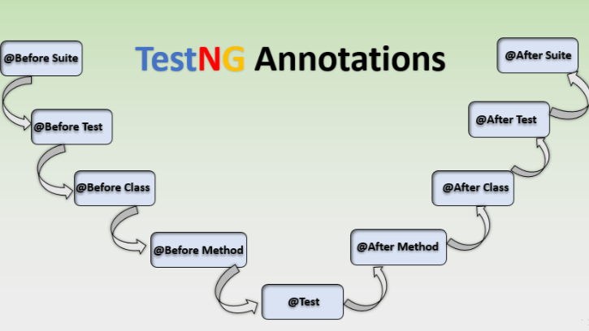

# TestNG Annotations

---

## Overview

When working with a TestNG-based testing framework, annotations are used to define and control the test workflow. They instruct TestNG on when and how to execute specific methods, handle test data, manage resources, and monitor execution events. This document provides a detailed breakdown of the most commonly used TestNG annotations along with their purpose, attributes, code examples, and practical scenarios.



---

## 1. @Test

**Purpose:** Marks a method as a test case — the core annotation for writing test methods in TestNG.

Every individual test case in a TestNG framework must be annotated with `@Test`. This tells TestNG to treat the method as an executable test scenario, enabling it to be discovered, run, and reported as part of the test suite.

### Basic Example

```java
@Test
public void verifyLogin() {
    // Test logic for verifying login functionality
    Assert.assertTrue(isLoginSuccessful());
}
```

### Key Attributes

- **priority** — Defines the execution order of test methods (lower number runs first).
- **dependsOnMethods** — Specifies methods that must pass before this test can execute.
- **groups** — Categorizes tests for selective execution (e.g., smoke, regression).
- **enabled** — Allows temporarily disabling a test without deleting it.

### Example with Attributes

```java
@Test(priority = 1, groups = {"smoke", "regression"}, enabled = true)
public void testHomePage() {
    // Test home page functionality
}
```

### Practical Scenario

In a Selenium-based framework, every individual feature test — such as login, product search, registration, or checkout — is annotated with `@Test`. The `priority` attribute ensures critical smoke tests (e.g., login) execute before dependent regression tests (e.g., adding to cart).

---

## 2. @BeforeSuite & @AfterSuite

**Purpose:** Execute methods once before and after the entire test suite runs.

These annotations are used for suite-level setup and teardown. They run exactly once per test suite execution, making them ideal for initializing and releasing shared, heavyweight resources.

### Example

```java
@BeforeSuite
public void setUpSuite() {
    // Initialize test suite-level resources, e.g., DB connections
}

@AfterSuite
public void tearDownSuite() {
    // Release resources used during the suite
}
```

### Practical Scenario

In a large enterprise test suite, `@BeforeSuite` is used to start an application server or establish a database connection pool. `@AfterSuite` is used to close these connections and trigger test report generation (e.g., ExtentReports finalization). Since these are expensive operations, they only need to happen once per full suite run.

---

## 3. @BeforeTest & @AfterTest

**Purpose:** Run before and after each `<test>` tag defined in the TestNG XML configuration file.

The `<test>` tag in `testng.xml` can group multiple classes together. Methods annotated with `@BeforeTest` and `@AfterTest` execute once before and after all the classes within that `<test>` block run, making them useful for actions shared across multiple test classes.

### Example

```java
@BeforeTest
public void setUpTest() {
    // Prepare test-specific configurations
}

@AfterTest
public void cleanUpTest() {
    // Clear data or reset states
}
```

### Practical Scenario

Consider a `testng.xml` with two `<test>` blocks: one for the *Login Module* and another for the *Payment Module*. `@BeforeTest` can be used to initialize a database schema for a particular module, and `@AfterTest` can clean up test-specific data once all tests in that module are done.

---

## 4. @BeforeClass & @AfterClass

**Purpose:** Execute once before and after all test methods in a given test class.

These annotations are scoped to a single test class. The `@BeforeClass` method runs once before any test in that class executes, and `@AfterClass` runs once after all tests in the class have completed.

### Example

```java
@BeforeClass
public void initializeDriver() {
    // Initialize WebDriver
    driver = new ChromeDriver();
}

@AfterClass
public void closeDriver() {
    // Quit WebDriver
    driver.quit();
}
```

### Practical Scenario

In a Selenium framework with a class called `LoginTests`, `@BeforeClass` initializes the ChromeDriver instance once so it can be reused across all login-related test methods. `@AfterClass` then closes the browser after all login tests are done, avoiding the overhead of launching a new browser for each individual test.

---

## 5. @BeforeMethod & @AfterMethod

**Purpose:** Execute before and after every single `@Test` method in the class.

These annotations ensure each test method starts from a consistent, clean state. `@BeforeMethod` sets up preconditions before each test, while `@AfterMethod` performs cleanup or post-test actions afterward.

### Example

```java
@BeforeMethod
public void navigateToBaseURL() {
    driver.get("http://example.com");
}

@AfterMethod
public void logOut() {
    // Log out from the application if logged in
}
```

### Practical Scenario

In a test class verifying multiple features of a web application, `@BeforeMethod` navigates the browser to the homepage before every test to ensure each test starts from the same entry point. `@AfterMethod` logs the user out and optionally captures a screenshot, ensuring test isolation and clean state for subsequent tests.

---

## 6. @DataProvider

**Purpose:** Supplies multiple sets of test data to a `@Test` method, enabling data-driven testing.

`@DataProvider` enables parameterized testing by feeding different data combinations into the same test method. Each row in the returned `Object[][]` represents one set of test data, causing the test to execute once per row.

### Example

```java
@DataProvider(name = "loginData")
public Object[][] getLoginData() {
    return new Object[][] {
        {"user1", "password1"},
        {"user2", "password2"}
    };
}

@Test(dataProvider = "loginData")
public void testLogin(String username, String password) {
    // Use the provided username and password to test login
}
```

### Practical Scenario

Rather than writing separate test methods for each set of credentials, `@DataProvider` allows the same login test to run with multiple username/password combinations from a single test method definition. Test data can be sourced from Excel files, databases, or JSON via utility classes, making the framework highly scalable for data-driven testing.

---

## 7. @Parameters

**Purpose:** Passes parameter values defined in the TestNG XML file directly into test methods.

`@Parameters` reads configuration values from the `testng.xml` file and injects them as arguments into the annotated method. This is particularly valuable for externalizing environment-specific configurations such as browser type, base URL, or database credentials.

### Example

```xml
<!-- In TestNG XML -->
<parameter name="browser" value="chrome"/>
<parameter name="url" value="https://staging.example.com"/>
```

```java
@Parameters({"browser", "url"})
@BeforeTest
public void setUp(String browser, String url) {
    // Initialize browser and navigate to URL
}
```

### Practical Scenario

In a cross-browser testing setup, multiple `testng.xml` files (or `<test>` tags) specify different browser and URL combinations. The `@Parameters` annotation picks up these values at runtime, allowing the same test code to run on Chrome, Firefox, and Edge without any code changes — only the XML configuration differs.

---

## 8. @Listeners

**Purpose:** Implements TestNG listener interfaces to hook into and respond to test execution lifecycle events.

`@Listeners` attaches listener classes to a test class. Listeners implement TestNG interfaces (e.g., `ITestListener`, `IReporter`) and are notified when tests start, pass, fail, or are skipped. This enables custom actions to be triggered at specific lifecycle points.

### Example

```java
@Listeners(TestListener.class)
public class TestClass {
    @Test
    public void sampleTest() {
        // Test logic
    }
}

// TestListener.class implementation:
public class TestListener implements ITestListener {
    @Override
    public void onTestFailure(ITestResult result) {
        // Capture screenshot on failure
    }
}
```

### Practical Scenario

In a Selenium framework integrated with ExtentReports, `@Listeners` is used to attach a custom listener that automatically captures a screenshot whenever a test fails. The listener's `onTestFailure` method embeds the screenshot into the HTML test report, making failure analysis much easier for the QA team.

---

## 9. @Factory

**Purpose:** Dynamically creates multiple instances of a test class, enabling programmatic test generation.

`@Factory` allows test instances to be created at runtime, which is useful when the same test class needs to run with different constructor parameters or configurations. Unlike `@DataProvider` (which runs the same instance with different data), `@Factory` creates entirely new test class instances.

### Example

```java
@Factory
public Object[] createTests() {
    return new Object[] {
        new TestClass("data1"),
        new TestClass("data2")
    };
}
```

### Practical Scenario

When testing an application across multiple user roles (e.g., Admin, Editor, Viewer), `@Factory` can dynamically instantiate the same test class for each role with different credentials or configurations, running all role-specific tests without duplicating test code.

---

## 10. Disabling Tests — enabled = false

**Purpose:** Temporarily disables a test method or class so it is skipped during execution.

Tests can be disabled by setting the `enabled` attribute to `false` within the `@Test` annotation. This is a non-destructive way to skip tests that are still under development, have known bugs, or depend on incomplete features, without permanently removing them from the codebase.

### Example

```java
@Test(enabled = false)
public void skippedTest() {
    // This test will not run
}
```

### Practical Scenario

During a sprint cycle, a feature test may be written in advance but the corresponding application feature is not yet fully implemented. Setting `enabled = false` skips the test in CI/CD pipelines without causing failures, and it can be re-enabled once the feature is complete and ready for validation.

---

## TestNG Annotation Execution Order

Understanding the execution order of lifecycle annotations is critical for designing a reliable test framework:

```
@BeforeSuite
    @BeforeTest
        @BeforeClass
            @BeforeMethod  →  @Test  →  @AfterMethod
            @BeforeMethod  →  @Test  →  @AfterMethod
        @AfterClass
    @AfterTest
@AfterSuite
```

---

## Summary Reference Table

| Annotation | Scope | When It Runs | Common Use Case |
|---|---|---|---|
| `@Test` | Method | As a test case | Mark individual test methods |
| `@BeforeSuite` | Suite | Once before entire suite | Init DB connections, global config |
| `@AfterSuite` | Suite | Once after entire suite | Release global resources, reports |
| `@BeforeTest` | Test tag | Before each `<test>` XML block | Load test-specific data or schema |
| `@AfterTest` | Test tag | After each `<test>` XML block | Clean data, reset state |
| `@BeforeClass` | Class | Once before all methods in class | WebDriver initialization |
| `@AfterClass` | Class | Once after all methods in class | WebDriver teardown |
| `@BeforeMethod` | Method | Before each `@Test` method | Navigate to base URL, reset session |
| `@AfterMethod` | Method | After each `@Test` method | Log out, capture screenshots |
| `@DataProvider` | Method | Supplies data to `@Test` | Parameterized / data-driven testing |
| `@Parameters` | Method | Reads from TestNG XML | Cross-browser / environment config |
| `@Listeners` | Class | Hooks into test lifecycle events | ExtentReports, screenshot on failure |
| `@Factory` | Method | Creates test instances dynamically | Programmatic test generation |
| `enabled = false` | Method/Class | Never (test is skipped) | Skip WIP or broken tests |

---

*Using these annotations effectively ensures a modular, scalable, and maintainable TestNG framework that can cater to diverse testing needs.*
