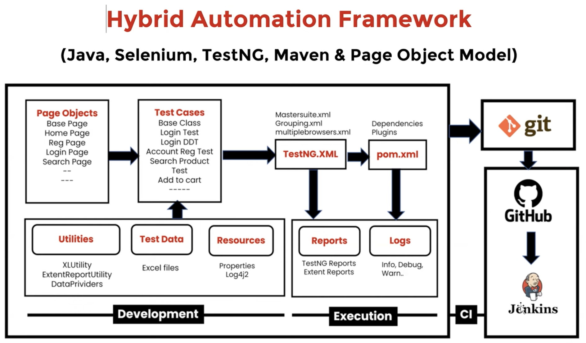

# Hybrid Automation Framework Project using Page Object Model (POM)



---
## 1. What is an Automation Framework?

An automation framework is a structured way of **organizing all the files and folders** in an automation project. Instead of dumping everything in one place, similar files are grouped into their own packages — test cases, page object classes, utilities, test data, properties files, screenshots, XML files, etc.

The three core objectives of any framework are:

- **Reusability** — Write something once and reuse it across multiple test cases. Avoid copy-pasting code. Utility files, for example, are written once and reused everywhere.
- **Maintainability** — The framework must survive long-term. New test cases should be easy to add, existing ones easy to modify, and the project should be understandable enough for any team member to contribute without breaking things.
- **Readability** — Everyone on the team must be able to understand the code. Using overly complex Java features (lambdas, streams, collections) unnecessarily makes code harder to read. Simple is better. A test automation codebase is a team asset, not a personal project.

---

## 2. Types of Frameworks

### Built-in Frameworks
These are pre-built, third-party libraries you install and use directly:

- **TestNG** — Java-based. Supports parallel testing, parameterization, data providers, annotations, grouping, and report generation.
- **JUnit** — Java-based. An older framework; TestNG was built to extend it with additional features like parallel testing.
- **Cucumber** — Java-based (also supports other languages). Used for BDD (Behavior-Driven Development) style test writing.
- **Robot Framework** — Keyword-driven. Works with Python and Java, but is most popular with Python due to richer library support.
- **pytest** — Python-only framework for automation.

Built-in frameworks alone are not enough to build a complete framework — they provide the foundation, but you need to add reporting, third-party integrations, utilities, and more on top.

### Customized (Hybrid) Frameworks
These are user-defined frameworks built on top of built-in frameworks. Every project's hybrid framework is a little different, but most share a common 80% structure. Types include:

- **Modular** — test cases split into independent modules
- **Data-driven** — test logic is separated from test data (Excel, CSV, properties files)
- **Keyword-driven** — test steps written using keywords
- **Hybrid** — a combination of the above (most common in open-source tool projects)

The framework covered in these sessions is a **Hybrid Driven Framework** built with Selenium + Java + TestNG + POM.

---

## 3. Phases of Framework Development

| Phase | Activity |
|---|---|
| 1. Analyze the application | Study pages, element types, identify what can/cannot be automated |
| 2. Choose test cases | Select which test cases to automate based on priority criteria |
| 3. Design & Development | Create folder structure, page objects, utilities, test cases |
| 4. Execution | Run tests locally (IDE) and remotely (Grid, Jenkins) |
| 5. Maintenance | Push to Git/GitHub, Jenkins pulls and runs in CI pipeline |

---

## 4. Choosing Test Cases for Automation

Not all test cases should be automated. Things like font size checks, color validation, CAPTCHA, image comparison, and browser keyboard navigation are typically done manually.

**Priority order for automation:**

1. **P1 — Sanity test cases**: Core functionality tests. If these fail, execution cannot proceed. These must be automated first.
2. **P2 — Data-driven test cases**: Tests requiring multiple sets of data or repetitive steps. Automation provides clear value here.
3. **P3 — Regression test cases**: Tests that must be re-run whenever a bug fix is delivered. These are identified gradually as bugs are found and fixed.
4. **P4 — Other automatable tests**: Any remaining test cases that can be automated if time permits.

### What is 100% Automation?

100% automation does **not** mean automating everything in the application. It means automating **every test case that is automatable**. If 90 out of 100 test cases can be automated and you automate all 90, that is 100% automation. The remaining 10 are handled through manual testing.

---

## 5. The Application Being Automated: OpenCart

The project automates the **OpenCart e-commerce application**, a free, open-source web store management system built on PHP + MySQL. It is a product that any company can download, customize (logo, products, etc.), and deploy on their own server.

**Why e-commerce?** E-commerce features are universal across platforms (Amazon, Flipkart, etc.) — registration, login, search, cart, checkout, order tracking. Learning it gives transferable domain knowledge.

### Frontend vs Backend Operations

| Frontend (automated) | Backend (admin only) |
|---|---|
| Register / login / logout | Manage product catalog |
| Search products | View customer records |
| Add to cart / wishlist | Process orders and returns |
| Place order / payment | Manage inventory/stock |
| Track order / reviews | Shipping and store info |

The project focuses on **frontend automation** using the URL: [https://tutorialsninja.com/demo/](https://tutorialsninja.com/demo/) (or an equivalent hosted instance without CAPTCHA restrictions).

---

## 6. Framework Structure (POM-based Hybrid)

```
src/
├── test/
│   ├── java/
│   │   ├── pageObjects/       ← One class per page (POM)
│   │   ├── testCases/         ← Test scripts (TestNG)
│   │   └── utilities/         ← Helper classes (driver setup, Excel, waits, reports)
│   └── resources/
│       ├── config.properties  ← URL, browser, credentials
│       └── testData/          ← Excel files for data-driven tests
├── test-output/               ← TestNG reports
├── logs/                      ← Log files
├── screenshots/               ← Failure screenshots
└── XML files/                 ← TestNG suite XMLs (run configurations)
```

### Key Integrations Planned

- **TestNG** — test runner, grouping, data providers
- **Extent Reports** — rich HTML test reports
- **Log4j** — logging
- **Selenium Grid** — remote, cross-browser execution
- **Git + GitHub** — source control
- **Jenkins** — CI/CD pipeline (pulls from GitHub and runs tests automatically)

---

## 7. Test Cases to be Automated (Initial Set)

| Test Case | Type |
|---|---|
| Register a new account | Sanity / End-to-end |
| Login with valid credentials | Sanity |
| Login with multiple credential sets | Data-driven |
| Search for a product | Functional |
| Compare products | Functional |
| Add product to cart | End-to-end |
| Place an order (full checkout flow) | End-to-end |

The instructor will demonstrate 4–5 test cases from scratch; the rest are left as practice using the provided 500+ test case Excel document covering 38+ functional areas.

---

## 8. Interview Tips (Covered in Session)

- **"What is a framework?"** → Organizing project files/folders in a structured way for reusability, maintainability, and readability.
- **"Is 100% automation possible?"** → Yes, but only in the sense that all *automatable* test cases are automated. Not every test case can or should be automated.
- **"Did you design the framework?"** → Be honest about your level. If you contributed without designing the whole thing: *"I contributed to the framework — I created page object classes, utility files, and automated test cases across multiple regression cycles. The initial design was a team effort led by senior members."*
- **"What domain have you worked in?"** → Domain experience matters. E-commerce knowledge is portable; banking/healthcare requires specific terminology learned on the job.

---

