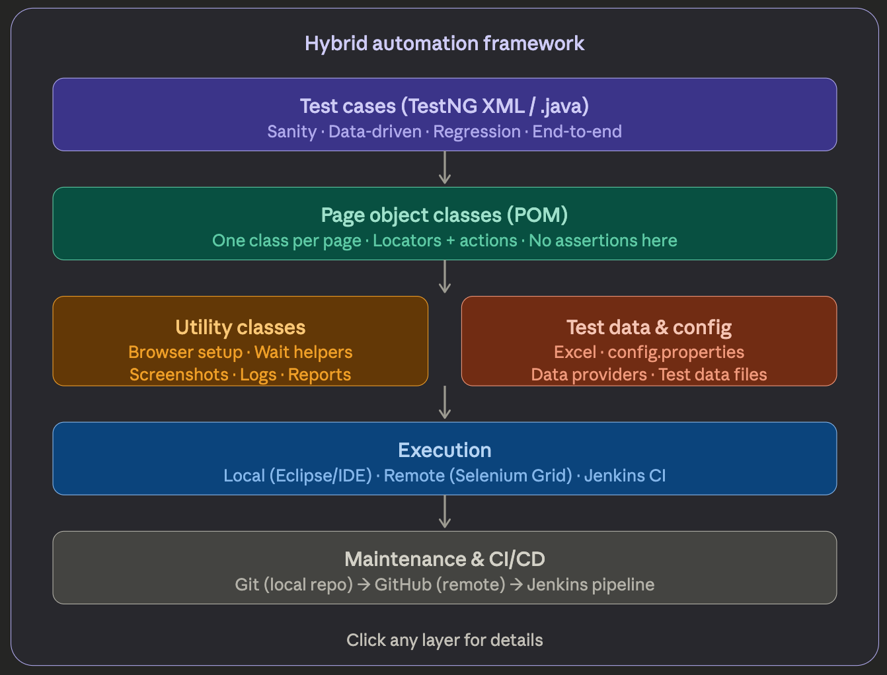
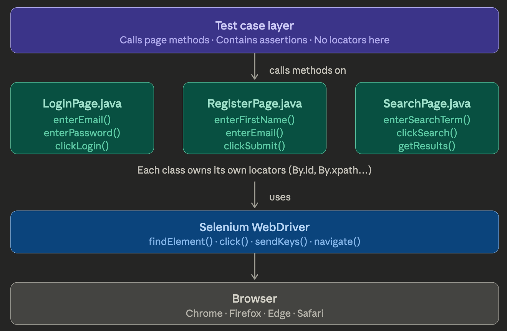
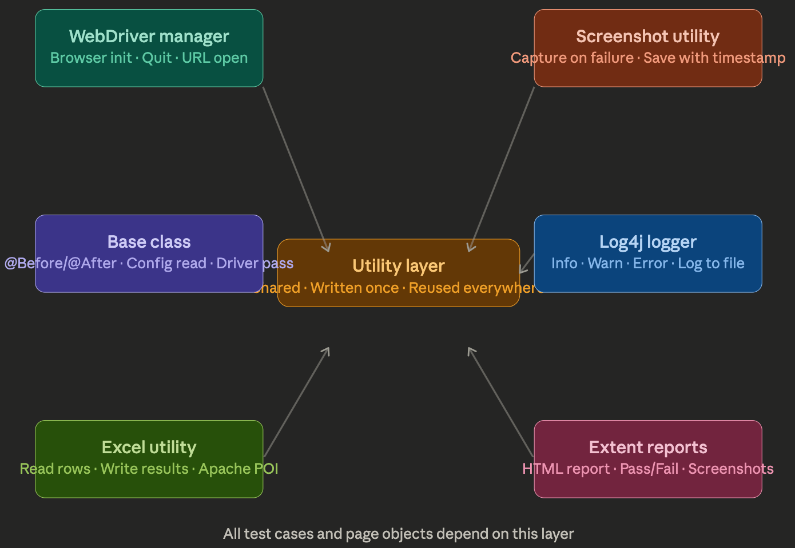
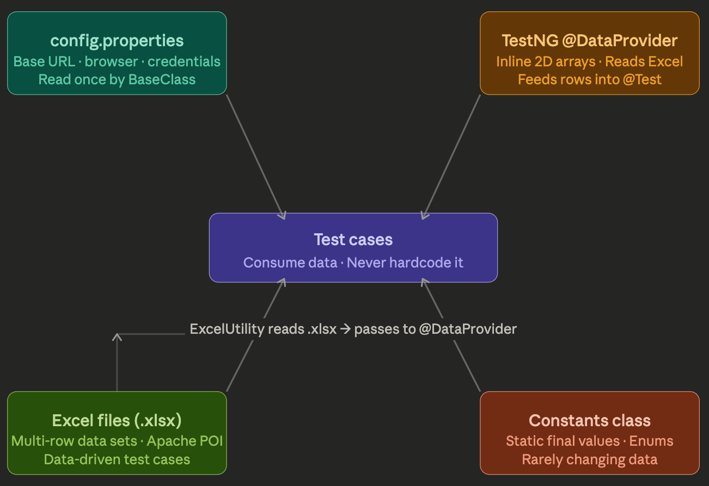
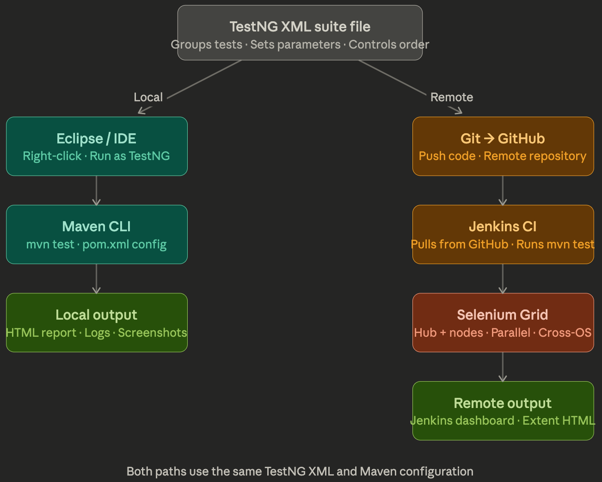
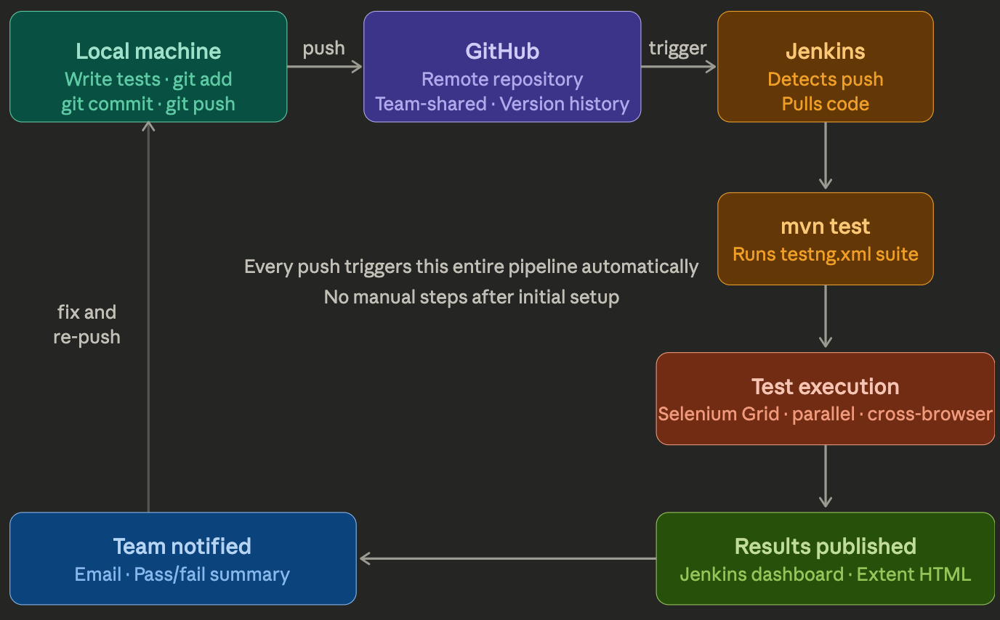

# Page Object Model (POM)

Below is a Hybrid Automation Framework Project using Page Object Model (POM) description in details:



## 1. Test cases in a hybrid automation framework

In a hybrid automation framework, **test cases** are the executable scripts that validate your application's behavior. Here's how they fit together:

**What they are technically**

Test cases are Java classes (`.java` files) annotated with TestNG (`@Test`). Each test method represents one scenario — it calls methods from Page Object classes to perform actions, then asserts the expected outcome.

A simple example:

```java
@Test
public void verifyLogin() {
    LoginPage lp = new LoginPage(driver);
    lp.enterEmail("user@example.com");
    lp.enterPassword("secret123");
    lp.clickLogin();
    Assert.assertTrue(driver.getTitle().contains("My Account"));
}
```

**Where they live in the framework**

Test cases sit at the top of the framework stack (as shown in the diagram). They depend on everything below them — page objects, utilities, and test data — but nothing below depends on them. This separation is the whole point of POM.

**The four types you'll write**

- **Sanity tests** — the most critical, first-priority scripts. They verify core functionality (login works, registration works). If these fail, nothing else runs.
- **Data-driven tests** — one test method that runs multiple times with different data sets, fed via TestNG's `@DataProvider` or an Excel file. Example: login test running with 5 username/password combinations in one shot.
- **Regression tests** — tests built up over time as bugs are fixed and re-verified. They grow gradually as the project matures.
- **End-to-end tests** — multi-step flows that chain several pages together, like: search product → add to cart → checkout → confirm order.

**Rules test cases must follow in a good framework**

- Test cases should contain **no locators** (no `By.id(...)`, no XPaths). Those belong exclusively in the page object classes.
- Each test should be **independent** — it should not rely on another test running first or leaving state behind.
- **No duplicate code** — if setup logic is repeated, it goes in a `@BeforeMethod` or a base class that all test classes extend.
- Assertions (`Assert.assertTrue`, `Assert.assertEquals`) live in the test case, not in page objects.

**How they're executed**

Test cases don't run directly — they're organized into **TestNG XML suite files** that group and configure which tests run, in what order, on which browser, and with what parameters. From there, Maven (`pom.xml`) can trigger those XML files from the command line or through Jenkins for CI runs.

---

## 2. Page Object Model (POM) pattern

Great question — POM is the most important design pattern in Selenium automation. Let me build up the intuition first, then show the structure.

The core problem POM solves: without it, every test script contains raw locators (`By.id("email")`, `By.xpath("//button[@type='submit']"`) scattered everywhere. When the developer changes one element on the login page, you have to hunt through every test file to fix it. With 50+ test cases, that becomes a maintenance nightmare.

POM's solution is simple: **one class per page, which owns all the locators and actions for that page.** Test cases never touch locators directly — they just call methods.---



## The anatomy of a Page Object class

Every page object follows the same three-part structure:

**1. WebDriver instance** — passed in via the constructor so the page object can drive the browser.

**2. Locators** — declared as `By` objects or as `@FindBy` annotated `WebElement` fields. These never leave this class.

**3. Action methods** — public methods that perform one meaningful user action each. They return either `void` or another page object (for chaining navigations).

```java
public class LoginPage {

    WebDriver driver;

    // All locators live here — nowhere else
    By emailField    = By.id("input-email");
    By passwordField = By.id("input-password");
    By loginButton   = By.xpath("//input[@value='Login']");

    // Constructor receives the driver from the test
    public LoginPage(WebDriver driver) {
        this.driver = driver;
    }

    // Action methods — clean, readable, no locators leaking out
    public void enterEmail(String email) {
        driver.findElement(emailField).sendKeys(email);
    }

    public void enterPassword(String password) {
        driver.findElement(passwordField).sendKeys(password);
    }

    public void clickLogin() {
        driver.findElement(loginButton).click();
    }
}
```

And the test case that uses it stays completely clean:

```java
@Test
public void verifyValidLogin() {
    LoginPage loginPage = new LoginPage(driver);
    loginPage.enterEmail("user@test.com");
    loginPage.enterPassword("secret");
    loginPage.clickLogin();
    Assert.assertTrue(driver.getTitle().contains("My Account"));
}
```

Notice the test case reads almost like plain English, and contains zero locators.

---

## The golden rules of POM

**One class, one page.** `LoginPage.java` handles only the login page. It never reaches into the header, the home page, or anything else. If you have 20 pages in your application, you have 20 page object classes.

**No assertions inside page objects.** Page objects perform actions; test cases make assertions. Mixing them breaks the separation and makes page objects harder to reuse across different test scenarios.

**No locators inside test cases.** If a test file contains a `By.xpath(...)`, something has gone wrong. All locators belong in the page object.

**Methods describe user intent, not technical steps.** Name methods `clickLogin()`, not `clickSubmitButton()`. Name them `enterSearchTerm(String term)`, not `sendKeysToSearchBox(String text)`. The method should read like something a user would do.

---

## Why this pays off

Suppose the developer renames the login button's ID from `btn-login` to `submit-login`. Without POM, you search through every test file. With POM, you change one line in `LoginPage.java` and every test that uses it is fixed automatically — because they all call `clickLogin()`, which is the only place that locator exists.

That single maintainability benefit is why POM is considered non-negotiable in professional Selenium frameworks.

---

## 3. Utility Files

Utility files are the backbone of the framework — the shared infrastructure that every test case and page object relies on. They're written once and reused everywhere, which is exactly the reusability principle the framework is built around.---



## 1. WebDriver Manager

This is the most fundamental utility. It handles browser initialization and teardown — the mechanics of actually launching Chrome, Firefox, or Edge.

```java
public class WebDriverManager {

    public WebDriver driver;

    public WebDriver initializeDriver() throws IOException {
        // Read browser type from config.properties
        Properties prop = new Properties();
        prop.load(new FileInputStream("config.properties"));
        String browserName = prop.getProperty("browser");

        if (browserName.equalsIgnoreCase("chrome")) {
            WebDriverManager.chromedriver().setup();
            driver = new ChromeDriver();
        } else if (browserName.equalsIgnoreCase("firefox")) {
            WebDriverManager.firefoxdriver().setup();
            driver = new FirefoxDriver();
        }

        driver.manage().window().maximize();
        driver.manage().timeouts().implicitlyWait(Duration.ofSeconds(10));
        return driver;
    }
}
```

By reading the browser name from a properties file rather than hardcoding it, you can switch browsers by changing one line — no code changes needed.

---

## 2. Base Class

Every test class extends the base class. It handles the setup and teardown that would otherwise be duplicated in every single test file — things like launching the browser before each test and closing it after.

```java
public class BaseClass extends WebDriverManager {

    public WebDriver driver;
    public Logger logger; // Log4j

    @BeforeClass
    public void setup() throws IOException {
        driver = initializeDriver();
        logger = Logger.getLogger(this.getClass());
        driver.get(readConfig().getProperty("baseURL"));
    }

    @AfterClass
    public void teardown() {
        driver.quit();
    }

    public Properties readConfig() throws IOException {
        Properties prop = new Properties();
        prop.load(new FileInputStream("config.properties"));
        return prop;
    }
}
```

Any test class that needs a browser simply does `extends BaseClass` — it inherits the driver, the logger, and the full setup/teardown automatically.

---

## 3. Excel Utility

Used for data-driven testing. Instead of hardcoding test data in your scripts, you store it in an Excel file and read it at runtime using **Apache POI**.

```java
public class ExcelUtility {

    public String[][] getTestData(String sheetName) throws IOException {
        FileInputStream fis = new FileInputStream("testdata/TestData.xlsx");
        XSSFWorkbook workbook = new XSSFWorkbook(fis);
        XSSFSheet sheet = workbook.getSheet(sheetName);

        int rows = sheet.getLastRowNum();
        int cols = sheet.getRow(0).getLastCellNum();
        String[][] data = new String[rows][cols];

        for (int i = 1; i <= rows; i++) {
            for (int j = 0; j < cols; j++) {
                data[i-1][j] = sheet.getRow(i).getCell(j).getStringCellValue();
            }
        }
        workbook.close();
        return data;
    }
}
```

This plugs directly into TestNG's `@DataProvider`, feeding multiple rows of credentials, search terms, or order details into a single test method.

---

## 4. Screenshot Utility

Captures a screenshot whenever a test fails, saving it with a timestamp so you can identify exactly when and what broke.

```java
public class ScreenshotUtility {

    public String captureScreen(WebDriver driver, String testName) throws IOException {
        TakesScreenshot ts = (TakesScreenshot) driver;
        File source = ts.getScreenshotAs(OutputType.FILE);

        String timestamp = new SimpleDateFormat("yyyyMMdd_HHmmss").format(new Date());
        String destination = "screenshots/" + testName + "_" + timestamp + ".png";

        FileUtils.copyFile(source, new File(destination));
        return destination; // returned so ExtentReports can embed it
    }
}
```

This is typically called inside a TestNG `@AfterMethod` that checks `ITestResult.FAILURE`, so screenshots are only taken when something actually goes wrong.

---

## 5. Log4j Logger

Logging lets you trace exactly what your test did step by step — invaluable when debugging failures without having to re-run the test.

```java
// In any test class (inherited via BaseClass)
logger.info("Navigating to login page");
logger.info("Entering email: " + email);
logger.warn("Element not immediately visible, waiting...");
logger.error("Login failed — unexpected page title: " + driver.getTitle());
```

Log4j is configured via a `log4j.properties` file that controls where logs go (console, file, or both) and what level of detail is captured. This runs silently in the background during every test execution.

---

## 6. Extent Reports

The most visible utility — it generates a rich, interactive HTML report after each test run showing which tests passed, which failed, how long each took, and embedded screenshots of failures.

```java
public class ExtentReportManager {

    public static ExtentReports setup() {
        ExtentSparkReporter reporter = new ExtentSparkReporter("reports/TestReport.html");
        reporter.config().setReportName("OpenCart Automation Report");
        reporter.config().setDocumentTitle("Test Results");

        ExtentReports extent = new ExtentReports();
        extent.attachReporter(reporter);
        extent.setSystemInfo("Tester", "QA Team");
        extent.setSystemInfo("Environment", "QA");
        return extent;
    }
}
```

The report is typically wired into TestNG listeners so it updates automatically as each test passes or fails — no manual calls needed inside individual test methods.

---

## How they all connect

When a test runs, the flow through the utility layer looks like this:

```
BaseClass.setup()
    → WebDriverManager launches Chrome (reads browser from config.properties)
    → Log4j initializes, starts writing to test.log
    → ExtentReports creates a new HTML report session

Test method executes
    → ExcelUtility feeds data via @DataProvider
    → Page objects perform actions
    → Logger records each step

Test fails?
    → ScreenshotUtility captures and saves the screenshot
    → ExtentReports marks the test red, embeds the screenshot

BaseClass.teardown()
    → driver.quit() closes the browser
    → ExtentReports flushes and saves the final HTML file
```

Every one of these utilities is written once and shared across the entire test suite — that's what makes the framework a framework rather than just a collection of scripts.

---

## 4. Managing test data in a hybrid framework

Test data management is what separates a truly maintainable framework from a fragile one. The core principle is simple: **test logic and test data must never be mixed together.** If your test script contains hardcoded strings like `"user@test.com"` or `"secret123"`, you have a data management problem — one credential change breaks multiple test files.

A hybrid framework typically uses several complementary approaches depending on what kind of data is needed.---



## 1. config.properties — environment-level data

This file holds data that applies to the entire test run — things that change between environments (QA, staging, production) but stay constant within a single run.

```properties
# config.properties
baseURL=https://demo.opencart.com
browser=chrome
username=test@example.com
password=secret123
implicitWait=10
```

The `BaseClass` reads this file once during `@BeforeClass` and makes the values available to every test through the inherited `readConfig()` method. When you want to run against a different environment, you change the URL in one file — nothing else touches.

```java
// Inside BaseClass — read once, shared everywhere
public Properties readConfig() throws IOException {
    Properties prop = new Properties();
    FileInputStream fis = new FileInputStream(
        System.getProperty("user.dir") + "/src/test/resources/config.properties"
    );
    prop.load(fis);
    return prop;
}

// A test class using it
String url  = readConfig().getProperty("baseURL");
String user = readConfig().getProperty("username");
```

---

## 2. Excel files — data-driven test data

For tests that need to run multiple times with different inputs — login combinations, registration details, search terms, order data — you store each row as a separate data set in an Excel sheet and read it at runtime using **Apache POI**.

A typical `TestData.xlsx` might look like this:

| Email | Password | Expected Result |
|---|---|---|
| valid@test.com | correct123 | Login successful |
| valid@test.com | wrongpass | Login failed |
| notanemail | correct123 | Invalid email |
| | correct123 | Email required |

The `ExcelUtility` class (from the utility layer) reads this sheet and returns it as a 2D `String` array:

```java
public class ExcelUtility {

    String path;

    public ExcelUtility(String path) {
        this.path = path;
    }

    public int getRowCount(String sheetName) throws IOException {
        FileInputStream fis = new FileInputStream(path);
        XSSFWorkbook wb = new XSSFWorkbook(fis);
        int rowCount = wb.getSheet(sheetName).getLastRowNum();
        wb.close();
        return rowCount;
    }

    public String getCellData(String sheetName, int row, int col) throws IOException {
        FileInputStream fis = new FileInputStream(path);
        XSSFWorkbook wb = new XSSFWorkbook(fis);
        String data = wb.getSheet(sheetName)
                        .getRow(row)
                        .getCell(col)
                        .getStringCellValue();
        wb.close();
        return data;
    }
}
```

---

## 3. TestNG @DataProvider — the bridge between Excel and tests

`@DataProvider` is the mechanism that connects your Excel data to your test method. It reads the spreadsheet and feeds each row into the test as a separate invocation — so one test method effectively becomes many test runs.

```java
public class LoginTest extends BaseClass {

    String path = System.getProperty("user.dir")
                + "/src/test/resources/testdata/LoginData.xlsx";
    ExcelUtility xl = new ExcelUtility(path);

    // DataProvider reads every row from the Excel sheet
    @DataProvider(name = "loginData")
    public Object[][] getData() throws IOException {
        int rows = xl.getRowCount("LoginSheet");
        int cols = 3; // email, password, expected result
        Object[][] data = new Object[rows][cols];

        for (int i = 1; i <= rows; i++) {
            data[i-1][0] = xl.getCellData("LoginSheet", i, 0); // email
            data[i-1][1] = xl.getCellData("LoginSheet", i, 1); // password
            data[i-1][2] = xl.getCellData("LoginSheet", i, 2); // expected
        }
        return data;
    }

    // Test runs once per row — no duplication
    @Test(dataProvider = "loginData")
    public void verifyLogin(String email, String password, String expected)
            throws IOException {
        LoginPage lp = new LoginPage(driver);
        lp.enterEmail(email);
        lp.enterPassword(password);
        lp.clickLogin();

        if (expected.equals("Login successful")) {
            Assert.assertTrue(driver.getTitle().contains("My Account"));
        } else {
            Assert.assertTrue(driver.getTitle().contains("Login"));
        }
    }
}
```

TestNG will run `verifyLogin` four times automatically — once for each row in the sheet — and report each invocation separately in the results.

---

## 4. Constants class — static reference data

For data that almost never changes and doesn't belong in a properties file — page titles, expected messages, fixed URLs, timeout values — a dedicated constants class keeps these out of test scripts without the overhead of file I/O.

```java
public class Constants {

    // Page titles
    public static final String HOME_PAGE_TITLE     = "Your Store";
    public static final String LOGIN_PAGE_TITLE    = "Account Login";
    public static final String ACCOUNT_PAGE_TITLE  = "My Account";
    public static final String REGISTER_PAGE_TITLE = "Register Account";

    // Success / error messages
    public static final String REGISTER_SUCCESS_MSG =
        "Your Account Has Been Created!";
    public static final String LOGIN_ERROR_MSG =
        "Warning: No match for E-Mail Address and/or Password.";

    // Timeouts
    public static final int IMPLICIT_WAIT  = 10;
    public static final int EXPLICIT_WAIT  = 20;
    public static final int PAGE_LOAD_WAIT = 30;
}
```

Used in test assertions like:

```java
Assert.assertEquals(driver.getTitle(), Constants.ACCOUNT_PAGE_TITLE);
Assert.assertTrue(successMsg.getText().contains(Constants.REGISTER_SUCCESS_MSG));
```

If the page title ever changes, you fix it in one place in `Constants.java` — every assertion across the suite updates automatically.

---

## How the four sources divide responsibility

| Data type | Where it lives | Who reads it | Changes how often |
|---|---|---|---|
| Base URL, browser, credentials | `config.properties` | `BaseClass` at startup | Per environment switch |
| Login combos, registration inputs | Excel `.xlsx` | `ExcelUtility` + `@DataProvider` | When test data needs expanding |
| Page titles, success messages | `Constants.java` | Directly in test assertions | Rarely — only if UI copy changes |
| Rarely changing lookup values | `Constants.java` or enums | Directly in test or page objects | Very rarely |

The discipline is to always ask: *where does this piece of data belong?* A URL belongs in `config.properties`. A set of 10 login combinations belongs in Excel. An expected page title belongs in `Constants`. None of them belong hardcoded inside a test method.

---

## 5. How test execution work locally and remotely

Test execution is where all the work from the previous layers — page objects, utilities, test data — actually runs. There are two distinct modes, and a professional framework needs to support both.---



## The TestNG XML Suite File — the starting point for both paths

Before getting into local vs remote, it helps to understand what actually triggers execution. You don't run individual Java test classes directly — you run a **TestNG XML suite file** that declares which tests to include, in what order, with what parameters, and how many threads to use. Everything else flows from this file.

```xml
<!-- testng.xml -->
<?xml version="1.0" encoding="UTF-8"?>
<!DOCTYPE suite SYSTEM "http://testng.org/testng-1.0.dtd">

<suite name="OpenCart Regression Suite" parallel="tests" thread-count="2">

    <test name="Chrome Tests">
        <parameter name="browser" value="chrome"/>
        <classes>
            <class name="testCases.LoginTest"/>
            <class name="testCases.RegisterTest"/>
            <class name="testCases.SearchTest"/>
        </classes>
    </test>

    <test name="Firefox Tests">
        <parameter name="browser" value="firefox"/>
        <classes>
            <class name="testCases.LoginTest"/>
            <class name="testCases.RegisterTest"/>
        </classes>
    </test>

</suite>
```

This single file controls the entire run. You can have multiple XML files for different purposes — `sanity.xml`, `regression.xml`, `smoke.xml` — and choose which one to run depending on the situation.

---

## Local Execution

Local execution means running tests on your own machine, inside your development environment. This is used during framework development, while writing new test cases, and for quick debugging.

### Option 1 — Run directly from Eclipse

Right-click on any of the following and select `Run As → TestNG Suite` (for XML) or `Run As → TestNG Test` (for a class):

- A specific test class
- The `testng.xml` file
- A specific `@Test` method

This is the fastest feedback loop during development. You see results immediately in the TestNG results panel, and any `System.out.println` or Log4j output appears in the console.

### Option 2 — Run via Maven from the command line

Maven is how you run tests in a controlled, reproducible way — the same command works on your machine, a colleague's machine, or a CI server.

First, the `pom.xml` needs the Surefire plugin configured to point at your XML file:

```xml
<!-- pom.xml -->
<build>
    <plugins>
        <plugin>
            <groupId>org.apache.maven.plugins</groupId>
            <artifactId>maven-surefire-plugin</artifactId>
            <version>3.0.0</version>
            <configuration>
                <suiteXmlFiles>
                    <suiteXmlFile>testng.xml</suiteXmlFile>
                </suiteXmlFiles>
            </configuration>
        </plugin>
    </plugins>
</build>
```

Then from the terminal:

```bash
# Run the full suite
mvn test

# Run a specific XML file
mvn test -DsuiteXmlFile=sanity.xml

# Override the browser at runtime
mvn test -Dbrowser=firefox

# Run only failed tests from the last run
mvn test -DsuiteXmlFile=testng-failed.xml
```

The `testng-failed.xml` file is automatically generated by TestNG after any run that has failures — it contains only the tests that failed, so you can re-run just those without touching anything else.

---

## Remote Execution

Remote execution means tests run somewhere other than your local machine — a different OS, a different browser, a CI server, or a grid of machines. This is where automation delivers its real value: running hundreds of tests in parallel across different environments without any manual involvement.

### Path 1 — Selenium Grid (cross-browser parallel execution)

Selenium Grid has two components: a **Hub** (the coordinator) and one or more **Nodes** (the machines that actually run the browser). Your test sends a request to the Hub describing what browser and OS it needs, and the Hub routes it to a matching Node.

**Starting the Grid (Selenium 4 standalone):**

```bash
# Download selenium-server-4.x.jar, then:
java -jar selenium-server-4.x.jar standalone
# Hub starts at http://localhost:4444
```

**Connecting your test to the Grid instead of a local browser:**

The key change is replacing `new ChromeDriver()` with a `RemoteWebDriver` that points at the Grid's URL:

```java
public WebDriver initializeDriver() throws Exception {

    String browser = prop.getProperty("browser");
    String runMode = prop.getProperty("execution_env"); // "local" or "remote"

    if (runMode.equalsIgnoreCase("remote")) {
        // Remote execution via Selenium Grid
        ChromeOptions options = new ChromeOptions();

        if (browser.equalsIgnoreCase("chrome")) {
            driver = new RemoteWebDriver(
                new URL("http://localhost:4444"),
                new ChromeOptions()
            );
        } else if (browser.equalsIgnoreCase("firefox")) {
            driver = new RemoteWebDriver(
                new URL("http://localhost:4444"),
                new FirefoxOptions()
            );
        }

    } else {
        // Local execution
        if (browser.equalsIgnoreCase("chrome")) {
            WebDriverManager.chromedriver().setup();
            driver = new ChromeDriver();
        } else if (browser.equalsIgnoreCase("firefox")) {
            WebDriverManager.firefoxdriver().setup();
            driver = new FirefoxDriver();
        }
    }

    driver.manage().window().maximize();
    driver.manage().timeouts().implicitlyWait(Duration.ofSeconds(10));
    return driver;
}
```

Now switching between local and Grid is a single change in `config.properties`:

```properties
execution_env=remote   # or local
browser=chrome
```

With the `parallel="tests"` and `thread-count="2"` in your TestNG XML, your tests now run simultaneously on multiple nodes — one on Chrome, one on Firefox — cutting total execution time in half or more.

### Path 2 — Jenkins CI pipeline (scheduled and triggered execution)

Jenkins is a CI tool that automatically pulls your code from GitHub and runs your tests on a schedule or whenever code is pushed. This is what "continuous integration" means in practice — tests run without anyone manually triggering them.

**The flow:**

```
Developer pushes code to GitHub
        ↓
Jenkins detects the push (webhook or polling)
        ↓
Jenkins pulls the latest code
        ↓
Jenkins runs: mvn test
        ↓
Tests execute on the Jenkins server (or Grid nodes)
        ↓
Jenkins publishes results to its dashboard
        ↓
Team gets notified of pass/fail via email
```

**Basic Jenkins job configuration:**

Inside a Jenkins Freestyle job you configure:

```
Source Code Management:
  Git → https://github.com/yourteam/opencart-automation.git

Build Trigger:
  Poll SCM → H/5 * * * *   (check every 5 minutes)
  or: GitHub webhook (trigger instantly on push)

Build Step → Invoke top-level Maven targets:
  Goals: test
  POM: pom.xml

Post-build Actions:
  Publish HTML reports → reports/TestReport.html
  Email notification → qa-team@company.com
```

Once this is configured, every single push to GitHub automatically triggers a full test run — no human involvement needed. The team wakes up to a dashboard showing exactly which tests passed and which failed overnight.

---

## How local and remote relate to each other

The critical point is that **the test code itself does not change** between local and remote execution. The same Java test classes, the same TestNG XML, the same Maven command — the only difference is what `execution_env` is set to in `config.properties` and where Jenkins points its Maven command.

This is by design. A framework that requires code changes to switch environments is not a well-built framework. The environment should be configuration, not code.

| Aspect | Local | Remote (Grid + Jenkins) |
|---|---|---|
| Who triggers it | Developer manually | Jenkins automatically |
| Where browser runs | Your machine | Node machine |
| Parallel execution | Limited by your CPU | Across multiple nodes |
| Used for | Development, debugging | Regression, CI, overnight runs |
| Results visible in | IDE + local HTML report | Jenkins dashboard + email |
| Code changes needed | None | None — config only |

---

## 6. Maintaining code in a CI/CD pipeline

Code maintenance in a CI/CD pipeline is what transforms automation from a local scripting exercise into a professional, team-scale operation. The pipeline ensures that every change anyone makes is automatically validated, integrated, and reported — without anyone manually coordinating it.

The three tools that make this work together are **Git** (local version control), **GitHub** (remote shared repository), and **Jenkins** (the automation server that ties everything together).---



## Stage 1 — Git: local version control

Git tracks every change you make to your automation project on your own machine. Think of it as a detailed history of your entire project — who changed what, when, and why — that you can roll back at any point.

**The daily workflow for an automation engineer:**

```bash
# First time only — tell Git who you are
git config --global user.name "Your Name"
git config --global user.email "you@company.com"

# Initialize Git in your project (first time only)
git init

# Check what has changed since your last commit
git status

# Stage your changes (specific file or everything)
git add src/test/java/testCases/LoginTest.java
git add .   # stages all changed files

# Commit with a meaningful message
git commit -m "Add data-driven login test with Excel integration"

# See the full history of commits
git log --oneline
```

Every `git commit` is a snapshot of your project at that moment. If a new test case breaks something, you can roll back to any previous commit instantly. This is why you should commit frequently — after every meaningful addition or fix, not just at the end of the day.

**What belongs in `.gitignore`:**

Not everything in your project should be pushed to GitHub. Generated files, local config, and build artifacts should be excluded:

```gitignore
# .gitignore
target/               # Maven build output
test-output/          # TestNG default reports
reports/              # Extent HTML reports
screenshots/          # Failure screenshots
logs/                 # Log files
*.class               # Compiled Java files
.classpath
.project
.settings/
```

Screenshots, logs, and reports are generated fresh every run — there's no value in version-controlling them, and they'd bloat the repository quickly.

---

## Stage 2 — GitHub: the shared remote repository

GitHub is where the team's code lives centrally. Every team member pushes their local commits here, and Jenkins pulls from here to run tests. It's the single source of truth for the project.

**Connecting your local project to GitHub:**

```bash
# Link your local repo to a GitHub remote (first time only)
git remote add origin https://github.com/yourteam/opencart-automation.git

# Push your local commits to GitHub
git push -u origin main   # first push
git push                  # every push after that

# Pull the latest code from teammates before starting work
git pull origin main
```

**Branching — how teams work without stepping on each other:**

In a team, nobody works directly on the `main` branch. Each person creates a feature branch for their work, then merges it back when done:

```bash
# Create and switch to a new branch for your feature
git checkout -b feature/search-test-automation

# Work on your test cases, commit as normal
git add .
git commit -m "Add product search and filter test cases"

# Push the branch to GitHub
git push origin feature/search-test-automation

# Open a Pull Request on GitHub for team review
# After approval, merge into main
```

This means the `main` branch always contains reviewed, stable code — and Jenkins always runs tests against `main`.

---

## Stage 3 — Jenkins: the automation server

Jenkins monitors your GitHub repository and reacts whenever code changes. Its job is to pull the latest code, run the full test suite, and report results — all without anyone pressing a button.

**Setting up a Jenkins job:**

Inside Jenkins, creating a Freestyle job involves four key sections:

```
1. SOURCE CODE MANAGEMENT
   ✓ Git
   Repository URL: https://github.com/yourteam/opencart-automation.git
   Branch: */main
   Credentials: (your GitHub token)

2. BUILD TRIGGERS
   ✓ Poll SCM
   Schedule: H/5 * * * *    ← checks GitHub every 5 minutes
   
   OR
   
   ✓ GitHub hook trigger    ← fires instantly on every push (preferred)

3. BUILD STEP — Invoke top-level Maven targets
   Goals: clean test
   POM: pom.xml

4. POST-BUILD ACTIONS
   ✓ Publish HTML reports
     Report path: reports/
     Report files: TestReport.html
   ✓ Email notification
     Recipients: qa-team@company.com
```

**What `clean test` does:** `clean` deletes the previous build's output so stale results never contaminate the new run. `test` compiles the project and executes the TestNG suite defined in `pom.xml`.

---

## Stage 4 — The pipeline in action, end to end

Here is exactly what happens from the moment a team member pushes code:

```
1. Engineer finishes a new test case
   git add . → git commit -m "Add checkout end-to-end test" → git push

2. Jenkins detects the push within seconds (webhook) or minutes (polling)

3. Jenkins pulls the latest code from GitHub
   git pull origin main

4. Jenkins runs the build
   mvn clean test
   → Surefire plugin reads pom.xml
   → Launches testng.xml suite
   → BaseClass initializes WebDriver (local or Grid)
   → All test classes execute

5. Results are collected
   → TestNG generates test-output/
   → ExtentReports writes reports/TestReport.html
   → Log4j writes logs/automation.log
   → Screenshots saved for any failures

6. Jenkins publishes the HTML report to its dashboard
   → Green build = all tests passed
   → Red build = one or more failures

7. Jenkins emails the team
   Subject: "BUILD FAILED — OpenCart Regression Suite — 3 failures"
   Body: links to the Jenkins dashboard and HTML report

8. Engineer opens the report, sees which tests failed and why,
   fixes the issue, pushes again — pipeline restarts automatically
```

---

## Day-to-day maintenance discipline

The pipeline only works well if everyone follows consistent practices:

**Commit messages that mean something:**
```bash
# Good — tells you exactly what changed and why
git commit -m "Fix LoginTest locator after UI update to input-email-v2"
git commit -m "Add Excel data provider for registration negative cases"
git commit -m "Refactor BaseClass to support Safari driver initialization"

# Bad — tells you nothing
git commit -m "fix"
git commit -m "changes"
git commit -m "update test"
```

**Push at least once per day.** Code sitting only on a local machine is code at risk. If your machine fails, the work is gone. The remote repository is the safety net.

**Never push broken code to main.** Always run at least the sanity suite locally before pushing. If tests fail on your machine, they'll fail in Jenkins too — and block the whole team's pipeline.

**Pull before you push.** If a teammate pushed since your last pull, you may have conflicts. Always `git pull` before `git push` to resolve conflicts locally rather than in the shared repository.

---

## The complete maintenance picture

| Tool | Responsibility | Used by |
|---|---|---|
| Git (local) | Track changes, commit history, branching | Every engineer daily |
| GitHub | Central shared repo, pull requests, code review | Whole team + Jenkins |
| Jenkins | Auto-trigger tests on push, publish results, notify | Runs automatically |
| Maven | Standardize how tests are compiled and run | Jenkins + engineers locally |
| Extent Reports | Human-readable pass/fail details per test | QA team + stakeholders |

The goal of all of this is that **no single person is responsible for running tests manually.** Once the pipeline is set up, it runs itself — every push triggers a full validation cycle, results are visible to everyone, and failures are caught within minutes rather than days.

---


