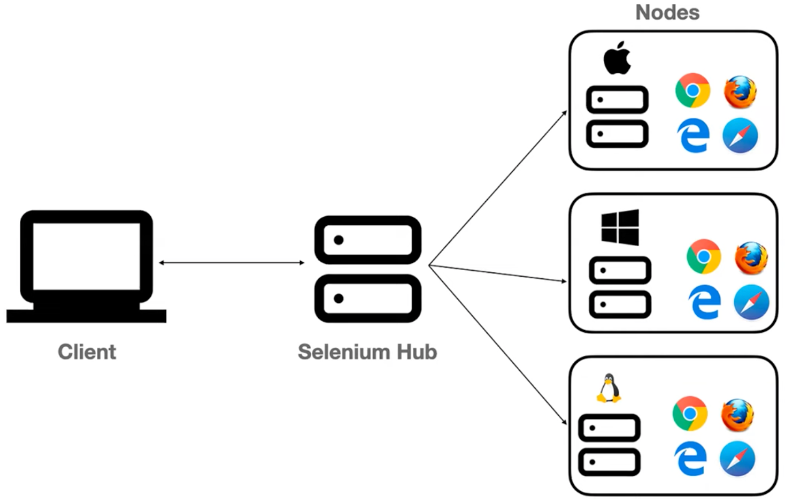

# Running Tests on Selenium Grid

## 1. What is Selenium Grid?

Selenium Grid is a major component of the Selenium suite that allows you to run test cases on **remote machines** — enabling cross-browser and cross-platform testing from a single control point.

Without Grid, tests run only on your local machine and local browsers. Grid solves the problem of needing to verify that your application works correctly across **multiple operating systems** and **multiple browsers**, because real users can be on any combination of these.

---

## 2. Core Concepts: Hub and Node



Selenium Grid operates on a **Hub-Node architecture**.

### Hub
- The **central controller** machine from which test cases are written, triggered, and monitored.
- Controls the entire grid environment.
- Knows about all registered nodes and their capabilities (OS, browsers).
- Routes test execution requests to the appropriate node based on desired OS and browser.

### Node
- A **remote machine** (physical, virtual, or container) registered with the Hub.
- Has one or more browsers installed.
- Receives test execution commands from the Hub and runs them locally.
- Can be Windows, Mac, Linux, or any other OS.

**Key Rule:** The Hub and all Nodes must be connected to the **same network**.

---

## 3. Grid Setup Modes

### Mode 1: Standalone Setup (Single Machine)
- The **same machine** acts as both Hub and Node.
- Ideal for **practice and development**.
- No additional machines or VMs required.

**Command to start:**
```bash
java -jar selenium-server-<version>.jar standalone
```

### Mode 2: Hub and Node Setup (Multiple Machines / Distributed)
- One machine is designated as the **Hub**.
- One or more separate machines/VMs/containers are designated as **Nodes**.
- Nodes are registered with the Hub via command.

**Step 1 — Start the Hub** (run on Hub machine):
```bash
java -jar selenium-server-<version>.jar hub
```

**Step 2 — Start and Register each Node** (run on each Node machine):
```bash
java -jar selenium-server-<version>.jar node --hub <HUB_URL>
```

> **Example Hub URL:** `http://192.168.1.6:4444`  
> Default port is **4444**.

---

## 4. Prerequisites for Grid Setup

| Requirement | Details |
|---|---|
| Selenium Server JAR | Download from [selenium.dev/downloads](https://www.selenium.dev/downloads/) |
| JAR on every machine | The same JAR must be present on the Hub AND all Nodes |
| Browsers installed | Each Node must have the required browsers installed |
| Same network | All machines must be on the same local network |

### Downloading the JAR
1. Go to the official Selenium website → **Downloads**
2. Scroll to **Selenium Server (Grid)**
3. Download the latest `.jar` file (e.g., `selenium-server-4.20.jar`)
4. Place it in a known directory (e.g., `C:\automation\`)

---

## 5. Node Options: Physical Machines vs. VMs vs. Docker

### Physical Machines
- Most expensive and impractical for temporary testing.
- Hard to scale.

### Virtual Machines (VMs)
- Emulate different OS environments within a host machine.
- Examples: VMware, VirtualBox.
- **Less costly** than physical machines, but still complex to set up and maintain.
- Each VM needs the JAR file and browsers installed.

### Docker Containers *(Recommended Modern Approach)*
- Containers replace VMs with a **lightweight, image-based** approach.
- Download OS images from **Docker Hub** → Create containers → Use as Nodes.
- Docker images for Selenium Grid already come pre-configured with the grid setup.
- Much simpler to scale: create multiple containers with one command.

> **Note:** Docker setup will be a separate topic. Today's focus is the traditional JAR-based approach.

---

## 6. Grid Console / Dashboard

Once the grid is started, open the Hub URL in a browser:

```
http://localhost:4444
```
or
```
http://<hub-ip>:4444
```

The **Grid Console** shows:
- Which OS and browsers are registered (e.g., Windows + Chrome, Firefox, Edge)
- How many parallel sessions are available (default: **16 per browser**)
- **Sessions tab**: Live view of currently running test sessions

> Sessions disappear from the dashboard once the test completes. Close the command prompt window = Grid stops.

---

## 7. Modifying the Automation Framework for Grid

### Step 1: Add Execution Environment Parameter to `config.properties`

```properties
# Use 'local' to run on local machine, 'remote' to run on Grid
execution_environment=local
# execution_environment=remote
```

Toggle between `local` and `remote` depending on where you want to execute.

---

### Step 2: Update the Base Class (`BaseClass.java`)

In your `@BeforeMethod` setup:

```java
String env = p.getProperty("execution_environment");

if (env.equalsIgnoreCase("remote")) {

    // --- GRID / REMOTE EXECUTION ---

    DesiredCapabilities capabilities = new DesiredCapabilities();

    // Set Operating System (value comes from TestNG XML)
    if (os.equalsIgnoreCase("Windows")) {
        capabilities.setPlatform(Platform.WINDOWS);
    } else if (os.equalsIgnoreCase("Mac")) {
        capabilities.setPlatform(Platform.MAC);
    } else {
        System.out.println("No matching OS found");
        return;
    }

    // Set Browser (value comes from TestNG XML)
    switch (browser.toLowerCase()) {
        case "chrome":
            capabilities.setBrowserName("chrome");
            break;
        case "edge":
            capabilities.setBrowserName("MicrosoftEdge");
            break;
        default:
            System.out.println("No matching browser found");
            return;
    }

    // Hub URL — replace IP with your Hub machine's IP or use localhost
    String hubURL = "http://192.168.1.6:4444/wd/hub";

    // Create RemoteWebDriver
    driver = new RemoteWebDriver(new URL(hubURL), capabilities);

} else if (env.equalsIgnoreCase("local")) {

    // --- LOCAL EXECUTION ---

    switch (browser.toLowerCase()) {
        case "chrome":
            driver = new ChromeDriver();
            break;
        case "edge":
            driver = new EdgeDriver();
            break;
        case "firefox":
            driver = new FirefoxDriver();
            break;
    }
}
```

**Required imports:**
```java
import org.openqa.selenium.remote.DesiredCapabilities;
import org.openqa.selenium.remote.RemoteWebDriver;
import org.openqa.selenium.Platform;
import java.net.URL;
```

---

### Step 3: Pass OS and Browser via TestNG XML

`testng.xml` continues to pass `os` and `browser` as parameters — no change needed here. These values feed into both local and remote branches of your Base Class.

```xml
<parameter name="os" value="Windows"/>
<parameter name="browser" value="chrome"/>
```

For **cross-browser parallel execution on Grid**, configure `parallel.xml`:
```xml
<suite name="CrossBrowser" parallel="tests">
    <test name="ChromeTest">
        <parameter name="os" value="Windows"/>
        <parameter name="browser" value="chrome"/>
        ...
    </test>
    <test name="EdgeTest">
        <parameter name="os" value="Windows"/>
        <parameter name="browser" value="edge"/>
        ...
    </test>
    <test name="FirefoxTest">
        <parameter name="os" value="Windows"/>
        <parameter name="browser" value="firefox"/>
        ...
    </test>
</suite>
```

---

## 8. Key Classes Used for Grid Execution

| Class | Purpose |
|---|---|
| `DesiredCapabilities` | Specifies desired OS and browser for the Grid session |
| `Platform` | Enum providing platform constants: `Platform.WINDOWS`, `Platform.MAC`, etc. |
| `RemoteWebDriver` | Parent class of all WebDriver implementations; used for Grid execution |
| `URL` | Converts Hub URL string to a `java.net.URL` object |

> `RemoteWebDriver` is the **parent class** of `ChromeDriver`, `EdgeDriver`, `FirefoxDriver`, etc. In Grid mode, you use `RemoteWebDriver` directly since the node handles the specific browser instantiation.

---

## 9. Where Reports, Logs, and Screenshots Are Generated

Even when tests execute on a remote Node, **all output is captured on the Hub machine**:

| Artifact | Location |
|---|---|
| Console logs | Hub machine |
| Test reports (TestNG, Extent) | Hub machine |
| Screenshots | Hub machine |
| Errors / Stack traces | Hub machine |

Only the **browser launch and UI interactions** happen on the Node. Everything else remains on the Hub.

---

## 10. Parallel Execution on Grid

Grid supports running multiple browser sessions simultaneously. The default is **16 sessions per browser**. This means:
- Up to 16 Chrome sessions at once
- Up to 16 Firefox sessions at once
- Up to 16 Edge sessions at once

If all sessions are occupied, new tests go into a **queue** and execute when a session becomes free. You can monitor this in real time on the Sessions tab of the Grid Console.

---

## 11. Summary: What Changes vs. What Stays the Same

| Item | Change Required? |
|---|---|
| Test case logic | ❌ No change |
| `testng.xml` parameters | ❌ No change |
| `config.properties` | ✅ Add `execution_environment` |
| `BaseClass.java` | ✅ Add remote execution branch |
| Hub URL | ✅ Capture from Grid console |
| Framework structure | ❌ No change |

The same code works for **Standalone**, **Hub-Node**, and **Docker** Grid setups. The only difference between these setups is the infrastructure — the Java/TestNG code is identical.

---

## 12. Quick Reference: Grid Commands

| Goal | Command |
|---|---|
| Start Standalone Grid | `java -jar selenium-server-4.x.jar standalone` |
| Start Hub only | `java -jar selenium-server-4.x.jar hub` |
| Start and register a Node | `java -jar selenium-server-4.x.jar node --hub http://<hub-ip>:4444` |
| Open Grid Console | Navigate to `http://localhost:4444` in browser |

---

## 13. Next Steps

- **Docker-based Grid Setup**: Use pre-built Docker images from Docker Hub to spin up nodes as containers automatically — no manual JAR deployment or VM management needed.
- Recommended for CI/CD pipelines and scalable test infrastructure.

---