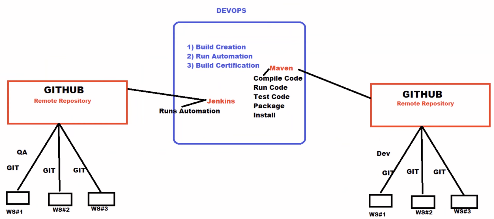

# 🐙 Git & GitHub Workflow

---

## 1. What is Git?

Git is like a really epic **save button** for your files and directories. Officially, Git is a **version control system (VCS)**.

### Traditional Saving vs Git Saving

| Traditional Save | Git Save |
|-----------------|---------|
| One file, one record (`essay.doc`) | Records **differences** in files over time |
| Must manually duplicate (`essay-draft1.doc`, `essay-final.doc`) | Keeps a full **historical record** of every save |
| Easy to lose track of versions | Can restore any previous version instantly |
| No collaboration built in | Built for team collaboration |

### Why Git?
- Review how your project grows over time
- Restore file states from any point in history
- Share and collaborate via GitHub, GitLab, Bitbucket
- **Almost all software companies consider Git an essential skill**
- GitHub portfolio = proof of your work to future employers

---

## 2. Git vs GitHub

| Tool | What It Is | Where It Lives |
|------|-----------|---------------|
| **Git** | Version control software | Your local machine |
| **GitHub** | Remote storage + web interface for Git repos | Online (`github.com`) |

> 💡 Git works offline on your machine. GitHub is the cloud — it stores your code remotely so others can access it.

---

## 3. Prerequisites

Before using Git & GitHub, install and configure these two tools:

### 3a. Install Git

**Download:** [git-scm.com/downloads](https://git-scm.com/downloads) — available for Windows, Mac, Linux (free)

**Windows Installation Steps:**
1. Download the 64-bit standalone installer
2. Double-click the `.exe` file
3. Click **Next** through ~14 screens (keep all default options)
4. Click **Install** on the final screen
5. Click **Finish** — then **reboot your system**

**Verify installation** — right-click anywhere on desktop and look for:
- `Git Bash` — the Git command prompt (use this for all Git commands)
- `Git GUI` — graphical interface

```bash
git --version    # Check installed version (must be 2.28 or later)
```

### 3b. Create a GitHub Account

Go to [github.com](https://github.com) and sign up with your email.

> ✅ **Everyone in tech should have a GitHub account.** It acts as your portfolio — interviewers check it to see your actual work.

**After signup — recommended settings:**
- Go to **Email Settings** → enable "Keep my email addresses private"
- Enable two-factor authentication (2FA) for security

---

## 4. Configuring Git (One-Time Setup)

After installing Git, configure your identity. Git needs this to track who made each commit.

```bash
git config --global user.name "Your Name"
git config --global user.email "yourname@example.com"
```

**Set default branch to `main` (modern standard):**
```bash
git config --global init.defaultBranch main
```

**Verify your config:**
```bash
git config --get user.name
git config --get user.email
```

**Mac users — ignore `.DS_Store` files:**
```bash
echo .DS_Store >> ~/.gitignore_global
git config --global core.excludesfile ~/.gitignore_global
```

**Set VS Code as default commit message editor:**
```bash
git config --global core.editor "code --wait"
```

---

## 5. SSH Key Setup (GitHub Authentication)

SSH keys let you push to GitHub without typing your username/password every time.

### Step 1: Check for existing SSH key
```bash
ls ~/.ssh/id_ed25519.pub
```
If you see "No such file or directory" → create a new one.

### Step 2: Generate SSH key
```bash
ssh-keygen -t ed25519
```
- Press **Enter** when asked for location (use default)
- Optionally add a passphrase (recommended for security)

### Step 3: Copy your public key
```bash
cat ~/.ssh/id_ed25519.pub
```
Copy the entire output (starts with `ssh-ed25519`).

### Step 4: Add key to GitHub
1. Go to GitHub → Profile Picture → **Settings**
2. Click **SSH and GPG Keys** → **New SSH Key**
3. Give it a name (e.g., `windows-laptop`)
4. Paste your key → Click **Add SSH Key**

### Step 5: Test the connection
```bash
ssh -T git@github.com
```

**Expected output:**
```
Hi USERNAME! You've successfully authenticated, but GitHub does not provide shell access.
```

---

## 6. Maven Installation

Maven is a **build tool** used to compile and run your automation project outside of Eclipse.

### Why Install Maven at OS Level?
- Eclipse has Maven built-in — but only works **inside** Eclipse
- To run tests from the **command prompt** or **Jenkins**, you need Maven installed on the OS

### Maven Installation — Windows

1. Download from [maven.apache.org](https://maven.apache.org/download.cgi) → **Binary zip archive** (`.zip`)
2. Extract the zip file
3. Move the extracted folder to `C:\Program Files\` (or any permanent location)
4. Copy the path to the `bin` folder (e.g., `C:\Program Files\apache-maven-3.9.6\bin`)
5. Go to: **This PC → Right-click → Properties → Advanced System Settings → Environment Variables**
6. Under **System Variables**, find `Path` → click **Edit** → click **New**
7. Paste the `bin` folder path → click **OK** → close all windows

**Verify:**
```bash
mvn -version
mvn --version
```

### Maven Installation — Mac

**Step 1: Download**
Go to [maven.apache.org](https://maven.apache.org/download.cgi) → download the **Binary tar.gz archive** (`.tar.gz`)

**Step 2: Extract and move**
```bash
# Unzip the downloaded file, then move to a permanent location
# Note the root directory path (e.g., /Users/yourname/Desktop/apache-maven-3.9.6)
```

**Step 3: Find the root directory path**
```bash
cd ~/Desktop/apache-maven-3.9.6
pwd    # Copy this output — this is your MVN_HOME path
```

**Step 4: Set environment variables in bash profile**
```bash
vim ~/.bash_profile
```

Inside vim — press `i` to enter insert mode, then type:
```bash
export MVN_HOME=/path/to/apache-maven-3.9.6
export PATH=$PATH:$MVN_HOME/bin
```

Press `ESC`, then type `:wq` and press `Enter` to save and exit.

**Step 5: Apply the changes**
```bash
source ~/.bash_profile
echo $MVN_HOME    # Verify the path is set correctly
```

**Verify Maven:**
```bash
mvn -version
```

> ⚠️ **Java is required** before Maven will work. Make sure Java 11 or later is installed. Check with: `java -version`

---

## 7. Running Tests with Maven (pom.xml)

### Add Plugins to pom.xml

Maven uses **two types of entries** in `pom.xml`:

| Entry Type | Purpose |
|-----------|---------|
| `<dependencies>` | Download required JAR files (Selenium, TestNG, etc.) |
| `<plugins>` | Compile and run the project |

**Two plugins required:**

```xml
<build>
  <pluginManagement>
    <plugins>

      <!-- Plugin 1: Compile the project -->
      <plugin>
        <groupId>org.apache.maven.plugins</groupId>
        <artifactId>maven-compiler-plugin</artifactId>
        <version>3.11.0</version>
      </plugin>

      <!-- Plugin 2: Run TestNG XML file -->
      <plugin>
        <groupId>org.apache.maven.plugins</groupId>
        <artifactId>maven-surefire-plugin</artifactId>
        <version>3.2.5</version>
        <configuration>
          <suiteXmlFiles>
            <suiteXmlFile>master.xml</suiteXmlFile>
          </suiteXmlFiles>
        </configuration>
      </plugin>

    </plugins>
  </pluginManagement>
</build>
```

> 💡 Place the `<build>` block **before** the `<dependencies>` section in pom.xml.
> Change `master.xml` to whichever TestNG XML file you want to run.

### maven-compiler-plugin vs. maven-surefire-plugin

Both plugins are core parts of the Maven build lifecycle, but they serve entirely different purposes — one **prepares** the code, the other **validates** it through testing.

| Feature | maven-compiler-plugin | maven-surefire-plugin |
|---------|----------------------|----------------------|
| **Primary Goal** | Compiles Java source files into bytecode | Executes unit/integration tests and generates reports |
| **Lifecycle Phase** | `compile` and `test-compile` | `test` |
| **Input** | Main source (`src/main/java`) and test source (`src/test/java`) | Compiled test classes |
| **Output** | `.class` files in `target/classes` and `target/test-classes` | Test results and reports in `target/surefire-reports` |
| **Supported Frameworks** | N/A — uses standard Java compiler (`javac`) | JUnit, TestNG, and POJO tests |

#### maven-compiler-plugin — Details

This plugin transforms your human-readable Java code into a format the JVM can execute.

- **Two core goals:**
    - `compiler:compile` — compiles main source files
    - `compiler:testCompile` — compiles test source files
- **Key configuration:** specify Java version (`source` and `target`) to ensure compatibility across environments
- **Incremental compilation:** by default, only recompiles files that have **changed** since the last build — saves time on large projects

#### maven-surefire-plugin — Details

This plugin is the standard tool for running tests during the build process.

- **Automatic detection:** finds and runs classes matching patterns like `**/Test*.java` or `**/*Test.java`
- **Build failure:** if any test fails, Surefire **fails the entire build immediately** by default
- **Reporting:** produces plain text and XML reports in `target/surefire-reports/`; pair with `maven-surefire-report-plugin` for HTML reports
- **Parallel execution:** supports running tests in parallel to speed up large test suites
- **TestNG XML support:** configure a specific XML suite file (like `master.xml`) under `<suiteXmlFiles>`

#### Relationship in the Build Lifecycle

```
Step 1 — compile:      Compiler Plugin compiles application code  →  target/classes/
Step 2 — test-compile: Compiler Plugin compiles test code         →  target/test-classes/
Step 3 — test:         Surefire Plugin runs compiled test classes  →  target/surefire-reports/
```

> 💡 Think of it this way: the **Compiler Plugin builds the car**, and the **Surefire Plugin takes it for a test drive**.

### Run from Inside Eclipse
Right-click `pom.xml` → **Run As** → **Maven test**

✅ Success message: `BUILD SUCCESS`

### Run from Command Prompt

```bash
cd C:\path\to\your\project     # Navigate to project folder
mvn test                        # Run tests
mvn clean test                  # Clean previous output, then run tests
```

### Create a run.bat File (Windows) — One-Click Execution

Create a new file called `run.bat` in your project folder and add:
```bat
cd C:\path\to\your\project
mvn test
```
Double-click `run.bat` → it opens command prompt and runs your tests automatically.

**Mac equivalent — create `run.sh`:**
```bash
#!/bin/bash
cd /path/to/your/project
mvn test
```

### Execution Hierarchy

```
pom.xml
  └── TestNG XML file (master.xml)
        └── Test Cases
              ├── Page Object Classes
              ├── Utility Files
              └── Test Data / Config Files
```

---

## 8. Git & GitHub Workflow

### Key Concepts

| Term | Meaning |
|------|---------|
| **Working Directory** | Your local project files (Eclipse workspace) |
| **Staging Area (Index)** | Files added but not yet committed — a "waiting room" |
| **Local Repository** | Git's history of commits on your machine (`.git` folder) |
| **Remote Repository** | GitHub — the shared, online copy accessible by everyone |
| **Untracked files** | Files in working directory not yet added to staging (shown in red) |
| **Tracked files** | Files added to staging (shown in green) |
| **Committed files** | Changes saved to local repository |

### Workflow Diagram

```
Working Directory  →  Staging Area  →  Local Repo (Git)  →  Remote Repo (GitHub)
  (untracked)           git add          git commit              git push
                                                                    ↑
                                                         Jenkins pulls from here
```

---

## 9. Git Commands — Complete Reference

### 9a — First-Time Setup (One-Time Only)

| Command | Purpose |
|---------|---------|
| `git init` | Create a new local repository in current folder |
| `git config --global user.name "Name"` | Set your name for all commits |
| `git config --global user.email "email"` | Set your email for all commits |
| `git remote add origin <URL>` | Connect local repo to GitHub remote repo |

### 9b — Daily Workflow Commands

| Command | Purpose |
|---------|---------|
| `git status` | See which files are untracked / staged / committed |
| `git add -a` | Add **all** files and folders to staging |
| `git add <filename>` | Add a **specific file** to staging |
| `git add <foldername>` | Add a **specific folder** to staging |
| `git add *.java` | Add all files with `.java` extension |
| `git add .` | Add all files in current directory and subdirectories |
| `git commit -m "message"` | Commit staged files to local repository |
| `git push origin main` | Push commits to GitHub remote repository |
| `git push origin master` | Push commits (if using master branch) |
| `git push` | Shorthand push (when remote is already set) |

### 9c — Getting Code from Remote

| Command | Purpose |
|---------|---------|
| `git pull <URL>` | Pull latest changes from remote into local |
| `git pull origin main` | Pull from main branch of remote |
| `git clone <URL>` | Download an entire repo from GitHub for the first time |

> 💡 **pull vs clone:**
> - `clone` = first time getting a project that doesn't exist locally yet
> - `pull` = updating an existing local project with latest remote changes

### 9d — Status & History Commands

| Command | Purpose |
|---------|---------|
| `git status` | Show current state of working directory and staging area |
| `git log` | View full commit history (press `q` to exit) |
| `git remote -v` | Show connected remote repository URLs |
| `git --version` | Check installed Git version |

### 9e — System Commands

| Command | Purpose |
|---------|---------|
| `git version` | Check Git version |

---

## 10. Step-by-Step: First Round (New Project)

```bash
# Step 1: Create local repository (ONE TIME)
git init

# Step 2: Provide your identity (ONE TIME)
git config --global user.name "Your Name"
git config --global user.email "your@email.com"

# Step 3: Check what files exist
git status

# Step 4: Add all files to staging
git add -a

# Step 5: Commit to local repository
git commit -m "First commit"

# Step 6: Connect to GitHub remote repository (ONE TIME)
git remote add origin https://github.com/yourusername/your-repo.git

# Step 7: Push code to GitHub
git push origin master
```

---

## 11. Step-by-Step: Subsequent Rounds (Daily Work)

From the **second day onwards**, skip steps 1, 2, and 6 — just run these three commands:

```bash
# After making any changes to your project...

git add -a                          # Add all changes to staging
git commit -m "Describe your change"  # Commit to local repo
git push origin master              # Push to GitHub
```

> ✅ That's it — just **add, commit, push** every day.

---

## 12. Cloning an Existing Repository

When you **join a new company** or want someone else's project:

```bash
# Navigate to where you want to save the project
cd C:\my-projects

# Clone the repository
git clone https://github.com/username/repository-name.git

# Or with SSH (preferred):
git clone git@github.com:username/repository-name.git
```

After cloning, use the normal `add → commit → push` workflow going forward.

---

## 13. Creating a GitHub Personal Access Token

Used instead of password when pushing to GitHub.

1. Go to GitHub → **Profile Picture** → **Settings**
2. Click **Developer Settings** → **Personal Access Tokens** → **Tokens (classic)**
3. Click **Generate new token**
4. Add a note (e.g., "testing token")
5. Set expiration (e.g., 30 days or No expiration)
6. Select permissions: `repo`, `admin:org`, `user`, `delete_repo`
7. Click **Generate token** → **Copy the token immediately** (it won't show again)

Use this token when Git asks for a password during `git push`.

---

## 14. CI/CD Process Overview



### The Three Teams

| Team | Responsibility |
|------|---------------|
| **Development** | Write application code, commit to Git, push to GitHub |
| **QA / Testing** | Write automation scripts, commit to Git, push to GitHub |
| **DevOps** | Build creation, run automation, build certification via Jenkins |

### Daily Workflow in a Real Project

```
9:00 AM  — Developers & QA write code / automation
5:00 PM  — Everyone commits & pushes to GitHub (cut-off time)
Night    — DevOps Jenkins pulls latest code, creates build, runs automation
9:00 AM  — Build certified → QA downloads build, continues testing
```

This is called the **Nightly Build** cycle — builds are created and certified overnight so QA has a fresh build every morning.

### Execution Flow

```
GitHub Repository
      │
      ▼
   Jenkins
      │
      ├── Pulls latest code from GitHub
      ├── Runs: mvn test (via pom.xml)
      ├── Executes TestNG XML → Test Cases
      └── Generates reports / certifies build
```

---

## 15. Branching (Overview)

In real projects, everyone works on their **own branch** to avoid conflicts.

| Branch | Purpose |
|--------|---------|
| `master` / `main` | Final, working, production-ready code |
| `B1`, `B2`, `B3` | Individual developer/tester branches |

**Basic flow:**
1. Each person works in their own branch
2. Code is pushed to individual branches on GitHub
3. A **GitHub admin / senior developer** merges all branches into `master`
4. Conflicts are resolved during the merge process
5. Jenkins always pulls from the `master` branch

> ⚠️ Merging, pull requests, conflict resolution, fetch, reset — these are **advanced Git concepts** covered separately.

---

## 16. Quick Reference — Color Codes in Git Status

| Color | Meaning | Stage |
|-------|---------|-------|
| 🔴 Red | Untracked / modified files | Working directory only |
| 🟢 Green | Files added to staging | Staged, ready to commit |
| ⚪ White | Committed files | Saved to local repository |

---

## 17. Best Practices

- ✅ Commit code **every day** at end of day — don't let changes pile up
- ✅ Write **descriptive commit messages** (e.g., `"Add login test case"` not `"changes"`)
- ✅ Keep your GitHub repositories **public** so Jenkins and interviewers can access them
- ✅ Use **atomic commits** — one commit per feature/fix (easier to revert if needed)
- ✅ Always push to GitHub so your Jenkins CI pipeline gets the latest code
- ✅ Use `git status` frequently to know the current state of your files
- ✅ Never edit files directly on GitHub — always edit locally and push

---

## 18. Complete Command Summary

```bash
# ── SETUP (One Time) ──────────────────────────────────
git init                                    # Create local repo
git config --global user.name "Name"        # Set username
git config --global user.email "email"      # Set email
git remote add origin <GitHub-URL>          # Link to GitHub

# ── DAILY WORKFLOW ───────────────────────────────────
git status                                  # Check file states
git add -a                                  # Stage all files
git add <file>                              # Stage specific file
git commit -m "message"                     # Commit to local repo
git push origin master                      # Push to GitHub

# ── GETTING CODE ─────────────────────────────────────
git pull <URL>                              # Pull latest from remote
git clone <URL>                             # Clone new repo to local

# ── MAVEN ────────────────────────────────────────────
mvn -version                               # Check Maven version
mvn test                                   # Run tests via pom.xml
mvn clean test                             # Clean + run tests

# ── MAC ENVIRONMENT SETUP ────────────────────────────
vim ~/.bash_profile                         # Open bash profile
export MVN_HOME=/path/to/maven             # Set Maven home
export PATH=$PATH:$MVN_HOME/bin            # Add Maven to PATH
source ~/.bash_profile                     # Apply changes
echo $MVN_HOME                             # Verify variable
```

---

> 🚀 **Key Takeaway:** Git tracks your code history locally. GitHub stores it remotely. Maven runs it automatically. Jenkins runs it continuously — every night, pulling the latest from GitHub.

---