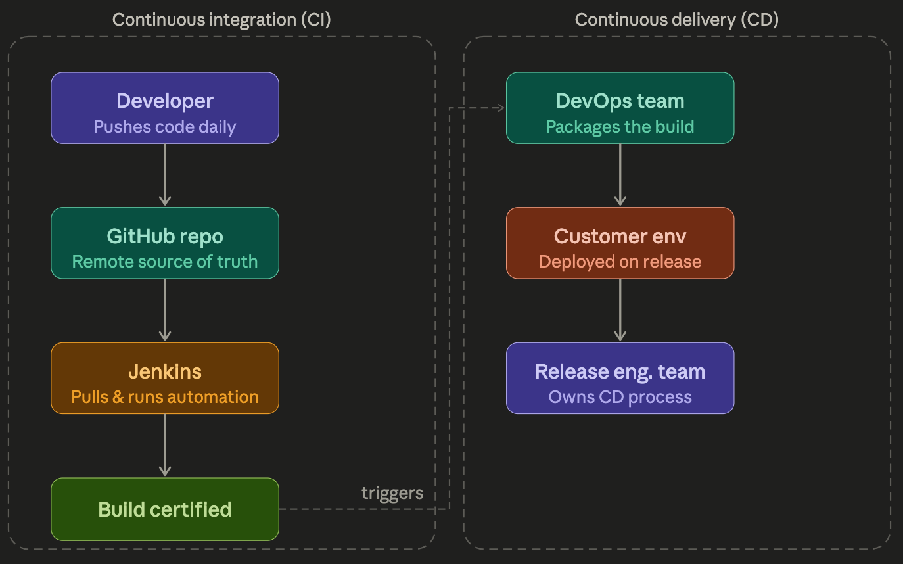

# Jenkins CI Setup 

---

## 1. What is Jenkins?

Jenkins is a free, open-source continuous integration (CI) automation server. In a DevOps environment, it sits at the centre of the development-testing-release cycle, automatically pulling code from a repository, building it, running tests, and certifying the result.

### CI vs CD

Two concepts that are often confused:

**Continuous Integration (CI)** is the cyclic loop between developers and testers. Every day, developers push new code to a shared repository; every night, Jenkins pulls that code, builds it, and runs the automation suite. This keeps the codebase integrated and tested continuously.

**Continuous Delivery (CD)** is what happens after a successful build — the certified software is released or deployed to the customer environment. CD is typically handled by a separate Release Engineering (RE) team, while CI is shared between developers and testers.

The full DevOps picture combines both:

```
[Dev] → push → [GitHub] → Jenkins pulls → [Build + Test] → Certified
                                                                 ↓
                                                        [Package & Release] → [Customer env]
                              ←————————— CI ————————————→  ←————— CD —————→
```



---

## 2. Who Owns Jenkins?

In a real production environment, **Jenkins is owned and installed by the DevOps team**, not by testers or developers. The DevOps team:

- Installs Jenkins on their own servers
- Creates user accounts and shares a URL (Jenkins is a web application)
- Builds and manages the full pipeline (code → build → test → deploy)

Testers only need to log in, create their project configuration, and trigger or monitor builds. They never need to install Jenkins themselves in a real job.

---

## 3. Installation

### Option A: WAR File (for learning)

A WAR (Web Archive) file is a single portable Java file. You download `jenkins.war`, run it manually from the command line, and Jenkins starts. When you close the terminal window, Jenkins stops. This gives you complete manual control and is ideal for learning.

**Run command:**
```bash
java -jar jenkins.war
```

By default, the WAR file runs in **headed mode** — you can see the browser UI during test execution.

> Keep the terminal window open while using Jenkins. Closing it stops the server.

---

### Option B: macOS Installer via Homebrew (recommended for Mac)

Jenkins can be installed on macOS using the **Homebrew** package manager. The Homebrew formula is `jenkins-lts`.

> **Note:** This package is supported by a third party and may not be updated as frequently as packages directly supported by the Jenkins project.

**Prerequisites:** You must have both **Homebrew** and **Java** installed on your Mac before proceeding.

#### Key commands

| Action | Command |
|--------|---------|
| Install the latest LTS version | `brew install jenkins-lts` |
| Start the Jenkins service | `brew services start jenkins-lts` |
| Restart the Jenkins service | `brew services restart jenkins-lts` |
| Update the Jenkins version | `brew upgrade jenkins-lts` |
| Stop the Jenkins service | `brew services stop jenkins-lts` |

After starting the service, Jenkins is accessible at:
```
http://localhost:8080
```

Unlike the WAR file, the Homebrew installation runs Jenkins as a **background service** — it persists across terminal sessions. You must explicitly stop it when no longer needed.

---

### Option C: OS Installer (for production/Windows)

For production environments, the DevOps team downloads an OS-specific installer (`.exe` for Windows, `.pkg` for Mac). Jenkins runs as a persistent background service and is always available — no manual start required. By default, it runs in **headless mode** (no browser UI during test execution), which is faster and more appropriate for automated nightly runs.

---

## 4. First-Time Setup

Once Jenkins starts, open:
```
http://localhost:8080
```

You will see the **Unlock Jenkins** screen.

### Step 1: Unlock Jenkins

Copy the initial admin password from the terminal output, or retrieve it from the file path shown on screen.

- **Mac/Linux path:** `~/.jenkins/secrets/initialAdminPassword`
- **Command to retrieve it:**
  ```bash
  cat ~/.jenkins/secrets/initialAdminPassword
  ```

Paste the password and click **Continue**.

### Step 2: Install Plugins

Choose **Install suggested plugins**. This installs Git, GitHub, Pipeline, and other essential plugins automatically. Wait for all boxes to turn green before proceeding.

### Step 3: Create Admin User

Fill in a username, password, and email. For local learning, `admin` / `admin` is fine. **Do not skip this step** — the admin account controls all other users and project access.

### Step 4: Instance Configuration

Note the Jenkins URL shown (default: `http://localhost:8080`). Click **Save and Finish**, then **Start using Jenkins**.

---

## 5. Plugin Configuration

Jenkins requires plugins to interact with external tools like Git, GitHub, and Maven. Most essential plugins are installed during the suggested plugin step, but **Maven Integration Plugin** is often missing and must be added manually.

**Steps:**
1. Go to `Manage Jenkins → Plugins → Available plugins`
2. Search for `Maven Integration`
3. Select the checkbox and click **Install**

This is a one-time step. Once installed, it moves to the **Installed plugins** tab.

---

## 6. Global Tool Configuration (Critical)

Jenkins needs to know the file system paths for Java, Git, and Maven on the machine it is running on.

**Navigate to:** `Manage Jenkins → Tools`

### JDK

Click **Add JDK**, provide a name, and enter the Java home path.

- **Windows example:** `C:\Program Files\Java\jdk-17`
- **Mac command to find it:**
  ```bash
  /usr/libexec/java_home
  ```

### Git

Click **Add Git**, provide a name, and enter the path to the Git executable.

- **Windows example:** `C:\Program Files\Git\bin\git.exe`
- **Mac command to find it:**
  ```bash
  which git
  ```

### Maven

Click **Add Maven**, provide a name, and enter the **Maven home directory** (not the binary).

- **Windows example:** `C:\Program Files\Maven\apache-maven-3.x.x`
- **Mac command to find it:**
  ```bash
  mvn -v
  ```

Click **Apply** and **Save**. This is a one-time configuration.

> **Important:** These paths must point to software on the **same machine Jenkins is installed on**. If Jenkins is on a remote DevOps server, you cannot use paths from your local laptop.

---

## 7. Creating a Project in Jenkins

### Maven Project (most common for testers)

This is the preferred approach for running Selenium/TestNG automation projects hosted on GitHub.

1. Dashboard → **New Item** → enter a name → select **Maven project** → OK
2. Under **Source Code Management**, select **Git**
3. Paste your GitHub repository URL (no credentials needed for public repos)
4. Scroll to the **Build** section — `pom.xml` is pre-filled
5. In the **Goals** field, type: `test`
6. Click **Apply** and **Save**

To run: click **Build Now**. Jenkins pulls the code from GitHub and runs `mvn test`, which executes your TestNG XML suite.

---

### Freestyle Project (for `.bat` / `.sh` scripts)

Use this for batch file execution or non-Maven projects.

1. New Item → name → select **Freestyle project** → OK
2. Scroll to **Build Steps** → **Add build step**
3. Select **Execute Windows batch command** (Windows) or **Execute shell** (Mac/Linux)
4. Enter the full path to your `.bat` or `.sh` file, or `cd` to the directory first
5. Click **Apply** and **Save**, then **Build Now**

---

## 8. Build Results Explained

| Status | Symbol | Meaning |
|--------|--------|---------|
| Not built | Three dots | Job exists but has never run |
| Success | Green / blue tick | Build passed, all tests passed |
| Failure | Red X | Build crashed or compilation error |
| Unstable | Yellow ball | Build ran but some tests failed |

Click on any build in the **Build History** panel, then **Console Output**, to see the full log.

If a test fails in Jenkins:
1. Reproduce the failure locally in Eclipse/IntelliJ
2. Fix the issue
3. Run locally to confirm it passes
4. Commit and push the updated code to GitHub
5. Trigger another build in Jenkins

---

## 9. Why Local Projects Can't Run on a Remote Jenkins

This is a critical concept. When Jenkins is installed on a remote DevOps server, all paths configured in Global Tool Configuration point to **that server's file system**. A path like `C:\Users\YourName\eclipse-workspace\MyProject\pom.xml` is meaningless to a remote Jenkins server — the file doesn't exist there.

**The rule:**

| Jenkins location | Project location |
|-----------------|-----------------|
| Local machine | Can run local projects |
| Remote DevOps server | Must use a GitHub URL |

Always push your project to GitHub before expecting a remote Jenkins instance to run it.

---

## 10. The Typical Daily Workflow

```
1. Write / update test cases locally (Eclipse / IntelliJ)
        ↓
2. Run locally to confirm they pass
        ↓
3. Run via `mvn test` in terminal
        ↓
4. Commit and push to GitHub
        ↓
5. Jenkins runs overnight (or triggered manually)
        ↓
6. Morning: check Jenkins dashboard for pass / fail
        ↓
7. If unstable → fix locally → push → re-run in Jenkins
```

This flow means most regression and sanity testing happens automatically inside Jenkins without manual intervention, freeing testers to focus on automating new test cases during the day.

---

## 11. Common Problems and Fixes

| Problem | Cause | Fix |
|--------|-------|-----|
| Jenkins not opening at `localhost:8080` | Service not running | Re-run `java -jar jenkins.war` or `brew services restart jenkins-lts` |
| `No such file: pom.xml` | Wrong path in Build section | Use path relative to repository root |
| `Couldn't find any revision to build` | Wrong branch name | Change `*/master` to `*/main` |
| Maven path error | Pointed to binary instead of directory | Use the Maven home folder, not `/usr/local/bin/mvn` |
| Port 8080 conflict | Another app using the port | Start Jenkins on a different port: `java -jar jenkins.war --httpPort=9090` |
| Email notification error | No SMTP server configured | Ignore or disable email notification for now |

---

## 12. Reset Jenkins (Clean Start)

If you need to wipe Jenkins and start fresh:

```bash
brew services stop jenkins-lts
rm -rf ~/.jenkins
brew services start jenkins-lts
```

This removes all jobs, configurations, and history.

---

## 13. What Testers Actually Need to Know

In a real job, the DevOps team handles Jenkins installation, pipeline creation, and administration. A tester's responsibility is:

- Keep automation code committed and pushed to GitHub regularly
- Configure the Jenkins job correctly (GitHub URL, Maven goal, `pom.xml` path)
- Monitor build results and fix failing tests promptly
- Understand the difference between CI (daily testing loop) and CD (release process)

For deeper knowledge — pipeline-as-code using `Jenkinsfile`, webhook-triggered builds, Selenium Grid integration, and Docker-based Jenkins — a dedicated DevOps course covers these in detail.

---

## 14. Quick Reference — Key Commands

```bash
# macOS Homebrew
brew install jenkins-lts          # Install
brew services start jenkins-lts   # Start
brew services restart jenkins-lts # Restart
brew services stop jenkins-lts    # Stop
brew upgrade jenkins-lts          # Update

# WAR file (any OS with Java)
java -jar jenkins.war              # Start (default port 8080)
java -jar jenkins.war --httpPort=9090  # Start on custom port

# Maven (inside Jenkins job or terminal)
mvn test                           # Run all tests via pom.xml

# Retrieve initial admin password (Mac/Linux)
cat ~/.jenkins/secrets/initialAdminPassword
```

---

